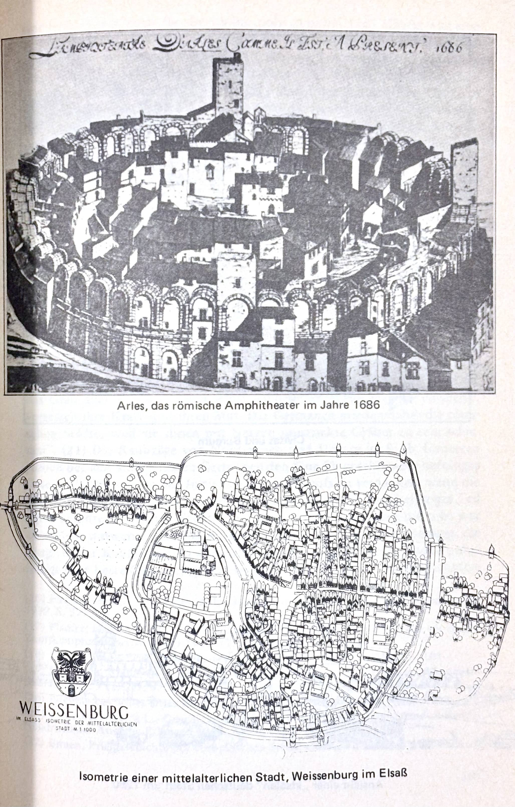
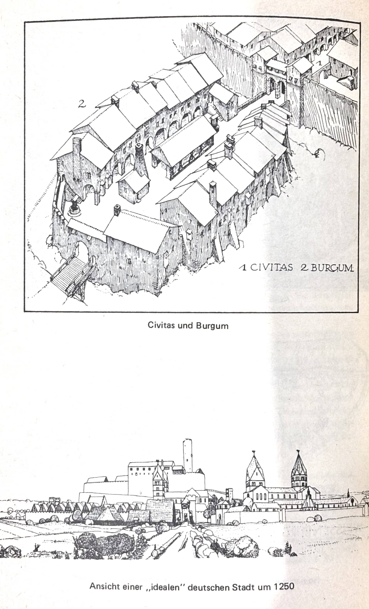
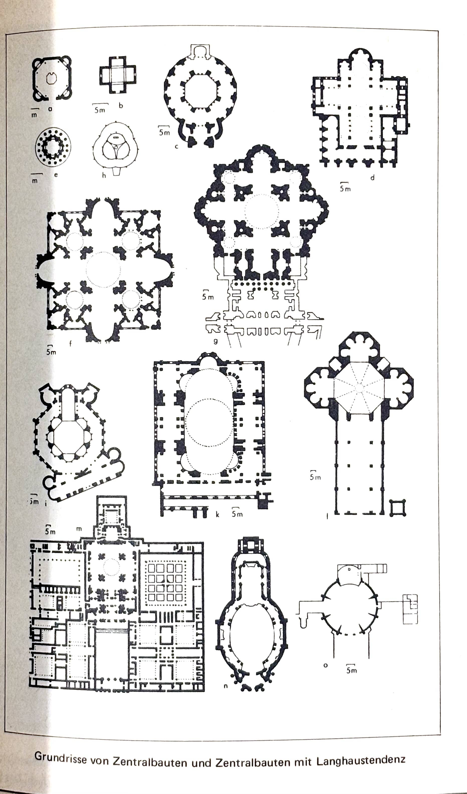
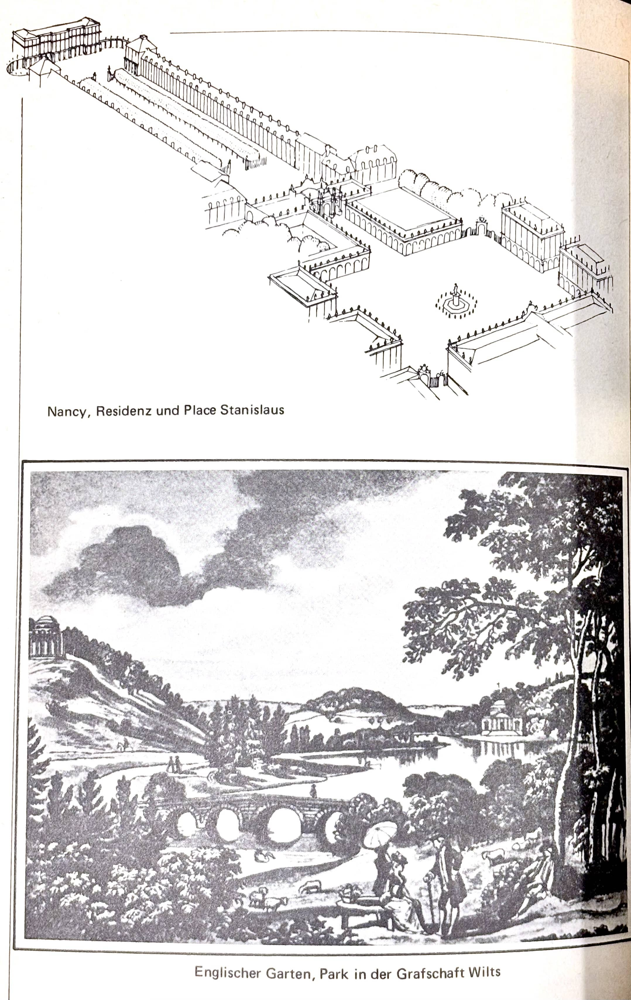
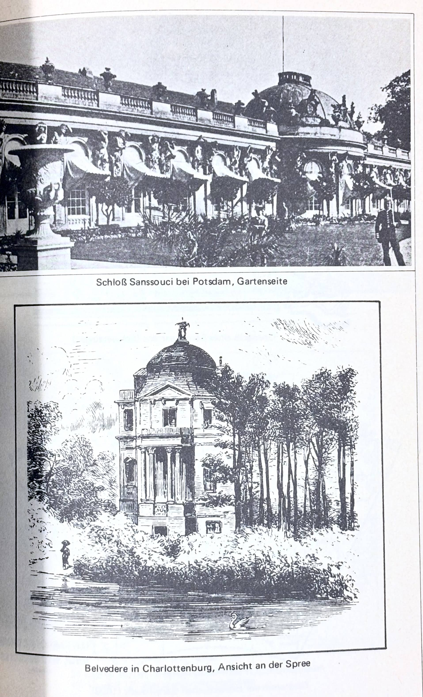
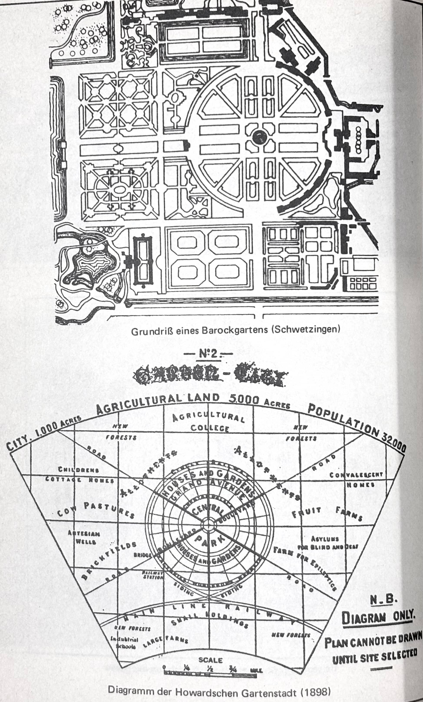
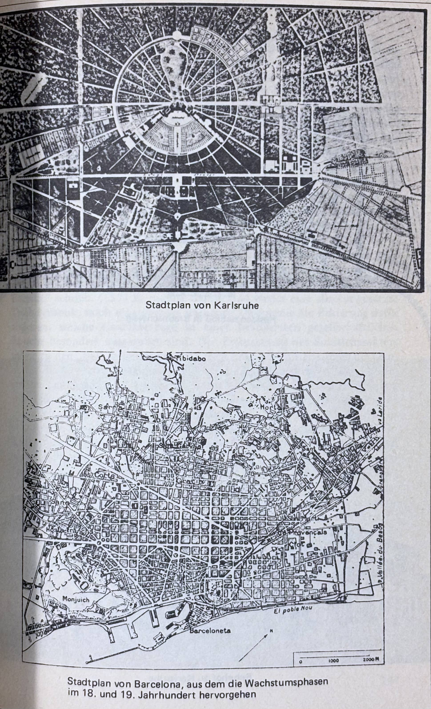
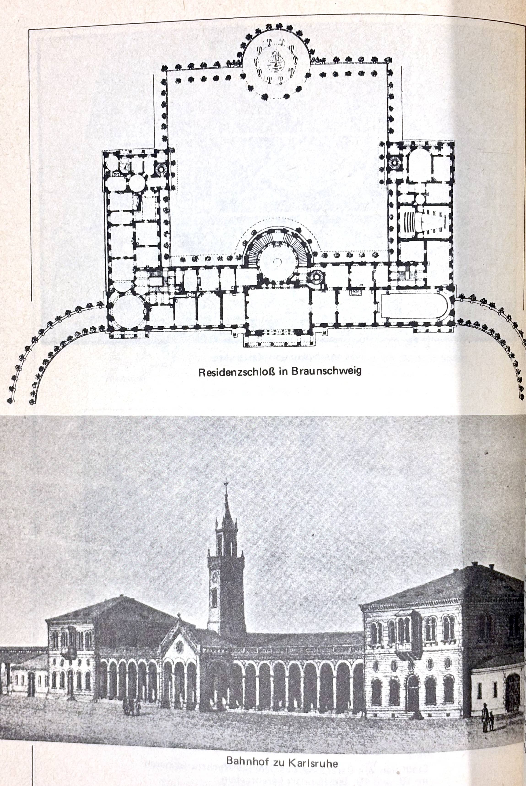

# Die Stadt im Durchbruch zur zweiten Stufe der gesellschaftlichen Entwicklung

Die Entstehung der ersten Städte überhaupt fällt mit der ersten Stufe der gesellschaftlichen Entwicklung zusammen; in der zweiten Stufe werden dagegen die Bedingungen allgemeiner Verstädterung gelegt, wodurch die Autonomie der Stadt als Herrschaftsinstanz aufgehoben wird; sie verliert auch ihre klaren räumlichen Grenzen. Damit verändert sich das gewohnte Bild des Gegensatzes von Stadt und Land, obwohl der Gegensatz zwischen geistiger und körperlicher Arbeit bestehen bleibt. Die "Stadtregionen", wie die neuen Großstädte oder Metropolen auch genannt werden, erstrecken sich kilometerweit ins Land, sie sind nicht länger eindeutig von der sie umgebenden Landschaft abgegrenzt. Die Unterschiede zwischen städtisch dichter und ländlich aufgelockerter Siedlungsweise verwischen sich. Viele Bewohner der Metropole wünschen in einer Umgebung zu leben, in der sie relativ isoliert, vor allem ungestört von Lärm und anderen Nachteilen städtischer Betriebsamkeit sind; sie leben suburban statt urban.

Die Metropole, die ganze Städte und Ortschaften in sich aufnimmt und neue Satellitenstädte dazu schafft, teilt mit der einst autonomen Stadt die Herrschaftsfunktionen. In ihrem Kern, der City, werden Kontroll- und Lenkungsmaßnahmen ausgeübt, die nun nicht mehr bloß auf ein enges Hinterland ausgedehnt sind, sondern die entferntesten Regionen des Erdballs betreffen. Die Verwaltungen großer Betriebe und Konzerne, die in den Metropolen angesiedelt sind, beeinflussen Produktionsstätten, die oft außerhalb der Landesgrenzen liegen. Zugleich organisieren sie die Waren- und Geldzirkulation, die ebenfalls alle geographischen und politischen Grenzen überschreitet. Da alle Länder dieser Erde in das System des Weltmarktes einbezogen sind, muß die "nationale Selbstgenügsamkeit" aufgegeben werden. Diese allseitigen Beziehungen führen zu einer Weltoffenheit, die die Bedürfnisse und Erfahrungsmöglichkeiten der Menschen entfaltet. Die modernen Großstädter profitieren noch im täglichen Speiseplan, der ihnen sogar bei Frost und Schnee frische Erdbeeren aus anderen Ländern offeriert, von diesen weltumspannenden Beziehungen.

Die moderne Metropole mit ihren hochentwickelten Verkehrssystemen kann nur auf Grundlage der industriellen Produktion entstehen. Industrialisierung und "Verstädtischung" der Gesellschaft sind das Resultat der bürgerlichen Ökonomie im Marx'schen Sinne. Die Ausdehnung von Tausch- und Geldbeziehungen, wie sie seit dem 16. Jahrhundert in Europa stattfand, die Absicherung dieser Zirkulationssphäre durch die Schutz- und Wirtschaftspolitik der absolutistischen Staaten, waren wichtige Vorstufen zu dieser Entwicklung.

Bürgerliche Ökonomie bedeutet an erster Stelle, daß nicht für den unmittelbaren Bedarf, sondern für den Austausch produziert wird. Erfolgreiches Wirtschaften ist an die positive Bilanz der Unternehmen gebunden; nur bei einem in Geldwert ausdrückbaren Überschuss kann auf Dauer investiert werden. Die in die Produktion gesteckten Werte müssen sich "realisiert" haben, d.h. die hergestellten Produkte müssen innerhalb einer bestimmten Zeit verkauft sein, sonst sind sie wertlos; sie haben keinen Wert erbracht. So scheint es in der bürgerlichen Ökonomie zuerst um die Produktion von Werten zu gehen, nicht aber um benötigte Güter oder Dienstleistungen. Der durch das "Wertgesetz" vermittelte Anreiz zur Produktion läßt deren Ziele sehr abstrakt erscheinen. Zugleich erscheint diese Produktionsweise als ein "System allseitiger Abhängigkeiten", da der Zwang zum Verkaufen und Kaufen die Individuen mit ihren Bedürfnissen von den vielfältigsten Kauf- und Verdienstchancen abhängig macht. Zwar entwickelt sich unter diesen Bedingungen die menschliche Produktivkraft ganz außerordentlich, aber Kälte und Anonymität bestimmen die gesellschaftlich determinierten Beziehungen der einzelnen zueinander. Die Ambivalenz dieser Entwicklung ist dabei am deutlichsten in den Verhaltensweisen der modernen Großstädter, den Bewohnern der Metropolen der Industrienationen, ausgeprägt.

In dem "System allseitiger Abhängigkeit" setzen sich diejenigen Waren und Dienstleistungen durch, die die niedrigsten Preise haben, so daß schließlich "alle Nationen" gezwungen werden, "die Produktionsweise der Bourgeoisie sich anzueignen, wenn sie nicht zugrunde gehen wollen; sie zwingt sie, die sog. Zivilisation bei sich selbst einzuführen, d.h. Bourgeois zu werden".[^3-1] Der Prozeß der Zivilisation ist demnach die universelle Ausbreitung der bürgerlichen Gesellschaft, und dies hat nichts mit "Eurozentrismus" zu tun.

Das System "sachlicher Abhängigkeit" ist in den sozialistischen Ländern, die ihre Produktion und deren Industrialisierung nach festgelegten Planzielen zu regeln versuchen, um nicht den Fehlern der Marktwirtschaft zu verfallen, dennoch nicht aufgehoben. Auch dort gelten die Bedingungen der "zweiten Stufe der gesellschaftlichen Entwicklung". Die Menschen verhalten sich hier ebenfalls als Lohn- und Gehaltsempfänger zu den Bedingungen der Produktion. Sie erfahren Arbeit nur sehr begrenzt als "Selbstbetätigung" und werden mittels "materieller Anreize" zu erhöhter Produktivität angestachelt. Vor allem sind auch der Entfaltung ihrer Individualität Grenzen gesetzt. Das Wirken der zentralen Planungsinstanzen ist offenbar nicht weniger von irrationalen Momenten durchsetzt als die Anarchie marktwirtschaftlicher Mechanismen.[^3-2] Es hat den Anschein, als habe die Planwirtschaft nur die liberale Anfangsphase des noch zersplitterten Privateigentums mittels politischer und nicht allein ökonomischer Gesetze übersprungen, um die Industrialisierung forciert voranzutreiben. Da Russland zu Beginn des 20. Jahrhunderts noch von einem feudalen Staatsgefüge beherrscht war, auch wenn es bereits von kapitalistischen Produktionsformen durchdrungen war,[^3-3] mußte die Revolution von 1917 auch den Staatsapparat erst modernisieren. Das scheint die Tendenz zu "staatlich geplanter Entfaltung der Wirtschaft", wie sie nach dem Urteil von Kriedte, Medick und Schlumbohm allgemein bei Nationen zu erwarten ist, die mit der Industrialisierung im Rückstand sind,[^3-4] verstärkt zu haben.

Die sog. Konvergenz westlicher und östlicher Industrienationen, ihre epochale Verwandtschaft trotz ihres unterschiedlichen rechtlichen Überbaus, wäre demnach nichts Zufälliges, kein abstrakter "Zeitgeist", sondern der "Geist des Kapitalismus". Zufällig wäre auch nicht, daß der Städtebau in beiden Gesellschaftssystemen, sofern er auf modernster Stufe stattfindet, sich zum Verwechseln ähnelt. Als "Übergangsgesellschaften" haben die sozialistischen Länder ähnliche Probleme wie die kapitalistischen Länder des Westens zu bewältigen: Industrialisierung und Verstädterung zu vollziehen, kurz, die "sog. Zivilisation bei sich selbst" einzuführen. Den Gesellschaften auf der zweiten Stufe der gesellschaftlichen Entwicklung gelingen diese beiden Aufgaben allerdings nur um den Preis der Umweltzerstörung. Die Funktionsweise der bürgerlichen Gesellschaft in diesem allgemeinen Sinne bleibt unbegriffen, wenn nicht mit der Analyse der gesellschaftlichen Bedingungen zugleich die psychischen Veränderungen der Menschen betrachtet werden.

Die moderne Produktionsweise zwingt den Menschen vor allem ein neues Zeitempfinden auf. Während in den agrarisch produzierenden Gesellschaften die Arbeitsrhythmen durch "natürliche" oder zyklische Rhythmen bestimmt waren, etwa den Wechsel der Jahreszeiten, die Dauer der Reifezeiten von Pflanzen, der Lebenszeit von Tieren, ordnen sich die Menschen der städtisch-industriellen Gesellschaften abstrakten Zeitmaßen unter.[^3-5] Durch die "Taylorisierung" der Arbeitsprozesse innerhalb der industriellen Produktion büßen die handwerklich ausgebildeten Arbeiter viele ihrer Fähigkeiten ein und verkümmern in ihren sozialen Äußerungsformen.[^3-6]

Auf der anderen Seite können die komplizierten Produktionsanlagen nur von Menschen in Gang gehalten werden, deren geistige Fähigkeiten hoch entwickelt sind. Ein Indiz der Verbesserung der geistigen Kompetenzen der Angehörigen industrialisierter Gesellschaften ist die Tatsache, daß sie frühzeitig Grundkenntnisse im Lesen, Schreiben und Rechnen erworben haben; ein geistiges Vermögen, das vordem nur den Angehörigen oder privilegierten Bediensteten der herrschenden Klassen zugestanden war.

Die geistigen und psychischen Reaktionsformen der Menschen werden jedoch nicht nur durch ihre Arbeitsverhältnisse bestimmt, sondern auch durch ihre Lebensbedingungen außerhalb der Arbeit. Die Industrialisierung und die Verstädterung haben die Trennung von Arbeiten und Wohnen bedingt und damit größte Auswirkungen auf die Gestaltung des Familienlebens gehabt. Vor allem wird dadurch die psychische Verfassung der Menschen, die Vereinzelung oder Individuierung im sozialen Sinne, weiter verändert. Die Verstädterung im Zeichen der "Geldwirtschaft", wie es bei Simmel hieß, bringt mit der Individuierung auch Gefahren für das Wohlbefinden der Individuen, bedroht zugleich ihre Individualität. Der moderne verstädterte Mensch ist sozial weniger als Angehöriger einer bestimmten Familie von Belang als von seiner Qualität als Arbeitskraft. Seine Qualifizierung als spezifische Arbeitskraft bestimmt seinen Beruf, seine Einkommenschancen und seinen sozialen Status in hohem Maße.

Die Auflösung des oikos als Produktionsgemeinschaft zugunsten der industriellen, großbetrieblichen Produktion degradiert die Familie zur bloßen Konsumtionsgemeinschaft, macht sie generell zur Kleinfamilie, die "eigentumslos" ist, d.h. keine Produktionsinstrumente besitzt. Damit geht nicht nur eine beschränkte Kinderzahl einher, sondern auch die Beschränkung der familialen Wohngemeinschaft auf die Gatten und ihre Kinder. Sie liefert die Kinder einerseits in unentrinnbarer Weise den persönlichen Schwierigkeiten ihrer Eltern aus und legt damit den Grund vieler psychischer Störungen, andererseits befreit sie die Gemeinschaft der Gatten von der Bevormundung des übergeordneten Familieninteresses und ermöglicht so die Verwirklichung "individueller Gattenliebe", die Entfaltung von Individualität überhaupt.

Freilich ist die moderne Familienform nur die abstrakte Möglichkeit der Verwirklichung dieses Ziels. Individualität oder Ich-Autonomie werden, wie Hegel es formulierte, erst "durch eine unendliche Vermittlung der Zucht des Wissens und des Wollens" erworben.

Universale Verstädterung und Industrialisierung sind die unlöslich miteinander verbundenen Tatsachen des gesellschaftlichen Fortschritts. Es ist tautologisch, die Verstädterung aus der Industrialisierung abzuleiten. Beide gehen auf ein drittes Gemeinsames zurück: die bürgerliche Gesellschaft und die ihr eigentümliche Wirtschaftsweise, den Kapitalismus. Darum ist die Bestimmung des Ursprungs der bürgerlichen Gesellschaft wichtig, um zu erfahren, welche gesellschaftlichen Kräfte die Bedingungen der Verstädterung zuerst konstellierten. Je mehr sich die gesellschaftlichen Prozesse zu "Sachgesetzlichkeiten" verselbständigen und die Richtung des industriellen Fortschritts immer eindimensionaler wird – die Gestalt der verstädterten Umwelt ist dafür nur ein Beispiel –, umso notwendiger ist es, sich auf den Ursprung dieser Prozesse zu besinnen, damit die Möglichkeit eines Wandels jenseits der quasi naturgesetzlich wirkenden "Sachzwänge" wenigstens geahnt werden kann.

Die bürgerliche Gesellschaft, die den Durchbruch zur zweiten Stufe der gesellschaftlichen Entwicklung aus sich heraus schaffte, hat ein besonderes Verhältnis zur Stadt: sie ist stadtgeboren. Ihre Entfaltung ist historisch durch zwei gegenläufige Bewegungen bestimmt. Zuerst bildete sich mit der Konstituierung autonomer Städte im Mittelalter ein Bürgertum heraus, das imstande war, den alten Gewalten die Herrschaft über die Stadt zu entreißen und damit eine autonome bürgerliche Stadt zu schaffen, die ich als "proto-bürgerlich" bezeichnen möchte,[^3-7] da sie die feudale Gesellschaft noch nicht sprengte; sodann wurden diese autonomen Städte durch die Herrscher großer Territorien entmachtet und dem nationalen Staatsapparat untergeordnet. Durch die Bildung des Flächenstaats erschlossen sich dem kapitalistischen Warenverkehr erst wieder die Räume, die durch den mittelalterlichen Partikularismus der autonomen Städte und Landschaften zersplittert worden waren. Im Absolutismus begann sich das moderne Verhältnis von Stadt und Land auszubilden. In dieser Zeit wurden die ersten Kolonialgesellschaften gegründet. Das Ausbeutungsverhältnis, wie es ehedem zwischen Stadt und Land bestanden hatte, wurde nun auf das Verhältnis ökonomisch entwickelter Länder zu rückständigen Ländern ausgedehnt. Damit erhielt der Gegensatz von Stadt und Land eine neue ungeahnt großräumige Dimension.

## 1. Die Geburt der autonomen proto-bürgerlichen Stadt

Bekanntlich war der bürgerlichen Entwicklung in der Antike durch die an den oikos gebundene Sklavenwirtschaft eine innere Schranke gesetzt. Obwohl Rom über Handelsbeziehungen verfügte und vor allem durch die Plündereien in den Provinzen in den Besitz großer Reichtümer gelangt war, kam es nicht zur kapitalistischen Entwicklung, die nach Meinung vieler Historiker der einzige Ausweg aus dem römischen Pauperismus gewesen wäre.[^3-8]

Die unfreie Arbeit der Sklaven, die in den großen Gütern akkumuliert waren, verhinderte eine konkurrenzfähige Produktion auf Grundlage freier Arbeit. Diesem Sachverhalt hat vor allem auch Max Weber seine Aufmerksamkeit gewidmet. Das Ende der Antike bedeutete nach seiner Auffassung die "innere Selbstauflösung einer alten Kultur", die an ihren eigenen wirtschaftlichen Voraussetzungen zugrunde ging. Die Sklavenhaltung verhinderte, "daß mit Entwicklung der Konkurrenz freier Unternehmer mit freier Lohnarbeit um den Absatz auf dem Markt diejenige ökonomische Prämie auf arbeitssparende Erfindungen entstand, welche die letztere in der Neuzeit hervorrief".[^3-9] Mit Hilfe einer großen und disziplinierten Anzahl von Sklaven vermochte der römische oikos gewerbliche Produkte für einen allgemeinen Absatz herzustellen. Darüber hinaus bestanden aber keine Anreize, die Ausmaße und die Organisation der Produktion zu ändern.

Weber machte darüber hinaus geltend, daß die Familienlosigkeit der Sklaven, die zu ihrer Eigentumslosigkeit dazukam, ihre Selbstrekrutierung durch eigene Nachkommenschaft verhinderte und neue Sklaven darum nur in neuen Raubkriegen herbeigeschafft werden konnten. Mit dem Ende der Expansion des römischen Reiches wurden die unfreien Arbeitskräfte in den oiken knapp und die Produktion mußte schrumpfen. Der oikos wurde mehr und mehr auf die Deckung seiner eigenen Bedürfnisse zurückgeworfen. Indem schließlich die Sklaven vom Kasernendasein befreit wurden und als hörige Kleinbauern immerhin eine gewisse Selbständigkeit erhielten, bahnte sich im spätrömischen Reich bereits die feudale Gesellschaft an. Mit der Fronarbeit der hörigen Bauern konnte bei den schlechten Verkehrsverhältnissen der Antike nicht für einen auswärtigen Absatz produziert werden; und die "dünnen Fäden des Verkehrs, die über die naturalwirtschaftliche Unterlage gesponnen waren", wie Weber es mit einem einprägsam bildhaften Ausdruck belegte, mußten "sich allmählich weiter lockern und zerreissen".[^3-10] Die Loslösung der großen Güter vom Austausch auf lokalen Märkten besiegelte das Schicksal der Städte. Sie verfielen. Darum war am Ende der Antike die Grundherrschaft zum Träger der Kultur geworden, einer Kultur, die allerdings sehr verfallen war. Karl der Große war für Weber "ein überaus ländlicher Analphabet".[^3-11] Die Entwicklung ging im Mittelalter, wie es in der "Deutschen Ideologie" heißt, vom Land aus, nicht von der Stadt. Max Webers "weltgeschichtliche Analysen", so sehr sie marxistischen Gesellschaftsanalysen entgegengedacht waren,[^3-12] bestätigen diese These vollauf.

Nicht nur Weber, sondern auch etliche Historiker bestreiten, daß die antike Kultur durch Katastrophen äußerer Art zerbrochen ist. Die Völkerwanderungen der Germanen hätten den Niedergang Roms nur beschleunigt, waren aber nicht die Ursache des Zerfalls des Weltreichs. Der Übergang zwischen Antike und Mittelalter habe sich über acht Jahrhunderte, von Kaiser Augustus bis zu Karl dem Großen, vollzogen.[^3-13] Die Versuche, die Grenze zwischen beiden Epochen auf ein bestimmtes Ereignis und eine Jahreszahl zu fixieren, entspräche einer Mode des 19. Jh., als für die Schulbücher nach klaren, gut merkbaren Abgrenzungen gesucht wurde.[^3-14] Trotz des fließenden Übergangs sind freilich die Unterschiede zwischen beiden Epochen sehr groß.

Die römischen Städte hatten sich seit dem 5. Jh. entvölkert und zur Zeit Karls des Großen, also im 8./9. Jh., war das städtische Leben nahezu vollständig erloschen. Was von den römischen Städten noch übrig war, wurde oft nur als Steinbruch benutzt. Trier und Split können als Beispiele dafür gelten. Beide Städte wurden innerhalb der Mauern früherer kaiserlicher Paläste errichtet.[^3-15] In Europa, mit Ausnahme Italiens, hatte eine durchgreifende Reagrarisierung stattgefunden, die antike Sklavenwirtschaft war von einer Domänenwirtschaft abgelöst worden.

Die politisch selbständige Stadt des Mittelalters hat keine unmittelbaren antiken Vorbilder. Im nördlichen Europa stellt sie einen Neubeginn städtischer Entwicklung dar. In diesem Neubeginn wiederholte sich aber noch einmal das Schema "primärer Stadtgründungen", wie es für die erste Stufe der gesellschaftlichen Entwicklung charakteristisch war. Eine Herrenburg war der eine Kristallisationskern der wiedererstehenden Stadt; der andere war die Niederlassung von Kaufleuten und Handwerkern. Der doppelte Ansatz der städtischen Siedlung – hochgelegene befestigte Herrenburg, unbefestigter verkehrsgünstig gelegener Wohn- und Handelsplatz herrenloser Zuwanderer – war auch für die antike polis typisch.[^3-16] Häufig war eine Bischofsburg Anziehungspunkt für handel- und gewerbetreibende Zuzügler.

Zwar waren unter den Merowingern die noch vorhandenen römischen Stadtreste unter Königsherrschaft gekommen und wurden vom königlichen Grafen verwaltet, aber im 6. Jh. war die Macht der katholischen Kirche so weit gewachsen, daß die Bischöfe vielfach die Herrschaft über eine ehemalige Römerstadt erlangten.[^3-17] Von der römischen civitas blieb nicht einmal rechtlich etwas übrig; die alten Begriffe wurden von der Kirche für neue Verhältnisse gebraucht, civitas hieß die Diözese des Bischofs. Zwischen antiken und mittelalterlichen Städten bestand höchstens eine siedlungsgeschichtliche Kontinuität,[^3-18] aber selbst diese war in vielen Fällen unterbrochen.[^3-19] Von allen Theorien über die Entstehung der mittelalterlichen Stadt sei mit Gewissheit diejenige falsch, resümierte Pirenne bereits Ende des 19. Jh., die sie aus dem Fortbestehen der römischen Munizipalverfassung zu erklären versuche.[^3-20]

Als halbnomadisierende Volksstämme waren die Germanen der römischen Stadtkultur so abgeneigt wie die dorischen Griechen der kretisch-minoischen. G.L. v. Maurer begann sein mehrbändiges Werk über die "Geschichte der Städteverfassung" mit einer Beschreibung germanischer Stadtfeindschaft: "Städte nach römischer Art kannten die Altgermanen nicht. Solche mit Stadtmauern, Türmen und gemauerten Toren versehenen festgeschlossene Orte hielten die Germanen für Bollwerke der Knechtschaft und für das Grab aller Freiheit. Denn selbst wilde Tiere, wenn man sie einsperre, vergessen ihre Kraft und ihren Mut. Die Germanen mieden daher die römischen Städte, weil sie ihnen mit Netzen umstrickte Gräber zu sein schienen".[^3-21] Die Raubzüge von Normannen und Ungarn im 9. Jh. förderten jedoch bei den stadtscheuen Germanen den Sinn für geschlossene befestigte Orte.[^3-22] Oft war es der Initiative eines Bischofs zu verdanken, wenn die alte römische Stadtmauer wieder instandgesetzt wurde. Der befestigte Teil der frühmittelalterlichen Stadt, die civitas, das castrum oder die urbs, war aber nicht notwendig ein Bischofssitz; wichtig war nur die Befestigung, die Burg, in der Kaufleute und Gewerbetreibende, deren Niederlassung unbefestigt oder bestenfalls pallisadiert war, in Notzeiten Schutz finden konnten.

Die unbefestigte Siedlung wurde darum auch forisburgus oder suburbium genannt.

Das Bürgertum erwuchs aus jenen suburbien, die im Schatten der Burgen lagen. "Die Kaufmannssiedlungen entstanden an Orten, an denen es bereits eine größere befestigte Ansiedlung, eine 'urbs' gab"...[^3-23] Diese ersten Stadt- bzw. Vorstadtbewohner waren ein recht abenteuerliches Volk. Vermutlich waren sie in den meisten Fällen unfrei geboren; weil das aber bei Zuzüglern oft nicht recht festzustellen war und es keine juristische Klausel gab, die im Falle von Unklarheit unfreie Herkunft konstatiert hätte, so galten sie als herrenlos und frei. Es waren nicht gerade die feinsten Leute, die in der Vorstadt ansiedelten. v. Maurer berichtete: "Heinrich der Vogler versetzte sogar Diebe und anderes Gesindel in die Vorstädte. Und in Basel u.a.m. verwies man die Freudenmädchen in die Vorstädte. Daher standen die Vorstädte öfters nicht gerade im besten Ruf".[^3-24]

Das Wort Bürger, das seit dem 11. Jh. existiert, legt von dieser Herkunft, ihrer Unsicherheit und Unklarheit, Zeugnis ab. Pirenne meinte, daß es vom Französischen "nouveau bourg", womit die Vorstädte gemeint waren, stamme.[^3-25] Edith Ennen war dagegen der Auffassung, daß burgenses den Bewohner des burgum, was im Burgundischen so viel wie Handelsniederlassung bedeute, meine. Möglicherweise leite es sich auch von burgus (röm.) = Wachturm her. Sie resümierte: "In unserem Zusammenhang ist es wesentlich, daß im Romanischen burgus oder burgum die geschlossene Siedlung, den enggebauten Marktort, bzw. das Marktquartier bezeichnet und nicht etwa eine militärische Anlage".[^3-26] Die burgenses waren also auf keinen Fall die Bewohner der Burg, das waren die milites oder clerici, sondern die Bewohner der Vorstädte.

Unter diesen Vorstadtbewohnern nahmen die Fernhandelskaufleute die führende Stellung ein. Sie waren der eigentliche Gegenspieler zu den feudalen Stadtherrn, die sie anfangs noch gefördert hatten, weil sie auf pfundige Abgaben aus Handelsgewinnen hofften. Der oft rasch erworbene Reichtum dieser Kaufleute erlaubte ihnen auch eine besondere Stellung innerhalb der vorstädtischen Siedlungsgemeinschaft; sie waren die "majores". Aus diesem Majorat, das bereits im 13. Jh. mit den Ministerialen eine Schicht bildete, entwickelte sich bald das mittelalterliche Patriziat.[^3-27] Denn der Handel, der die großen Gewinne – bei großen Risiken – und damit den Reichtum brachte, war der Fernhandel.

  [^3-1]: Marx, Karl und Friedrich Engels, Manifest der Kommunistischen Partei, in: MEW 4, S. 466
  [^3-2]: Kosta, Jiří, Jan Meyer, Sibylle Weber, Warenproduktion im Sozialismus, Frankfurt 1973, S. 93
  [^3-3]: Anderson, Perry, Lineages of the Absolutist State, London 1974, S. 348 ff.
  [^3-4]: vgl. Schlumbohm in: Kriedte, Peter, Hans Medick, Jürgen Schlumbohm, Industrialisierung vor der Industrialisierung, Göttingen 1977, S. 271
  [^3-5]: vgl. hierzu: Thompson, E.P., Zeit, Arbeitsdisziplin und Industriekapitalismus, in: R. Braun, W. Fischer, H. Großkreutz, H. Volkmann (Hg.), Gesellschaft in der industriellen Revolution, Köln 1973, S. 81 ff.
  [^3-6]: Osterland, Martin, Innerbetriebliche Arbeitssituation und außerbetriebliche Lebensweise von Industriearbeitern, in: Osterland (Hg.), Arbeitssituation, Lebenslage und Konfliktpotential, Frankfurt 1975, S. 167 ff.
  [^3-7]: Ebenso wie der Frühhistoriker Henri Frankfort die verschiedenen vorgeschichtlichen Epochen Mesopotamiens unter "protoliterarischer Phase" zusammenfaßte, weil bereits erste Schriftzeichen erfunden worden waren, die Schrift jedoch noch nicht zu einem ausgebildeten System gediehen war, soll die autonome Stadt des Mittelalters, die zwar den Keim zur bürgerlichen Entwicklung legte, selbst aber noch Teil der Feudalgesellschaft war, als "proto-bürgerlich" bezeichnet werden. In ihr prägten sich die bürgerlichen Wirtschafts- und Verhaltensweisen zunächst nur rudimentär aus, zeigten aber gewissermaßen prototypische Züge.
  [^3-8]: vgl. neben anderen Pöhlmann, Robert, Die Übervölkerung der antiken Großstädte im Zusammenhang mit der Gesamtentwicklung städtischer Zivilisation, Leipzig 1884, S. 32
  [^3-9]: Weber, Die sozialen Gründe des Unterganges der antiken Kultur, a.a.O., S. 6
  [^3-10]: ebd., S. 17/18
  [^3-11]: ebd., S. 24
  [^3-12]: Baumgarten, Einleitung zu Max Weber, Soziologie, Universalgeschichtliche Analysen, Politik, a.a.O., S. XXVIII ff.
  [^3-13]: Dopsch, Alfons, Vom Altertum zum Mittelalter. Das Kontinuitätsproblem, in: Archiv für Kulturgeschichte, Jg. 16 (1926), S. 159-182
  [^3-14]: Strohecker, Karl Friedrich, Um die Grenze zwischen Antike und abendländischem Mittelalter, in: Saeculum Jg. 1 (1950), S. 433-65
  [^3-15]: Pirenne gab ein anschauliches Bild dieser Zustände: "In Trier richtete man ein Fenster des früheren kaiserlichen Palastes, so gut es ging, für die Verteidigung her und machte aus ihm eines der Stadttore." Pirenne, Geschichte Europas, a.a.O., S. 83
  [^3-16]: Pirenne, Henri, Les Villes et les Institutions Urbaines, Paris und Bruxelles (5) 1939, S. 375
  [^3-17]: Planitz, Hans, Die deutsche Stadt im Mittelalter. Von der Römerzeit bis zu den Zunftkämpfen, Graz/Köln (2) 1965 (1. Aufl. 1954), S. 28/29
  [^3-18]: Ennen, Edith, Frühgeschichte der europäischen Stadt, Bonn 1953, S. 105
  [^3-19]: Steinbach, Franz, Bemerkungen zum Städteproblem, in: Rheinische Vierteljahresblätter, Jg. 7 (1937), S. 127-137
  [^3-20]: Pirenne, Les Villes et les Institutions Urbaines, a.a.O., S. 31
  [^3-21]: v. Maurer, Georg L., Geschichte der Städteverfassung in Deutschland, 4 Bände, Neudruck der Ausgabe Erlangen 1869, Aalen 1962, Bd. 1, S. 1
  [^3-22]: Ennen, Frühgeschichte der europäischen Stadt, a.a.O., S. 93
  [^3-23]: Mottek, Hans, Wirtschaftsgeschichte Deutschlands, Berlin (DDR) 1968, Bd. I, S. 188
  [^3-24]: v. Maurer, Geschichte der Städteverfassung in Deutschland, a.a.O., Bd. II, S. 76
  [^3-25]: Pirenne, Geschichte Europas, a.a.O., S. 200
  [^3-26]: Ennen, Frühgeschichte der europäischen Stadt, a.a.O., S. 124/125
  [^3-27]: Rörig, Fritz, Die europäische Stadt, in: Propyläen-Weltgeschichte, Bd. IV (Das Zeitalter der Gotik und Renaissance 1250-1500), Berlin 1932, S. 282

Dieses durch Handel erworbene Geld bezeichnete Marx als die erste Form von frei verfügbarem Kapital. Weder der feudale Besitz noch das ständisch gebundene Eigentum des freien Handwerkers waren frei verfügbar und beweglich, wie es zuletzt das moderne Kapital ist, das für die verschiedensten Formen der Investition eingesetzt werden kann.[^3-28] Der Ausgangspunkt der bürgerlichen Entwicklung im Mittelalter lag bei den unternehmerischen Fernhandelskaufleuten.

Allein der Handel ist nicht isoliert vom Gewerbe zu betrachten. Fernhändler hatten bereits in den orientalischen Despotien existiert, aber sie konnten kein großes soziales Gewicht erreichen, weil sie nur mit Luxusprodukten für die königlichen oder priesterlichen Haushalte handelten. Im Mittelalter aber entstand trotz der ökonomischen Interessensdifferenzen zwischen Handel und Gewerbe eine politische Koalition zwischen beiden, die sich mit Erfolg gegen die Grundherrschaft durchsetzte und dadurch bürgerlichen Rechts- und Verkehrsformen einen Weg bahnte. Es waren nicht nur Händler, mehr oder minder vagabundierende Glücksritter, die sich im 9. und 10. Jh. neben den feudalen Burgen oder Bischofssitzen vorübergehend niederließen, sondern auch hörige Gewerbetreibende, die für die Kaufleute zu produzieren versuchten. Es bestand darum in der frühen mittelalterlichen Stadt, in Max Webers Worten, "ein Gemenge von Freien und Unfreien".

Der entscheidende Gegensatz zur antiken Stadt sei darin zu sehen, daß dieses "Gemenge" über alle Standes- und Berufsdifferenzen hinweg einen "Zweckverband" bildete, aus dem heraus eine "autonome Gemeinde mit bestimmten Freiheitsrechten" entstand.[^3-29] Den mittelalterlichen Stadtbewohnern gelang es, ihre ökonomischen Interessen, nämlich die Erweiterung des Absatzes ihrer Waren, politisch durchzusetzen. Damit leiteten sie eine Entwicklung ein, die mit jeglicher hauswirtschaftlichen Gebundenheit der Wirtschaft aufräumte, zuletzt allerdings auch mit der autonomen "Stadtwirtschaft".

Daß die mittelalterliche Entwicklung vom Land ausging, war ein weiterer Vorzug für die bürgerlichen Verkehrsverhältnisse. Für einen allgemeinen Warenverkehr stand ein wesentlich größeres Territorium offen, als es die Stadtstaaten der Antike zu bieten hatten. Obwohl Rom die Hauptstadt eines riesigen Imperiums war, besaß es kein wirkliches Territorium: "Es stand mit den Provinzen in einem fast nur politischen Zusammenhange, der natürlich auch wieder durch politische Ereignisse unterbrochen werden konnte", heißt es in der "Deutschen Ideologie".[^3-30] Eine Tatsache, die übrigens Max Weber mit fast den gleichen Worten konstatierte: Weil die polis wesentlich Militärorganisation war, "lebte der Kapitalismus dort letztlich allein vom Politischen, er war sozusagen nur indirekt ökonomisch ..."[^3-31] Die bürgerlichen Verkehrsverhältnisse mußten aber "über die Stadt hinauskommen", um die Fesseln der vorbürgerlichen Produktionsweise zu sprengen.

Weber hebt dabei vor allem die Bedeutung eines stetigen Binnenlandhandels hervor, der anders als der Küstenhandel auf eine friedliche Erweiterung seines Absatzgebietes angewiesen ist. Trotz der notwendigen Wehrhaftigkeit sei der mittelalterliche Stadtbewohner darum bereits viel mehr zum homo oeconomicus erzogen worden als der antike polis-Bewohner.[^3-32]

Weber schob es auf "günstige gesellschaftliche Konstellationen", daß die mittelalterlichen Stadtbewohner sich erfolgreich gegen die Feudalgewalt durchsetzen konnten. Das frühe Bürgertum war durch die Selbstequipierung im Besitz von Waffen; sein Feind war gewöhnlich ein lokaler Grundherr, kein allmächtiger Despot oder Kaiser; es war auch nicht religiös zersplittert, sondern glaubte an den einen christlichen Gott. Denn von der bloß ökonomischen Lage her unterschieden sich die mittelalterlichen Kaufleute und Handwerker kaum von der plebs, die sich nach Roms Gründung nur im Asylum, nicht aber auf dem geheiligten Boden der Stadt selbst, ansiedeln durfte. Herkunftslos wie die plebs waren auch die proto-bürgerlichen Vorstadtbewohner des Mittelalters. Auch sie wohnten außerhalb der befestigten urbs. Im Gegensatz zu den mittelalterlichen Zuzüglern der Vorstädte blieben die antiken Vorstädter gesonderte Stammesgenossen, zwischen denen oft auch die Heirat verboten war. Die Anwohner der mittelalterlichen suburbien kämpften aber darum, als lokale Gemeinschaft anerkannt zu werden; keine Sippen- oder Familienzugehörigkeit sollte die lokale Gemeinschaft überlagern.

Daß die römische plebs nicht jene Entwicklung zur Warenproduktion einleiten konnte wie das mittelalterliche Bürgertum, lag nicht zuletzt daran, daß sie in ihren Emanzipationskämpfen um Gleichstellung, nicht aber um Durchsetzung neuer Organisationsformen des wirtschaftlichen und sozialen Lebens bemüht war. Das drückte sich in einer für moderne Verhältnisse kaum noch verständlichen Gebundenheit an die religiösen Bräuche der damaligen Zeit aus. Als die plebs einmal im Protest aus Rom auszog, schaffte sie es dennoch nicht, eine eigene Stadt zu gründen; denn dazu fehlten ihr die richtigen Götter.[^3-33] Zwar wurde in Rom die religiöse Erhabenheit der Geschlechterherrschaft gebrochen, und es fand bereits eine Entwicklung zur lokalen Stadtgemeinde statt, aber die Rechte eines "civis Romanus" waren nicht an das Wohnen in Rom gebunden.

Wie günstig auch die gesellschaftliche Konstellation für das mittelalterliche Bürgertum gewesen sein mochte, seine besondere historische Leistung lag in der Entwicklung neuer gesellschaftlicher Organisationsformen. An die Stelle der archaischen Familien- oder Hauszugehörigkeit trat der Treueschwur. Typisch für die Bewohner der proto-bürgerlichen Stadt sind die Verbrüderungen oder conjurationes. Das Vorbild all dieser Vereinigungen sah Pirenne in den Zusammenschlüssen der reisenden Kaufleute des 9. und 10. Jahrhunderts. Noch im 11. Jahrhundert war das Reisen so gefährlich, daß die Warentransporte grundsätzlich kollektiv vonstatten gingen, sei es in Flotten oder Karavanen, die selbstverständlich auch bewaffnet waren.

Die ökonomisch begründete Solidarität zwischen den Kaufleuten führte zu jener neuen sozialen Einheit der Schwurgemeinschaft, die Pirenne auch Ur-Gilde nannte.[^3-34] Diese Organisationsform bewährte sich ebenfalls in anderen Bereichen und Kämpfen des Bürgertums. Pirenne deutete die Ur-Gilde als Ersatz für die Sippe oder Familie, von der sich die einzelnen Fernhändler gerade losgerissen hatten. Sie sei als "künstliche Familie" zu verstehen, die aber wie diese Schutz und Hilfe zu gewähren hatte.[^3-35]

Diese kaufmännische Ur-Gilde mußte natürlich an dem Orte, wo sich die "marchands au long cours" im Winter niederließen, eine große Rolle spielen. "Man darf annehmen, daß in allen Wiken, in denen sich eine größere Zahl von Fernkaufleuten ansiedelte, eine solche Kaufmannsgilde entstand. Offenbar wurde sie früh von den Stadtherrn bekämpft und unterdrückt. Besonders die kirchlichen Stadtherren mochten an den germanischen Sitten der Gilden Anstoß nehmen, so daß sie nur im Dunkeln fortleben konnten."[^3-36] Auch Karl der Große soll diese Gilden verboten haben.

In den Bischofsstädten bildete sich der Konflikt zwischen Stadt und Bürgertum zuerst und am schärfsten aus, weil der Bischof seinen Haushalt in der Stadt selbst hatte und nicht wie sonst der Feudalherr auf dem Land wohnte. Ein Beispiel soll zeigen, wie Konflikte zwischen Stadtherr und Stadt- bzw. Vorstadtgemeinde zustande kamen. Ostern 1074 ließ der Erzbischof von Köln das Schiff eines Kaufmanns beschlagnahmen, das dieser zur Reise fertig gemacht hatte, um es selbst für eigene Transportzwecke zu gebrauchen. "Ein Recht zu dieser Beschlagnahme konnte der Bischof nur auf Hörigkeit oder Unfreiheit des Kaufmanns gründen."[^3-37]

Der Aufstand, den die Kölner Bürger damals gegen den Beschluß des Bischofs wagten, wurde niedergeschlagen, die Anführer schwer bestraft. Damit war aber die Freiheitsbewegung, die zugleich eine Kommunebewegung war, nicht erloschen. Im Kampf für König Heinrich IV. (1106) konnten die Kölner ihre Anerkennung als eigener Verband mit eigenen Rechten gegenüber dem Bischof erzwingen. Wittfogel bezeichnete also die Schwurgemeinschaften nicht zu Unrecht als "revolutionäre Organe des bürgerlichen Klassenkampfes".[^3-38]

Die Kaufleute waren aufgrund des königlichen jus mercatorum als Freie anerkannt. Sie waren nicht gewillt, sich vom lokalen Herrn in den Zustand der Unfreiheit und der willkürlichen Ausbeutung zurücksetzen zu lassen. Es gab für sie einen weiteren Grund, alle Hörigkeitsverhältnisse innerhalb ihrer Siedlungsgemeinschaft abzuschaffen: Sie waren oft mit Frauen unfreien Standes verheiratet. Um die Rechtslage ihrer Kinder zu sichern, setzten sich alle burgenses, auch die unfreien Handwerker und Kleinkrämer, für den Kampf um die Freiheit ein. Das 11. und 12. Jahrhundert ist darum von einer Reihe blutiger kommunaler Erhebungen gekennzeichnet, in deren Verlauf die Bürger die lokalen Herren entmachteten und die Befestigungsanlage übernahmen.[^3-39]

Die spezifisch städtische Schwurgemeinschaft, die Eidgenossenschaft, entstand erst, als die Stadt bereits als Siedlungsgemeinschaft existierte. Sie wurde zum Garant der Freiheit jedes einzelnen Bürgers, indem sie die Freiheitsprivilegien, die die einzelnen Kaufleute durch das jus mercatorum erlangt hatten, auf die Stadtgemeinde ausdehnte.

Die städtische Eidgenossenschaft oder conjuratio war nicht nur vorübergehende Kampfeseinrichtung gegen die Übergriffe des Feudalherrn, sondern schuf dauerhafte Formen von Organisation, die in proto-bürgerlichen Institutionen mündete. Sie brachte die Gilden hervor, aber auch die städtische Selbstverwaltung. Der Rat und das städtische Friedensgericht, das die Fehde durch die Sühne ersetzte, sind ebenso das Resultat der städtischen Eidgenossenschaft.[^3-40] Während die Gilde nur ein Personalverband war und blieb, ist die Eidgenossenschaft immer Territorialverband gewesen.[^3-41] Darin lag das Neue. Gemeinsam war beiden Vereinigungen allerdings der Treueschwur.

Die städtischen Freiheitsbewegungen waren im 12. und 13. Jahrhundert abgeschlossen. Die Eidgenossenschaft, die die Feudalherrn zunächst nur nach schweren Kämpfen anerkannt hatten, wurde bei der Gründung neuer Städte von vornherein als Privileg zugestanden.[^3-42] Durch den Sieg der bürgerlichen Stadtbewohner konnte schließlich jeder, der "Jahr und Tag" in der Stadt gewohnt hatte, den Schwur auf die Eidgenossenschaft leisten und erlangte dadurch seine Freiheit, freilich auch Pflichten gegenüber der Stadtgemeinde.

Der mittelalterliche Bürger wurde durch die Stadt geschaffen und nicht, wie in der Antike, die Stadt durch das Zusammensiedeln der freien Bürger.[^3-43] Die mittelalterliche autonome Stadt war nicht länger bloße Siedlungsgemeinschaft ländlicher Großgrundbesitzer, die ihre Renten in der Stadt verzehrten und die städtische Siedlungsform "zur kriegerischen Absicherung ihres Besitzes" benutzten, sondern wesentlich "Marktansiedlung", in der Händler und Handwerker das bestimmende Element waren, wie Weber in anderem Zusammenhang sagte. Kurz: Die mittelalterliche Stadt ist bürgerlich bestimmt, proto-bürgerliches Element innerhalb einer nicht-bürgerlichen Gesellschaft.

Zum Verständnis der bürgerlichen Züge der mittelalterlichen Stadt reicht es nicht aus, nur ihre Markt- und Tauschfunktionen darzustellen. Zwar zeigte sich mit zunehmender "Verbürgerlichung" von Wirtschaft und Gesellschaft durch wachsende "Kommerzialisierung und Monetarisierung" aller Beziehungen, daß der freie Warenaustausch das Wichtigste an der bürgerlichen Gesellschaft ist, aber bevor sich bürgerliche Verkehrsverhältnisse in größerem Umfange ausbildeten, bestimmten proto-bürgerliche Institutionen das Leben in der Stadt des Mittelalters. Mittelalterliches Bürgerleben bedeutete, in besonderer Weise organisiert zu sein: Der Bürger gehörte einer Gilde, Zunft oder Innung an, die sein persönliches Leben in hohem Maße beeinflußte.

Die Herkunft und Funktion dieser Gilden und Innungen sind kontrovers.[^3-44] Die quasi ständische Gliederung der proto-bürgerlichen Stadt deutet auf die Uneinheitlichkeit des in der Eidgenossenschaft verbundenen Bürgertums hin. Bereits im 11. Jahrhundert, als die burgenses noch in der Vorstadt lebten, bestanden große soziale Differenzen zwischen den einzelnen Bewohnern.[^3-45] Im 13. Jahrhundert standen sich Patriziat oder reiche Kaufleute, die gewöhnlich den städtischen Rat beherrschten, und Handwerker, die straff in Zünften organisiert waren, sowie zunftlose Arbeiter gegenüber.[^3-46] Engels definierte die Klassenverhältnisse innerhalb der städtischen Gemeinden am Ende des Mittelalters als Patrizier (= herrschende Klasse), bürgerliche Opposition (= Kleinbürger, reiche und mittlere Bürger) und plebejische Opposition (= Handwerksgesellen, Tagelöhner).[^3-47]

Seit ihren Anfängen also war die bürgerliche Gesellschaft in sich gespalten. Das Kleinbürgertum war darauf bedacht, das einheimische Gewerbe zu schützen; darum sahen die Handwerker mit Argwohn auf die fremden Waren, die die großbürgerlichen Kaufleute von außerhalb billig einkauften, um sie so gewinnbringend wie möglich auf dem heimischen Markt zu verkaufen. "Krämer und ... Handwerker ... sind die eigentlichen Lobpreiser der Stadtwirtschaft mit ihren fremdenfeindlichen Tendenzen, mit ihrem Ziel, alle Vorteile des örtlichen Marktes den Einheimischen zu sichern."[^3-48] Das Kleinbürgertum hielt am Althergebrachten fest, z.B. der "standesgemäßen" oder "bürgerlichen Nahrung", und bekämpfte im besonderen die neuen Wirtschaftspraktiken, wie sie sich mit dem Verlegersystem abzuzeichnen begannen.[^3-49]

Zum Schutz gegen die Herrschaft des großbürgerlichen Patriziats, das die frühe kapitalistische Entwicklung begünstigte, hatte es sich seit dem 12. Jahrhundert in Gilden, Zünften oder Innungen organisiert.[^3-50] Damit versuchte es, seine ökonomisch schwächeren Positionen durch politische Organisation wettzumachen.

Das städtische Bürgertum des Mittelalters verfolgte höchst unterschiedliche wirtschaftliche und soziale Interessen. Es war nur im Kampf gegen die feudalen Herren geeint. In dem Maße wie kapitalistische Unternehmensformen sich etablierten, kam sogleich ein zusätzliches Moment sozialer Gegensätze hinzu: zunftlose Arbeiter, deren billige Arbeitskräfte das zünftige Handwerk bedrohten. In der mittelalterlichen Stadt gab es darum soziale Spannungen, die sich nicht mehr um die bloße Größe des Besitzes drehten — wie in der antiken polis; vielmehr will "der Handwerker der spätmittelalterlichen Städte .... nicht Hausindustrieller und damit gewerbliche Arbeitskraft eines kapitalistischen 'Unternehmers' werden".[^3-51]

Zum Gegensatz von Groß- und Kleinbürgertum tritt zum ersten Male der Gegensatz von Kapital und Lohnarbeit, freilich nur als ein Gegensatz unter anderen. Nach Pirennes Auffassung war in den flandrischen Städten der Gegensatz zwischen Kapital und Arbeit so alt wie die Bourgeoisie selber.[^3-52] In Flandern wie in Italien gab es bereits im 14. Jahrhundert frühkapitalistische Unternehmensformen und Betriebe, in Florenz den ersten Arbeiteraufstand.[^3-53]

  [^3-28]: Marx, Das Kapital, a.a.O., Bd. III, S. 356 ff., S. 364
  [^3-29]: Weber, Wirtschaft und Gesellschaft im Rom der Kaiserzeit, in: Soziologie, Universalgeschichtliche Analysen, Politik, a.a.O., S. 30
  [^3-30]: Marx und Engels, Deutsche Ideologie, a.a.O., S. 23
  [^3-31]: Weber, Wirtschaft und Gesellschaft im Rom der Kaiserzeit, a.a.O., S. 50
  [^3-32]: Ebd., S. 38/39
  [^3-33]: Fustel de Coulanges, Der antike Staat, a.a.O., S. 278
  [^3-34]: Pirenne, Les Villes et les Institutions Urbaines, a.a.O., S. 368 ff.
  [^3-35]: Karl v. Hegel leitete das Wort Gilde von "Vergeltung" ab. "Damit sinnverwandt ist Buße, wodurch Frevel gesühnt und Opfer, wodurch den Göttern vergolten wird." (v. Hegel, Karl, Städte und Gilden der germanischen Völker im Mittelalter, 2 Bände, Neudruck der Ausgabe Leipzig 1891, Aalen 1962, S. 4/5) Planitz hielt die Gilde ursprünglich für eine Fortsetzung der germanischen Opfergemeinschaft, die zur brüderlichen Hilfe verpflichtete. In den niederfränkischen Gilden sollen am St. Nikolaustag Trinkgelage stattgefunden haben ebenso wie Spenden für die Armen, was nur die "christliche Form des Trankopfers für die Toten zur Zeit der wilden Jagd" gewesen sei. (Planitz, Hans, Kaufmannsgilde und städtische Eidgenossenschaft in niederfränkischen Städten im 11. und 12. Jahrhundert, in: Zeitschrift für Rechtsgeschichte, Germanische Abteilung (Savigny Stiftung), Jg. 60 (1940), S. 23) Es scheint also, daß im urtümlichen Schwurverband heidnisch-germanische neben christlichen Gebräuchen lebendig waren.
  [^3-36]: Planitz, Die deutsche Stadt im Mittelalter, a.a.O., S. 77/78
  [^3-37]: Ebd., S. 99
  [^3-38]: Wittfogel, Karl August, Geschichte der bürgerlichen Gesellschaft. Von ihren Anfängen bis zur Schwelle der großen Revolution, Berlin o.J. (1924), S. 47. Max Weber betonte auch das Moment illegaler Verschwörung an diesen Vereinigungen: Weber, Typologie der Städte, a.a.O., S. 951/52
  [^3-39]: Pirenne, Les Villes et les Institutions Urbaines, a.a.O., S. 393
  [^3-40]: Planitz, Kaufmannsgilde und städtische Eidgenossenschaft, a.a.O., S. 76
  [^3-41]: Ennen, Frühgeschichte der europäischen Stadt, a.a.O., S. 169 ff.
  [^3-42]: Rörig, Die europäische Stadt, a.a.O., S. 292
  [^3-43]: Pirenne, Les Villes et les Institutions Urbaines, a.a.O., S. 104/105
  [^3-44]: G. v. Below vertrat strikt die Ansicht, daß die Gilden sich "um gewerblicher Zwecke" willen gebildet haben, längst nachdem die städtische Eidgenossenschaft sich konstituiert hatte (v. Below, Georg, Die Bedeutung der Gilden für die Enstehung der deutschen Stadtverfassung, in: Jahrbuch für Nationalökonomie und Statistik, Jg. 15 (1892), Teil II, S. 66). Auch lehnte er es ab, die conjuratio als Gilde aufzufassen (ders., Stadtgemeinde, Landgemeinde und Gilde, in: Vierteljahresschrift für Sozial- und Wirtschaftsgeschichte, Vol. VII (1909), S. 434). Das steht im Gegensatz zur Auffassung von Pirenne, der in der kaufmännischen Ur-Gilde den Keim aller späteren bürgerlichen Vereinigungen sah, die durch Treueschwur zusammengehalten wurden. Steinbach argumentierte später wieder im Sinne Pirennes: Gemeinsam sei Stadtgemeinde und frühe Kaufmannsvereinigung, daß sie "bewaffnete Notgemeinschaft" gewesen seien (Steinbach, Franz, Stadtgemeinde und Landgemeinde. Studien zur Geschichte des Bürgertums, in: Rheinische Vierteljahresblätter, Jg. 13 (1948), S. 17). Pirenne war nicht der Meinung, daß die spätere Stadtverwaltung von der "Ur-Gilde" stamme (Pirenne, Les Villes et les Institutions Urbaines, a.a.O., S. 14/15). Auch steht außer Zweifel, daß die Gilden innerhalb der etablierten Städte nicht Notgemeinschaften, sondern Schutzvereinigungen waren.
  [^3-45]: Pirenne, Les Villes et les Institutions Urbaines, a.a.O., S. 53
  [^3-46]: Ebd., S. 107-110
  [^3-47]: Engels, Friedrich, Der deutsche Bauernkrieg, in: MEW 7, S. 336 ff.
  [^3-48]: Rörig, Die europäische Stadt, a.a.O., S. 368
  [^3-49]: Heckscher, Eli F., Der Merkantilismus, 2 Bände, Jena 1932, Bd. I, S. 25; Mauersberg, Hans, Wirtschafts- und Sozialgeschichte zentraleuropäischer Städte in neuer Zeit. Dargestellt an den Beispielen v. Basel, Frankfurt/Main, Hamburg, Hannover und München, Göttingen 1969, S. 221
  [^3-50]: v. Hegel, Städte und Gilden der germanischen Völker im Mittelalter, a.a.O., S. 448
  [^3-51]: Weber, Wirtschaft und Gesellschaft im Rom der Kaiserzeit, a.a.O., S. 33
  [^3-52]: Pirenne, Les Villes et les Institutions Urbaines, a.a.O., S. 389
  [^3-53]: Ernst, Werner, Probleme städtischer Volksbewegungen, dargestellt am Beispiel der Ciompi-Erhebung in Florenz, in: W. Ernst und M. Steinmetz (Hg.), Städtische Volksbewegungen im 14. Jh., Berlin (DDR) 1960, S. 11 ff.

Vom 13. Jahrhundert an waren die Städte in Europa weniger vom Kampf gegen die Feudalgewalten als von Bürgerkämpfen gekennzeichnet, deren Ausgang über das Tempo der kapitalistischen Entwicklung entschied. Steigender ländlicher Bevölkerungsdruck und sich allmählich erweiternde Warenproduktion führten zu einem gespannten Verhältnis zwischen Stadt- und Landbevölkerung. Kaufmännische Unternehmer suchten sich auf dem Land unorganisierte billige Arbeitskräfte, um sie in Heimarbeit für ihre Verlagssysteme auszubeuten; Zunftorganisationen unterbanden den Aufstieg ländlicher Arbeiter zu selbständigen städtischen Handwerkern durch rigorose Aufnahmebeschränkungen. Innerhalb des Stadtbereichs sollte es keine Konkurrenz zwischen den Meistern geben; deswegen wurde die Zahl selbständiger Meister außerordentlich beschränkt. Das wurde durch die Zünfte reguliert, die zugleich auch den Kampf gegen den städtischen Rat aufnahmen, damit ihre ökonomischen und sozialen Zielsetzungen nicht durch die unternehmerischen Interessen kaufmännischer Ratsleute durchkreuzt wurden.

Die Erhaltung althergebrachter ökonomischer Bedingungen, fester und "gerechter" Preise sowie gleichbleibender handwerklich gediegener Produktionsqualität, wie die Zünfte sie erstrebten, ging zu Lasten der Landbevölkerung. Das Monopol der gewerblichen Zünfte bekamen die Bauern in Form diktierter Preise zu spüren. Die Bauern mußten außerdem Steuern an ihre feudalen Herren entrichten. Auf ihnen lastete, wie Engels sagte, "der ganze Schichtenbau der Gesellschaft: Fürsten, Beamten, Adel, Pfaffen, Patrizier und Bürger".[^3-54] Zu Beginn des 16. Jahrhunderts kam es zu einer Reihe von Bauernaufständen, die aber, da die Bauern außer dem städtischen Lumpenproletariat kaum Verbündete hatten,[^3-55] mit furchtbaren Niederlagen endeten.

  [^3-54]: Engels, Der deutsche Bauernkrieg, a.a.O., S. 339
  [^3-55]: Mottek, Wirtschaftsgeschichte Deutschlands, a.a.O., S. 243

Wo sich die Handwerkerzünfte des städtischen Rats bemächtigten, wurde die kapitalistische Entwicklung mit ihren neuen und furchtbaren Ausbeutungstechniken aufgehalten, keineswegs aber völlig unterbunden.[^3-56] Für die ersten Lohnarbeiter, die Ciompi in Florenz, die sich gegen das neue Arbeitssystem aufzulehnen versuchten, war die Zunft das Vorbild politischer Organisation. Die Ciompi, zunftlose Wollarbeiter, kämpften um verbesserte Arbeitsbedingungen, vor allem um höhere Löhne.[^3-57] Sie wollten soziale Gleichstellung durch Errichtung einer neuen Zunft, die ihre Interessen im Rat der Stadt vertreten sollte, durchsetzen.[^3-58] 1378 wurde dieser Aufstand jedoch blutig niedergeschlagen.

Das in Gilden oder Zünften organisierte handwerkliche Bürgertum war der geschworene Feind der kapitalistischen Entwicklung, und dank seiner straffen Organisation war es die einzige Gruppe, die sich der neuen Entwicklung zeitweise erfolgreicher entgegenstemmte als die unorganisierte Landbevölkerung oder die zunftlosen Arbeiter, welche den neuen Ausbeutungsmethoden, die im Verlags- und Manufakturwesen angewandt wurden, umso hilfloser ausgeliefert waren. Trotz der Siege, die die Zünfte in manchen Städten, vor allem in Deutschland, erringen konnten, kämpften sie auf verlorenem Boden. Die Warenproduktion hatte gesellschaftliche Mechanismen in Gang gesetzt, die bereits das gesamte Gefüge der ständisch-feudalen Gesellschaft erschütterten. Der ökonomische Fortschritt lag nicht länger in der autonomen Stadtwirtschaft, die ihre Grenzen hatte, sondern in der Erweiterung der Warenproduktion für immer mehr Menschen, immer größere Bereiche und immer weiter entfernte Absatzgebiete. Die gesellschaftliche Entwicklung strebte "über die Stadt hinaus".

## 2. Entmachtung der autonomen Stadt durch den modernen Staat

Gegen Ende des Mittelalters begann die expandierende bürgerliche Ökonomie die feudalen Strukturen zu zersetzen. Alle Schichten, deren Einkommen auf Naturalabgaben beruhten, erlitten durch steigenden Waren- und Geldumlauf Einbußen; am deutlichsten bekam dies der alte Ritteradel zu spüren. Preissteigerungen führten zu einer allgemeinen Verringerung der Realeinkommen. Seit dem 16. Jahrhundert sanken die Reallöhne ständig; gleichzeitig entstanden auf dem Land die ersten Verlagssysteme, begann die "Proto-Industrialisierung".[^3-59] Der Arbeitstag wurde auf 13 bis 14 Stunden ausgedehnt. Frauen und selbst sehr kleine Kinder wurden in die neue Arbeitsfron eingespannt.[^3-60] Durch neue Verfahren der Landaufteilung wurden immer mehr bäuerliche Familien enteignet und zum Verkauf ihrer Arbeitskraft genötigt.[^3-61]
In den Städten wuchs die Anzahl der Ausgeschlossenen und Rechtlosen.[^3-62] Nutznießer dieses Umwälzungsprozesses waren allein kaufmännisch-unternehmerische Gruppen und die großen Feudalherren. Elias nannte es den "Königsmechanismus", daß der expandierende Geldumlauf die Großen der Feudalherren reich machte, während er die Kleinen, den alten Ritteradel, verarmen ließ. "Je mehr Geld auf einem Gebiet in Umlauf kam, desto stärker stiegen die Preise. Alle Schichten, deren Verdienst nicht entsprechend stieg, alle Menschen, die ein festgelegtes Einkommen hatten, waren damit benachteiligt, vor allem die Feudalherren, die von ihren Gütern feste Renten bezogen".[^3-63] Nur der König oder Landesfürst konnte von dieser Entwicklung profitieren, weil er vom städtischen Bürgertum, das sich von seinen feudalen Verpflichtungen, der Heeresfolge und den Naturalabgaben freigekauft hatte, ein Geldeinkommen erhielt. Von diesem Geld konnte er sich nicht allein bezahlte Söldner, sondern ebenso bezahlte Beamte leisten.[^3-64] Damit waren die mittelalterlichen Lebensverhältnisse überwunden; denn während der Lehnsherrschaft war der König oder Kaiser nur so stark, wie er als Krieger mächtig war und Land vergeben konnte; dagegen schwacher Titeleigentümer, sofern er sein Land an seine großen Vasallen verloren hatte.

Der Hof stand den Interessen des kapitalistischen Bürgertums so nahe, weil seine Macht auf ökonomisch vermittelten Beziehungen gründete und nicht länger auf Vasallen- und Kriegertreue. Folgerichtig betrieben die Souveräne neben der Kriegspolitik, die sie im territorialen Anspruch gegen die autonomen Städte und Nachbarländer führten, auch eine aktive Wirtschaftspolitik. Planmäßige Förderung von Handel und Gewerbe führten zu höheren Steuereinnahmen und festigten damit die neuen Grundlagen der Macht. Selbst die planmäßige Vermehrung der Bevölkerung lag den absoluten Herren am Herzen, damit das Land durch mehr Arbeitskräfte mehr Reichtum erwirtschaften und Steuern zahlen konnte; außerdem brauchten sie Nachschub für ihre Söldnerheere. Oberstes Gebot dieser Wirtschaftspolitik[^3-65] war eine positive Handelsbilanz, weil nur so Geld ins Land floß.[^3-66]

  [^3-56]: Dobb, Maurice, Entwicklung des Kapitalismus. Vom Spätfeudalismus bis zur Gegenwart, Köln (2) 1972 (engl. 1963), S. 161
  [^3-57]: Werner, Probleme städtischer Volksbewegungen im 14. Jahrhundert, a.a.O., S. 30 und S. 39
  [^3-58]: Clarke, M.V., The Medieval City State. An Essay on Tyranny and Federation in the Later Middle Ages, London 1926, S. 73 ff.
  [^3-59]: Vgl. hierzu: Kriedte, Medick und Schlumbohm, Industrialisierung vor der Industrialisierung, a.a.O., S. 64/65
  [^3-60]: Kulischer, Josef, Allgemeine Wirtschaftsgeschichte. Bd. II, Die Neuzeit, München/Berlin 1929, Kap. 13, S. 182
  [^3-61]: Ebd., S. 73 und 117
  [^3-62]: Mauersberg, Wirtschafts- und Sozialgeschichte zentraleuropäischer Städte, a.a.O., S. 104
  [^3-63]: Elias, Norbert, Über den Prozeß der Zivilisation. Soziogenetische und psychogenetische Untersuchungen, 2 Bände, Berlin/München (2) 1969 (1. Auflage 1939), Bd. II, S. 8/9
  [^3-64]: Diesen "Königsmechanismus" stellte auch Pirenne sehr deutlich dar: "Da der König imstande war, seine Diener zu bezahlen, brauchte er ihnen die Ämter nicht mehr erblich zu übergeben, und dadurch bleibt ihm von nun an die Verfügung über die Ämter nach eigenem Ermessen erhalten." Pirenne, Geschichte Europas, a.a.O., S. 248
  [^3-65]: Wegen der Betonung des Handels wurde diese Wirtschaftspolitik merkantilistisch genannt, wegen der Ausrichtung auf die Schatzkammer der Fürsten (camera) auch cameralistisch.

Der Hof brauchte Geld, um seine Beamten und Söldner zu bezahlen und seine ungeheuren Luxusbedürfnisse zu befriedigen. In ihrer Geldgier paktierte die Krone auch mit jenen abenteuernden Unternehmern und Seefahrern, die durch Kolonialerwerb oder bloße Räuberei zu großem Reichtum gelangt waren und ihre Pfründe durch nationale Monopolrechte, die sie der Krone wie einst die Städte ihre Privilegien, abhandelten, zu sichern versuchten.

Dieses Bündnis zwischen König und Bürgertum gehörte Elias' These zufolge zu den unumgänglichen politischen Maßnahmen, die dem Hof durch die sich ständig verschiebenden sozialen Kräfte aufgenötigt waren. Der Hof habe sich als Machtzentrum nur behaupten können, indem er Bürger zu Beamten machte, um dadurch den Adel in Schach zu halten.[^3-67] Andererseits war die Umwandlung des alten Ritteradels in einen neuen Amtsadel zugleich das Mittel, den Aufstieg des Bürgertums zu bremsen.

Diese spezifische Konstellation des Hofes zu erkennen ist wichtig, weil sie zu den Besonderheiten der westeuropäischen Entwicklung gehört, die den Übergang von der ersten Stufe der gesellschaftlichen Entwicklung zur zweiten erleichterte. Es ist irreführend, den Absolutismus als feudale Gesellschaftsstruktur zu deuten. Wie auch P. Anderson betonte, ist er ein kompliziertes Gefüge zwischen feudalen und kapitalistischen Produktionsformen, aber ein "historischer Wendepunkt", an dem schließlich der Bruch mit den alten Gesellschaftsformen erfolgte und der Dynamik und Expansion der neuen Wirtschaftsformen zum Durchbruch verholfen wurde.[^3-68]

Das Bündnis der neuen Staatsgewalt mit kapitalistischen Interessen war durch die Suche nach pfündigen Monopolnutzungen bedingt. Unter dem absolutistischen Staat waren "irrationaler", d.h. "an fiskalischen sowie kolonialen Chancen und Staatsmonopolen" interessierter sowie "rationaler" Kapitalismus, "der an Marktchancen orientiert" ist, konfrontiert.[^3-69]

  [^3-66]: Heckscher, Der Merkantilismus, Bd. II, a.a.O., S. 100-108
  [^3-67]: Elias, Höfische Gesellschaft, a.a.O., S. 307
  [^3-68]: Anderson, Perry, Lineages of the Absolutist State, a.a.O., S. 428/429
  [^3-69]: Weber, Die rationale Staatsanstalt und die modernen politischen Parteien und Parlamente (Staatssoziologie), in: Wirtschaft und Gesellschaft, a.a.O., S. 1024

Es ist umstritten, welche gesellschaftliche Gruppe im 16./17. Jahrhundert der stärkste Träger des "rationalen" Kapitalismus war. Die Rolle höfischer Kreise war ambivalent. Die Industrien, die der Hof förderte, waren meist Luxusindustrien, wenn sie nicht Zuliefererbetriebe für Armeebedürfnisse waren; mit Ausnahme der Porzellanmanufakturen gingen sie bald zugrunde. Max Weber war darum der Auffassung, daß der Kapitalismus von Unternehmern vorangetrieben wurde, die unabhängig von der Staatsgewalt emporgekommen waren, und nannte die "aufsteigenden Schichten des gewerblichen Mittelstandes", die dem "Geist des Kapitalismus" in Form der "protestantischen Ethik" huldigten, als dessen wichtigsten Träger.[^3-70] Obwohl diese Theorie von marxistischen Historikern[^3-71] bekämpft worden ist, bekräftigte sie zuletzt Maurice Dobb, indem er geltend machte, daß das durch spekulative Handelsgewinne reich gewordene Patriziat zwar große Kapitalien besessen habe, sich aber am wenigsten getrieben sah, dieses Geld durch Erneuerung der Produktionstechniken zu wirklichem Kapital zu machen. Vielmehr versuchte es, sich durch Privilegien und Monopolrechte abzusichern. Produktive Investitionen wurden darum von Leuten eingeführt, die selbst unmittelbar aus "den Reihen der Produzenten" kamen.[^3-72] Dies waren Handwerksmeister oder "Fertigmacher", die sich zwischen Handwerkern und etablierten Großkaufleuten aus der Hauptstadt befanden, wahrscheinlich kaufmännische Emporkömmlinge aus der Provinz.[^3-73] Diese Emporkömmlinge waren meist Verleger. Sie repräsentierten auch das geänderte Verhältnis von Stadt und Land zu Beginn der Neuzeit.

Die kapitalistische Entwicklung nahm nicht von der Manufaktur, der zentralisierten Produktionsstätte handwerklich gefertigter Produkte, ihren Anfang, sondern vom Verlagswesen, der Zusammenfassung dezentralisiert arbeitender Heimwerker. "Die neue Betriebsform", sagte Kulischer, "begnügte sich bloß damit, den Absatz großbetrieblich zu organisieren".[^3-74] Genau das war die Funktion des Verlegers. Die großbetriebliche Organisation der Arbeit als solcher, nicht bloß des Vertriebs der Produkte, erfolgte später, im wesentlichen erst mit der Industrialisierung.

Die ökonomische und gesellschaftliche Entwicklung ging nun "über die Stadt hinaus". Zunftmonopol und Preisregulierung beherrschten das städtische Gewerbe. Darum suchten sich die neuen Unternehmer ihre Arbeitskräfte außerhalb der Stadt. So sehr die Städte mit ihren Bannrechten diese Entwicklung bekämpften, so wenig wurden sie dabei von der sich neu etablierenden Staatsmacht unterstützt. Die Expansion der bürgerlichen Gesellschaft verlagerte sich von der Stadtwirtschaft hin zur Volkswirtschaft, zur Nationalökonomie.

  [^3-70]: Ders., Die protestantische Ethik. Eine Aufsatzsammlung (Hg. Joh. Winckelmann), München/Hamburg 1965 (1. Auflage 1920), S. 55
  [^3-71]: Hauptsächlich Grossmann, Henryk, Die gesellschaftlichen Grundlagen der mechanistischen Philosophie und die Manufaktur, in: Zeitschrift für Sozialforschung, Jg. IV (1935), S. 161-231, der gegen seinen Kollegen vom Institut für Sozialforschung, Franz Borkenau, und dessen Arbeit, Der Übergang vom feudalen zum bürgerlichen Weltbild, Paris 1934, polemisierte und behauptete, daß nur die durch Fernhandel reich gewordene Großbourgeoisie die unternehmerischen Qualitäten und vor allem das Kapital aufbringen konnte, die zur Einführung der neuen Produktionstechniken notwendig waren.
  [^3-72]: Dobb, Maurice, Entwicklung des Kapitalismus. Vom Spätfeudalismus bis zur Gegenwart, Köln (2) 1972 (engl. 1963), S. 136
  [^3-73]: Ebd., S. 196. Auch Jos. Kulischer schrieb den "aufsteigenden Mittelschichten des gewerblichen Mittelstandes" die wichtigste Rolle im ökonomischen Transformationsprozeß zu, vgl. Allgemeine Wirtschaftsgeschichte, a.a.O., Bd. II, S. 113
  [^3-74]: Kulischer, Allgemeine Wirtschaftsgeschichte, a.a.O., Bd. II, S. 119

Zwar verlief die wirtschaftliche Entwicklung weitgehend unabhängig vom Absolutismus und seinen merkantilistischen Maßnahmen, aber sie profitierte vom Abbau der regionalen Verwaltungsstrukturen, weil das den stärker werdenden Verkehrsansprüchen entgegenkam. Das zeigte sich auch am Ausbau des Binnenverkehrsnetzes. Denn noch im 16. Jh. konnte "von einem beständigen Frachtroutendienst" im zentraleuropäischen Raum nicht die Rede sein.[^3-75]

Die ökonomische Bedeutung der wachsenden Macht der Territorialstaaten sah Mauersberg vor allem darin, daß Voraussetzungen geschaffen wurden, "um einen ständigen und vor Raub und Überfall gesicherten Warenverkehr auf den Straßen des Reiches und der Länder zu ermöglichen".[^3-76] Der Landsherr trug auch Sorge für funktionierende Boten- und Postdienste und versuchte, die entsprechenden Einrichtungen der Städte seinem eigenen Monopol unterzuordnen. Je größer das Territorium, über das der Landsherr oder König verfügte, umso besser für die kapitalistische Entwicklung. Darum übernahmen England und Frankreich, beides große geeinte Königreiche, ab dem 17. Jh. die Führung in der ökonomischen Entwicklung. Italiens früher Aufschwung war abgebrochen, weil die Städte zu rivalisierenden Stadtstaaten geworden waren, denen das notwendige Hinterland zur Expansion fehlte. Deutschland blieb aufgrund der Niederlage der kaiserlichen Zentralgewalt, die den Kampf gegen Papst und Fürsten verloren hatte, territorial zerstückelt. Erst Preußen wurde nach dem 30jährigen Krieg zu einem Territorialstaat, der dank zielstrebiger Kriegs- und Wirtschaftspolitik so expansionsfähig war, daß daraus mit Verspätung noch ein Deutsches Reich entstand.[^3-77]

Mit dem Aufbau eines nationalen Verwaltungsapparates wurde den Städten und ihrer auf Autonomie bedachten Politik der Kampf angesagt. Auch das hatte ökonomisch weitreichende Wirkungen. Denn als die Städte im Mittelalter Autonomie erlangten, hatten sie oft ähnliche Befugnisse wie der Landesherr erworben; sie konnten z.B. Zölle erheben und Münzen prägen.[^3-78]

  [^3-75]: Mauersberg, Wirtschafts- und Sozialgeschichte zentraleuropäischer Städte, a.a.O., S. 376
  [^3-76]: Ebd., S. 379
  [^3-77]: Renard, G. und G. Weulersse, Life and Work in Modern Europe. 15th-18th Centuries, London/New York 1926, S. 288 ff.
  [^3-78]: Mauersberg, Wirtschafts- und Sozialgeschichte, a.a.O., S. 427

Alle diese zahlreichen, lokal unterschiedlichen Privilegien brachten später nur Hindernisse für den raschen Transport der Waren. Erschwerend für den reibungslosen Warenverkehr war auch die lokale Unterschiedlichkeit von Maßen und Gewichten. Was mittelalterlicher Partikularismus konkret bedeutete, versuchte Heckscher am Beispiel des Zollwesens, der wohl größten Behinderung für den Warenverkehr, zu belegen: "Am Rhein, dem bedeutendsten Verkehrsweg Mitteleuropas, gab es gegen Ende des 12. Jh. 19 Zollstationen. Im Laufe des 13. Jh. wurde ihre Zahl um 25 erhöht, im 14. Jh. um 20, so daß man gegen Ende des Mittelalters auf die enorme Ziffer von 62 oder 64 kam". Dadurch wurde ein großer Teil des Verkehrs auf die schlechten Landwege gedrängt, die den Transport sehr verlangsamten.[^3-79]

Den Städten wurde, mit Webers Worten, "Militärhoheit, Gerichtshoheit, Gewerbehoheit entzogen".[^3-80] In Frankreich fand die Entmündigung der Städte durch den Nationalstaat zuerst statt, denn hier war das Königtum besonders stark. Die Entmachtung der Städte wurde keinesfalls immer friedlich betrieben. Offensichtlich gab es viel Widerstand, vor allem gegen die neuen Steuern und die Art, wie sie eingetrieben wurden. Elias beschrieb den typischen Konfliktfall an der Umwandlung der sog. aides feodales für den König, d.h. der "Beihilfe in vier Fällen" — Kriegsführung, Freikauf mit Lösegeld, Ritterschlag des Sohnes, Heirat der Tochter — in regelmäßige Steuerabgaben. Zwar war die Stadtwirtschaft mit ihrem Steuersystem das Vorbild für die Steuerreformen des Feudalherren, aber wenn königliche Beamte diese "Beihilfen" als regelmäßige Steuern eintrieben, wurde das als Raub und Erpressung angesehen, und ihre Institutionalisierung erfolgte nicht ohne Gegenwehr. Insbesondere die Städte setzten sich zur Wehr. Elias resümierte: "Es führt hier zu weit, diese Kämpfe und die Aufstandsbewegungen der verschiedenen Städte im einzelnen zu verfolgen. Sie enden mit einer weiteren Gewichtsverschiebung zugunsten des Zentralapparats und des Königtums. Die Haupträdelsführer werden mit dem Tode bestraft, andere mit schweren Geldstrafen. Den Städten als Ganzen werden hohe Geldabgaben auferlegt. In Paris werden die festen Königsburgen oder Bastillen verstärkt und neue gebaut, die von königlichen "gens d'armes" besetzt sind. Und die städtischen Freiheiten werden beschränkt. Mehr und mehr werden von nun ab die lokalen Stadtverwaltungen königlichen Beamten unterstellt ...".[^3-81] Der französische König nutzte den fehlenden politischen Zusammenhalt der autonomen Städte. Er unterwarf sie einzeln durch Kriegsgewalt.

Obwohl der Aufbau eines zentralen Verwaltungsapparates in Preußen erst im 17./18. Jh. stattfand, spielte auch hier die militärische Kontrolle eine entscheidende Rolle zur Durchsetzung der neuen Rechtsverhältnisse. Gustav Schmoller führte aus, daß die hohe Verschuldung aller zu Preußen gehörenden Städte, die Mißwirtschaft oligarchischer Ratscliquen und der Unmut der ärmeren Stadtbevölkerung die Abschaffung der städtischen Autonomie zugunsten der nationalen Verwaltungsorgane begünstigte.[^3-82] Die Zentralgewalt trug mehr als alles andere dazu bei, die alten städtischen Organisationsformen, vor allem das zünftlerisch gebundene Produzieren, zu untergraben.

  [^3-79]: Heckscher, Der Merkantilismus, a.a.O., Bd. I, S. 39-42
  [^3-80]: Weber, Staatssoziologie, a.a.O., S. 1039
  [^3-81]: Elias, Über den Prozeß der Zivilisation, a.a.O., Bd. II, S. 295
  [^3-82]: Schmoller, Gustav, Deutsches Städtewesen in älterer Zeit, Bonn/Leipzig 1922, S. 263 f.

Das Kapitalbedürfnis der Kompagnien, die sich die Form von Aktiengesellschaften gaben, entsprang weniger der bloßen Vorfinanzierung der Fahrt als den Erfordernissen politischer Verwaltungs- und Gewaltmaßnahmen in den überseeischen Handelsgebieten, den Kolonialländern.[^3-93] Die Aktienkompagnie war im wesentlichen die Schöpfung Londoner Kaufleute und Leute des Hofs.[^3-94] In Frankreich, Spanien und Portugal versuchte die Staatsmacht, den überseeischen Außenhandel von vornherein durch staatliche oder halbstaatliche Unternehmen zu lenken.[^3-95]

Diese Kompagnien verbreiteten die Macht der neuen Staaten über die ganze Erde; denn sie hatten vom Staat das Privileg zuerteilt bekommen oder erhandelt, "entdeckte oder eroberte Länder zu regieren, daselbst Gerichte einzusetzen, lokale Gesetze zu erlassen, Titel zu vergeben, Festungen zu bauen und Truppen zu sammeln, Krieg zu führen und Frieden zu schließen mit nicht-christlichen Fürsten und Völkern, mit bewaffneter Hand alles niederzuschlagen, was ihren Privilegien zu nahe trat, und Personen, die auf ihrem Gebiet unerlaubt Handel trieben, verhaften zu lassen und heimzusenden, in einzelnen Fällen sogar Münzen mit lokaler Geltung schlagen zu lassen".[^3-96]

Die Befriedung des Landesinnern zugunsten ungestörten Warenverkehrs war mit erbitterten Kämpfen der soeben etablierten Nationen um Kolonialbesitz gekoppelt. Seit dem 17. Jh. vollzog sich in den exotischen Ländern "die Unterwerfung, Versklavung oder Ausrottung der Eingeborenen und der Raub ihrer Schätze, Gold, Silber und Juwelen, die die Europäer in Tempeln, Gräbern und Wohnungen vorfanden, sowie die Erpressung hoher Lösegelder und Abgaben, auch die Einführung des Zwangshandels mit den Eingeborenen, während ihnen verboten war, andere Gewerbeprodukte als die des Mutterlandes zu erwerben".[^3-97]

Die Rivalitäten, die ehedem zwischen den autonomen Stadtstaaten geherrscht hatten, fanden ihr Äquivalent im Kampf der europäischen Nationen um Kolonialbesitz. Rückblickend vom Merkantilismus bezeichnete Dobb darum das mittelalterliche Verhältnis von Stadt und Land als "städtischen Kolonialismus".[^3-98] Zwangshandel, die Lieferung billiger Agrarprodukte und Rohstoffe seitens der unterlegenen Bevölkerung waren die gleichbleibenden Merkmale städtischer wie staatlicher Herrschaftspraktiken. Es war für die Kolonialisierten kein großer Unterschied, ob die militärischen Unterdrückungsmaßnahmen unmittelbar von staatlichen Institutionen — wie bei der älteren Stadtherrschaft — ausgingen oder ob sie vermittelt waren durch staatlich abgesegnete Kapitalgesellschaften.

  [^3-93]: Ebd., S. 384
  [^3-94]: Ebd., S. 409
  [^3-95]: Ebd., S. 320
  [^3-96]: Ebd., S. 428
  [^3-97]: Kulischer, Allgemeine Wirtschaftsgeschichte, a.a.O., Bd. II, S. 199
  [^3-98]: Dobb, Entwicklung des Kapitalismus, a.a.O., S. 104/105

Die britische Herrschaft über Indien wurde durch die Eroberung der Englischen Ostindischen Gesellschaft begründet, die 1639 bereits das erste Fort anlegen ließ und 1685 dort mit zehn Kriegsschiffen und sechs Abteilungen Infanterie operierte. [^3-99]

Der Absolutismus arbeitete militärisch und ideologisch im Sinne solchen Fortschritts. Er kämpfte mit industriellen Waffen, mit Pulver und Geschütz gegen mittelalterliche Stadtanlagen; er brach mit der Moral der Stadtwirtschaft, indem er Zins erlaubte und Luxus förderte.[^3-100] Aber er war für die kapitalistische Entwicklung bald entbehrlich. In England rückte bereits 1688 das Parlament zu größerer Bedeutung neben der Monarchie auf; in Frankreich beseitigte die Revolution von 1789 das Königtum und den dazugehörigen Staatsapparat. Nach der Revolution wurden in Frankreich mehr Gesetze zur wirtschaftlichen "Einheitsbildung" durchgebracht als vom ancien regime. Diesen ökonomisch wichtigen Aspekt der französischen Revolution rückte besonders Heckscher ins rechte Licht: "Am 27. August ... (1790) ... wurde der Ausschußbericht vorgelegt, der mehr als irgendeine andere Maßnahme aus der Reformarbeit der Konstituante die Erfüllung eines vielhundertjährigen Strebens des Königtums bedeutete, nämlich die Abschaffung der inneren Zölle, Verlegung aller Zölle an die Landesgrenzen und Einführung des ersten allgemeinen Zolltarifs für Frankreich". Die Einheitlichkeit aller Maße, die Festlegung des Metermaßes als verbindliche Einheit, wurde auch erst 1790/91 hergestellt.[^3-101]

Die bürgerliche Klasse hat in der Revolution von 1789 keineswegs das Gewalt- und Steuermonopol abgeschafft, wie es der Absolutismus aufgebaut hatte, sondern nur unter ihre neue Regierungsform gebracht. "Der Bestand eines Monopols der Steuergebung und der physischen Gewaltanwendung ist die Grundlage ihrer eigenen gesellschaftlichen Existenz; er ist die Voraussetzung für die Beschränkung des freien Konkurrenzkampfes, den sie miteinander um bestimmte wirtschaftliche Chancen führen, auf das Mittel der wirtschaftlichen Gewalt".[^3-102] Diese Beschränkung der Gewalt galt freilich nur im inländischen Verkehr; sie beruhte zudem auf der Entmündigung der Städte. Nicht mehr die einzelnen Städte für sich, sondern die Hauptstadt, der Sitz der Regierung, übte Herrschaftsfunktionen aus. Von der Hauptstadt aus wurden die Beziehungen zu den neuentdeckten überseeischen Ländern organisiert. Hier hatten die privilegierten Handelsgesellschaften ihren Sitz, die im Namen der Nation und mit Einwilligung des Königs die systematische Plünderung der Kolonien betreiben durften.

  [^3-99]: Kulischer, Allgemeine Wirtschaftsgeschichte, a.a.O., Bd. II, S. 312
  [^3-100]: Heckscher, Der Merkantilismus, a.a.O., Bd. II, S. 260 ff.
  [^3-101]: Ebd., Bd. 1, S. 436
  [^3-102]: Elias, Über den Prozeß der Zivilisation, a.a.O., Bd. II, S. 155

Hauptstadt hieß zuerst: Sitz des Hofes. Die übrigen Städte sanken zu Provinzstädten ab, die zwar gegenüber dem sie umgebenden Land eine gewisse Vorrangstellung behaupten konnten, im Vergleich zur Hauptstadt jedoch in Rückständigkeit versanken.[^3-103] Zwar galt die Stadt, besonders in Frankreich, nur als der "Affe des Hofes",[^3-104] aber alles kulturelle und intellektuelle Leben einer Nation begann sich in der Hauptstadt zu konzentrieren und setzte damit Maßstäbe, die nicht mehr allein für die Stadt, sondern für die gesamte Nation galten. Die lokalen Unterschiede innerhalb der Kultur einer Nation wurden damit allmählich ihrer Autonomie beraubt, die Entwicklung zur städtischen Einheitskultur, wie sie heute durch die modernen Verkehrs- und Kommunikationsmittel verbreitet wird, war geöffnet.

  [^3-103]: Hobsbawm, Eric, Europäische Revolutionen, Zürich 1962, S. 25 ff.
  [^3-104]: Elias, Höfische Gesellschaft, a.a.O., S. 62

Die Hauptstadt ist der Vorläufer der Metropole. Sie markiert die neue geographische Dimension im Verhältnis von Stadt und Land. Die Verstädterung unter der Herrschaft der Metropolen ist bis heute von der Ausbeutung der ökonomisch und gesellschaftlich unentwickelten Länder gekennzeichnet. Die Aufhebung des Gegensatzes von Stadt und Land, Kennzeichen der dritten Stufe der gesellschaftlichen Entwicklung, steht noch aus.

## 3. Die Synthese vorbürgerlicher und bürgerlicher Elemente in der Architektur des Barock

In der Epoche der sich etablierenden Territorialstaaten, die eine Zeit schwerer Krisen war, in der die vordringende Geldwirtschaft das soziale Gefüge zersetzte und die religiöse Glaubenserneuerung sich in blutigen Kämpfen entlud, kam es in der Kunst, vor allem auch in der Architektur, zu einer höchst erstaunlichen Vielfalt neuer Werke. Die soziale und räumliche Veränderung des Verhältnisses von Stadt und Land, die sich nach der Entmachtung der autonomen Stadt ankündigte, schuf neue Ausgangsbedingungen für die Architektur. Sie wurde zur systematischen Durchgliederung des Raumes benutzt und zwar unter Einschluß landschaftlicher Elemente. Obwohl sich die Produktionsbedingungen des Bauens noch nicht wesentlich änderten — das Bauen blieb handwerklich und die Materialien blieben die gleichen — so wurde doch mit neuen Konstruktionsmöglichkeiten experimentiert. Die zweckrational veränderte Haltung zur Natur, wie sie die bürgerliche Lebenshaltung prägt, führte zu neuen Techniken in der Kunst. Davon wurde wiederum die Architektur beeinflußt. Im Barock fand eine momentane Versöhnung des Gegensatzes von Architektur und Landschaft im Medium der Kunst statt.

Die Momente des Gelungenen innerhalb des Barock stehen in krassem Gegensatz zur Düsterkeit der Epoche, in der sie entstanden. Es herrschte, wie Richard Alewyn es formulierte, ein Widerspruch "zwischen Askese im Leben und Pessimismus im Glauben auf der einen Seite und einer ausschweifenden Entfaltung der sinnlichen Kunst auf der anderen".[^3-105] Die herrlichen katholischen Kirchen entstanden im Zuge der Gegenreformation, die mit Inquisition und Hexenjagd zugleich einen Terror betrieb, der den furchtbarsten Strafvollzugsmaßnahmen des Mittelalters nicht nachstand. Die Prachtentfaltung am absolutistischen Hofe blühte, während im Verlags- und Manufakturwesen die Kinderarbeit intensiviert wurde und die menschlichen Arbeitskräfte verkümmerten. Der Hof lebte dem von vielfachen Steuern erpreßten Volk die Welt von Göttern vor und unterließ keinen Versuch, ein von Zweckbestimmtheit freies Leben real auszugestalten. Die neuen Produktionstechniken dienten allein seiner aufwendigen Selbstdarstellung.

Zum gleichen Zweck wurden im Barock die verschiedensten "Apparate" erstellt.[^3-106] Der bedeutendste Apparat, der der herrschaftlichen Repräsentation zu dienen hatte, war die barocke Architektur. Als vollkommen neuer Bautypus für die königliche oder fürstliche Behausung wurde das Schloß entwickelt. In der vorbürgerlichen Zeit waren alle Paläste und Schlösser mit Rücksicht auf Krieg, Besetzung und Verteidigung konstruiert worden, und die Baumasse war aus diesen Gründen meist recht kompakt zusammengefaßt, um nach außen wenig Angriffsfläche zu bieten und nach innen einen geschützten Hof zu gewähren. Mit der Befriedung der Territorien durch die absolutistischen Regierungen konnten die Paläste ausschließlich der Repräsentation dienen: Der Bau wurde enorm in die Breite gezogen, verlor an Höhe, erhielt eine lange fensterreiche Schauseite und abgrenzende Seitenflügel, die einen weiten Ehrenhof an der Vorderseite bilden halfen.[^3-107]

Im Rokoko wurde dieser Schloßtyp noch mehr in die Breite gezogen. Als quasi "archetypischer" Repräsentationsbau hat er noch in der Gestaltung mancher großstädtischer Bahnhöfe Pate gestanden wie etwa beim Frankfurter Hauptbahnhof. Vom Schloß, dem Zentrum der gesellschaftlichen Macht, wurden Linien in die umgebende Landschaft gezogen, deren Aufbau sich damit in die Achsen und Diagonalen des zentralen Baues einzufügen hatte. Dadurch wurde das Erlebnis des Raumes in unerhörter Weise gesteigert.[^3-108] Gruber bezeichnete die Gestaltung des äußeren Raumes als das "baukünstlerische Ideal" der "imperialistischen Architektur" der absolutistischen Könige.[^3-109]

  [^3-105]: Alewyn, Richard und Sälzle, Karl, Das große Welttheater. Die Epoche der höfischen Feste, Hamburg 1959, S. 54
  [^3-106]: Ebd., S. 39/40
  [^3-107]: Ebd., S. 41
  [^3-108]: Hempel, Eberhard, Baroque Art and Architecture in Central Europe, Harmondsworth 1965, S. 15
  [^3-109]: Gruber, Karl, Die Gestalt der deutschen Stadt, München, 2. überarb. Auflage 1976, S. 147; Gruber bewertete dieses Ideal negativ, da er darin die "ordo" des Mittelalters untergehen sah. Ähnlich negativ bewertete auch Lewis Mumford die "barocke Eintönigkeit" gegenüber dem "mittelalterlichen Universalismus", vgl. Mumford, Die Stadt, a.a.O., S. 404

Das Schloß rückte zum beherrschenden Bau der Residenzstadt auf, in deren Silhouette zwar auch Kirchen eine prominente Rolle spielten, aber in der Grundrißgestaltung des Stadtplans nur noch eine untergeordnete Funktion hatten. Mumford meinte, daß der barocke Städtebau "in formaler Hinsicht Ausdruck von Schauspiel und Zeremoniell" wurde, wie sie am Hofe herrschten.[^3-110] Die Achse, in deren Folge die äußeren Räume aufgereiht wurden, ist das Kernstück der "außenräumlichen Architektur". Dem Schloß wurde der "königliche Platz" hinzugefügt. Bei der Anlage solcher Plätze begnügte sich der Absolutismus "nicht mit der additiven Reihung einzelner Häuser", sondern unterwarf die Wandgestaltung des Platzes einer vereinheitlichenden Formgebung. Die Häuser des Platzes mußten gleiche Gesimshöhen oder eine durchlaufende Arkade aufweisen. Einer der ersten solchen Plätze wurde von Henri IV. angelegt; es war ein quadratisches Gelände, "an welchem er eine Manufaktur von Seidenwebern ansiedeln wollte, die von Mailand nach Paris umgesiedelt werden sollte. Als dieser Plan scheiterte, umgab er den Platz mit Wohnhäusern für den Hofadel, den er auf diese Weise zwang, in der Hauptstadt zu wohnen, um den Glanz der königlichen Hofhaltung zu erhöhen".[^3-111] Dieser Platz ist im heutigen Place des Vosges in Paris erhalten geblieben. Im Mittelpunkt solcher Plätze stand ein königliches Reiterstandbild.

Die axiale, auf einen "totalen Plan" hin tendierende Stadtplanung konnte in reiner Form nur bei Neugründungen verwirklicht werden. Dennoch schuf das Barock auch in bestehenden Städten mittels Straßendurchbrüchen und Planierungen durch die Anlage von Avenuen ein Instrument, das auch hier zentralperspektivische Blicke ermöglichte. Mumford erblickte darum in der Avenue das "bedeutendste Symbol" der Barockstadt.[^3-112] Sie sollte den Blick stets auf das gesellschaftliche Machtzentrum, den Hof und den König lenken. Aber die Größe dieser Anlagen hatte einen dialektischen Effekt, dessen Witz Mumford nicht entgangen war: "Diese langen Avenuen wirken als Verkleinerungsglas. In den langen Perspektiven von Versailles oder Sankt Petersburg wurde die zentrale menschliche Gestalt, ob König oder Zar, noch kleiner und verschwand bald darauf am politischen Horizont".[^3-113] Die ästhetische Erschließung weiter Räume ist vielleicht die größte Leistung der barocken Architektur. Sie basierte auf einem rationaleren Verhältnis zum Raum, nämlich dem meßbar gemachten Raum, in dem sich alle Dinge genau lokalisieren lassen.

  [^3-110]: Mumford, Die Stadt, a.a.O., S. 436
  [^3-111]: Gruber, Die Gestalt der deutschen Stadt, a.a.O., S. 148
  [^3-112]: Mumford, Die Stadt, a.a.O., S. 428
  [^3-113]: Ebd., S. 455

Schon am Ende des Mittelalters hatte sich, nach Arnold Hausers Auffassung, in manchen spätgotischen Werken die Darstellung des "wirklichen Raumes", d.h. "Raum in unserem Sinne", angebahnt. Darin spiegele sich der "neue Wirklichkeitssinn des Bürgers" wider.[^3-114] In der Renaissance wurde die einheitliche Darstellung des Raumes, seine Rekonstruktion nach der Zentralperspektive, zu einem "Mittel der Erklärung der Räumlichkeit", ein Instrument "optischer Erkenntnis".[^3-115] Gutkind führte die weiträumigen Planungsvorstellungen des Barock und das seit der Renaissance dargestellte vereinheitlichte Raumempfinden auf die beginnende Isolierung des Individuums zurück, das sich vom umgebenden Raum nicht mehr umschlossen fand, sondern die Welt, insbesondere seit den kopernikanischen Erkenntnissen, in grenzenloser Ausdehnung wähnte.[^3-116] Tatsächlich war die Erschließung bislang unbekannter Räume, etwa der neu entdeckte Kontinent von Amerika, wiederum Resultat bürgerlicher Expansion und Handelserfolge. Diese Erfahrungen des Raumes erhielten in der barocken Architektur eine ästhetische Verarbeitung, die noch alle bürgerliche Stadtplanung bis weit ins 19. Jh. beeinflußte.[^3-117]

Hauser datierte von der Renaissance eine Kunstentwicklung, die sich immer mehr in den "allgemeinen großen Rationalisierungsprozeß" eingliedere. "Auch die Einheitsprinzipien, die in der Kunst jetzt maßgebend waren, das einheitliche Raumgefühl und der einheitliche Maßstab der Proportionen, die Beschränkung der Darstellung auf ein einziges Hauptmotiv und die Zusammenfassung der Komposition in einer mit einem einzigen Blick umfaßbaren Form, entsprechen diesem Rationalismus. Es kommt in ihnen dieselbe Abneigung gegen alles Unberechenbare und Unkontrollierte zum Ausdruck, wie in der Plan-, Zweck- und Rechenmäßigkeit der gleichzeitigen Wirtschaft; sie sind Schöpfungen desselben Geistes, der sich in der Organisation der Arbeit, der Handelstechnik, dem Kreditwesen und der doppelten Buchhaltung, in den Methoden der Staatsregierung, der Diplomatie und der Kriegsführung durchsetzt".[^3-118] Damit stimmte Hauser der Auffassung von Weber bei, daß zunehmende Rationalisierung auf allen Gebieten des Lebens, einschließlich der Kunst, das Kennzeichen der modernen Gesellschaft ist, wie sie der abendländische Kapitalismus schuf. Dem Inhalt nach repräsentierte die barocke Kunst noch einmal vorbürgerliche, d.h. vorkapitalistische Gewalten, die Gestalt des Königs und die Macht der Kirche, aber in den Mitteln verfuhr sie rationalistisch. Darin liegt das Geheimnis ihres Stils, die Leistung ihrer Synthese.

  [^3-114]: Hauser, Sozialgeschichte der Kunst und Literatur, München 1967 (1. Aufl. 1953), S. 278
  [^3-115]: Ebd., S. 355
  [^3-116]: Gutkind, E.A., Urban Development in Central Europe, London 1964, S. 188
  [^3-117]: Benevolo, Leonardo, Geschichte der Architektur des 19. und 20. Jahrhunderts, Bd. I, München 1964 (italien. 1960), S. 168
  [^3-118]: Hauser, Sozialgeschichte der Kunst und Literatur, a.a.O., S. 293

Die Tendenz zur Rationalisierung und Vereinheitlichung ist nach Hausers Auffassung auch in den atektonischen Kompositionen des Barock, vor allem seiner manieristischen Frühphase, nicht aufgehoben, sondern höchstens gelockert, um neue "Reizsteigerung" zu schaffen. Harmonie und Symmetrie, überhaupt die vereinheitlichenden rationalen Formprinzipien, blieben seit der Renaissance verbindlich. Das Barock benutzte darüber hinaus die Mittel, die die Renaissance zur adäquaten Darstellung der Wirklichkeit erfunden hatte, wie z.B. die Zentralperspektive, in sophistischer Überspitzung, etwa um illusionäre Raumeindrücke zu erzeugen. Nicht, um sich der Welt zu versichern, sondern um ihr scheinhaftes und trügerisches Wesen auszudrücken, unternahmen die Künstler des Barock manche Versuche, die "Wirklichkeit in Schein" zu verwandeln. Alewyn maß diesem Motiv große Bedeutung für die barocke Leidenschaft zum Theaterspielen zu.[^3-119] Die Entwertung des bloß Kreatürlichen bedingte eine Neigung zu "Künstlerischem". Das Theater spiegelt eine sinnliche Welt vor, die zugleich unwirklich ist; es machte aus der Not der Zeit eine "ästhetische Tugend".[^3-120]

Im gleichen Zusammenhang nahmen Kleidung und Mode eine besondere Bedeutung an. In Alewyns Worten: "Eine künstliche Schöpfung soll die bloße Natur vergessen machen und an ihrer Stelle die menschliche Erscheinung glänzender wiederaufbauen".[^3-121] Die dunklen Farben, die mit der Herrschaft des spanischen Throns Mode wurden, haben bis in unsere Tage die offizielle Herrenmode bestimmt.[^3-122] So sinnenfreudig die Kultur des Barock nach außen sich gab, so naturfeindlich war sie ihrem Wesen nach. Ihr Ideal der Künstlichkeit machte ein Stück Lüge durchsichtig.

Indem die ästhetische Erhöhung des Herrschers nicht länger mit alten Tabus verknüpft war, die auf der Übernahme geheiligter Traditionen beruhte, sondern planmäßige Veranstaltung, zeigte sich, daß man "mit Kleidern Leute macht". Herrschaft entlarvt sich damit offener denn je als bewußt hergestellte Szenerie, nicht als gottgegebenes Spektakel.

Besonders deutlich ist dies wiederum an der Architektur abzulesen, die zur Kulisse, zur Bühne gemacht wird, auf der repräsentatives Geschehen abrollt. Mumford hielt es für keinen Zufall, "daß die neuen Stadtplaner wie Servandoni, Inigo Jones und Bernini gleichzeitig Bühnenbildner waren", und fuhr fort: "Die neue Stadt war überhaupt der Versuch eines Bühnenbildes: ein Prospekt für die absolute Macht".[^3-123] Nicht nur die Paläste der königlichen oder fürstlichen Herrscher dienten als Räume für festliche Szenen, auch die Kirche wurde zum Theater, "das in Parterre und Logen zerfällt und dem Altar wie dem Kultus den Anstrich der Szenerie verleiht".[^3-124]

  [^3-119]: Alewyn/Sälzle, Das große Welttheater, a.a.O., S. 48
  [^3-120]: Ebd., S. 70
  [^3-121]: Ebd., S. 34
  [^3-122]: Ebd., S. 33/34
  [^3-123]: Mumford, Die Stadt, a.a.O., S. 440
  [^3-124]: Hausenstein, Wilhelm, Vom Geist des Barock, München 1920, S. 99

Damit durchdringt die Sakralarchitektur ein neuer Zug: die Kalkulierung religiöser Gefühle; nicht nur das Gefühl der Erhabenheit und der Ehrfurcht, auch die zärtlichen Gefühle sollen durch die Anwesenheit in der Kirche stimuliert werden. Diese Absicht läßt sich aus der geschichtlichen Situation, dem Angriff auf den Katholizismus durch die protestantische Glaubenserneuerung, leicht verstehen. Die Gegenreformation zielte darauf, durch die Betörung und Gefangennahme der Sinne die Gemüter der Gläubigen zu ihren Gunsten zu beeinflussen. Indem die katholische Kirche einen wahren "Serail" in ihre Gebäude einziehen ließ,[^3-125] versuchte sie ihre Herrschaft zu festigen. Nach dem Konzil von Trient (1545) strebte der Katholizismus danach, "die Düsterkeit des militanten Katholizismus aufzuhellen, für den Glauben auch durch die Sinne zu werben, die Formen des Kults anziehender zu gestalten ..." Dabei waren "die gleichen Prinzipien des zielbewußten nüchternen Realismus, die in dem einen Fall den Weg der asketischen Strenge, in dem anderen den der Schmeichelei der Sinne nahelegten", wirksam:[^3-126] Die spezifisch abendländische Intellektualität und Rationalität, die Weber als das Resultat der Reformation ansah, bemächtigte sich auch der künstlerischen Absichten der katholischen Kirche. Die Kunst, selbst wo sie im Dienste der Kirche stand, wurde dadurch weiter profaniert. Sie rückte von der bloßen Erinnerung altehrwürdig geheiligter Formen ab, die unverrückbar gleich tradiert worden waren. Die planmäßige Verwendung architektonischer Formen zu bestimmten Zwecken entheiligte und funktionalisierte sie.

Auf das Moment untergründiger Rationalität und Affinität zur Mathematik im Barock verwies auch Hausenstein. Zur barocken Architektur gehöre nicht nur die üppigste Ornamentik, sondern die strengste Mathematisierung in der Grundrißgestaltung. "Einen einzigen barocken Plan sehen heißt, für alle Zeiten wissen, daß der am kecksten ausschweifende Stil, den es gibt, aus mathematischen Überlegungen hervorgeht. Die runden Risse der Kirchen sind nicht weniger Risse, weil sie rund sind. Die Weiche im Barock steht im Boden einer ungemeinen Präzision. Fassaden barocker Kirchen machen dich schwärmen. Ihr Geheimnis offenbart sich dem Verweilenden allmählich als ein System trigonometrischer Abmessungen".[^3-127]

Hausenstein faßte das Charakteristische des Barock in dem Begriff der "Gleichzeitigkeit seiner Handlungen" zusammen. "Barocke Simultaneität" vereinige alles Widersprüchliche in sich.[^3-128] Er nannte es das Geheimnis dieses Stils, "seine Einheit auf die Verbindung des Auseinanderstrebenden zu begründen".[^3-129]

  [^3-125]: Ebd., S. 199
  [^3-126]: Hauser, Sozialgeschichte der Kunst und Literatur, a.a.O., S. 402
  [^3-127]: Hausenstein, Vom Geist des Barock, a.a.O., S. 75. Vgl. auch Richard Benz, der die "immer erstaunlichere Mathematik" betonte, die sich in den überschneidenden Kreisen und Ovalen der Grundrisse barocker Kirchen erweise. Benz, Deutsches Barock, Kultur des 18. Jahrhunderts, Teil I, Stuttgart 1949, S. 81
  [^3-128]: Hausenstein, Vom Geist des Barock, a.a.O., S. 9 und 10
  [^3-129]: Ebd., S. 28

Die Widersprüchlichkeit dieses Stils beruht in dem Aufeinandertreffen bürgerlicher und vorbürgerlicher Elemente. Indem sich die alten Mächte des gesellschaftlichen Zusammenhalts noch einmal in einer durch Kunst erhöhten und sublimierten Weise darzustellen versuchten, bedienten sie sich bereits der Mittel, die nur die bürgerliche Produktionsweise zur Verfügung stellen konnte. Das macht einerseits ihre technische Überlegenheit, ihren unerhörten Glanz und Reichtum aus, enthält andererseits aber das Gift ihrer Zerstörung. Der bürgerliche Geist der Kalkulation konnte diese kostspielige Entfaltung gesellschaftlicher Herrschaft nicht dulden. Auch Herrschaft wurde im bürgerlichen Sinne rationalisiert. Sie wird heute ebenso nach den Kriterien von cost-benefit-Analysen bemessen wie andere Bereiche des Lebens auch.

Höhepunkte erreichte die höfische Repräsentation in der Veranstaltung großer Feste, die mit Feuerwerk und Wasserspielen, riesigen Umzügen, Maskeraden und Scharaden, Musik und Tanz begangen wurden. "Im Fest erst", bemerkte Alewyn, "erreicht die höfische Gesellschaft ihre gültige Form. Im Fest stellt sie dar, was sie sein möchte, was sie vielleicht zu sein glaubt, was sie in jedem Fall zu sein scheinen möchte. Es ist eine hochpathetische Demonstration, bei der die Gesellschaft alle die rhetorischen Metaphern, mit denen sie sich gern feierte, nun wirklich als Maske benutzt und diese Maskerade in den Stand der Mythologie erhebt. Und so verrichten noch einmal die alten Heidengötter und Heldengestalten ihr erstaunliches Amt".[^3-130] Diese Feste mögen wie ein letzter Nachhall der alten Stadtfestlichkeiten erscheinen, die mit den Stammesfesten korrespondierten, aber sie bedeuten zugleich den Bruch mit den unbewußt tradierten Inhalten der archaischen Feste. Denn an den höfischen Festen ist so gut wie alles Veranstaltung, kaum etwas Tradition. So stellte Heinrich Lützeler die Intention des Barock folgerichtig als den bewußten Versuch dar, durch ästhetisch vollkommene Umweltgestaltung, d.h. durch "das Geformte", als geschichtliche Macht zu wirken. "Seine Bauten sollen Geschichte bezeugen und erzeugen." Die Lebensauffassung, die sich in diesen Bauten ausdrückte, bedurfte zu ihrer Verwirklichung des Festes, das "bewirkende Selbstdarstellung" war und darum nicht allein aus "Genußgier" zu erklären sei.[^3-131]

  [^3-130]: Alewyn/Sälzle, Das große Welttheater, a.a.O., S. 14/15
  [^3-131]: Lützeler, Heinrich, Europäische Baukunst im Überblick. Architektur und Gesellschaft, Freiburg 1969, S. 215

Das Veranstaltete und Künstliche dieser Feste führte dazu, daß die ostentative Repräsentation der Höfe einer oft mühevollen Inszenierung glich, deren Leitung den fähigsten Architekten oder Künstlern übertragen wurde. Noch die geringfügig erscheinende Tatsache der Veränderung der Tanzsitten läßt die Anstrengung, das Natürliche in Künstliches zu verwandeln, erkennen. Zu Beginn der Neuzeit wurden die kultischen Rundtänze erstmalig choreographiert. Die natürlichen Bewegungsimpulse wurden damit der "Konzentration auf Maß und Verlauf" unterworfen; den Bewegungsabläufen wurden Momente des Innehaltens eingefügt, durch die der Tanzende seiner Bewegung bewußt wird.[^3-132]

  [^3-132]: zur Lippe, Rudolf, Naturbeherrschung am Menschen I. Körpererfahrung als Entfaltung von Sinnen und Beziehungen in der Ära des italienischen Kaufmannskapitals, Frankfurt 1974, S. 159-173

In dem Bestreben des Hofes, seine Geschichtsmächtigkeit durch aufwendige Repräsentation zu beweisen, wurden die Natur und ihre geheimnisvollen und fremdartigen Erscheinungsweisen als "Stilleben", als "nature morte", wie der entsprechende Ausdruck im Französischen heißt, rearrangiert. Die Orangerien des Hofes sind ein Beispiel dafür. Allgemein wurden die Naturerscheinungen unter systematischen Gesichtspunkten betrachtet und gesammelt; und nicht nur die wundersamen Naturdinge, sondern auch die geschichtlich bedeutsamen Dinge wurden gesammelt, katalogisiert und in Museen ausgestellt. Als ein solches "Vermächtnis des Schlosses" bezeichnete Mumford auch den zoologischen Garten. "Sich wilde Tiere zu halten, zumal bösartige oder exotische, war im Mittelalter immer noch ein Attribut der Könige, wiewohl dieser Brauch bis in die fernste Frühzeit des Königtums zurückreicht."[^3-133] Im Barock verkam diese Sitte zu etwas bewußt Institutionalisiertem, das ebenso der Wißbegier wie der Sensationslust zu genügen hatte. Diese Gefühle erscheinen wie das Zerfallsprodukt der verdrängten totemistischen Lebensinhalte.

Zwar ließ Walter Benjamin noch eine Beziehung zwischen absolutem Herrscher und archaischem König ahnen, wenn er sagte, daß im Barock die Überzeugung bestand, "daß im Herrscher, der hocherhabenen Kreatur, das Tier mit ungeahnten Kräften aufstehen kann".[^3-134] Vom Totemismus ist aber das absolute Königtum durch die vergangene Geschichte entfernt, vor allem durch die beginnende Rationalisierung des Lebens entrückt. Das drückte wiederum Benjamin aus, wenn er zwischen barockem Trauerspiel und antiker Tragödie unterschied. "Der Souverän repräsentiert die Geschichte".[^3-135] Er verkörpert nicht mehr die Substanz des Kollektivs. Das Trauerspiel, das mit Vorliebe tyrannische oder märtyrerhafte Könige darstelle, handele darum von geschichtlichem Leben, nicht aber die Tragödie, deren Gegenstand der Mythos sei.[^3-136] Die Geschichte, die die absoluten Könige repräsentieren, ist dabei schon vollständig von dem durchsetzt, was noch heute "Realpolitik" genannt wird. Darum spielt in diesen Stücken auch die Figur des Intriganten eine sehr große Rolle; denn er ist derjenige, der seine geistigen Fähigkeiten ganz in den Dienst von Herrschaftsabsichten stellt.

Geistiges Vermögen enthüllte sich in dieser Zeit wesentlich als das Vermögen, Diktatur auszuüben. "Dieses Vermögen erfordert ebenso strenge Disziplin im Inneren, wie skrupelloseste Aktion nach außen."[^3-137] Macchiavellis Lehren sollten den Fürsten das Regieren erleichtern. Die Zügelung der Affekte, die sich mit der Rationalisierung des Lebens anbahnte, hat auch eine kalte und böse Seite. Als "unpersönlich, reserviert, kühl und hart" charakterisierte darum Hauser den höfischen Menschen, der den Ausdruck seiner Gefühle unterdrückt, um Haltung zu bewahren, stets gute Miene zum bösen Spiel macht. "Daher die Irrealität des Lebens am Hofe, das nichts als ein Gesellschaftsspiel, ein blendend inszeniertes Theater ist".[^3-138] Die "Apparatur der Etikette", räumte auch Elias ein, enthalte ein Moment von "Zweckrationalität".[^3-139] Mumford stellte die Etikette, die besonders das Leben des Königs regulierte, als ein unnatürliches Zwangssystem dar, dessen Starrheit dem Arbeitsablauf eines "Automobilarbeiters am Förderband" gleiche. "Jede Einzelheit war geplant und festgelegt, für den Herrscher selber ebenso wie für sein Gefolge. Vom ersten Augenblick an, da der Fürst die Augen auftat, bis zur letzten Minute, wenn seine Geliebte das Schlafzimmer verließ, befand er sich sozusagen auf dem Förderband."[^3-140] Die Befolgung der mit der Etikette gesetzten Regeln machte die Menschenmassen, die das Schloß des Königs bewohnten, für den Souverän überschaubar und lenkbar. Und es waren nicht wenige, die in den Schlössern der Herrscher beherbergt werden konnten. Im Schloß von Versailles konnten ungefähr zehntausend Menschen untergebracht werden.[^3-141]

So deuten sich in den durch Etikette bestimmten Beziehungen der Menschen am Hofe die großstädtischen Verkehrsformen an, die für den Bereich der Öffentlichkeit streng geregelte Umgangsformen vorschreiben, hinter die das persönliche Empfinden zurückgestellt werden muß. Großstädtisch in der Anlage des Schlosses ist auch die Anonymität seiner Grundrißgestaltung, die ihm dafür eine "gewisse Elastizität der Verwendbarkeit" erlaubte.[^3-142] In den Flügeln des Schlosses waren Zimmer von gleicher Größe schlicht neben- und übereinander gereiht. Das kam der Beherbergung der zahlreichen Gäste des Schlosses zugute und wirkte als Vorbild für andere Massenunterkünfte, die neuen Hotels für gewerbliche Zwecke. Der Hotelbau orientierte sich darum an palastartigen Maßstäben.

In der letzten Schaustellung der vorbürgerlichen Herrschaftsformen kommen bereits die bürgerlichen Geisteshaltungen zum Vorschein.

Macchiavellistische Gesinnung, die bewußte Trennung der Sphäre von Geschäft und Politik gegenüber der von Moral und Sittlichkeit, baut auf bürgerlicher Rationalität auf. Die Schönheit der Feste, die Göttlichkeit der Repräsentation, die Prächtigkeit der architektonischen Kulisse ist kalkuliert, von Experten ersonnen und durchgeführt. Im archaischen Königtum waren die Festlichkeiten dagegen ein Teil des religiösen Lebens und in ihrer Form von geheiligten Traditionen bestimmt. Die barocke Kunst, in der Überfülle ihrer sinnlichen Pracht, ist ganz und gar Künstlichkeit, weit entfernt von aller mythischen Beziehung zur Natur, genau wie die Gesellschaft, die immer künstlicher wird, die seit der Nationalstaatbildung einem neuen Urbanisierungsgrad zustrebt. Diese Kunst symbolisiert in ihrer unendlich gesteigerten Künstlichkeit aber auch den Triumph der "Schöpfernatur des Menschen, die noch nie Dagewesenes aus sich als neues lebendiges Gebilde erzeugt".[^3-143]

Als "noch nie Dagewesenes" muß vor allem die Landschaftsarchitektur angesehen werden. Der französische Hof schuf das hervorragendste Beispiel der Eingliederung der Umgebung in die Architektur der Schloßanlage, als er seinen Sitz vom Louvre in Paris nach Versailles verlegte. "Dies erst war die Schöpfung einer Allmacht", wie Benz es ausdrückte, "die nicht nur die Materie des Steins zu ihrer Verherrlichung zwang, sondern auch die Natur durch Kunst verwandelt und in Dienst genommen zeigte — die Parks mit Alleen dem Land verbunden und in weiten Prospekten wieder ins Unendliche geöffnet, umschlossen nachdrücklicher, als Garten und Gitter eines Stadtpalastes es vermögen, diese ganz von der übrigen Menschheit getrennte Existenz, die Land und Stadt in einem war, Kirchen und Kapellen mit sich barg wie Theater und Konzertsaal, und vor einer unendlich reichen und wechselnden Folie von Natur und Kunst die festliche Selbstdarstellung von Herrscher und Hof erst in ihrem ganzen Umfang ermöglichte."[^3-144] Die Indienstnahme der Natur zur Verherrlichung von Herrschaft war nichts Neues; in den vorbürgerlichen Zeiten, da Herrschaft mit dem Geistigen und Geheiligten identifiziert wurde, fanden die heiligen Symbole, die Götterfiguren, nach Hegels Worten "erst in einer von der Kunst herkommenden Umgebung ... ihr angemessenes Element".[^3-145] Zur würdigen Darstellung des Heiligen wurde die Natur immer schon durch Architektur verändert und sei es nur ein Altar mit abgegrenztem Weihbezirk gewesen, der einen heiligen Hain auszeichnete. Die barocken Herrscher, die ihre Vergöttlichung ganz bewußt betrieben, setzten die Mittel der Kunst nur mit ungleich größerem Aufwand ein, um sich ihr "angemessenes Element" in einer von Kunstschöpfungen veränderten Umwelt zu sichern.

Die Synthese aller Kunstrichtungen in der festlichen Selbstdarstellung des Hofes — Architektur, Ballett, Musik und Theater wurden alle gleichermaßen für die Feste eingesetzt — wurde zugleich auch der Tendenz der Vereinheitlichung unterworfen. Die Idee des Gesamtkunstwerks hat ihren Ursprung im Barock. Darin äußert sich die auf totale Naturbeherrschung zielende bürgerlich-kapitalistische Produktionsweise. Noch sah es so aus, als könne die Vielfalt der neuen Produktionstechniken durch den menschlichen Willen, wie ihn der absolute Herrscher verkörperte, zu einer künstlerischen Einheit unerhörten Ausmaßes zusammengezwungen werden. Die Kunstwerke des Barock, die auf alles umfassende Totalität ausgerichtet sind, versuchen das auszudrücken. Nie zuvor hatten die Könige über solche Reichtümer verfügt wie die absolutistischen Könige, in deren Territorien die bürgerliche Wirtschaftsform ihre Früchte zu tragen begann und die Bevölkerung zu Steuerzahlern wurde. Noch war die Eigengesetzlichkeit der ökonomischen Prozesse nicht mächtig genug, um mit der Beseitigung von Göttern und archaischer Herrschaftsrepräsentanz auch die großen Kunstwerke zu beseitigen.

Die barocke Landschaftsarchitektur verdankt sich zwar ebenfalls nur herrschaftlichen Repräsentationsbedürfnissen; das Stigma herrschaftlicher Abstammung teilt sie allgemein mit der Kunst. Darüber hinaus jedoch eröffnet sich mit der Landschaftsarchitektur die Perspektive einer Versöhnung des Gegensatzes von natürlich und künstlich, städtisch und ländlich. Die barocke Landschaftsarchitektur ist, wie Richard Benz es ausdrückte, "Stadt und Land" in einem, freilich nicht in gedankenlosem Nebeneinander, sondern in planvoller ästhetischer Gestaltung ihrer gegensätzlichen Erscheinungsformen. Aus dem barocken Schloßpark, der noch mit schnurgeraden Linien die Landschaft zu dominieren versucht, wurde der "Englische Garten" entwickelt, dessen Architektur sich nur mehr verschönernd der Landschaft einpassen sollte. Gutkind erläuterte dies: "Der Garten wurde der Natur angeglichen, die nur insoweit korrigiert wurde, wie es unbedingt notwendig erschien, um ihre wilde und unveränderte Ursprünglichkeit zu sänftigen und um einen perspektivischen Ausblick herzustellen".[^3-146] Um solche Eindrücke von Räumlichkeit zu erzeugen, benutzte man die landschaftlichen Elemente selber, z.B. einzelne Baumgruppen, deren Anordnung hintereinander dann perspektivische Weiten freigibt. Hegel hat diese Form der Landschaftsgestaltung als einen Verlust architektonischer Ordnung und Regelmäßigkeit beklagt und die "überall sichtbare Absichtlichkeit des Absichtslosen", diesen "Zwang des Ungezwungenen" als geschmacklos verurteilt.[^3-147] Doch andererseits war er der Auffassung, daß die künstlerisch produzierten Gegenstände erfreuen, weil sie so "natürlich gemacht" sind.[^3-148] Indem das Künstliche durch eine bestimmte Form der Durchbildung zum Natürlichen wird, verliert es den barbarischen Charakter, der aus seiner herrschaftlichen Zurichtung und seiner Verfügung für fremde Zwecke entstand.

In ihren Anfängen mußte die Kunst dem Menschen unnatürlich und fremd erscheinen, da sie wesentlich im Dienste geheiligter Herrschaft stand und selbst als Mittel der Distanzierung angewandt wurde, um das Heilige vom natürlich-profanen Dasein abzugrenzen. Erst die Entlassung der Kunst aus diesen Diensten vermag ihre Formen zu einer anderen Sprache zu bewegen als der von Distanzierung. Im Barock, wo das Künstliche selbst zum Zweck wird, eröffnete sich zuerst eine Perspektive weiträumiger Umweltgestaltung, die wie ein Blick durchs Schlüsselloch des immer noch verschlossenen Paradieses anmutet. "Kunst", so formulierte es Adorno, "ahmt nicht Natur nach, auch nicht ihr einzelnes Naturschönes, doch das Naturschöne an sich".[^3-149] Sie vertritt die Natur, das Stumme, bloß als Objekt Behandelte, "durch ihre Abschaffung in effigie".[^3-150] Eben diese Auferstehung der Natur im Bilde bahnte sich in der barocken Landschaftsarchitektur an.

Kann einerseits die Säkularisierung der Kunst im Barock als die Entstehung der Kunst als Kunst gelten, so verliert sie doch andererseits keineswegs ihre Bedeutung für den gesellschaftlichen Zusammenhang. Elias verwies darauf, daß "kulturelle Formungen", die wir meist "rein ästhetisch" wahrnehmen, "von den Mitlebenden selbst zugleich auch als höchst differenzierter Ausdruck von sozialen Qualitäten" angesehen wurden.[^3-151] Diese Beobachtung gilt in sehr allgemeiner Weise für die Wahrnehmung des Ästhetischen, das mit dem Schönen auch das Wahre und Gute zu identifizieren geneigt ist. Die "ästhetische Empfänglichkeit" kann sich erst da herausbilden, wo die Menschen von gröbster Not befreit aufwuchsen und, durch historische oder soziale Distanz geschützt, die Bedrohlichkeit alter Herrschaftsformen nicht mehr spüren, nur ihre übriggebliebenen Hülsen von ihrer rein formalen Seite her betrachten können. Aber das "Kunstschöne", von Hegel auch "das Ideal" genannt, verliert seine Beziehung zum sozialen Leben gerade wegen seiner idealisierenden Funktion nicht. Das "Wunder der Idealität", dieser "durch den Geist produzierte Schein", gilt Hegel als "Spott" oder eine "Ironie über das bloß äußerliche natürliche Dasein".[^3-152]

Schiller erhoffte sich von einer durch Kunst durchformten Umgebung eine günstige moralische Wirkung. "Durch die ästhetische Gemütsstimmung wird aber die Selbsttätigkeit der Vernunft schon auf dem Felde der Sinnlichkeit eröffnet, die Macht der Empfindung schon innerhalb ihrer eigenen Grenzen gebrochen und der physische Mensch so weit veredelt, daß nunmehr der geistige sich nach den Gesetzen der Freiheit aus demselben bloß zu entwickeln braucht".[^3-153] In diesem Sinne sprach Hegel auch von der Kunst als der "ersten Lehrerin der Völker". Sie hebe "mit milden Händen über die Naturbefangenheit" hinweg.[^3-154]

Dieser Sinn der Kunst, die moralische Wirkung des "schönen Scheins", ist heute negiert. Die Architekten haben sich vom Ideal des Künstlers weitgehend losgesagt. Die Maßstäbe für Ästhetisches sind willkürlich und abstrakt, scheinen reduziert auf persönlichen Geschmack. In der Stadt- und Landesplanung gelten ästhetische Kriterien zunächst als planungsirrelevant — die amtlich vorgeschriebenen 2 % Kunst am Bau bei öffentlichen Gebäuden ändern das nicht, da sie bloß hinzuaddiert werden — so daß bereits Camillo Sitte, der letzte, der eine historische Analyse der "künstlerischen Grundsätze" des Städtebaus unternahm (1889), darüber klagte, daß solcher Betrachtung fast "einhellige, bis zu Spott und Geringschätzung gehende Verwerfung" entgegenstehe.[^3-155] Gegen die Rationalisierung der architektonischen Formen im Häuser- und Städtebau kämpfte er vergebens.

Mit der Durchsetzung universaler Tausch- und Geldbeziehungen hat sich der Charakter von Herrschaft geändert. Die von der bürgerlichen Gesellschaft produzierten "Sachzwänge" des Wirtschaftslebens beherrschen das gesellschaftliche Leben gründlicher, als es eine auf partikulare Gruppeninteressen beschränkte Herrscherklasse je vermochte. Die vollkommen versachlichte und anonymisierte Herrschaft, die durch bezahlte Funktionäre innerhalb bürokratisch organisierter Institutionen ausgeübt wird, bedarf nicht länger der Erhöhung und Absicherung durch Kunst. Darum kann die moderne funktionale Architektur auch so leicht auf repräsentativen Formenreichtum verzichten. Sie protzt höchstens mit klotziger Monumentalität und teuren Verkleidungsmaterialien. Die zum Schema vereinfachten Konstruktionen offenbaren die absolut gewordene Herrschaft der gesellschaftlichen Zwänge, angesichts derer die unvollkommenen Herrschaftsmittel vorbürgerlicher Gesellschaftskräfte unvermutet ästhetische Qualitäten gewinnen. Die "Vermählung von Stadt und Land" mit den Mitteln der Architektur, wie sie im Barock stattfand, verweist dabei mehr als Howards Gartenstadt auf eine Möglichkeit der Versöhnung des alten Gegensatzes. Die "von der Kunst herkommende Umgebung", die bislang nur Göttern und vergötterten Herrschern vorbehalten war, sollte endlich den Bewohnern der Metropolen zum "angemessenen Element" ihres Lebens werden.

  [^3-133]: Mumford, Die Stadt, a.a.O., S. 443
  [^3-134]: Benjamin, Walter, Ursprung des deutschen Trauerspiels, Frankfurt 1972, S. 82
  [^3-135]: ebd., S. 54
  [^3-136]: ebd., S. 51
  [^3-137]: ebd., S. 98
  [^3-138]: Hauser, Sozialgeschichte der Kunst und Literatur, a.a.O., S. 473
  [^3-139]: Elias, Höfische Gesellschaft, a.a.O., S. 200/201
  [^3-140]: Mumford, Die Stadt, a.a.O., S. 437/438
  [^3-141]: Elias, Höfische Gesellschaft, a.a.O., S. 123
  [^3-142]: Mumford, Die Stadt, a.a.O., S. 440
  [^3-143]: Benz, Deutsches Barock, a.a.O., S. 134
  [^3-144]: ebd., S. 84
  [^3-145]: Hegel, Ästhetik II, a.a.O., S. 297
  [^3-146]: Gutkind, Urban Development in Central Europe, a.a.O., S. 217
  [^3-147]: Hegel, Ästhetik II, a.a.O., S. 349
  [^3-148]: ebd., S. 216
  [^3-149]: Adorno, Theodor W., Ästhetische Schriften, in: Ges. Schriften, a.a.O., Bd. 7, S. 113
  [^3-150]: ebd., S. 104
  [^3-151]: Elias, Höfische Gesellschaft, a.a.O., S. 92
  [^3-152]: Hegel, Ästhetik I, a.a.O., S. 215
  [^3-153]: Schiller, Friedrich, Über die ästhetische Erziehung des Menschen, in: Sämtliche Werke, Stuttgart 1862, Bd. 12, S. 82 (= 23. Brief)
  [^3-154]: Hegel, Ästhetik I, a.a.O., S. 76 und 75
  [^3-155]: Sitte, Camillo, Der Städtebau nach seinen künstlerischen Grundsätzen, Wien (2) 1889, Vorrede

## 4. Der moderne städtische Sozialcharakter und seine Vorläufer

Auf der ersten Stufe der gesellschaftlichen Entwicklung erwies sich die Stadt als der Transformator totemistischer Gebräuche zu gesellschaftlichen Gesetzen; auf der zweiten Stufe findet die endgültige Zerstörung aller naturwüchsigen, aus der "Urgesellschaft" stammenden Institutionen statt. Eine der umwälzendsten Leistungen der proto-bürgerlichen Stadtbewohner lag in der Abschaffung der alten Familien- und Sippschaftsloyalität zugunsten der durch christlichen Treueschwur gesegneten Stadtgemeinde.[^3-156] Die naturwüchsigen Organisationseinheiten — Klan, Phatrie oder Sippe, schließlich der Stamm — wurden durch formale Organisationseinheiten ersetzt. Dies hatte einen großen Einfluß auf die Gestalt urbaner Verhaltensweisen. Parallel zur Formalisierung der gesellschaftlichen Organisationseinheiten entwickelte sich eine Individualisierung der menschlichen Beziehungen, da die Auflösung des urtümlichen sozialen Zusammenhangs eben die Entstehung des Individuums im gesellschaftlichen Sinne förderte.

Der Charakter einzelner Menschen oder auch ganzer Menschengruppen wird durch die "Einwirkung der gesamten gesellschaftlichen Einrichtungen" geformt, wie Horkheimer zur Einführung in die "Studien über Autorität und Familie" schrieb.[^3-157] Er meinte damit, daß weder eine absolut gesetzte Triebdynamik noch eine absolut wirkende Ökonomie die Erklärung dafür abgeben, welche Charakterzüge in einer bestimmten gesellschaftlichen Epoche besonders ausgeprägt sind. Die Erforschung des Sozialcharakters müsse zu den "tieferliegenden psychischen Faktoren, mittels deren die Ökonomie die Menschen bestimmt", vorstoßen und die Psychologie des Unbewußten berücksichtigen. Unbewußtes läßt sich, wie die Psychoanalyse lehrt, selten unmittelbar, sondern erst aus einem größeren Zusammenhang heraus verstehen, der die Kenntnis der Geschichte des betreffenden Individuums voraussetzt. Ähnliches gilt für das Verstehen des Sozialcharakters. Die Vorläufer des modernen städtischen Charakters sind dabei aus der Entstehung und der Funktionsweise der bürgerlichen Gesellschaft zu begreifen, denn erst im Zuge ihrer Entwicklung setzten Industrialisierung und totale Verstädterung ein.

In der vollständig ausgebildeten "bürgerlichen" Gesellschaft, die nach Marx' Verständnis erst mit fortgeschrittener Industrialisierung erreicht ist, bestimmen die zu Sachgesetzen geronnenen Herrschaftsverhältnisse das Leben der Menschen. Die Anonymität dieser Herrschaftsform ist Ausdruck der Eigentumslosigkeit der Individuen, Korrelat ihrer Ohnmacht gegenüber den Bedingungen der Produktion. Das Verhalten der urbanisierten Menschen ist diesen Bedingungen angepaßt. Sie geben sich unpersönlich und distanziert.

  [^3-156]: Max Weber maß darum dem Christentum, das die Sippen- und Gentilbande endgültig ihrer religiösen Bedeutung beraubte, eine geradezu revolutionäre Bedeutung bei. Weber, Typologie der Städte, a.a.O., S. 947
  [^3-157]: Horkheimer, Max, Allgemeiner Teil zu den "Studien über Autorität und Familie", Paris 1936, S. 9

Marx begründete diese zentralen Charakterzüge des modernen Individuums aus der entwickelten Ware-Geld-Beziehung. Die Gleichgültigkeit der Tauschenden gegeneinander rührt von ihrem Gleichgelten im Tauschakt. Das "Verkehrsverhältnis", worin sie stehen, bedeutet, daß jeder "dieselbe gesellschaftliche Beziehung zu dem anderen (hat), die der andere zu ihm hat". Als Subjekte des Austauschs ist ihre Beziehung daher die der Gleichheit.[^3-158] Zum Motiv der "Integrierung dieser Individuen" komme aber hinzu, daß sie nicht nur "als Gleiche vorausgesetzt sind und (sich) bewähren", sondern daß sie sich in Freiheit begegnen. Sie anerkennen sich wechselseitig als Eigentümer von Waren und bemächtigen sich der Waren der anderen nicht mit Gewalt, sondern erwerben sie durch Kauf.[^3-159] Die Voraussetzung der "sozialen Gleichheit im Akt des Austauschs" sei zwar "natürliche Verschiedenheit" der Eigentümer wie vor allem auch ihrer Waren, aber die individuellen Unterschiede werden im Tauschakt nicht beachtet. Das Gleichgelten bewirkt einerseits Freiheit und Gleichheit der Austauschenden, andererseits aber auch Gleichgültigkeit, anonymes Nebeneinander. Damit ist ein zentraler Widerspruch der bürgerlichen Individualität angesprochen. Die wechselseitige Anerkennung im Tauschakt bestätigt den einzelnen gegenüber dem anderen und der Gesellschaft als selbständiges Individuum. Da diese Anerkennung jedoch an Geld, "den Besitz des Individualitätslosen",[^3-160] wie Marx treffend formulierte, gebunden ist, wird im gleichen Akt die Individualität wiederum negiert.

Auch Simmel, der sich noch ausführlicher als Marx mit den Eigenarten des bürgerlichen, städtischen Menschen auseinandersetzte, stellte Unpersönlichkeit und Distanziertheit als seine charakteristischen Züge heraus. Insbesondere betonte er die Blasiertheit des Großstädters, womit er einen Zustand meinte, der dem der melancholischen Verstimmung verwandt ist. Denn dem "Blasierten" erscheine die Welt "in einer gleichmäßig matten und grauen Tönung". Es sei nicht so, daß er die Unterschiede der Dinge nicht richtig erkenne, aber er empfinde ihre Unterschiede als "nichtig". Diese Seelenstimmung sei der "getreue subjektive Reflex der völlig durchgedrungenen Geldwirtschaft".[^3-161] Es sind also nicht die Großstädte als solche, die Anonymität und deren subjektive Entsprechung: Unpersönlichkeit, Distanziertheit und Blasiertheit, bedingen, sondern es ist die Wirtschaftsform, nämlich die "Geldwirtschaft", die in erster Linie diese Verhaltensweisen hervorruft. Laut Simmel waren die Städte von "jeher" Sitz der Geldwirtschaft, aber erst in der modernen Großstadt hat die Geldwirtschaft universale Geltung erlangt, und die typischen Verhaltensweisen dieser Großstädter geben das wieder.

Aus der "Geldwirtschaft" leitete Simmel weitere kollektive Charakterzüge ab: Verstandesherrschaft, Sachlichkeit, "in der sich eine formale Gerechtigkeit oft mit rücksichtslosester Härte paart", vor allem Gleichgültigkeit gegenüber der Individualität der Erscheinungen.[^3-162] "Kalte Intellektualität" und "formale Gerechtigkeit" hatte Max Weber als Elemente im modernen Sozialcharakter genannt, ohne sie auf die großstädtischen Lebensbedingungen zu beziehen. Simmel dagegen brachte "die Hypertrophie der objektiven Kultur" und ihre Gefahr für die "Ausbildung persönlicher Sonderart", also von Individualität,[^3-163] auch mit der Siedlungsform in Verbindung, nämlich dem "Tempo" und der "Mannigfaltigkeit", die durch die "Anhäufung so vieler Menschen mit so differenzierten Interessen" entsteht.[^3-164] Diesen Gedanken hat Lewis Wirth in seinem bekannten Aufsatz über "Urbanism as a Way of Life" weiter ausgeführt, indem er Urbanität oder urbane Verhaltensweisen von der Bevölkerungsdichte und der "Heterogenität" der Stadtbewohner abhängig machte.[^3-165] Wie Simmel beschrieb Wirth sehr eindringlich die Paradoxien des großstädtischen Lebens: "Mögen die Kontakte mit dem Gegenüber noch so hautnah sein, sie sind dennoch unpersönlich, oberflächlich, transitorisch und segmentär. Die Distanz, die Gleichgültigkeit und die abgeklärte Haltung, welche die Stadtmenschen in ihren Beziehungen zueinander zur Schau stellen, können so als Mittel betrachtet werden, um sich gegen persönliche Ansprüche und Erwartungen anderer zu immunisieren."[^3-166] Damit entsteht der Eindruck, daß die siedlungsmäßige Verdichtung Ursache der typischen Verhaltensweisen von Städtern sei. Der Zusammenhang von großstädtischer Siedlungsverdichtung, "Steigerung des Nervenlebens" und Geldwirtschaft, den Simmel als wesentlich herausstellte, löst sich dadurch auf. Die Verhaltensweisen des modernen Großstädters erscheinen historisch dann nicht mehr wandelbar.

Das Unpersönliche, dem Individuellen gegenüber gleichgültige Verhalten der Großstädter oder allgemein der modernen zivilisierten Menschen hat jedoch weniger mit der Stadt als solcher zu tun als mit der bislang unauflöslichen Verknüpfung von städtischer und bürgerlicher Entwicklung. Weder Simmel noch Marx gingen zwar explizit auf den Begriff der Anonymität ein; aber wenn sie die Gleichgültigkeit der Menschen betonten, die sich wesentlich als Käufer und Verkäufer begegnen, so suchten sie darin zugleich die Erklärung für die Ausbreitung anonymer Verhältnisse, wie sie für die Verstädterung typisch ist. Gleichgültigkeit, Unpersönlichkeit und Blasiertheit sind also bürgerliche "Tugenden", nicht ewige Eigenschaften städtischer Menschen.

  [^3-158]: Marx, Rohentwurf, a.a.O., S. 153
  [^3-159]: ebd., S. 155
  [^3-160]: ebd., S. 133
  [^3-161]: Simmel, Georg, Die Großstädte und das Geistesleben, a.a.O., S. 385
  [^3-162]: ebd., S. 382
  [^3-163]: ebd., S. 392
  [^3-164]: ebd., S. 383 und 384
  [^3-165]: Wirth, Lewis, Urbanität als Lebensform (amerik. 1938), in: Stadt- und Sozialstruktur (Hg. U. Herlyn), München 1974, S. 48/49
  [^3-166]: ebd., S. 52

Solange die Individuen dem Wertgesetz gehorchen müssen und ihr Denken vom Kalkulieren von Preisen oder äquivalenten Vergünstigungen bestimmt ist, werden allerdings die von Simmel genannten "typischen" Eigenschaften der verstädterten Menschen lebendig bleiben.

Der zeitgemäße Sozialcharakter, wie David Riesman ihn zeichnete, erscheint vollkommen durch das herrschende System ökonomischer Abhängigkeit determiniert. Er ist "außen-geleitet"; seine seelischen Energien zehren sich in der Anpassung an die je geltenden Moden und Meinungen aus. Demgegenüber stand der "innen-geleitete" Mensch, ein Charaktertyp, wie er im Zeitalter der Renaissance und Reformation anzutreffen war.[^3-167] Der "innen-geleitete" Mensch, der den literarischen Beispielen zufolge das Ideal wirtschaftlicher Selbstgenügsamkeit à la Robinson Crusoe verkörperte, besaß nach Riesmans Dafürhalten ein hohes Maß seelischer Autonomie.[^3-168] Sein Verschwinden hat mit der Veränderung der Eigentumsverhältnisse zu tun. Durch den Mechanismus der Konkurrenz wurden die vielen kleinen Privateigentümer, die jene selbstgenügsamen, nach festen Prinzipien lebenden Individuen waren, beseitigt. Die Entwicklung des zerstreuten Privateigentums zum großen Kapital hat andere Verkehrsverhältnisse gesetzt. Um in den Hierarchien der großen Konzerne oder Verwaltungen aufzusteigen, ist "weitgehende Verhaltenskonformität" angebracht, die Riesman als typisch für "außen-geleitetes" Verhalten ansah, und die weniger durch "Zucht und vorgeschriebene Verhaltensregeln" erzwungen wird als durch "außergewöhnliche Empfangs- und Folgebereitschaft" für die "Handlungen und Wünsche anderer".[^3-169] "Außen-geleitetes" Verhalten zeigten hauptsächlich die Angehörigen des gehobenen Mittelstandes, die in den Großstädten wohnten. Nicht "Furcht vor Schande" wie beim "traditionsgeleiteten" Menschen, noch Schuldgefühl wie beim "innen-geleiteten", sondern "diffuse Angst" diktiere dem "außen-geleiteten" Menschen sein Verhalten.

Diese Angst entspringt der Eigentumslosigkeit der einzelnen. Sie sind in bewußt fühlbarer Weise vom Kollektiv abhängig, auf dessen Signale sie, auch im Bereich des Konsums und der Freizeit, mit höchster Feinheit reagieren. Adorno stellte den Zusammenhang dieser Angst mit der archaischen "Angst vorm Ausgestoßenwerden" her. "Sie ist geschichtlich zur zweiten Natur geworden; nicht umsonst bedeutet Existenz im philosophisch unverderbten Sprachgebrauch ebenso das natürliche Dasein wie die Möglichkeit der Selbsterhaltung im Wirtschaftsprozeß".[^3-170] Im Überich der modernen Menschen verschmelze diese Angst vorm Ausgestoßenwerden mit jener älteren, durch das Ausgestoßenwerden zugleich physisch vernichtet zu werden. Darum ist die seelische Autonomie der eigentumslosen Menschen vor härtere Bewährungsproben gestellt als die des Privateigentümers, der den Wert beständiger psychischer Strukturen in der Beständigkeit seines Eigentums bestätigt fand.[^3-171]

  [^3-167]: Riesmann, David, Reuel Denney und Nathan Glazer, Die einsame Masse. Eine Untersuchung der Wandlungen des amerikanischen Charakters, Reinbek 1958, S. 34
  [^3-168]: ebd., S. 105
  [^3-169]: ebd., S. 38
  [^3-170]: Adorno, Theodor W., Zum Verhältnis von Soziologie und Psychologie, in: Ges. Schriften, a.a.O., Bd. 8, S. 47
  [^3-171]: Riesman et al., Die einsame Masse, a.a.O., S. 265 ff.

Die Anpassungsbereitschaft der modernen zivilisierten Menschen bedingt aber nicht nur Konformität, sondern setzt auch, wie Riesman hervorhob, Einfühlung in die "Handlungen und Wünsche anderer" voraus. Psychische Autonomie ist auch bei "außen-geleiteten" Menschen denkbar. Aber diese Autonomie beruht — im Gegensatz zu der des "innen-geleiteten" Menschen — auf einem höheren Niveau an "Selbstbewußtheit". "Seine Autonomie hängt nicht davon ab, mit welcher Leichtigkeit er seine Gefühle abtun oder verschleiern kann, sondern ganz im Gegenteil gerade davon, mit welchem Erfolg er sich darum bemüht, seine eigenen Gefühlsbewegungen, Entfaltungsmöglichkeiten und Grenzen zu erkennen und zu achten".[^3-172]

  [^3-172]: ebd., S. 271/272

Die konformistische Anpassungsbereitschaft, die aber mit erhöhter Feinfühligkeit gekoppelt ist, bestimmt auch die Beziehungen der Bewohner moderner Stadtteile, die oft zu Tausenden an einem Ort zusammengesiedelt werden, ohne vorher in Beziehung gestanden zu haben. Es gibt Sozialforscher, die die besondere Bereitschaft dieser Stadtbewohner, sich rasch zu nachbarlichen Kontakten zu finden, ohne damit jedoch gefühlsmäßig tiefere Bindungen einzugehen, als "oberflächlich" verurteilen, weil zu wenig "echte Begegnung" stattfände.[^3-173] Wenn die Bewohner neuer Stadtteile nicht total isoliert nebeneinander leben wollen, sondern rasch Bekanntschaft herstellen, so sind sie deswegen nicht "oberflächlich" in ihren Beziehungen. Sie wollen nur nicht auf ein bestimmtes Maß an psychischer Distanz verzichten.

  [^3-173]: Heil, Karolus, Kommunikation und Entfremdung. Menschen am Stadtrand. Legende und Wirklichkeit, Stuttgart/Bern 1971, S. 158

Die Rituale höflichen Verhaltens ermöglichen dem urbanisierten Menschen sehr differenzierte Formen des Umgangs. Neben den intensiven Gefühlsbeziehungen, die hauptsächlich im Kreise der Familie ausgelebt werden, bestehen vielfältige Möglichkeiten, Beziehungen von höchst unterschiedlicher emotionaler Beteiligung aufzunehmen. Anonymität und Sachlichkeit als allgemeine Verkehrsformen erlauben die Aufnahme flüchtiger Kontakte, die gewöhnlich rasch fallengelassen werden, aber doch der Anknüpfungspunkt einer neuen und emotional bedeutsamen Beziehung sein können, die der Ausbildung von Individualität förderlich ist. Das hat Alfred Lorenzer als das positive psychologische Resultat der Verstädterung hervorgehoben. In der Fähigkeit, auf flüchtige, dennoch emotional bestimmte Kontakte reagieren zu können, stecke eine "große Sublimierungsleistung".[^3-174]

  [^3-174]: Lorenzer, Alfred, Städtebau: Funktionalismus und Sozialmontage? Zur sozialpsychologischen Funktion der Architektur, in: Architektur als Ideologie (Hg. H. Berndt, K. Horn, A. Lorenzer), Frankfurt 1968, S. 68

Anonymität sei dabei eine wichtige Voraussetzung für die Offenheit der möglichen Beziehungen. Zwar gebe es Verfallsformen des ritualisierten, sich selbst darstellenden Verhaltens, das besonders Hans Paul Bahrdt als Merkmal moderner Städter ansah; das Rituelle erstarre dann zu Pedantischem.[^3-175] Aber die Beherrschung des "feinen Systems von Regeln und Ritualen", das den großstädtischen Alltag bestimmt, erfordere ein "hohes Niveau der Affektkultur".[^3-176]

  [^3-175]: Bahrdt, Hans Paul, Die moderne Großstadt. Soziologische Überlegungen zum Städtebau, Reinbek 1961, S. 42-44
  [^3-176]: Lorenzer, Funktionalismus und Sozialmontage, a.a.O., S. 65

Die erhöhten psychischen Anforderungen, denen die einzelnen in der modernen städtischen Zivilisation unterworfen sind, wenn sie sich als Individuen zu bewähren versuchen, würdigte Mitscherlich als ein neues historisches Ziel. Weil die Ich-Identität des verstädterten Menschen weniger durch "sozialen Gehorsam" vermittelt sei, sondern "Selbsteinsicht" verlangt, sei sie schwerer zu verwirklichen.[^3-177] Ähnlich wie Riesman verwies auch Mitscherlich auf die nivellierenden Gegenkräfte, die dem "Trend nach Mündigkeit" entgegenwirken. Die typisierten Konsumgegenstände und die durch die Massenmedien nahegelegte Identifikation mit ihnen fördere "narzißtische Objektwahl" und damit wechselseitige Isolierung. Zur Ich-Identität, die auf Individuierung strebt, gehöre aber die Konstanz affektiver Beziehungen, nicht narzißtische Selbstgenügsamkeit und Rückzug aus emotionell bedeutsamen Beziehungen.[^3-178] Da diese Ich-Identität nicht mehr auf dem Besitzen dinghafter Reichtümer aufbauen kann, obgleich sie materiellen Reichtum voraussetzt, ist der "Trend nach Mündigkeit" gleichzusetzen mit dem Streben nach menschlichen Beziehungen und psychischen Strukturen, die dem Individuum Selbstbewußtsein und Spontaneität ermöglichen, kurz, die der Konstituierung des "totalen" Individuums förderlich sind.

  [^3-177]: Mitscherlich, Alexander, Großstadt und Neurose, in: Die Unwirtlichkeit unserer Städte. Anstiftung zum Unfrieden, Frankfurt 1965, S. 160
  [^3-178]: ebd., S. 158

Die als Resultat der bürgerlichen Wirtschaftsweise dargestellten psychischen Konstellationen haben sich keineswegs so zwanglos herausgebildet, wie es in der theoretischen Ableitung erscheinen mag. Die Anpassung an die kapitalistische Arbeitsdisziplin erfolgte bei großen Teilen der Bevölkerung durch physische Gewaltanwendung oder wenigstens deren Androhung. Viele der englischen Kleinbauern und Häusler, die im 17. Jahrhundert landlos geworden waren, gingen lieber betteln, als sich der Fron von Verlags- oder Manufakturarbeit zu unterziehen. Sie zogen es vor, "solange müßig zu bleiben, bis der bei ihren geringen Bedürfnissen ziemlich lang reichende Verdienst vertan und vertrunken war".[^3-179]

  [^3-179]: Kulischer, Allgemeine Wirtschaftsgeschichte, a.a.O., Bd. II, S. 149

Sie waren noch nicht so diszipliniert, um ihr Leben nach festen Vorstellungen zu planen. Es fehlte ihnen ein Stück Überich oder Arbeitsmoral. Gegen diese Müßiggänger und Bettler gingen die absolutistischen Regierungen mit drakonischen Gesetzen vor, um die frei Herumvagabundierenden einzufangen und den neuen, kapitalistisch geführten Unternehmungen als billige Arbeitskräfte zuzuführen. Denn in der "Vorstufe des Kapitals" betonte Marx, seien die eigentumslos gemachten Menschen noch nicht bereit, unter den Bedingungen zu arbeiten, die dem Kapital am günstigsten seien. Es bestehe daher "Staatszwang", um die Eigentumslosen zu Arbeitern zu machen.[^3-180] Die Menschen wurden größtenteils gewaltsam an die Lohnarbeit, vor allem die neuartige, in der damaligen Landwirtschaft und im zünftigen Gewerbe unbekannte Disziplin gewöhnt. Erst in der entwickelteren Produktionsweise des Kapitals versteht es sich von selbst, daß die eigentumslosen Menschen von sich aus Arbeit suchen. Dieses "von selbst" setzt jedoch die Verinnerlichung der gesellschaftlichen Notwendigkeiten voraus.

  [^3-180]: Marx, Rohentwurf, a.a.O., S. 624

Die massenpsychologischen Veränderungen, die seit der Neuzeit beobachtbar sind, können darum nicht allein der quasi mechanisch wirksamen physischen Gewaltanwendung zugeschrieben werden, die man insbesondere gegen die ärmsten Bevölkerungsgruppen anwandte. Der Kapitalismus zeichnet sich gerade bei fortschreitender Entwicklung durch die Beseitigung von Gewaltverhältnissen innerhalb der wirtschaftlichen Beziehungen aus. Auch könnte die komplizierte Gesellschaftsmechanik, auf der sein Funktionieren beruht, sich kaum aufrechterhalten, wenn sie nur durch Gewaltanwendung vermittelt wäre und nicht durch verinnerlichte Gebote, die diese Mechanik "von selbst" in Gang halten. Zwar bleibt die physische Gewaltandrohung in Form staatlicher Sanktionen als ultima ratio des gesellschaftlichen Zusammenhalts erhalten, aber im alltäglichen Umgang erleichtern verinnerlichte Verhaltensmaßregeln dieses Zusammenspiel.

Bedeutsamen Anteil an der jeweiligen historischen Ausbildung des Gewissens und der Moral hatten die Religionen. Darin stimmen selbst so unterschiedliche Theoretiker wie Friedrich Engels und Max Weber überein.[^3-181]

  [^3-181]: Engels bezeichnete die katholische Kirche als die "allgemeinste Zusammenfassung und Sanktion der Feudalordnung" und darum hätten sich alle Angriffe auf den Feudalismus auch als Angriffe auf die Kirche und ihre Lehren äußern müssen; die Klassenkämpfe im 16. Jahrhundert trugen "religiöse Schibboleths" und die politischen Zielsetzungen waren zugleich "theologische Ketzereien" (vgl. MEW, a.a.O., Bd. 7, S. 343/344). Max Weber ging generell davon aus, daß "in der Vergangenheit überall die magischen und religiösen Mächte" sowie die dazugehörigen Moralvorschriften "die wichtigsten formenden Elemente der Lebensführung" waren (vgl. Weber, Die protestantische Ethik, a.a.O., S. 20/21).

Weber hatte aus der Tatsache, daß Protestanten im Erwerbsleben durchschnittlich erfolgreicher abschnitten als Katholiken,[^3-182] geschlossen, daß die "protestantische Ethik", d.h. das protestantische Gewissen, sich positiv zum "Geist des Kapitalismus" verhalte. Erfolg beim Geldverdienen faßte Weber als Zeichen gelungener Anpassung an die bürgerliche Gesellschaft und die ihr eigentümliche Wirtschaftsweise auf. Der "Geist des Kapitalismus" ist eine spezifisch rationale Form des Verhaltens, die Weber auch als "zweckrationales Verhalten" umschrieb. Die zweckrationale Einstellung zum Leben, die Orientierung am persönlichen Fortkommen, die heute charakteristisch für die Haltung moderner Menschen ist, wurde also paradoxerweise durch religiöse Inhalte stimuliert. Dies steht in Gegensatz zur Zweckrationalität selbst, die keine höhere Vernunft anerkennt außer der, sich zu vorgegebenen Zwecken als Individuum möglichst geschickt im Sinne des persönlichen Vorteils zu verhalten.

  [^3-182]: Weber, Protestantische Ethik, a.a.O., S. 47

Aber es wäre falsch, dem Protestantismus die Umerziehung mittelalterlicher Menschen zu disziplinierten Lohnarbeitern als bewußte Absicht zu unterstellen. Wie Weber immer wieder betonte, wurde die protestantische Bewegung "zuerst durch theologische Probleme ausgelöst". Luthers Kampf gegen die Kirche begann mit der Verurteilung des sog. Ablasses, wodurch die Seele gegen Geld aus dem Fegefeuer freigekauft werden sollte. Das religiöse Ziel war die Herstellung der ursprünglichen Reinheit der christlichen Lehre; Luthers Bibelübersetzung sollte die brüchig gewordenen Lehren des Katholizismus durch den kritischen Vergleich mit dem Text der Bibel erschüttern.

Der Konservatismus der Reformation setzte dabei eine seltsame Dialektik in Gang. Die Verpönung von Sakramenten, die Verurteilung der Vorstellung, daß Gottes Wirken durch Menschen oder die Fürsprache von Heiligen beeinflußt werden könnte, führte zur Formulierung neuer religiöser Dogmen, durch die letzte Reste magischen Handelns innerhalb der Religion beseitigt wurden. Weber sah in dieser Beseitigung magischer Überreste wiederum nur die Durchsetzung des allgemeinen Rationalisierungsprozesses, der auch vor der Religion nicht halt machte.

Die wichtigste psychologische Errungenschaft des erneuerten religiösen Empfindens war die Betonung des individuellen Gewissens, wodurch der einzelne unmittelbar zu Gott kommunizierte, ohne der vermittelnden Rolle von Sakramenten oder Fürsprache von Heiligen zu bedürfen. Bei Calvin erhielt die Entwertung des persönlichen Wollens und Tuns zur Erlangung des Seelenheils einen besonders harten Akzent. Die Erlösung hänge von der Gnadenwahl Gottes ab, eines verborgenen Gottes zumal, der diese Wahl unabhängig von den Bestrebungen des einzelnen trifft. Einzig ein "heiliger Lebenswandel" konnte als Anzeichen dafür gewertet werden, daß die Gnade Gottes wirksam und für den Betreffenden günstig ausgefallen war.

Einen heiligen Lebenswandel, im Unterschied zum bloß natürlichen Leben, hatten sonst nur die Mönche der katholischen Kirche geführt. Sie lebten dabei im Schutze von Klöstern, die sie von der sündhaften und gefährlichen Welt so weit abschirmten, daß sie ihre asketischen Lebensideale in der Gemeinschaft pflegen konnten. Der übrigen Welt waren sie nur durch Arbeit verbunden. Im Calvinismus hatte die "heilige" Lebensführung weit größere soziale Folgen, weil sich die asketische Strenge der Lebensführung nicht hinter Klostermauern abspielte, sondern mit der "Notwendigkeit der Bewährung im weltlichen Berufsleben" verknüpft war.[^3-183] Sie wurde zur "innerweltlichen Askese", wie Weber das nannte.

  [^3-183]: ebd., S. 137

Die "innerweltliche Askese" förderte eine "anti-natürliche", zugleich aber auf praktische Dinge bezogene Lebenshaltung, die den sich ständig ändernden Produktions- und Verkehrsverhältnissen sehr zustatten kam. Das drückte sich in den besseren beruflichen Leistungen von Protestanten gegenüber Katholiken aus. Weber hob hervor, daß die durch die Reformation geförderte Arbeitsmoral durchaus als "unvorhergesehene und geradezu ungewollte Folge" der Arbeit der Reformatoren anzusehen sei. Sie war am deutlichsten im Calvinismus ausgeprägt, der in Gewissensfragen kompromißloser als Luthertum war. Luther hatte schließlich mit der Formel: "Wes des Landes, des der Glaube", seinen Frieden mit den weltlichen Gewalten geschlossen und die Glaubensfrage von der persönlichen Gewissensentscheidung auf das Machtkalkül der absolutistischen Herren verlagert. Für den Calvinisten war das Gebot, keinen Herrn außer Christus anzuerkennen, wirksamer, und dies hat die Hugenotten mehr als alles andere in Frankreich verhaßt gemacht.[^3-184]

  [^3-184]: Lüthy, Herbert, Nochmals: "Calvinismus" und Kapitalismus. Über die Irrwege einer sozialhistorischen Diskussion, in: Gesellschaft in der industriellen Revolution (Hg. R. Braun, W. Fischer, H. Großkreutz, H. Volkmann), Köln 1973, S. 32

Die Verinnerlichung gesellschaftlicher Gebote zu Gewissensfragen war die große massenpsychologische Leistung der Reformation. Längst bevor die Industrialisierung einsetzte und die Verstädterung ihre größten Fortschritte machte, hatten sich wesentliche Züge des urbanisierten Menschen herauskristallisiert. Die Bereitschaft zu disziplinierter Arbeit und die Fähigkeit, sich gewissenhaft und pünktlich auf zeitliche Vereinbarungen einlassen zu können, unerläßliche Fähigkeiten moderner urbanisierter Menschen, wurden hier bereits angelegt.

Elend und raffiniert ersonnene Todesstrafen hätten nach Horkheimer Ansicht nicht ausgereicht, um die Masse der Menschen, die unter dem Vordringen kapitalistischer Arbeitsorganisation zu leiden hatten, zu unbedingter Pünktlichkeit und Zuverlässigkeit gegenüber der Arbeit zu erziehen. Darum erscheine die protestantische Religionserneuerung, vor allem der "theokratische Irrationalismus Calvins", wie die "List der technokratischen Vernunft", sich ihr "Menschenmaterial erst zu präparieren".[^3-185]

  [^3-185]: Horkheimer, Max, Vernunft und Selbsterhaltung (1941/42), in: Autoritärer Staat, Amsterdam 1967, S. 97.
  [^3-186]: Elias' Deutung der Herkunft des zweckrationalen Verhaltens deckt sich in ihrer Fragestellung fast wörtlich mit Webers Einleitung zur "Protestantischen Ethik", trotzdem ignorierte er diese Arbeit von Weber. Wie er in einem Gespräch (1977) mitteilte, kam es ihm auf die Ausbildung seiner eigenen Theorie über den "Prozeß der Zivilisation" mehr an als auf einen ideengeschichtlichen Vergleich verwandter sozialwissenschaftlicher Theorien.

Das spezifisch moderne, nämlich zweckrationale Verhalten oder die instrumentelle Vernunft, die den persönlichen Vorteil als moralische Maxime setzt und Rationalität auf die günstigsten Zweck-Mittel-Relationen zur Erreichung dieser partikularen Interessen und Ziele verkürzt, kann nicht nur auf die Wirkung von Gewaltanwendung zurückgeführt werden. Es setzt vielmehr eine Bereitschaft der einzelnen voraus, sich auf die Gegebenheiten der bürgerlichen Gesellschaft aus eigenem Antrieb einzulassen. Weber hatte als Ausgangspunkt solcher Motive die Religionskrise im spätmittelalterlichen Europa erkannt, die bewirkte, daß viele Menschen aus Überdruß an sinnlos gewordenen religiösen Gebräuchen durch Aushöhlung ihres Glaubensgehaltes sich einer "gereinigten" Religion zuwandten und mit der Glaubenserneuerung ihre Verhaltensweisen, gerade auch im alltäglichen Leben, in der Familie und im Geschäftsgebaren, änderten. Diese Religionserneuerung war der aktiven Anpassung an die kapitalistische Gesellschaft höchst dienlich, auch wenn das nur ein zufälliges Ergebnis gewesen war.

Es zeichnet sich mit Ausbreitung der Zivilisation ab, daß Zweckrationalität zum allgemeinen Verhaltensstil wird. Ganz offensichtlich sind die Bevölkerungen der unterentwickelten Länder gezwungen, sich im Zuge der Industrialisierung und Verstädterung Verhaltensweisen anzueignen, die einen Bruch mit der Rationalität ihrer vorherigen Lebensformen darstellen. Auf keinen Fall können diese Transformationen von rationalem Verhalten nach dem Modell der europäischen Glaubenserneuerung im 16. Jahrhundert erfolgen, da die kulturellen Ausgangsbedingungen in den Entwicklungsländern gewöhnlich ganz andere sind als im spätmittelalterlichen Europa. Es ist also die Frage, durch welche gesellschaftlichen Konstellationen jenseits der "protestantischen Ethik" zweckrationales Verhalten als aktive Anpassungsleistung bedingt werden kann. Hierzu bietet die Arbeit von Norbert Elias "Über den Prozeß der Zivilisation" reiches Material. Danach standen selbst in Europa während des 16.-18. Jahrhunderts andere Bedingungen als die Religionserneuerung Pate bei der Herausbildung zweckrationalen Verhaltens. Elias' Theorie kann darum als parallele oder konkurrierende Darstellung zu den Ansichten Max Webers über die Entstehung der modernen Rationalität aufgefaßt werden; denn Elias ging überhaupt nicht auf die "protestantische Ethik" ein, gelangte aber zu einer genauso schlüssigen Ableitung zweckrationalen Verhaltens wie Weber.[^3-186] Darüber hinaus entwickelte er ein Modell der Zivilisationsausbreitung, das die Anpassung der ehemaligen Kolonialländer an die städtisch-industriellen Lebensverhältnisse, wie sie zuerst in Europa entstanden, als etwas Allgemeines, nicht etwa spezifisch Europäisches oder bestenfalls Nordamerikanisches, erscheinen läßt.

Die spezifisch abendländische Rationalität stammt nach Elias' Auffassung aus den Umgangsformen am Hofe. Dabei mündete die "höfisch-aristokratische Menschenmodellierung" zuletzt in die "berufsbürgerliche", wie Elias das nannte.[^3-187] Zwischen beiden Formen von Rationalität bestehen trotz inhaltlicher Widersprüche wesentliche formale Ähnlichkeiten: "Beiden gemeinsam ist ein Übergewicht langfristiger realitätszugewandter Überlegungen über momentane Affekte in der fluktuierenden Spannungsbalance am Steuer des Verhaltens in bestimmten sozialen Feldern und Situationen. Aber im berufsbürgerlichen Typ der Verhaltenssteuerung spielt bei der typeigenen Rationalität die Kalkulation von Gewinn und Verlust finanzieller Machtchancen eine primäre Rolle, in dem höfisch-aristokratischen Typ die Kalkulation von Gewinn und Verlust an Prestige- und Status-Chancen der Macht."[^3-188] Das Gemeinsame ist das Kalkulierende, das nüchterne Abwägen der gegebenen Mittel in einer bestimmten Situation, eben zweckrationales Verhalten.

In Elias' Darstellung der modernen Rationalität und der verstärkten Affektkontrolle kommt ihre Beziehung zu herrschaftlichem Verhalten besonders deutlich zum Vorschein. Die Zügelung des Gefühlsausdrucks ermöglicht die Täuschung und Überlistung derjenigen, denen es versagt ist, sich die Fähigkeit nuancierten Gefühlsausdrucks anzueignen. Im Barock wurde das Bösartige dieser Fähigkeit erkannt und als Falschheit beklagt. Die Beziehungen am Hof, die zu einer nie gekannten Raffinesse der Menschenbehandlung und Selbstdarstellung führten, setzten allerdings auch ein hohes Beobachtungsvermögen und eine außerordentliche Einfühlsamkeit in die Regungen anderer voraus. Aber sie waren herrschaftlichen Beziehungen unterworfen. Die Etikette erwies sich als das Instrument autoritärer Lenkung durch den König.[^3-189] Sie war ein Instrument der Verkehrsregulierung, das die fluktuierenden Menschenmengen in ihren Reaktionsweisen vergleichbar machte. Die "gute Miene zum bösen Spiel", die oberste Tugend der von der Gunst des Königs ökonomisch abhängigen Höflinge, die den Verfall ihres adligen Gutsbesitzes als neuer Beamtenadel wettzumachen suchten, war nicht in jedem Fall gleich. Die Stilisierung minimaler Differenzen im persönlichen Ausdruck erlaubte individuelle Darstellung gerade bei Einhaltung allgemein verbindlicher Formen. Auf diese Weise formt sich Individualität. Die höfische Gesellschaft der beginnenden Neuzeit, die Individualität erstmalig kultivierte, war dabei schon Teil der bürgerlichen Gesellschaft, die das Verhalten der Menschen durch ökonomische Abhängigkeiten nachhaltiger als alle vorherigen Gesellschaften zivilisiert.

  [^3-187]: Elias, Über den Prozeß der Zivilisation, a.a.O., Bd. II, S. 418
  [^3-188]: Elias, Höfische Gesellschaft, a.a.O., S. 141
  [^3-189]: ebd., Kap. V

Obwohl an den Höfen vorbürgerlicher Gesellschaften der König als Gott oder als Stellvertreter Gottes verehrt wurde, besaß er doch weniger absolute Autorität als die Herren des Absolutismus. Die Höflinge erzählten ihm darum, wie Contenau aus Babylons Blütezeit geradezu verwundert berichtete, mitunter recht unverblümt die Wahrheit.[^3-190]

Die Kunst der Selbstdarstellung, nach Bahrdt eine der typischsten Eigenschaften moderner urbanisierter Menschen, hat ihre Wurzeln auch in der höfischen Gesellschaft, nicht nur, wie Bahrdt sagte, in der Situation auf dem Markt.[^3-191] Die Stilisierung des eigenen Selbst vollzog sich am Hofe unter den Regeln der Etikette. Die Entfaltung von Individualität auf der Bühne des Hofes bezog sich auf einen Kanon allgemein bekannter Regeln des Umgangs. Ohne diesen Bezug aufs Allgemeine verkommt Individualität zur Absonderlichkeit. Längst hat der Großstädter die Regeln der Etikette verinnerlicht; er gebraucht Höflichkeitsfloskeln so selbstverständlich, ohne sie allzu wörtlich zu nehmen, daß er kaum mehr ihren rituellen Charakter erkennt. Sie sind Bestandteil seiner natürlichen Ausdrucksformen geworden. Er bewegt sich auf der Bühne der Straßen ungezwungener als der Höfling in den Alleen des Parks oder den Enfiladen des Schlosses.

  [^3-190]: Contenau, Everyday Life in Babylonia and Assyria, a.a.O., S. 137
  [^3-191]: Bahrdt, Hans Paul, Die moderne Großstadt, a.a.O., S. 38

Die Einbeziehung immer mehr Menschen in den "Prozeß der Zivilisation" und damit die Einübung urbaner Verhaltensweisen erfordert psychische Anpassungsleistungen, die Elias positiv als verstärkte Affektkontrolle würdigte. Die Anpassung an den kalkulierenden "Geist des Kapitalismus" erfolgte jedoch nicht so problemlos, wie das bei Elias erscheinen mag. Nicht nur sind die Befreiungskämpfe in den Ländern der dritten Welt heute von furchtbaren Entzweiungen gekennzeichnet, die auf sinnlose Weise ungezählte Menschenopfer fordern; auch die Zivilisierung der europäischen Menschen im 17. Jahrhundert ging nicht ohne Blutvergießen vonstatten.

Die bürgerliche Gesellschaft besitzt eine eigentümliche Dialektik in der Ausübung ihrer Herrschaft. Sie nötigt den von ihr Beherrschten die Zivilisation selbst auf. Sie zwingt die Kolonisierten, wie Elias zu zeigen versuchte, sich die Umgangsformen ihrer Herrscher anzueignen und schafft damit die Bedingungen ihrer Emanzipation. Denn Gesellschaften mit "starker Funktionsteilung" können nicht einfach mit der Waffe in der Hand über andere Völker herrschen, sondern sie müssen versuchen, sie auch als Arbeitskräfte und Konsumenten zu nutzen; "das aber zwingt sowohl zu einer gewissen Hebung des Lebensstandards, wie zu einer Züchtung von Selbstzwang- oder Überich-Apparaturen bei den Unterlegenen nach dem Muster der abendländischen Menschen selbst; es erfordert wirklich eine Zivilisation der unterworfenen Völker".[^3-192] Diese Integration in die Zivilisation und die Verstädterung vollzieht sich jedoch nicht, wie Elias glauben macht, automatisch, sondern unter heftigen Kämpfen und nahezu selbstmörderischen gesellschaftlichen Widersprüchen. Selbstzwang und Überich-Apparatur entstehen ebenfalls nicht automatisch auf Grund von Nachahmung und Einsicht, sondern aus leidvoller Erfahrung von Abhängigkeit, die die einzelnen in ihren Emanzipationskämpfen abzuschütteln versuchen.

Elias sah den "Prozeß der Zivilisation", wie er die Entfaltung der bürgerlichen Gesellschaft mit ihren stets weiter reichenden Tauschbeziehungen nannte, als quasi automatisch ablaufenden Vorgang an. Menschliche Wünsche und Hoffnungen haben nach seiner Auffassung keinen Einfluß auf ihn.[^3-193] Er wird vielmehr von der "Verdichtung des gesellschaftlichen Interdependenzgeflechts" bestimmt. Damit meinte Elias die Tauschbeziehungen, die sich auf Grund erhöhter Arbeits- oder "Funktionsteilung" gegenüber dem einzelnen verselbständigen und ihn in ein immer dichter gesponnenes Netz gesellschaftlicher Verpflichtungen und Regeln hineinziehen. Dieser Geschichtsobjektivismus scheint dem historischen Materialismus verwandt, teilt aber nicht dessen Absichten. Für Marx waren die zu festen "Konfigurationen" oder Gesetzmäßigkeiten geronnenen sozialen Verhältnisse Anreiz zur Kritik, nicht bloß Gegenstand wissenschaftlicher Betrachtung.

Obwohl Elias in seiner Theorie über die psychischen Auswirkungen des zivilisatorischen Prozesses zentrale Begriffe der Psychoanalyse übernahm, wie etwa den des Überichs, gebrauchte er sie doch nur im soziologischen Sinne. Die Psychoanalyse betont in der Genese des Überichs die Verarbeitung inzestuöser Konflikte und Triebwünsche; in der soziologischen Betrachtung entfällt dieser Bezug zum Triebleben gewöhnlich. Darum tendierte Elias im Gegensatz zu Max Weber, der im bürgerlichen Überich das dunkle Wesen eines deus absconditus erblickte, zur Vernachlässigung der irrationalen Elemente des Überichs. Trotz des eingeschränkten theoretischen Verständnisses von der Genese und Funktionsweise des Überichs vermochte Elias die Umstrukturierung des psychischen Apparats durch die Zivilisation in einer Weise darzustellen, die seine These, daß die Differenzierung dieses Apparats selbst Produkt der Zivilisation sei,[^3-194] auf das überzeugendste bestätigt.

  [^3-192]: Elias, Über den Prozeß der Zivilisation, a.a.O., Bd. II, S. 427
  [^3-193]: ebd., S. 394
  [^3-194]: Elias, Über den Prozeß der Zivilisation, a.a.O., Bd. I, S. 262

Elias erschloß die großen psychischen Umwälzungen aus den kleinen Veränderungen des Alltagslebens, z.B. der Verfeinerung der Tischsitten ab dem 16. Jahrhundert. Mittelalterliche "Tischzuchten" sprachen den Kodex guter Sitten noch im Tone von Ermahnungen aus, die wie für Kinder gedacht erscheinen: vor dem Essen die Hände waschen und nicht mit beiden Händen in die Schüssel langen, Besteck richtig benutzen, die Hände nicht nach dem Essen ablecken, zum Naseputzen ein Tuch benutzen, anstatt den Rotz an den Kleidern abzuwischen usw.[^3-195] Diese Ermahnungen, die noch in Erasmus von Rotterdams Schrift "De civilitate morum puerilium" (1530) an die Angehörigen der Oberschicht gerichtet wurden, verbanden sich bei Erasmus aber auch schon mit psychologischen Ratschlägen. Die Kleidung und die Art und Weise, wie ein Mensch seinen Körper repräsentiere, gebe eine bestimmte Seelenlage wider.[^3-196]

Darin sah Elias den Vorboten neuer sozialer Integrationsformen und die Ankündigung höflichen Verhaltens, wie es für moderne urbanisierte Menschen mittlerweile zur Selbstverständlichkeit wurde.

Unzivilisiertes Verhalten zeichnet sich nach Elias durch mangelnde Selbstkontrolle und ungleich intensiveres Ausleben aller Leidenschaften und vor allem Gewalttätigkeit aus. Der Preis der geringeren Affektkontrolle waren furchtbare Ängste, wovon die mittelalterlichen Höllenbilder drastische Vorstellungen vermittelten.[^3-197] Die Affekte, die ursprünglich zwischen den Menschen stärker zum Ausdruck gebracht wurden, mußten sich im Zuge der Zivilisation in innere Kämpfe umwandeln und das bedingte jene "Selbstumformung", die den zivilisierten Menschen positiv vom unzivilisierten unterscheidet. Die Selbstkontrolle, die in der Welt der durchkalkulierten Beziehungen gefordert wird, ist dabei aber, wie Weber betonte, oft mit ganz irrationalen Regungen verbunden.

Webers These, daß die spezifisch moderne Rationalität einen irrationalen Kern hat, schlossen sich sowohl Borkenau wie Horkheimer an. Durch die Reformation wurde ein Verhalten gefördert, das die Kluft zwischen verstandesmäßigem und gefühlshaftem Reagieren vertiefte. Die reformierten Gläubigen, die einen möglichst "heiligen Lebenswandel" zu führen versuchten, um den Gnadenstand zu dokumentieren, distanzierten sich absichtlich vom normalen Gefühlsleben, weil dieses zum bloß "natürlichen Leben" gehörte. In diesem Sinne haben sie auch ihre Kinder erzogen. Im protestantischen Milieu gedieh darum ein Charakter, der sich nicht allein durch Beflissenheit und Zuverlässigkeit auszeichnete, sondern auch durch einen Zug kalter Intellektualität. Von diesem Ursprung ist jenes intellektuelle Gebaren verständlich, das gefühlsmäßige Prozesse im Denken leugnet oder das Gefühlsleben ausschließlich vom Kopf her zu bestimmen versucht. Die Abtrennung des Wissens vom Gefühl gestattet das Ausleben höchst irrationaler und destruktiver Regungen, die aber durch die Isoliertheit der Affekte die höfliche Fassade zivilisierter Menschen nicht beeinträchtigen.

Weber sagte darum auch, daß rationales Verhalten im bürgerlichen Sinne "nicht eine zunehmende allgemeine Kenntnis der Lebensbedingungen, unter denen man steht, (bedeutet). Sondern sie bedeutet etwas anderes: das Wissen davon oder den Glauben daran: daß man, wenn man nur wollte, es jederzeit erfahren könnte, daß es also prinzipiell keine geheimnisvollen unberechenbaren Mächte gäbe, die da hineinspielen, daß man vielmehr alle Dinge — im Prinzip — durch Berechnen beherrschen könne".[^3-198]

  [^3-195]: ebd., S. 66 ff.
  [^3-196]: ebd., S. 102
  [^3-197]: ebd., S. 328-330

Zwiespältig wie die bürgerliche Entwicklung ist auch der "seelische Fortschritt", den die Erstarkung des Gewissens oder Überichs bedeutet. Die größeren Gewissensanforderungen, die der Protestantismus stellte, ohne jedoch auf Erden die moralische Anstrengung in jedem Falle belohnt sehen zu wollen, mußten den einzelnen Gläubigen innerlich sehr belasten. Der Katholizismus, der von der Sündhaftigkeit der menschlichen Natur ausging, erteilte seinen Anhängern nach korrekt vollzogenem "Unterwerfungsritual" die Absolution. Psychologisch bedeutet dies die Entlastung von Schuldgefühlen. Solche Gnadenmittel wie die Absolution lehnte der Protestantismus aber ab. Protestantische Gläubige sind damit vor härtere Aufgaben an Schuldbewältigung gestellt. Der Psychoanalytiker G. Piers leitete aus der protestantischen Ethik die Entstehung kollektiver Charakterzüge ab, die als zwangsneurotisch anzusehen wären.[^3-199]

Da das protestantische Überich "Übermenschliches" fordere, gerate es in Konflikt mit dem Ich, das die hochfliegenden Ideale des Überichs niemals erfüllen könne und darum von chronischen Schuldgefühlen geplagt werde. Sofern das Ich zusätzlich durch unterdrückte Triebregungen heimgesucht würde, flüchte es sich in zwangsneurotische Symptome und suche Beruhigung in der geordneten Welt der Rituale.

Widersprüchlich wie die bürgerliche Gesellschaft war die Glaubenserneuerung, die den neuen Sozialcharakter prägen half. Angesichts der Gnadenwahl und der Unmöglichkeit, mit eigenen guten Werken auf Gottes Ratschluß einzuwirken, mußte die moralische Anstrengung, ein "heiliges Leben" zu führen, sinnlos erscheinen. Zum "Siegel der Gnade" wurde schließlich, wie Horkheimer ironisch bemerkte, "die Höhe des Einkommens, das sich, irrational, auf Grund des ökonomischen Wertgesetzes verteilt".[^3-200]

Moralisches Verhalten wurde nach Borkenaus Auffassung in dreifacher Hinsicht irrational: "beziehungslos zum überirdischen Heil, zum Arbeitserfolg und vor allem zum individuellen Glück".[^3-201] Die Trennung von Erfolg und Moral, die darin angebahnt ist, gehört zur bürgerlichen Gesellschaft.

  [^3-198]: Weber, Max, Vom inneren Beruf zur Wissenschaft, in: Soziologie, Universalgeschichtliche Analysen, Politik, a.a.O., S. 317
  [^3-199]: Piers, Gerhart, Die drei Gewissen des Abendlandes, in: Psyche 28 (1974), S. 171
  [^3-200]: Horkheimer, Max, Montaigne und die Funktion der Skepsis, in: Kritische Theorie II, a.a.O., S. 223
  [^3-201]: Borkenau, Franz, Der Übergang vom feudalen zum bürgerlichen Weltbild, a.a.O., S. 161

Widersprüchlich verhielten sich die Reformatoren vor allem auch zur Gewissensfrage und zur Freiheit des Individuums. Zwar wurde durch die Stärkung des persönlichen Gewissens die Idee vermittelt, daß die innere Freiheit durch äußere Mächte nicht angetastet werden könne. Aber das Freiheitserlebnis beschränkte sich, wie Herbert Marcuse kritisierte, auf bloße Innerlichkeit.[^3-202] Den äußeren Gewalten, insbesondere den absolutistischen Fürsten, galt nach Luthers Dafürhalten unbedingter Gehorsam. Trotz des radikaleren Gewissensbegriffs hatte auch Calvin nur "passives Widerstandsrecht" gegenüber gottlosen weltlichen Gewalten erlaubt. Erst sein Schüler Beza hielt "bewaffnete Revolution" für ein Mittel, das im äußersten Fall gegen den Mißbrauch des Amtes seitens der Obrigkeit angewendet werden dürfe.[^3-203]

  [^3-202]: Marcuse, Herbert, Ideengeschichtlicher Teil in "Studien über Autorität und Familie", a.a.O., S. 140
  [^3-203]: ebd., S. 151/152

Indem Luther sich von den realen Freiheitsbewegungen seiner Zeit, den Bauernerhebungen, aufs schärfste distanziert hatte, erwies er sich zwar als geschickter Realpolitiker, verriet aber damit ein Stück weit seine eigenen Ideale. Moral galt nicht für die Fürsten, nur für den kleinen Mann. Diese "doppelte Moral" hatte Macchiavelli systematisch erläutert und den Widerspruch zwischen moralischem und zweckrationalem Verhalten deutlich gemacht.

Unlösbare Spannungen zwischen Ich und Überich auf Grund uneinlösbarer moralischer Anforderungen bestimmen nicht nur den psychischen Konflikt, der die Entstehung zwangsneurotischer Verhaltensweisen begünstigt, sondern äußern sich auch in der Melancholie. Auf diesen Zusammenhang verwies Freud, als er die "unzweifelhaft genußreiche Selbstquälerei der Melancholie" zu deuten versuchte. Wie bei dem "entsprechenden Phänomen der Zwangsneurose" bedränge ein allzu strenges Überich das geplagte Ich. Freud sah zwischen der "Übermoral" des Gewissens, der fordernden Strenge des Überichs, und der Befriedigung anal-sadistischer Triebregungen eine enge Beziehung.[^3-204] Die übermäßige Strenge verhindere eine Verinnerlichung der geforderten Gebote und die von der Moral verpönten Gelüste könnten darum nicht überwunden werden, sondern verschafften sich in nur wenig geänderter Form Durchbruch. Die Selbstquälerei des Melancholikers verleide auch seinen Angehörigen das Leben und in dieser Atmosphäre wechselseitiger Quälerei sah Freud das Wirken anal-sadistischer Regungen.

  [^3-204]: Freud, Sigmund, Trauer und Melancholie, in: GW, a.a.O., Bd. 10, S. 439

Zum bürgerlichen Charakter gehören nicht nur zwangsneurotische, sondern ebenso melancholische Züge. Das ist die Kehrseite der erhöhten Ordentlichkeit und Zuverlässigkeit zivilisierter Menschen. Auf diesen Sachverhalt spielte Benjamin an, als er sagte, daß der Protestantismus "im Volke zwar den strengen Pflichtgehorsam angesiedelt (habe), in seinen Großen aber den Trübsinn".[^3-205] Im Barock erscheinen die menschlichen Beziehungen durch Falschheit und Verstellung verzerrt, und die Klagen über die böse Welt gingen noch in die evangelischen Kirchenlieder ein. "Trauer", sagte Benjamin dazu, "ist die Gesinnung, in der das Gefühl die entleerte Welt maskenhaft neu belebt, um ein rätselhaftes Genügen an ihrem Anblick zu finden".[^3-206] Trauer und Melancholie sind verwandt; in Freuds Worten: "Beider Trauer ist die Welt arm und leer geworden, bei der Melancholie ist es das Ich selbst".[^3-207] Die dem Protestantismus eigentümliche Entwertung des unmittelbaren Empfindens bedeutet Abzug libidinöser Besetzungen von der Umwelt. Wo diese Besetzungen zurückgenommen werden, erscheint die Welt leer und sinnlos. Es ist diese melancholische Abwendung von der Welt, die als die "Blasiertheit" des Großstädters imponiert.

  [^3-205]: Benjamin, Ursprung des deutschen Trauerspiels, a.a.O., S. 149
  [^3-206]: ebd., S. 150
  [^3-207]: Freud, Trauer und Melancholie, a.a.O., S. 431

Gelegentlich sprach auch Elias vom "Doppelcharakter" der abendländischen Zivilisation,[^3-208] aber seine Angriffe auf die Rationalität des zivilisierten Menschen waren niemals so hart wie die von Max Weber oder gar Horkheimer, der die zur "instrumentellen Vernunft" reduzierte Rationalität als die "Umnachtung der Vernunft" ansah.[^3-209] Elias zeigte die Zivilisation hauptsächlich von ihren positiven Zügen. Die Unterdrückung unmittelbaren Gefühlsausdrucks, die Beherrschung von Leidenschaften, notwendiges Resultat verstärkter wechselseitiger Abhängigkeit in den gesellschaftlichen Beziehungen, bringe überhaupt erst psychische Differenzierung zuwege und mildere Brutalität und Gewalttätigkeit in den alltäglichen Umgangsformen.

Obwohl diese Zivilisierung der städtischen Alltagssitten relativ jungen Ursprungs ist, gehört sie doch zu den kulturellen Errungenschaften, die unverzichtbar erscheinen. Die Verwilderung dieser Sitten, wie sie durch die Verslumung alter Stadtteile hervorgerufen wird, darum als Rückfall hinter ein bereits erreichtes Niveau städtischer Lebensformen empfunden werden. Aber die Begleitumstände der durch Platons philosophische Dialoge berühmt gewordenen griechischen Gastmähler erscheinen in der Schilderung von J. H. Breasted wie die Verhaltensweisen New Yorker Slumbewohner: die meist schwer betrunkenen Teilnehmer des Gelages trieben sich in Rotten auf den Straßen herum und stifteten allerlei Unfug, wofür sie in heutiger Zeit wegen nächtlicher Ruhestörung arrestiert würden.[^3-210]

  [^3-208]: Elias, Über den Prozeß der Zivilisation, a.a.O., Bd. II, S. 347
  [^3-209]: Horkheimers Arbeit über die "Kritik der instrumentellen Vernunft" erschien ursprünglich unter dem englischen Titel "Eclipse of Reason", womit er die "Verfinsterung", "Abnahme" oder eben "Umnachtung" der Vernunft durch ihre Instrumentalisierung meinte.
  [^3-210]: Breasted, James Henry, The Conquest of Civilisation, New York 1938 (1. Aufl. 1926), S. 345

Es besteht darum kein Grund, die der totalen Verstädterung vorangegangenen Epochen und Charaktere zu idealisieren. Wenn es den Anschein hat, als habe die Rationalisierung des Lebens unter okzidental-kapitalistischem Vorzeichen der Zwangsneurose und melancholicher Verstimmung besonderen Vorschub geleistet, so daß zur modernen Großstadt unausweichlich die Neurose gehöre, so kann daraus nicht gefolgert werden, daß die Menschen vor dieser Entwicklung weniger an seelischen Krankheiten zu leiden hatten. Über diese Leiden der Menschen aus vergangenen Epochen ist wenig bekannt. Die körperlichen Leiden, die den Rechtlosen, vor allem den Sklaven, in der Alten Welt zugefügt wurden, waren furchtbar. Grauenvoll waren vor allem die Vergeltungsstrafen der bürgerlichen Justiz in den mittelalterlichen Städten.[^3-211] Die ständig drohende Anwendung physischer Gewalt bis hin zur Folterung kann nicht ohne schädliche Auswirkung auf das Seelenleben geblieben sein. Angst muß das Fühlen und Denken in hohem Maße beeinträchtigt haben.[^3-212] Solche Angst fördert "sozialen Gehorsam" und behindert die Entfaltung von Individualität.

So zeichnet sich der moderne städtische Sozialcharakter einerseits durch erhöhte Chancen zur Entfaltung seiner Individualität aus, weil die destruktive Wirkung physischer Gewalt im alltäglichen Umgang sehr gemindert ist; andererseits ist die Entfaltung der Individualität durch die nivellierende Wirkung der "Geldwirtschaft" und der genormten Konsumgüter, überhaupt die "Hypertrophie der objektiven Kultur", wie es bei Simmel hieß, wiederum behindert. Die Verdichtung und präzisierte Koordination der in die Großstadt verlagerten Lebensvollzüge, die vordem stärker gruppenspezifisch rituell geregelt waren und dem einzelnen weniger Organisationsaufgaben abverlangten, hat Walter Benjamin als Kennzeichen der Moderne herauszuarbeiten versucht. Die Großstadtmengen weckten "Angst, Widerwillen und Grauen" in denen, "die sie als die ersten ins Auge fassen".[^3-213] Diese Gefühle wurden von den Schriftstellern des 19. Jh. oft sehr genau thematisiert. Das Gedränge und Geschiebe einander völlig fremder Menschen auf der begrenzten Fläche des Trottoirs bewirke ein "Chok"-Erlebnis, das eine ähnliche Wirkung habe wie die inhaltslose taylorisierte Arbeit von Industriearbeitern. "Die Zertrümmerung der Aura im Chokerlebnis"[^3-214] lasse Phantasie und Erfahrungsfähigkeit verkümmern. Unter "Aura" verstand Benjamin die "einmalige Erscheinung einer Ferne, so nah sie auch sein mag" oder auch die "Unnahbarkeit", wie sie den archaischen geheiligten Kult- und Götterbildern eigen war.[^3-215] Die Umstrukturierung der Arbeits- und Familienverhältnisse, wie sie mit der modernen Verstädterung gegeben ist, wirkt also bis in die Wahrnehmung des einzelnen hinein und formt seinen Charakter.

  [^3-211]: Foucault, Michel, Überwachen und Strafen. Die Geburt des Gefängnisses, Frankfurt 1976 (franz. 1975), Teil I und II
  [^3-212]: Karl Bücher verwies bereits auf diesen Zusammenhang, vgl. Bücher, Die Entstehung der Volkswirtschaft, Vorträge und Aufsätze, Tübingen (14./15.) 1920, S. 405
  [^3-213]: Benjamin, Walter, Über einige Motive bei Baudelaire, in: Illuminationen, Frankfurt 1961, S. 220
  [^3-214]: ebd., S. 240
  [^3-215]: Benjamin, Walter, Das Kunstwerk im Zeitalter seiner technischen Reproduzierbarkeit, in: Illuminationen, a.a.O., S. 154 und S. 177

Die der Funktionsweise der bürgerlichen Ökonomie geschuldeten Verhaltensweisen der modernen Großstadtmenschen müssen als die negativen Seiten seines Sozialcharakters angesehen werden. Unpersönliches und stereotypisiertes Verhalten entspricht den rationalisierten, inhaltlich und zunehmend auch zeitlich vorgegebenen Arbeitsabläufen urbanisierter Menschen. Sie antworten darauf mit Gleichgültigkeit gegenüber den öffentlichen Belangen der Gesellschaft. Je inhaltsloser die Arbeit, umso eher findet sich eine "instrumentelle" Einstellung zur Arbeit.[^3-216] Das mit der Trennung von Arbeiten und Wohnen abgespaltene Familienleben gewinnt eine besondere Bedeutung. Hier werden die Verhaltensweisen gepflegt, die in der Arbeitswelt und im öffentlichen Verhalten unterdrückt sind. Für die Erziehung der Kinder eignen sich die öffentlichen "Tugenden", Unpersönlichkeit und Distanziertheit, nicht. Schon darum sind im Bereich der Familie oder äquivalenter Lebensformen menschliche Eigenschaften vonnöten, die über die Grenzen zweckrationalen Verhaltens hinausgehen. Die Bedingungen der Entfaltung "totaler Individuen" sind im privatisierten Bereich der verstädterten Gesellschaften angelegt.

  [^3-216]: Gordthorpe, John H., David Lockwood, Frank Bechhofer, Jennifer Platt, Der "wohlhabende" Arbeiter in England, München 1970 (engl. 1968), Band I: Industrielles Verhalten und Gesellschaft, S. 61 ff. Hartmut Lüdtke referierte empirische Untersuchungen, die auch bei höheren gesellschaftlichen Schichten von "instrumenteller" Arbeitseinstellung berichten, und schließt allgemein, daß mit der "Beschleunigung des technologischen Wandels" zunehmende Streßbelastung der Arbeit zu erwarten sei und damit eine Abwertung der Arbeit als zentraler Lebensbefriedigung. Dagegen werde das Familienleben aufgewertet. Vgl. Lüdtke, Freizeit in der Industriegesellschaft, Emanzipation oder Anpassung? Opladen, 2. überarb. Aufl. 1975, S. 76 und S. 38.
