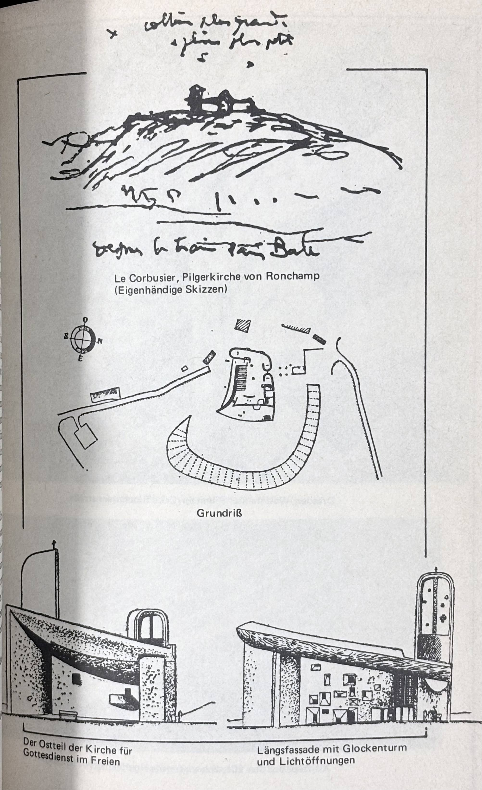
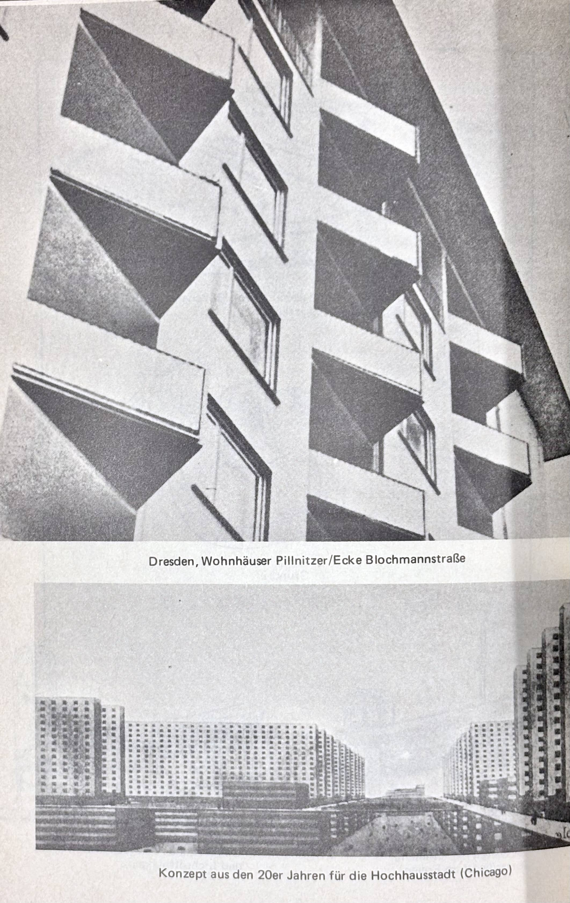
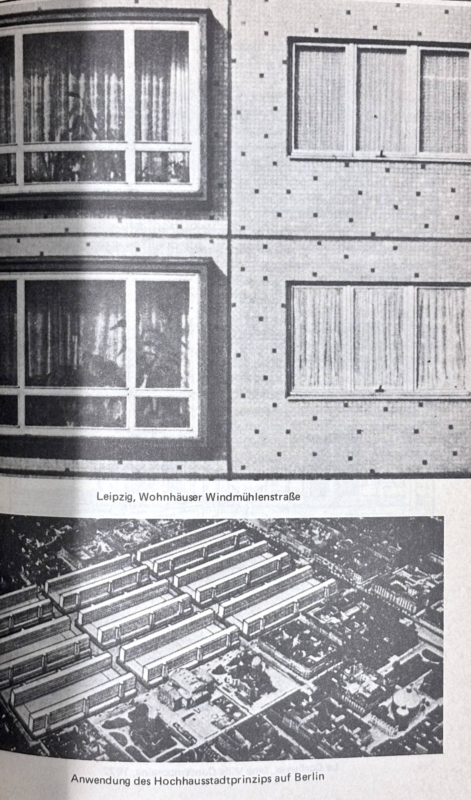
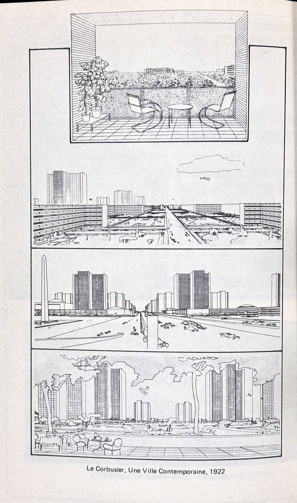

# Resultate der Verstädterung

Die Verstädterung, wie sie auf der zweiten Stufe der gesellschaftlichen Entwicklung einsetzt, zeigt, daß die menschliche Lebensweise sich von allen naturbedingten Formen löst und eine künstliche Umwelt zur "zweiten" Natur des Menschen wird. "Urbanism as a Way of Life", wie Louis Wirth seine Betrachtungen über die moderne Großstadt nannte, wird zum dominanten Lebensstil. Die Verstädterung auf der ersten Stufe der gesellschaftlichen Entwicklung blieb quantitativ und qualitativ beschränkt, weil der überwiegende Teil der Bevölkerung landwirtschaftlich produzierte und daher ans Land gebunden war. Der in der Landwirtschaft erzeugte Überfluß ermöglichte nur punktuelle Verstädterung; die Städte wuchsen kaum über die Maße "primärer Stadtgründungen" hinaus. Die eigentliche "städtische Umwälzung" (G. Childe) findet jetzt erst statt. Dabei wird deutlich, daß die gegen das Land abgesetzte Stadt eine Übergangsinstitution war, die mit der Metropolenbildung verschwindet, indem städtische Lebensformen innerhalb der industriellen Gesellschaft universell werden.

Der Übergang von der ersten zur zweiten Stufe der gesellschaftlichen Entwicklung ist die Geschichte des Kapitalismus. Die Durchsetzung dieser Wirtschaftsform ist untrennbar mit der bürgerlichen Klasse verbunden, deren Selbstverständnis Horkheimer einmal so formulierte: "Das bürgerliche Individuum ... glaubte ..., es gehöre einer Gesellschaft an, die den höchsten Grad von Harmonie einzig durch die unbeschränkte Konkurrenz individueller Interessen erreichen könne. Man kann sagen, daß der Liberalismus sich als Förderer einer Utopie verstanden hat, die verwirklicht war und nicht viel mehr brauchte als das Glätten einiger störender Unebenheiten."[^4-1] Diese "störenden Unebenheiten" bestanden in krassen Klassengegensätzen, einer pauperisierten Landbevölkerung, die auf der Suche nach Broterwerb zu Beginn der Industrialisierung in die Städte strömte und deren Glanz und Reichtum mit ihrem Elend und ihren Krankheiten verdüsterte. Die quasi verwirklichte Utopie und die Freiheit des Individuums galten nur für den Privateigentümer, nicht für diejenigen, die nichts als ihre Arbeitskraft besaßen.

  [^4-1]: Horkheimer, Zur Kritik der instrumentellen Vernunft, a.a.O., S. 133

Aber das vielgepriesene Prinzip der Konkurrenz entzog bei fortschreitender Entwicklung den bürgerlichen Individuen die materielle Basis ihrer Freiheit: das Eigentum. Wachsende Konzentration und Zentralisation des Kapitals, Resultat der Konkurrenz unter den vereinzelten Privateigentümern, enteignete immer mehr Kapitalisten. Dadurch löste sich die alte bürgerliche Klasse als Gemeinschaft unabhängiger Privateigentümer auf, aber mit dem Verschwinden dieser Klasse entfaltet der Kapitalismus erst seine wahre Gestalt.

Mit der Beseitigung der alten bürgerlichen Klasse durch die Eigengesetzlichkeit der Konkurrenz der vereinzelten Kapitalbesitzer, aus dem die großen Kapitalgesellschaften letztlich als Sieger hervorgehen, setzt ein weiterer gesellschaftlicher Umstrukturierungsprozeß ein: Die Kapitalfunktionen werden an ebenfalls Lohnabhängige delegiert. Es entwickelt sich eine "Teilung der Arbeiter in Handarbeiter und Arbeitsaufseher"[^4-2] und darüber hinaus eine im Sinne des Kapitals unproduktive Verwendung von Arbeitskräften als "dienende Klasse".[^4-3] Entgegen der These der unterschiedslosen Verelendung aller Lohnabhängigen wies Marx auf Tendenzen der zunehmenden Differenzierung der Arbeitsverhältnisse hin, die zur Bildung besonderer Berufsgruppen mit unterschiedlicher Entlohnung führen. Diesen Schluß glaubte auch Michael Mauke in seiner Arbeit über "Die Klassentheorie von Marx und Engels" ziehen zu können. Der "allround"-Kapitalist alten Schlages verschwindet, statt dessen übernehmen "höhere", d.h. besser bezahlte Lohnarbeiter die Planungs- und Verwaltungsaufgaben, die zur Erhaltung des Betriebs notwendig sind. In diesem Sinne sind die Angestellten und Beamten als Lohnarbeiter im Sinne Marx’ zu verstehen.

  [^4-2]: Marx, Kapital I, a.a.O., S. 445
  [^4-3]: ebd., S. 469

Die Differenzierung der abhängig arbeitenden Bevölkerung in sehr unterschiedliche Einkommensklassen und Beschäftigungsarten läuft parallel mit der Entwicklung des Kapitals zur Aktiengesellschaft und der Entwicklung "großer" Industrie. In der Aktiengesellschaft komme das Kapitalverhältnis zum reinsten Ausdruck: "als unmittelbare Macht der Dinge über die Menschen, als ein System 'technischer' Sachzwänge von dämonischer Funktionalität".[^4-4] Die Figur des einzelnen Kapitalisten, insbesondere des autonomen Fabrikherren, wird obsolet. Aktuell wird dagegen die Gestalt des Funktionärs, des Managers, wie überhaupt der leitenden Angestellten und Beamten, die nun die Funktionen des Kapitals als selbst Abhängige wahrnehmen.

  [^4-4]: Mauke, Michael, Die Klassentheorie von Marx und Engels, Frankfurt 1970, S. 103

Mauke versuchte, das epochal Neue daran herauszustellen: "An der Schwelle zum eigentlichen, der kapitalistischen Produktionsweise adäquaten Produktionsbetrieb, der mechanisierten Fabrik, kommt es zur zweiten geschichtlichen Arbeitsteilung zwischen geistiger und körperlicher Arbeit. Von vornherein spalten sich die geistigen Kompetenzen des Produktionsprozesses ab; betriebliche Leitung, Koordination, Kommunikation, Planung, Aufgaben technologischer Konstruktion, Vorbereitung und Kontrolle sowie alle Vermittlungskontakte mit der gesellschaftlichen Warenzirkulation werden nicht mehr vom unmittelbaren Produzenten geleistet, sondern zur Funktion einer spezifischen, hierarchisch gestuften technischen bzw. kommerziellen 'Intelligenz'."[^4-5] Diese "zweite geschichtliche Arbeitsteilung zwischen geistiger und körperlicher Arbeit" bestimmt auch die Form des heutigen Verstädterungsprozesses: Die neue technische und kommerzielle Intelligenz findet ihre günstigsten Arbeitsbedingungen in der City, dem Zentrum der Metropole.

  [^4-5]: ebd., S. 37

Die Entwicklung des Kapitalverhältnisses und seine Auswirkung auf die Bevölkerung der Industrienationen ist natürlich auch von der nicht-marxistischen Soziologie registriert worden. Vor allem Max Weber hatte in seinen politischen Schriften auf die überragende Bedeutung der Bürokratisierung moderner Arbeitsverhältnisse hingewiesen. Als die "entscheidende ökonomische Grundlage" des Bürokratisierungsprozesses hatte er die "Trennung des Arbeiters von den sachlichen Betriebsmitteln" genannt.[^4-6] Für Weber war Kapitalismus von einem geschulten und bezahlten "Fachbeamten" gar nicht zu trennen. Die modernen Beamten, die er als "hochqualifizierte geistige Arbeiterschaft" ansah, müßten "festen Lohn" beziehen, damit sie ihren Verwaltungsaufgaben ohne Interesse an persönlicher Bereicherung nachkämen. Sie sorgten allerdings mehr als alle anderen Gesellschaftsschichten für die "Unentrinnbarkeit" der "modernen rationalen Lebensordnung",[^4-7] Weber wurde nie müde, dies gerade der Sozialdemokratie vorzuhalten, deren Hoffnung auf den Sozialismus er nur als eine schlimmere Variante von bürokratisiertem Kapitalismus denunzierte. Auch wenn der "Privatkapitalismus" abgeschafft sei, so gäbe es doch nicht die Freiheit für die Individuen, weil die staatliche Bürokratie unangefochten weiter herrschte. Seine Gesellschaftskritik gipfelte in dem Satz: "Im Verein mit der toten Maschine ist sie an der Arbeit, das Gehäuse jener Hörigkeit der Zukunft herzustellen, in welche dereinst die Menschen sich, wie die Fellachen im alt-ägyptischen Staat, ohnmächtig zu fügen gezwungen sein werden ..."[^4-8]

  [^4-6]: Weber, Max, Wirtschaft und Gesellschaft, Köln (5) 1964, 2. Halbband, S. 1048
  [^4-7]: ebd., S. 1059
  [^4-8]: ebd., S. 1060

Solcher Pessimismus lag Marx ferne. Er setzte seine Hoffnung darauf, daß die Aktionen bewußt gewordener Menschen dieses "stählerne Gehäuse der Hörigkeit" sprengen würden. Bislang ist diese Hoffnung in den Bereich der Utopie verwiesen. Das Kapitalverhältnis als spezifisch gesellschaftliches Verhältnis zwischen den Menschen hat nichts von seiner Macht eingebüßt. "Sachzwänge" bestimmen die Lebensverhältnisse moderner Menschen, gleichgültig, ob sie sich als Lohnabhängige im Sinne Marx’ oder als Angehörige einer nivellierten Mittelstandsgesellschaft im Sinne Schelskys verstehen.[^4-9]

  [^4-9]: Schelsky, Helmut, Gesellschaftlicher Wandel, in: ders., Auf der Suche nach Wirklichkeit, Düsseldorf/Köln 1965

Webers Kritik an der modernen Bürokratie bleibt in tiefem Pessimismus befangen, weil er sich Rationalität jenseits der bürgerlichen Rationalität nicht vorstellen konnte. Selbst dort, wo er zur Überwindung des lähmenden Einflusses bürokratischer Herrschaft den charismatischen Führer und die Größe der Nation als Ziele der Politik empfahl,[^4-10] sind seine Analysen nicht frei von einem Ton der Verzweiflung. In mancher Hinsicht scheint die Kritik von Horkheimer und Adorno an der bürgerlichen Rationalität dem Weberschen Pessimismus zu ähneln, da sie ebenfalls unerbittlich auf die negativen Seiten dieser Vernunft hinwiesen. Im Gegensatz zu Weber distanzierten sie sich jedoch von dem Anteil an herrschaftlicher Vernunft, das dem bürgerlichen Denken aufgrund seiner Nähe zum naturwissenschaftlichen Denken innewohnt. Sie versuchten, dieses Herrschaftsmoment innerhalb der Logik dieses Denkens selbst aufzuspüren: "Was als Triumph subjektiver Rationalität erscheint, die Unterwerfung alles Seienden unter den logischen Formalismus, wird mit der gehorsamen 'Unterordnung der Vernunft unters unmittelbar Vorfindliche erkauft.'"[^4-11]

  [^4-10]: Weber, Wirtschaft und Gesellschaft, a.a.O., S. 1089 ff.
  [^4-11]: Horkheimer, Max und Theodor W. Adorno, Dialektik der Aufklärung (1944), Frankfurt 1969, S. 33

Auch die Länder des "realen Sozialismus" unterscheiden sich hierin kaum von dem vielgeschmähten Kapitalismus. Einer ihrer zentralen Vorwürfe gegen das kapitalistische System lautet, daß sich in ihm die Vernunft, d.h. das Wertgesetz, nur planlos durchsetze, während sie beanspruchen, es planvoll durchzusetzen.[^4-12] Beide Male beherrschen nicht Menschen, sondern Sachgesetze die Gesellschaft. Die Vorherrschaft abstrakter Kategorien, die sowohl in der Gesellschaft wie im Verhalten der Individuen als einzig wahre Rationalität gilt, ist bürgerliche Ideologie. Der Kern dieser Ideologie besteht darin, daß sie — nach einer Formulierung von Negt/Kluge — "von Wertabstraktionen durchzogen" ist.[^4-13] Diese Abstraktionen sind das geistige Korrelat der Warenproduktionen, die darauf aufbauen, daß die Werte der Waren auf abstrakte Werte bezogen und verglichen werden können.[^4-14]

  [^4-12]: Die politische Ökonomie des Sozialismus und seine Anwendung in der DDR, Berlin (DDR) 1969, S. 278 ff.
  [^4-13]: Negt, Oskar und Alexander Kluge, Öffentlichkeit und Erfahrung. Zur Organisationsanalyse von bürgerlicher und proletarischer Öffentlichkeit, Frankfurt 1972, S. 115
  [^4-14]: ebd., S. 144

Horkheimer hatte bereits 1942 auf grundsätzlich gleiche Entwicklungen in beiden Systemen verwiesen und zwar in dem von Max Weber gemeinten Sinne der Hörigkeit des einzelnen gegenüber dem Ganzen. "Die Bürokratie", sagte Horkheimer damals, "bekommt den ökonomischen Mechanismus wieder in die Hand, der unter der Herrschaft des reinen Profitprinzips der Bourgeoisie entglitt."[^4-15] Die Staatsform der Zukunft sei der "integrale Etatismus" oder Staatssozialismus.

  [^4-15]: Horkheimer, Max, Autoritärer Staat (1942), in: ders., Gesellschaft im Übergang, Frankfurt 1972, S. 27

Man könnte die Behauptung wagen, daß in den "klassischen kapitalistischen Ländern" die Enteignung der ursprünglichen bürgerlichen Privateigentümer und autonomer Kapitalisten zugunsten von Aktiengesellschaften oder sonstwie gemeinschaftlich verwaltetem großem Kapital auf ökonomischem Wege vor sich ging, nämlich durch den Mechanismus der Konkurrenz, während in den sozialistischen Ländern die Bildung großer Kapitalien mehr auf unmittelbar politischem Wege organisiert wurde. Von daher ließe sich verstehen, warum in den sozialistischen Staaten der Bürokratie von vornherein eine so große Bedeutung zukommt, während die Bürokratisierung der kapitalistischen "Heimatländer" erst ein allmähliches Produkt der gesellschaftlichen Entwicklung zu sein scheint.

Die von Max Weber prophezeite Unentrinnbarkeit bürokratischer Herrschaft wird von den Regierungen der Ostblockstaaten bestätigt. Die Planwirtschaft, wie sie dort von Staats wegen betrieben wird, bringt den Werktätigen nicht die Freiheit zur "Selbstbestätigung", die Marx als ein Zeichen der Überwindung der kapitalistischen Arbeitsformen ansah; sie konfrontiert sie vielmehr mit permanenten Versorgungskrisen und chaotischen Koordinierungsproblemen innerhalb der Produktionsabläufe selbst. Die offizielle Beseitigung "anarchischer Marktverhältnisse" wird zudem durch die reichhaltige Existenz illegaler schwarzer und grauer Märkte Lügen gestraft.[^4-16]

  [^4-16]: Kosta et al., Warenproduktion im Sozialismus, a.a.O., S. 164 und 172

Im integralen Etatismus bzw. "autoritären Staat" sah Horkheimer das Gegenteil dessen verwirklicht, was Marx sich unter der gemeinschaftlichen Kontrolle der Produktion durch die Assoziation der vereinigten Individuen vorstellte. Die "negativen Utopien", wie sie von G. Orwell in dem Roman "1984" oder in A. Huxleys "Brave New World" gezeichnet sind, beziehen ihr Grauen aus der bis in den letzten Winkel reichenden Überwachung und Dirigierung der Individuen durch staatliche Kontrollorgane. Die Marx’sche Utopie meint die Verwirklichung von Individualität; sie setzt die Entwicklung "totaler" Individuen als geschichtliches Ziel. In der "Deutschen Ideologie" vertrat Marx mit Engels sogar die These, daß die Individuen "den Staat stürzen" müßten, "um ihre Persönlichkeit durchzusetzen"; denn die bisherigen Formen der Gemeinschaft seien aufgrund ihres antagonistischen Klassencharakters nur "Surrogate" von Gemeinschaft gewesen.[^4-17] Damit war nicht ein Bekenntnis zur Anarchie gemeint, sondern die Einsicht in eine höhere Form der gesellschaftlichen Organisation, die ein neues Verhältnis von Individuum und Gesellschaft bedeutet.

  [^4-17]: MEW 3, a.a.O., S. 77

Zur Verwirklichung der gesellschaftlichen Organisation, wie sie für die dritte Stufe der gesellschaftlichen Entwicklung benötigt wird, ist die Entfaltung der Individuen zu "totalen Individuen" erforderlich.

Nur das voll entwickelte Individuum ist imstande, die gesellschaftlichen und natürlichen Prozesse durch vernünftige, der jeweiligen Situation angepaßte Planung zu steuern. Während die Integration der Individuen in die Gesellschaft auf der ersten Stufe der gesellschaftlichen Entwicklung naturwüchsig geschah, nämlich durch die Zufälligkeit ihrer Geburt und der damit gegebenen Zugehörigkeit zu einem bestimmten Familienclan, wurde sie auf der zweiten Stufe durch formale Organisationsprinzipien ersetzt, die der Form nach zunächst den naturwüchsigen Organisationseinheiten nachgebildet waren, im Prinzip aber auf die beliebigsten Gruppierungsmerkmale ausgedehnt werden können. Je formalisierter und bürokratisierter der gesellschaftliche Zusammenhang zuletzt wird, umso mehr müssen sich die Individuen auf persönlich erworbene Fähigkeiten verlassen können, die ihnen rascher und besser als die formalisierten Verkehrsformen das Zurechtfinden in der hoch arbeitsteiligen, städtisch-industriellen Gesellschaft erleichtern.

Das gesellschaftliche Leben auf der zweiten Stufe der Entwicklung ist durch die sachliche Abhängigkeit der einzelnen und die Undurchdringlichkeit der zu Sachgesetzen geronnenen Herrschaftsverhältnisse bestimmt. In den vorbürgerlichen Gesellschaften wurde die wechselseitige Abhängigkeit der Individuen in naturgegebenen Abstammungsverhältnissen erfahren, deren dunkler Ursprung durch mythologische Erzählungen aufgehellt wurde, um das zwanghafte und mechanische Moment des gesellschaftlichen Zusammenhangs zu mildern und dem menschlichen Denken und Fühlen näherzubringen. Das jährliche Stadtfest, das in den archaischen Stadtgemeinschaften gefeiert wurde, zelebrierte den analphabetischen Menschen diesen Zusammenhang in einer Weise, der zugleich auf ihre Phantasien wirkte. Die Geschicke der Stadtbewohner wurden dabei auch, wie von den Riten des babylonischen Neujahrsfestes abzulesen ist, aus dem Ratschluß der Götter abgeleitet. Mit solchen mythologischen Vorstellungen hat die bürgerliche Gesellschaft aufgeräumt und anstelle der mythischen Gewalten das Tauschprinzip und das Wertgesetz gestellt. Die Vollstrecker der modernen Sachgesetze, all die vielen Beamten oder Funktionäre, teilen mit den alten Göttern höchstens die Launen.

Zudem waren die Götter und ihre menschlichen Inkarnationen, die archaischen Könige und Helden, zugleich die menschheitsgeschichtlich frühesten, wenn auch noch unvollkommenen Individuen. Die heutigen Funktionäre dagegen verkörpern als "Charaktermasken"[^4-18] nur noch das Gesellschaftlich-Allgemeine. Die Weiterentwicklung von Individualität ist also nicht mehr im gesellschaftlich-öffentlichen Bereich aufzuspüren, sondern im privaten der Familie.

  [^4-18]: Marx, Das Kapital I, a.a.O., S. 100

Die "Resultate der Verstädterung" sind heute wesentlich von den Bedingungen geprägt, die Marx mit Kapitalismus meinte, dem "System allseitiger sachlicher Abhängigkeit". Nicht nur die Architektur weist in ihrer kalten Funktionalität jene Züge der Unterwerfung unter "Sachgesetze" auf; die gesamte Aneignung des Raumes ist in der Trennung von Wohn- und Arbeitsbezirken das unmittelbare Resultat kapitalistischer Arbeitsteilung. Hieraus ergeben sich völlig neue Formen der Benutzung und des Erlebens des Landes, weil mit der Trennung von Arbeiten und Wohnen auch neue Verkehrsmittel zur Überwindung der größeren Entfernungen notwendig wurden. Dies alles drückt sich in einem grundlegenden Formwandel des Verhältnisses von Stadt und Land aus.[^4-19]

Ebenso neuartige Bedingungen ergeben sich für den Bereich der Öffentlichkeit, die sich in den vorbürgerlichen Gesellschaften auf den städtischen Plätzen konstituierte und den freien Stadtbürgern Möglichkeiten des persönlichen Einflusses auf die allgemeinen Belange bot, heute jedoch in besonderen Institutionen lokalisiert ist. Deren bürokratische Struktur verwehrt den einzelnen die Einflußnahme auf öffentliches Geschehen, wie sie noch in der frühen Form bürgerlicher Öffentlichkeit möglich war; sie zwingt zugleich zu neuen Formen politischer Aktion.[^4-20]

  [^4-19]: Köllmann, Wolfgang, Von der Bürgerstadt zur Regional-Stadt. Über einige Formwandlungen der Stadt in der deutschen Geschichte, in: Die deutsche Stadt im Industriezeitalter (Hg. Jürgen Reulecke), Wuppertal 1978, S. 19
  [^4-20]: Matzerath, Horst, Von der Stadt zur Gemeinde, in: Archiv für Kommunalwissenschaften, 13. Jg. (1974), S. 24

## 1. Moderne Formen des Gegensatzes von Stadt und Land

Wie die rechtliche Veränderung des Status der Städte in der ersten Hälfte des 19. Jahrhunderts anzeigt, hört die Stadt zu Beginn der Industrialisierung auf, als autonome Herrschafts-, Wirtschafts- und Verwaltungseinheit zu existieren. Die städtischen Sonderrechte und Privilegien wurden von den Regierungen der neuen Territorialstaaten abgebaut, Stadt und Land einer vereinheitlichenden Gemeindeordnung unterworfen.[^4-19] An die Stelle jeweils lokal verschiedener Stadtpolitik rückte die staatliche Politik und Raumordnung. Inhaltlich bildete, nach Auffassung von H. Matzerath, das französische Gemeinderecht (nach der Revolution von 1789, H.B.) den schärfsten Bruch mit der Vergangenheit.[^4-20]

  [^4-21]: Schmoller, Gustav, Deutsches Städtewesen in älterer Zeit, Bonn/Leipzig 1922, S. 387
  [^4-22]: Matzerath, Von der Stadt zur Gemeinde, a.a.O., S. 32
  [^4-23]: Köllmann, Von der Bürgerstadt zur Regional-Stadt, a.a.O., S. 19/20
  [^4-24]: Köllmann, Wolfgang, Industrialisierung, Binnenwanderung und "Soziale Frage", in: ders., Bevölkerung in der industriellen Revolution, Göttingen 1974, S. 105-106

Trotz erheblicher Größenunterschiede wurden alle Gemeinden rechtlich gleichgestellt. Auch im territorial zersplitterten Deutschland wurde in den verschiedenen Ländern in den dreißiger Jahren des 19. Jahrhunderts Gemeindereformen durchgeführt, die die einstige Bürgergemeinde zur bloßen Einwohnergemeinde machte. In Preußen vollzog sich die Staatsbildung und die gleichzeitige Entmachtung der Städte zwischen 1700 und 1740, indem die Städte durch allgemeine Verwaltungsreformen ihrer lokalen Privilegien allmählich beraubt wurden. Schmoller stellte diesen Prozeß sehr ausführlich dar und zog das Resümee: "Die Einfügung der Städte in den Staatsorganismus einerseits, ihre Unterstellung unter die staatlichen Behörden hängt mit dem wichtigsten Umschwung in der modernen Staatsverwaltung zusammen, mit der Trennung von Justiz und Verwaltung, der Bildung der besonderen Verwaltungsbehörden."[^4-21] Mit anderen Worten: Die Städte wurden dem staatlichen "Gewaltmonopol" (Elias) untergeordnet. Damit trat der Gegensatz von Stadt und Land in ein neues Stadium; er differenzierte sich, und er entfaltete sich in neuen geographischen Dimensionen.

Die Stadt, nicht länger ein wirtschaftlich autonomes Gebilde, politisch entmachtet, wurde nur noch ganz formal von der Anzahl ihrer Einwohner her bestimmt; z.B. definierte Preußen Gemeinden mit mehr als 100 000 Einwohnern als Großstädte.[^4-22] Aber dieser statistisch formale Stadtbegriff ist von der weiteren Verstädterung längst überholt.

Unter den Historikern der Neuzeit scheint eine Übereinstimmung über die Veränderung des Verhältnisses zwischen Stadt und Land zu bestehen, die sich aus dem Vordringen staatlicher Verwaltung in alle Lebensbereiche ergab. Die "Überführung aller Einwohner in eine gemeinsame Staatsgemeinschaft" ist nach Köllmanns Ansicht als die Überwindung des rechtlichen (ständischen) Gegensatzes von Stadt und Land zu verstehen, allerdings nicht des Stadt-Land-Gegensatzes schlechthin.[^4-23] Die Beseitigung der rechtlichen Schranken zwischen Stadt und Land erleichterte den Prozeß riesiger Binnenwanderungen der zu Beginn des 19. Jahrhunderts verarmten Landbevölkerung, die an die Standorte der neuen Industrien drängte, um Arbeit zu finden, und damit zum enormen Wachstum städtischer Agglomerationen beitrug.[^4-24]

Die "tatsächliche Stadteinheit" ist heute die Metropole, die zahlreiche Stadt- oder Landgemeinden in sich aufgenommen hat. Sie hat viele Namen: Ballungsgebiet, Agglomeration, Stadtregion, Stadtlandschaft, Megalopolis. Einer der Vorläufer der Metropole war die "Hauptstadt", die zu Beginn der Nationalstaatsbildung entstand. Gegenüber der Hauptstadt verkamen viele der einst mächtigen autonomen Städte zu bloßen Provinzstädten. Der andere Vorläufer metropolitaner Verstädterung war die Agglomeration vieler Menschen an den Standorten der neu entstehenden Industrien und ihrer Rohstoffbasen.[^4-25]

### 1.1 Der Wandel des Stadt-Land-Gegensatzes in der Phase der Proto-Industrialisierung

Bevor die Industrialisierung einsetzte, hatten in den europäischen Nationen seit dem 16. Jh. tiefgreifende soziale Umwälzungen stattgefunden. Da die zünftlerische Gebundenheit der gewerblichen Produktion in den Städten zu einer Stagnation der Arbeitstechniken führte, mußten die unternehmerischen Kaufleute auf das Land ausweichen, um für neue Arbeitstechniken und -organisationen Menschen zu finden, die außerhalb der mittelalterlichen Zunftordnung standen. So bildeten sich zuerst auf dem Lande Sozialstrukturen heraus, wie sie für die Organisation kapitalistischer Arbeitsverhältnisse typisch sind.[^4-26] Das Verlagswesen oder die Hausindustrie schuf den Übergang vom zünftigen Handwerk zur späteren Großindustrie. Durch Handelsgewinne reich gewordene städtische Unternehmer organisierten dazu ländliche Arbeitskräfte, um deren gewerbliche Produkte in einer groß angelegten Absatzorganisation zu vertreiben. Trotz erheblicher regionaler und zeitlicher Diskontinuitäten brachte bereits die Phase der "Proto-Industrialisierung" neue Formen räumlicher Arbeitsteilung hervor.[^4-27] Es bildeten sich jetzt ländliche Regionen heraus, "in denen ein großer Teil der Bevölkerung ganz oder in einem beträchtlichen Maße von gewerblicher Massenproduktion für überregionale und internationale Märkte lebte".[^4-28] Die Abhängigkeit "barbarischer oder halbbarbarischer Länder von den zivilisierten" begann sich auszubilden. Der "Ansatzpunkt der Proto-Industrialisierung und der durch sie forcierte Prozeß der Differenzierung und Polarisierung innerhalb der ländlichen Bevölkerung", war aber laut Kriedte, Medick und Schlumbohm "die bereits bestehende Trennung von Stadt und Land".[^4-29]

Im Übergang zur zweiten Stufe der gesellschaftlichen Entwicklung oder zu Beginn des Kapitalismus ist der ausgebildete Gegensatz von Stadt und Land Voraussetzung; er ist in dieser Epoche am schärfsten ausgeprägt.

  [^4-25]: Ipsen, Gunter, Die Stadt (IV), in: Handwörterbuch der Sozialwissenschaften, Bd. 9, Stuttgart/Tübingen/Göttingen 1956
  [^4-26]: Dabei hatte die um ca. 200 Jahre früher einsetzende kapitalistische Entwicklung in den norditalienischen Stadtstaaten eine Sonderstellung, die mit der nord- und mitteleuropäischen nicht vergleichbar ist.
  [^4-27]: Kriedte et al., Industrialisierung vor der Industrialisierung, a.a.O., S. 25/26. Der Begriff "Proto-Industrialisierung" wurde zuerst von den amerikanischen Historikern F. Mendels sowie Charles und Richard Tilly eingeführt.
  [^4-28]: ebd., S. 26
  [^4-29]: ebd., S. 28

Die kapitalistische Entwicklung setzt wiederum Mechanismen frei, die diesen Gegensatz einerseits nivellieren, andererseits in geographisch neue Bahnen lenken. Es schreitet eine immer großräumigere soziale Differenzierung einzelner Landstriche oder gar Erdteile voran, wobei die Industrienationen eine deutliche Dominanz haben und den Differenzierungsprozeß bestimmen. Innerhalb der Industrieländer verringert sich der Gegensatz von städtischer und ländlicher Lebensform und Siedlungsweise. Ehemals städtische Einrichtungen (Verkehrsmittel, Massenmedien, Einkaufszentren) dringen in die entlegensten ländlichen Winkel vor.

Die These von Marx: "Die moderne (Geschichte) ist Verstädtischung des Landes, nicht wie bei den Antiken, Verländlichung der Stadt"[^4-30] erscheint darum richtig. Bereits im "Manifest der Kommunistischen Partei" hatten Marx und Engels konstatiert: "Die Bourgeoisie hat das Land der Herrschaft der Stadt unterworfen. Sie hat enorme Städte geschaffen, sie hat die Zahl der städtischen Bevölkerung gegenüber der ländlichen in hohem Grade vermehrt und so einen bedeutenden Teil der Bevölkerung dem Idiotismus des Landlebens entrissen. Wie sie das Land von der Stadt, hat sie die barbarischen und halbbarbarischen Länder von den zivilisierten, die Bauernvölker von den Bourgeoisievölkern, den Orient vom Okzident abhängig gemacht."[^4-31] Unter Bourgeoisie wird hier offensichtlich nicht das mittelalterliche Bürgertum verstanden, sondern die Gesellschaft des 19. Jh., in deren Epoche die Herausbildung "enormer" Städte fällt und die Ausweitung des Stadt-Land-Herrschaftsgefälles auf sehr viel ausgedehntere Regionen.

Das Wachstum der "enormen" Städte der neuen Gesellschaftsformation ging auf Kosten der Landbevölkerung. Robert Schnerb führte aus: "Mit Ausnahme Englands lebte bis zum Jahr 1850 der Hauptteil der Bevölkerung auf dem Land. Doch dann setzte ein Ansturm auf die Städte ein. Die Konzentrationsbewegung war eindeutig das Ergebnis der Landflucht; nirgendwo kann der natürliche Bevölkerungszuwachs allein dafür verantwortlich gemacht werden."[^4-32] E. Hobsbawm dagegen betonte, daß ein allgemeiner "ungewöhnlicher demographischer Aufschwung" im 19. Jh. stattfand: "Im Verlauf der ersten Hälfte des 19. Jh. hat sich die Bevölkerung Großbritanniens fast verdoppelt, im Jahrhundert von 1750 bis 1850 fast verdreifacht. Zwischen 1800 und 1846 stiegen die Einwohnerzahlen Preußens, im europäischen Rußland (ohne Finnland), zwischen 1750 und 1850 in Norwegen, Schweden und Holland, in weiten Gebieten Italiens um nahezu 100% ..."[^4-33]

Diese allgemeine "Bevölkerungsexplosion an der Schwelle zur Industrialisierung", die R. Malthus zu den düstersten Prognosen über das weitere Schicksal der menschlichen Gattung nötigte, war durch verschiedene gesellschaftliche Faktoren bedingt. Zunächst hatten Veränderungen der landwirtschaftlichen Produktion durch Einführung der Kartoffel, der Düngung der Felder, der Vierfelderwirtschaft statt Brache und verbesserte Viehzuchtergebnisse[^4-34] zu einem Anwachsen der ländlichen Bevölkerung geführt. Die Abwanderung dieser Überschußbevölkerung in die Städte erhöhte die Wachstumsraten, weil in der Stadt die Heiratsbeschränkungen wegfielen, wie sie auf dem Lande galten, wo das Heiraten an eine "Vollstelle" gebunden war. Da die städtischen Zuwanderer ihr unter ländlichen Verhältnissen entstandenes "generatives" Verhalten beibehielten und, einmal verheiratet, unbeschränkt Kinder in die Welt setzten, wuchs die städtische Bevölkerung unmäßig.

Mittlerweile hat sich in den hochindustrialisierten Ländern das generative Verhalten der Bevölkerung gewandelt und die "Bevölkerungsschere", wie R. Mackenroth das Auseinanderklaffen der Zuwachsraten gegenüber den Absterbequoten nannte, "hat sich wieder geschlossen".[^4-35] Sie ist allerdings in den sog. Entwicklungsländern sehr weit geöffnet, weil die Säuglingssterblichkeit zurückgeht, aber das generative Verhalten noch an vorindustriellen Bedingungen orientiert ist. In Indien wurden Mitte der 70er Jahre groß angelegte Versuche gemacht, Männer, die mehr als drei Kinder hatten, zu sterilisieren. Geburtenbeschränkung gehört dort zum bevorzugten Thema staatlicher Propaganda.

In Europa erfolgte die Veränderung des generativen Verhaltens zu Beginn der Industrialisierung ohne staatliche Eingriffe. Sie spiegelt eine Anpassung an die städtischen Lebensverhältnisse wider, die sich zum Vorteil der Kinder niederschlägt. Die Beschränkung der Kinderzahl ist eines der bedeutsamsten Resultate der modernen Verstädterung.

Die Verstädterung, die auf Grundlage der Industrialisierung vor sich geht, schafft einen neuen Typus Stadt oder Stadt-Land-Kontinuum: die Metropole. Mackensen stellte fest, daß das "ältere Städtewesen" kaum über einen Verstädterungsgrad von einem Sechstel der Gesamtbevölkerung hinauskommt und Großstädte nur als Metropolen mächtiger Imperien zu bilden vermag. Mit der Industrialisierung wuchs der Anteil von Menschen innerhalb einer Nation, die in Städten wohnen, auf zwei Drittel, davon ein Drittel in Städten von mehr als 100 000 Einwohnern.[^4-36] Wie aus einer ähnlichen Arbeit von Bernhard Schäfers allerdings hervorgeht, sind die

  [^4-30]: <!-- TODO: Marx-Quelle für das Zitat "Die moderne (Geschichte) ist Verstädtischung des Landes ..." -->
  [^4-31]: Marx, Karl und Friedrich Engels, Manifest der Kommunistischen Partei, in: MEW 4, S. 466
  [^4-32]: Schnerb, Robert, Das bürgerliche Zeitalter, a.a.O. <!-- TODO: genaue Seitenangabe für das Zitat -->
  [^4-33]: <!-- TODO: Quelle/Seite für das Zitat von E. Hobsbawm -->
  [^4-34]: Schnerb, Das bürgerliche Zeitalter, a.a.O., S. 21-23
  [^4-35]: Mackenroth, Gerhard, Bevölkerungslehre, in: Gehlen, A. u. H. Schelsky, Soziologie. Ein Lehr- und Handbuch zur modernen Gesellschaftskunde, Düsseldorf/Köln 1955, S. 46-92, hier: S. 80
  [^4-36]: Mackensen, Rainer, Städte in der Statistik, in: Pehnt, Wolfgang, Die Stadt in der Bundesrepublik, Stuttgart 1974, S. 129-165, hier: S. 136 f.

Stadtdefinitionen einzelner Nationen sind statistisch gesehen außerordentlich uneinheitlich,[^4-37] so daß sich der jetzige Verstädterungsprozeß kaum mehr als quantitatives Problem fassen läßt.

Den Wandel des Stadt-Land-Verhältnisses, wie ihn die entwickelteren Nationen Europas im 19. Jh. durchmachten, erleben jetzt die Städte ehemaliger Kolonialländer. Sie werden von überschüssigen ländlichen Arbeitskräften bevölkert, für die noch keine industriellen Arbeitsplätze vorhanden sind, und deren selbsterbaute Hütten sich zu riesigen Slums agglomerieren. Für René König sind sie "eher Arbeitslagern als städtischen Siedlungen vergleichbar".[^4-38] Im Kalkutta der 60er Jahre galten über 40 % der Bevölkerung als Einwanderer oder Flüchtlinge. Diese Städte zeigen etwas von der Veränderung des Stadt-Land-Gegensatzes in ihrer wahrscheinlich schrecklichsten Phase.

Nach Bernhard Schäfers' Darstellung erleiden die ländlichen Zuzügler südamerikanischer Städte ein schlimmeres Schicksal als die ländlichen Zuwanderer europäischer Städte im 19. Jh. In Europa hielten sich Bevölkerungsbewegung, Sozialstruktur und Industrialisierung eher die Waage, obwohl auch hier die Industrialisierung mit furchtbarem städtischen Elend einherging. In den Entwicklungsländern kontrastiert eine bereits hochentwickelte industrielle Fertigungstechnik, wie sie von den Industrienationen verbreitet wird, mit einer vorindustriell lebenden Bevölkerung, die meist nicht einmal des Lesens und Schreibens kundig ist.[^4-39] Die Arbeitslosenquote wird in den dortigen Ländern auf 20 % geschätzt.[^4-40] Ein Leben voll grauenhafter Armut erwartet darum die ländlichen Zuwanderer; sie bleiben der städtischen Lebensweise fremd, werden nicht "akkulturiert", obwohl sie in den Städten oder ihrer unmittelbaren Umgebung siedeln.[^4-41]

Wolfgang Köllmann wie auch Wolfram Fischer verwiesen darauf, daß der verschärfte Stadt-Land-Gegensatz, wie er zu Beginn der Industrialisierung auftritt, durch die Industrialisierung selbst gemindert wird. Die "soziale Frage", die in Europa im 19. Jh., in den Entwicklungsländern im 20. Jh. das rasante Wachstum "enormer" Städte begleite, sei in Wirklichkeit Erbe der Phase, die der Industrialisierung unmittelbar vorausgehe und im Pauperismus der ländlichen Bevölkerung geendet habe.[^4-42]

  [^4-37]: Schäfers, Bernhard, Phasen der Stadtbildung und Verstädterung, in: Zeitschrift für Stadtgeschichte, Stadtsoziologie und Denkmalpflege, 4. Jg. (1977), S. 243
  [^4-38]: König, René, Großstadt, in: Handbuch der empirischen Sozialforschung (Hg. R. König und E. Scheuch), Bd. II, Stuttgart 1969, S. 622-674, hier: S. 659
  [^4-39]: Schäfers, Bernhard, Elendsviertel und Verstädterung in Lateinamerika, Sozialforschungsstelle an der Universität Münster o.J., S. 84/85
  [^4-40]: Herold, Dieter, Die weltweite Vergroßstädterung, a.a.O., S. 216
  [^4-41]: Schäfers, Elendsviertel und Verstädterung in Lateinamerika, a.a.O., S. 97
  [^4-42]: Fischer, Wolfram, Wirtschaft und Gesellschaft im Zeitalter der Industrialisierung, Göttingen 1972, S. 242 ff.; außerdem: Köllmann, Wolfgang, Bevölkerung in der industriellen Revolution, a.a.O., S. 36 f.

Die heutige Verstädterung in den Entwicklungsländern wird als quantitative "Über-Urbanisierung" (Ph. Hauser) bezeichnet, mit der die qualitative Verstädterung, die Anpassung der Menschen vom Land an die städtische Zivilisation, nicht Schritt zu halten vermag. Die These, daß im Übergang zur zweiten Stufe der gesellschaftlichen Entwicklung ein besonders scharfer Stadt-Land-Gegensatz entsteht, scheint aufs bitterste bestätigt. Schäfers erwähnte am Beispiel der südamerikanischen Städte, daß "ein Kontinuum zwischen Stadt und Land", wie es in den entwickelteren Industrieländern besteht, in den unterentwickelten Ländern fehle. In der Stadt konzentriere sich alles, auf dem Land gebe es nichts.[^4-43]

Die furchtbaren Momente dieser Übergangsformen nicht zu vergessen, sondern in ihrer Verquickung mit den großartigen Errungenschaften der modernen Zivilisation im Gedächtnis zu behalten, war ein wesentlicher Impuls der Marx'schen Gesellschaftskritik. Marx hatte die Phase der "Proto-Industrialisierung" den Prozeß der "ursprünglichen Akkumulation" des Kapitals genannt. In dieser Phase wurde zuerst der "historische Scheidungsprozeß von Produzent und Produktionsmittel" eingeleitet, das spezifisch kapitalistische Arbeitsverhältnis etabliert, das den Lohnarbeiter voraussetzt, den anderen Menschen, "der sich selbst freiwillig zu verkaufen gezwungen ist".[^4-44] Die Umwandlung der Arbeitskräfte in eigentumslose Lohnarbeiter, die bereit waren, sich der Disziplin der Verlags- und Manufakturbetriebe anzupassen, wurde oft mit brutaler Gewalt durchgesetzt, nicht nur durch Not erzwungen. Die Brutalität der englischen und irischen Bauernfreisetzungen wurde von Marx minutiös beschrieben; sie offenbarte die Ohnmacht der Landbevölkerung gegenüber den neuen gesellschaftlichen Gewalten, vor allem der organisierten Staatsgewalt.

In der neueren historischen Forschung über die Phase der "Proto-Industrialisierung" wird das Moment dramatischer Gewaltanwendung in der Verwandlung ländlicher Bevölkerungsgruppen zu lohnabhängigen Arbeitern geringer eingeschätzt. Hans Linde betonte, daß das Elend der Landbevölkerung im 18. Jh. vor allem durch eine "säkulare Bevölkerungszunahme" bedingt war. Verbesserungen in der landwirtschaftlichen Produktion (Kartoffelanbau) und Verbesserungen im Gesundheitswesen sprengten die bis dahin relativ stationäre Bevölkerungsvermehrung und schufen damit "die arbeitswirtschaftliche Voraussetzung einer proletarischen Lohnarbeiterschaft ohne eigene Produktionsmittel".[^4-45] Bevor die industrielle Großstadt mit ihrem proletarischen Massenelend entstand, war auf dem Lande bereits eine "proto-industrielle" Arbeiterschaft vorhanden, die sich und ihre Familien willig dem kapitalistisch orientierten Verleger anheimgab. Die proto-industriellen Heimarbeiter "unterhungerten" (K. Wittfogel) den manufakturiellen Großbetrieb. Das Motiv der familialen Selbstausbeutung dieser ersten Lohnarbeiterschaft ist in dem Wunsch zu sehen, der Abhängigkeit des "großen Hauses" zu entrinnen; Peter Laslett betonte, daß vor allem die Chance, eine Familie zu gründen, die Hausindustrie attraktiv machte.[^4-46]

Denn die einzige Möglichkeit vorindustrieller Gesellschaften, bei gegebenem Nahrungsspielraum und begrenztem Territorium die Bevölkerung an allzu großer Vermehrung zu hindern, lag darin, das Heiraten zu unterbinden.

Durch die Proto-Industrialisierung wurden aber neue Arbeitsplätze geschaffen und Bevölkerungskreise, die sonst vom Heiraten ausgeschlossen waren, konnten nun eine Familie gründen. Dies war auch identisch mit dem einzig legitimen Genuß von Sexualität. Darauf war das frühkapitalistische Verlagssystem wiederum ausgerichtet: Es nutzte die noch vorindustriellen Lebens- und Produktionsformen aus, indem es nicht den einzelnen Lohnarbeiter, sondern die gesamte Familie als Arbeitseinheit ausbeutete. Gewerbliche Kinderarbeit hat darum in der proto-industriellen Familienwirtschaft ihre Wurzeln.

Das proletarische Elend, das zuerst auf dem Land entstand, wurde in der Stadt durch eine "enorme" Zusammenballung unübersehbar. In der Stadt war die arme Bevölkerung auch weniger bereit, ihr Hungerdasein stumm zu ertragen.[^4-47] Die Aufstände der Bevölkerung gegen Not und Ausbeutung fanden im 19. Jh. hauptsächlich in den Städten statt (48er Revolution, Aufstand der Pariser Kommune 1871). In den großen Städten begannen die Arbeiter sich zu organisieren, um ihre Interessen gegen die Staatsgewalt durchzusetzen.

Drakonische Disziplinierung der Arbeitskräfte in der ersten Phase der Industrialisierung wurde auch im nachrevolutionären Rußland angewandt. Nach der Revolution (1917-1921) verschärfte sich der "Widerspruch zwischen Stadt und Land" und fand Ausdruck in "zahlreichen Bauernaufständen, in Anbau- und Ablieferungsboykott".[^4-48] Die forcierte Industrialisierung wurde mit Hilfe der Armee durchgeführt. Wie zur Zeit des Absolutismus war auch hier die organisierte staatliche Gewalt das Mittel, um - in Marx' Worten - die neuen gesellschaftlichen Verhältnisse "treibhausmäßig zu fördern und Übergänge abzukürzen".[^4-49] So beginnt die Verstädterung auf der zweiten Stufe der gesellschaftlichen Entwicklung mit einer Verschärfung des Stadt-Land-Gegensatzes und einer Ausdehnung der "territorialen Teilung der Arbeit, welche besondre Produktionszweige an besondre Distrikte eines Landes bannt"[^4-50], bevor die Mechanismen der Nivellierung dieses Gegensatzes wirksam werden.

  [^4-43]: Schäfers, Elendsviertel und Verstädterung, a.a.O., S. 42/43
  [^4-44]: Marx, Kapital I, a.a.O., S. 753
  [^4-45]: Linde, Hans, Familie und Haushalt als Gegenstand bevölkerungsgeschichtlicher Forschung, in: Sozialgeschichte der Familie in der Neuzeit Europas (Hg. Werner Conze), Stuttgart 1976, S. 36/37
  [^4-46]: Laslett, Peter, Familie und Industrialisierung: eine "starke Theorie", in: Sozialgeschichte der Familie in der Neuzeit Europas, a.a.O., S. 23 und 25
  [^4-47]: Hobsbawm, Europäische Revolutionen, a.a.O., S. 398
  [^4-48]: Kosta et al., Warenproduktion im Sozialismus, a.a.O., S. 147/148
  [^4-49]: Marx, Kapital I, a.a.O., S. 791
  [^4-50]: ebd., S. 371

### 1.2 Paradoxien im industriellen Verstädterungsprozeß

Nach Grauhans Auffassung entwickelt sich der moderne Stadt-Land-Gegensatz in zwei Dimensionen: 1. im Ausbeutungsverhältnis der Metropolen gegenüber ehemaligen Kolonialländern (= großräumige Extension), 2. im Differenzierungsprozeß des metropolitanen Gebietes selbst, der Herausbildung unterprivilegierter Regionen (= Intensivierung im Innern der Metropole).
Die moderne Verstädterung "hebt den alten Stadt-Land-Gegensatz nicht auf, sondern reproduziert ihn in erweiterter räumlicher Dimension stets neu im Prozeß der um institutionelle Grenzen kaum bekümmerten Agglomeration und Deglomeration. Der im Weltmaßstab so eindrückliche Gegensatz von unterentwickelten und überentwickelten Gebieten bildet sich also innerhalb der entwickelteren Gesellschaften nochmals ab."[^4-51] Die fortschreitende Funktionalisierung ganzer Landstriche und Erdteile nach dominanten Nutzungsarten zeigt die ungeminderte Wirksamkeit repressiver Arbeitsteilung.

Der Zusammenhang zwischen den arbeitsteilig zergliederten Gebieten der Metropole wird durch technisch aufwendige Verkehrsanlagen hergestellt, deren derzeitige technologische Gestalt (Abgas- und Lärmerzeugung) die Stadt zur "Transportanlage" verkümmern läßt.[^4-52] Die fortgeschrittene Arbeitsteilung, die die räumlich so wirksame Trennung von Arbeiten und Wohnen durchsetzte, führt zu Wachstumsgesetzen der industriellen Verstädterung, die von amerikanischen Sozialforschern zuerst entdeckt und nach Art biologischer Prozesse dargestellt wurden.[^4-53] Ernest Burgess hatte die "Theorie der konzentrischen Zonen" der Nutzungs- und Wachstumsräume des metropolitanen Gebietes formuliert, sein Mitarbeiter McKenzie postulierte, daß dieses Wachstum, ähnlich wie bei der Ausbreitung einer Pflanzensorte im Raum, in Wellen von "Invasion" und "Sukzession" vor sich ginge und darum in den Begriffen der "Ökologie", d.h. der Lehre vom Verhalten von Pflanzen- und Tiergruppen im Raum, zu fassen sei. Bernd Hamm verwies darauf, daß es den "Sozialökologen" hauptsächlich darauf ankam, die "unbewußten, nicht willentlich gesteuerten Erscheinungen sozialer Organisation" auf diese Weise sichtbar zu machen.[^4-54] Was R. Park als "biotische Struktur" vom kulturellen Überbau unterschieden wissen wollte, sei als "Figuration", als "anonymer Zwang" zu verstehen, welche das "soziale Handeln" der Menschen, d.h. ihre mit Bewußtsein geplanten Aktionen, ebenso durchkreuzen und unmöglich machen, wie andere naturgegebene Verhältnisse sonst.[^4-55]

  [^4-51]: Grauhan, Rolf-Richard, Lokale Politikforschung, Frankfurt 1975, Bd. 1, S. 12
  [^4-52]: Helms, Hans G. und Jörn Janssen, Kapitalistischer Städtebau, Neuwied 1970, S. 7
  [^4-53]: Park, Robert E. und Ernest W. Burgess/McKenzie, The City, Chicago 1925
  [^4-54]: Hamm, Bernd, Die Organisation der städtischen Umwelt, Frauenfeld/Stuttgart 1977, S. 29
  [^4-55]: ebd., S. 89

Die Sozialökologen faßten die Wachstumsprozesse der industriellen Großstadt als ein unbewußt ablaufendes Geschehen auf, das sich zwar als massenhaftes Resultat vieler vereinzelter sozialer Entscheidungen und individuell bewußter Aktionen ergibt, jedoch insgesamt von Kräften determiniert wird, die von "kulturellen Werten" ziemlich unabhängig erscheinen. Danach bildet sich die Stadtmitte durch die Konkurrenz der mächtigsten Institutionen um die Standorte heraus, die wegen ihrer verkehrsgünstigen Lage begehrt werden. Die Dominanz des Gebietes, das City geworden ist, drückt sich darin aus, daß von seiner Expansion alles weitere Wachstum der Metropole bestimmt wird. Die Wachstumsschübe des Zentrums breiten sich wellenförmig ins weitere Stadtgebiet und schließlich das Umland aus.[^4-56]

Die Zone, die dem Stadtkern unmittelbar anschließt, ist von den negativen Folgen der Wachstums- und Umstrukturierungsverläufe am stärksten betroffen: Sie wird zum Sammelbecken von armen und sozial anomischen Bevölkerungsgruppen; nicht nur Kriminalität, sondern auch Geisteskrankheiten haben hier ihre größte Verbreitung.[^4-57] Je weiter die Entfernung zum Zentrum, umso besser ist der soziale Status und das Einkommen der dort Wohnenden.

Innerhalb der Zonen ähnlicher Einkommensgruppen und Berufsklassen bilden sich weitere Gebiete von besonders homogener Struktur aus: z.B. Quartiere von rassisch und sprachlich einheitlichen Bewohnern. Die Sozialökologen nannten solche Quartiere "moral region" oder "natural area". Aber diese "natürlichen" Raumeinheiten sind nur der räumliche Niederschlag gesellschaftlicher Beziehungen. Die sozial einheitlichen Wachstumsringe des metropolitanen Gebietes zeigen, daß unterschiedliche Einkommensgruppen nicht nach dem Zufallsprinzip gestreut sind, sondern Identität und Gruppenzugehörigkeit mit einer bestimmten Lokalität verknüpfen oder gezwungen sind, dies zu tun.

Die Ausbildung sozial homogener Räume innerhalb der Stadt ist historisch nicht neu. In den vorindustriellen Städten bestand häufig eine Trennung, respektive "Segregation" verschiedener Berufsgruppen, die jeweils eine besondere Straße für ihr Gewerbe zugewiesen bekamen.

  [^4-56]: Dieses Wachstumsgesetz fand Ingrid Thienel auch für das Wachstum Berlins im 19. Jh. bestätigt. Vgl.: Thienel, Ingrid, Städtewachstum im Industrialisierungsprozeß des 19. Jh. = Veröffentlichungen der Historischen Kommission zu Berlin, Bd. 39, Berlin/New York 1973
  [^4-57]: Als die klassische Arbeit, die den Zusammenhang von Stadtquartier und Häufung psychisch erkrankter Bewohner feststellte, gilt: Faris, R. E. L. und H. W. Dunham, Mental Disorders in Urban Areas. An Ecological Study of Schizophrenia and other Psychoses, Chicago 1965 (1. Aufl. 1939)

In den USA, die ein Staat von Einwanderern waren, in dem neue, vor allem demokratischere Lebensformen erprobt werden sollten, verletzte die Segregation sozialer Schichten das Ideal der "offenen Gesellschaft". Das Ghetto, der einst umschlossene Ort der jüdischen Gemeinde innerhalb der christlichen Stadt des Mittelalters, war in der industriellen Großstadt nicht verschwunden. Soziale Segregation ist nur ein anderer Ausdruck für das Ghetto ohne Mauern. Dabei sind die reichsten und die ärmsten Gruppen am stärksten an die Lebensweise des Ghettos gebunden. "Ganz allgemein trifft zu", versuchte Ulfert Herlyn dies zu deuten, "daß man in dem alltäglichen Interaktionsfeld des vertrauten Wohnquartiers Menschen bevorzugt, deren Verhalten man von seinen eigenen Verhaltensweisen her kennt und deren Rollenverhalten dem eigenen nahe kommt."[^4-58] Nicht die Ausbildung homogener Stadtbereiche soll hier kritisiert werden, sondern die wechselseitige Isolierung dieser Bereiche, wodurch "inselartige Konfigurationen" begünstigt werden. Sie lassen Barrieren unnötiger Fremdheit zwischen den Stadtbewohnern entstehen.

Die Dominanz des Gebietes, das City ist und den Wachstumsprozeß der Metropole als Ganzer bestimmt, erklärt sich aus seiner Beziehung zum Produktionsprozeß. Seit der Industrialisierung nahm die Anzahl der Beschäftigten in der Landwirtschaft, zuvor Hauptarbeitsgebiet für die Masse der Bevölkerung, unaufhörlich ab. Durch zunehmende Automatisierung der Produktion werden aber auch die Beschäftigungszahlen in der gewerblich-industriellen Produktion verringert. Dieser Sachverhalt ist in der technokratisch formulierten Theorie von Jean Fourastie festgehalten, der zwischen primärem, sekundärem und tertiärem Produktionssektor unterschied, wobei er unter tertiärem Sektor alles subsumierte, was nicht der landwirtschaftlichen (= primärer) und der industriellen (= sekundärer) Produktion zuzurechnen ist.[^4-59]

Das Bild der "tertiären" Gesellschaft, wie Fourastie es entwarf, hatte in den Kreisen stadtplanerisch arbeitender Architekten eine große Anziehungskraft. In den utopischen Entwürfen Kenzo Tanges für das zukünftige Tokio waren die Fourastie'schen Kategorien stillschweigend zugrundegelegt und gingen von daher in die Diskussion über moderne Stadtplanung ein. Es ist bezeichnend, daß Fourasties technokratische Theorie gerade auch von den Stadtplanern sozialistischer Länder akzeptiert wird.[^4-60]

  [^4-58]: Herlyn, Ulfert (Hg.), Stadt- und Sozialstruktur, München 1974, Einleitung S. 27. Hanne Schneider sprach von "inselartigen räumlichen Konfigurationen", die sich auch dann als typische Form der Aneignung des Raumes durchsetzen, wenn verschiedene Bevölkerungsgruppen administrativ "gemischt" werden. Vgl. Schneider, Hanne, Segregation und Ghettobildung in der Großstadt, in: Zeitschrift für Stadtgeschichte, Stadtsoziologie und Denkmalpflege, 4. Jg. (1977), S. 336/337
  [^4-59]: Fourastie, Jean, Die große Hoffnung des 20. Jahrhunderts, Köln-Deutz 1954 (frz. 1949), S. 30, 66 und 79/80.

In der City sammeln sich die Arbeitsstätten, die industrielle "Lenkungs- und Kommandofunktionen" erfüllen;[^4-61] hier wird wesentlich der Absatz und die Verteilung der industriellen Güter und Dienstleistungen organisiert. In den USA spricht man direkt von "Central Business District". Es ist der Arbeitsplatz der "höheren" Lohnarbeiter, eben der "tertiären" Beschäftigten, die die "geistigen Kompetenzen" des Produktionsablaufes wahrnehmen und die alte Trennung des Gegensatzes von körperlicher und geistiger Arbeit aufrechterhalten, ja, ihn vielleicht noch verschärfen. So betonen gerade sowjetische Stadtplaner oder Sozialwissenschaftler, daß sich in den großen Stadtzentren nicht nur die "Organisationen der sozialen Leitung der Volkswirtschaft und der Gesellschaft als solcher" konzentrierten, sondern auch Organisationen, die der "Produktion von Information" dienten, also Presse, Rundfunk, Fernsehen, wissenschaftliche Einrichtungen.[^4-62]

Die City ist mithin der Erbe des sakralen Zentrums der vorindustriellen Städte: gemeinsam ist beiden die zentrale Lokalisierung der Herrschaftsfunktionen der geistigen Arbeit. Die skyscraper der Banken und Versicherungen haben indessen alle babylonischen Türme in den Schatten gestellt. Zugleich deuten sich in den Arbeitsbedingungen der Beschäftigten des "tertiären Sektors" Elemente der dritten Stufe der gesellschaftlichen Entwicklung an: daß der Mensch "neben den Produktionsprozeß tritt", anstatt sein "Hauptagent" als "Arbeitstier" zu sein.

Wo ein Gebiet sog. Cityfunktionen übernimmt, steigen die Werte seiner
Grundstücksparzellen, weil ein Konkurrenzkampf um die begehrtesten
Standorte stattfindet. Die Höhe der Bodenpreise, in denen sich dieser Kon-
kurrenzkampf entscheidet, gilt nicht dem Stück Land, um das gehandelt
wird, sondern der erwarteten Rendite, die die neue Nutzung des Grundstücks abwerfen soll. "Der Bodenpreis ist", Brede, Kohaupt und Kujath zufolge, "also kapitalisierte und antizipierte Grundrente, d.h. er ist der Kaufpreis nicht für den Boden, sondern für die Grundrente, welche angesichts der beabsichtigten Nutzung des Bodens abgefangen werden kann."[^4-63]

  [^4-60]: Bruno Flierl, der auf diese Zusammenhänge verwies, berichtete von ähnlichen ökonomischen Einteilungsschemata russischer Autoren; widerwillig konzedierte er, daß das Fourastiesche Entwicklungsschema, von sowjetischen Ökonomen und Stadtplanern meist um den Bereich der Wissenschaft als viertem Sektor erweitert, auf internationalen Stadtplaner- und Architektenkongressen zur mindesten Verständigung diente. Vgl.: Flierl, Bruno, Gesellschaft und Architektur. Schriftenreihe der Bauforschung, Reihe Städtebau und Architektur 44, Berlin (DDR) 1975, S. 14/15, 18/19
  [^4-61]: Ipsen, Gunter (Hg.), Daseinsformen der Großstadt. Typische Formen sozialer Existenz in Stadtmitte, Vorstadt und Gürtel der industriellen Großstadt, Tübingen 1959, S. 59 ff.
  [^4-62]: Achijeser, A.S., L.B. Kogan, O.B. Janizki, Urbanisierung, Gesellschaft und wissenschaftlich-technische Revolution, in: Sowjetwissenschaft, Gesellschaftswissenschaftliche Beiträge, 10 (Oktober) 1969, S. 1024

Die "tertiären" Betriebe können die Bodenpreise hochtreiben, weil sie ihre Beschäftigten nicht nur aus innerbetrieblichen Gründen in großen Bürogebäuden konzentrieren, sondern auch aus externen Gründen die Vorteile städtischer Konzentration suchen. "Maximale Erschließungsqualität", wie Bernd Hamm es ausdrückt, ist für diese Betriebe in der Standortwahl und schließlich -gestaltung ausschlaggebend.[^4-64]

Im Verlaufe solcher städtischer "Umstrukturierungen" macht das entsprechende Gebiet gewaltige soziale und architektonische Wandlungen durch. Grundstücksspekulationen und geplante Verslumung, Großbauprojekte und Baulärm, vor allem steigende Mietpreise und erhöhter Verkehrslärm vertreiben die dort ansässige Wohnbevölkerung.[^4-65] Die besser verdienenden Gruppen ziehen je nach ihrer Einkommenslage in die näheren oder entfernteren Ringe des metropolitanen Einzugsbereichs, "sozial Schwache" bleiben oder rücken verstärkt nach.

Bürohochhäuser signalisieren maximale Ausnutzung der gegebenen Grundstücksflächen, ein riesiges Verkehrsaufkommen von benzingetriebenen Fahrzeugen verpestet die Gegend mit Lärm und Gestank. Ist der Umstrukturierungsprozeß abgeschlossen, so steht der enormen Zahl tagsüber anwesender Arbeitsbevölkerung nur noch eine verschwindende Zahl dort Wohnender gegenüber.[^4-66] Diese Differenzierung städtischer Wohn- und Arbeitsgebiete vollzieht sich in geringerem Umfang auch in den Städten, die nicht das Zentrum einer großen Agglomeration sind.[^4-67] Das ringförmige Wachstum und die "Tertialisierung" der großen Stadtkerne wird ebenfalls in den Metropolen sozialistischer Länder beobachtet.[^4-68] Durch die bessere staatliche Kontrolle des Wohnungsbaues und der Zuweisung von Wohnungen an die Wohnungssuchenden ist das Phänomen der sozialen "Segregation" anscheinend geringer ausgeprägt.[^4-69]

  [^4-63]: Brede, Helmut, Barbara Dietrich, Bernhard Kohaupt, Politische Ökonomie des Bodens und Wohnungsfrage, Frankfurt 1976, S. 39
  [^4-64]: Hamm, Die Organisation der städtischen Umwelt, a.a.O., S. 56
  [^4-65]: Kade, Gunnar und Karl Vorlaufer, Grundstücksmobilität und Bauaktivität im Prozeß des Strukturwandels citynaher Wohngebiete. Beispiel Frankfurt/M.-Westend, Seminar für Wirtschaftsgeographie, Frankfurt 1974
  [^4-66]: Auf diesen Zusammenhang, der zunächst in den amerikanischen Großstädten auffiel, verwies G. Stöber bereits Anfang der 60er Jahre am Beispiel Frankfurts, vgl.: Stöber, Gerhard, Struktur und Funktion der Frankfurter City. Eine ökologische Untersuchung der Stadtmitte, Frankfurt 1964, S. 14 ff.
  [^4-67]: Herlyn, Ulfert und H.J. Schaufelberger, Innenstadt und Erneuerung. Eine soziologische Analyse historischer Zentren mittelgroßer Städte. Göttingen 1971 = Schriftenreihe "Städtebauliche Forschung" des Bundesministers für Städtebau und Wohnungswesen 03.007, Braunschweig 1972, S. 106-119
  [^4-68]: Vgl. hierzu die Aufsätze von Jürgen Hoffmeyer-Zlotnik, Jens Dangschat und Norman Wendl, sowie Mathias Osterwold in: Friedrich, Jürgen (Hg.), Stadtentwicklung in kapitalistischen und sozialistischen Ländern, Reinbek 1978
  [^4-69]: Hoffmeyer-Zlotnik in: Stadtentwicklung in kapitalistischen und sozialistischen Ländern, a.a.O., S. 167/168 und 183
  [^4-70]: Brede, Helmut, Bestimmungsfaktoren industrieller Standorte. Eine empirische Untersuchung = Schriftenreihe des Ifo-Instituts für Wirtschaftsforschung Nr. 75, Berlin, München 1971

Die technisierten Verkehrsmittel sollen den schlimmsten Auswirkungen der Verstädterung dieser Art entgegenwirken. Denn die City ist trotz ihres unwirtlichen Milieus ein unentbehrlicher Bestandteil der Gesellschaften auf der zweiten Stufe der Entwicklung. Innerhalb großer Stadtregionen sind sie die Orte günstigsten Zugangs; technologisch weisen sie die beste Verkehrserschließung auf. Ihre verkehrsgünstige Lage ist gewöhnlich durch ihre ältere historische Bedeutung bedingt, wird aber im Zuge der Industrialisierung durchaus gefördert. Es besteht ein Zwang, die städtischen Arbeitsplätze, vor allem auch die der City, aufzusuchen, weil der Lebensunterhalt nur durch bezahlte Arbeit erworben werden kann. Die City ist darum für die Masse der Menschen, die in der Agglomeration wohnen und vor allem dort Arbeit suchen, der ideale "Anlaufpunkt". Nur landwirtschaftlich Arbeitende und Rentner sind nicht ökonomisch dazu bestimmt, die Agglomeration als Lebensort zu suchen. Die City ist der Markt der Metropole, allerdings ohne Marktplatz. Sie ist der über die Stellenangebote vermittelte Arbeitskräftemarkt. Sie ist zugleich der Markt für alle Kontakte und Informationen, die zur Lenkung und Kontrolle der Produktion und des Absatzes der vielfältigen Produkte notwendig sind. Aber nicht nur die City, die gesamte Agglomeration erweist sich als abhängig vom "Arbeitskräftereservoir". Ihr Wachstum beruht auf den Bedingungen des Marktes für die menschlichen Arbeitskräfte. Auch die Standortentscheidungen "sekundärer" Betriebe richten sich hauptsächlich nach der Verfügbarkeit über Arbeitskräfte.[^4-70] Die Agglomeration der Menschen und Betriebe im Raum intensiviert sich daher noch.

Zwar gibt es Auslagerungen von Citybetrieben in die weniger teuren Randgebiete der Agglomeration, aber die Hauptexpansion der wirtschaftlichen wie auch städtischen Umstrukturierungen nimmt bislang von der City ihren Ausgang. Die erhöhte Ausnutzung alter Stadtquartiere für wirtschaftliche Zwecke, fühlbar an dem steigenden Verkehrsaufkommen, sichtbar an den baulichen Veränderungen, führt zu "ökologischen" Überlastungen. Im wahrsten Sinne des Wortes sind diese Stadtgebiete überlaufen; sie erwecken manchmal den Eindruck, niedergetreten zu werden. Daß in diesen Gegenden die großen Bäume absterben, ist nicht zufällig. Die dort mühsam am Leben erhaltene Kümmervegetation verdeutlicht auf einen Blick die "Unwirtlichkeit" dieses "Gebietes". Die Lokalität und ihre Atmosphäre, die einst den Prozeß der Citybildung begünstigte, wird durch die Vollendung dieses Prozesses zerstört. Doch scheint die über die Geschichte und die Architektur der alten Stadtkerne vermittelte Atmosphäre unentbehrlich für die Identifikation der Menschen mit dem Gebilde "Stadt", die über die nur ökonomisch erzwungenen und formal hergestellten Beziehungen hinausgeht.

Die Ausdehnung des Siedlungsraumes über die alten Verwaltungsgrenzen von Städten und Gemeinden hinaus wird auch als "Suburbanisierung" bezeichnet. Bernhard Schäfers nannte dies den "Normalfall des Verstädterungsvorgangs"[^4-71] und fügte hinzu, daß sich hierbei auch eine "Mediatisierung allzu typischer Umwelteinflüsse" vollziehe, d.h. es findet eine Vereinheitlichung der Geschichte, Einmaligkeit und Unverwechselbarkeit des bewohnten Raumes durch vereinheitlichte Bauformen statt. Die "extensive Verstädterung" impliziert auch eine neue Beziehung des Städters zum Land: Land soll als Landschaft dem Genuß zivilisierten Wohnkomforts einverleibt werden. Der verstädterte Mensch flieht die Enge des alten Stadtraumes, der durch die Verkehrsbelästigungen zunehmend unbewohnbarer wird; er gibt dabei nicht seine städtischen Lebensformen auf. Wenn heute die Großstädter aufs Land ziehen, sogar alte Bauernhäuser stilgerecht wiederherstellen und bewohnen, so bedeutete dies nur die Ausbreitung städtischer Zivilisation, nicht aber eine Rückkehr zu tatsächlich ländlichen Lebensformen.

Umgekehrt vollzieht sich eine Angleichung der Landbevölkerung an die städtischen Arbeits- und Lebensformen. Die Zahl landwirtschaftlicher Betriebe nimmt in der Bundesrepublik noch immer ab. Der Anteil landwirtschaftlich Beschäftigter beträgt weniger als 10 % aller Beschäftigten.[^4-72] Nur größere Betriebe können rationell wirtschaften und ihren Beschäftigten Einkommen und Arbeitszeiten bieten, die mit städtischen Bedingungen vergleichbar sind. Am rationellsten wirtschaften die Betriebe, die eine allgemeine Verflechtung zwischen Maschinen- und Düngemittelindustrie sowie Verpackungs- und Veredelungsindustrie (Nahrungsmittel) herstellen.[^4-73] So bewahrheitet sich die Marx'sche Prognose, nach der die Landwirtschaft zu einem bloßen Zweig der Industrie werde. "An die Stelle des gewohnheitsfaulsten und irrationellsten Betriebs tritt bewußte, technologische Anwendung der Wissenschaft".[^4-74]

  [^4-71]: Schäfers, Bernhard, Über einige Zusammenhänge zwischen der Entwicklung suburbaner Räume, gesellschaftlichen Prozessen und Sozialverhalten, in: Beiträge zum Problem der Suburbanisierung = Veröffentlichungen der Akademie für Raumforschung und Landesplanung, Hannover 1975, S. 81-94, hier: S. 87
  [^4-72]: Agrarbericht 1976. Agrar- und ernährungspolitischer Bericht der Bundesregierung, Deutscher Bundestag, Drucksache 7/4680, zeigt den andauernden Rückgang landwirtschaftlicher Betriebe
  [^4-73]: Martwich, Barbara, Vom Stadt-Land-Gegensatz zum Stadt-Umland-Problem. Soziologische Theorien zum Verhältnis von Stadt und Land, (Dissertations-Manuskript) Göttingen 1976, S. 220
  [^4-74]: Marx, Kapital I, a.a.O., S. 530

Die "Krise der Landwirtschaft" ist eine Krise der Kleinbetriebe. Viele Besitzer kleiner Bewirtschaftungsflächen sind meist nur noch "Nebenerwerbslandwirte". Die jüngeren Landbewohner suchen gewerbliche Arbeitsplätze, weil sie dort geregeltere Arbeitszeiten haben.[^4-75] "Mit der Emanzipierung der unterbäuerlichen Schichten, deren Angehörige zu gutbezahlten Industriearbeitern geworden sind, tritt", nach Auffassung von H. Kötter, "auf dem Dorfe eine echte Revolution ein".[^4-76] Spezifisch dörfliche "gemeinschaftliche" Lebensweisen verschwinden, indem die soziale Kontrolle der einzelnen sich lockert und städtisch distanziertes Verhalten auch für die Bewohner kleiner Gemeinden zur Regel wird. Horkheimer hatte diese Angleichung städtischer und ländlicher Bereiche als "Nivellierung" aufgefaßt und ihr nichts Gutes abgewinnen können, weil er darin die Gefahr von Gleichschaltung sah: "Wenn die Unterschiede zwischen den Berufen, zwischen Dorf und Stadt, zwischen Arbeitszeit und Freizeit, zwischen Kind und Jüngling, weiblicher und männlicher Gesinnung jetzt sich ausgleichen, so werden die Menschen einander gleich, ohne daß sie sich einander nähern. Nicht bloß die Motorisierung des Lebens, sondern selbst noch das jüngere Alter bei der Eheschließung bewirkt nicht menschliche Solidarität, sondern Zersplitterung."[^4-77]

  [^4-75]: Planck, Ulrich, Die Landfamilie in der Bundesrepublik Deutschland, in: Claessens, Dieter und Petra Milhoffer (Hg.), Familiensoziologie. Ein Reader als Einführung, Frankfurt 1973, S. 167-204, hier: S. 177
  [^4-76]: Kötter, Herbert, Agrarsoziologie, in: Gehlen/Schelsky, Soziologie, a.a.O., S. 204-237, hier: S. 231
  [^4-77]: Horkheimer, Max, Der Mensch in der Wandlung seit der Jahrhundertwende, in: ders., Gesellschaft im Übergang, a.a.O., S. 99/100

So bringt die "Verstädtischung" der Gesellschaft auf der zweiten Stufe ihrer Entwicklung ein paradoxes Resultat hervor: eine Aufhebung des Gegensatzes von Stadt und Land zugunsten einer Vereinheitlichung aller Lebensformen, "Gleichschaltung" anstelle der Entfaltung von Individualität; ausserdem die Herausbildung "räumlicher Disparitäten", d.h. des krassen Unterschiedes von Gebieten, die von einer armen oder reichen Bevölkerung bewohnt werden. Der Kern des Gegensatzes von Stadt und Land, die Trennung der körperlichen von der geistigen Arbeit und die seither bestehende Herrschaft der geistigen Arbeit über die körperliche, ist ungeachtet des äusseren Formwandels dieses Verhältnisses derselbe geblieben. Die hemmungslose Ausnutzung aller natürlichen und gesellschaftlichen Ressourcen ohne Rücksicht auf die absehbaren Folgen ist Ausdruck von Herrschaft. Daß diese Herrschaft in Form von "Sachzwängen" erscheint, die inzwischen selbst die wohlverstandenen Lebensinteressen der privilegierten Klassen verletzen, macht deutlich, daß ihre Abschaffung überfällig ist.

Marx sah den ökologischen Konflikt von Anfang an in der kapitalistischen Entwicklung angelegt: "Mit dem stets wachsenden Übergewicht der städtischen Bevölkerung, die sie in großen Zentren zusammenläuft, häuft die kapitalistische Produktion einerseits die geschichtliche Bewegungskraft der Gesellschaft, stört sie andererseits den Stoffwechsel zwischen Mensch und Erde; durch die 'Zerstörung der bloß naturwüchsig entstandnen Umstände jenes Stoffwechsels' seien die Menschen schließlich gezwungen, 'ihn systematisch als regelndes Gesetz der gesellschaftlichen Produktion und in einer der vollen menschlichen Entwicklung adäquaten Form herzustellen'."[^4-78]

Dieser Zwang treibt die Menschen industrialisierter Länder heute zum Kampf gegen die allgemeine Verseuchung der Umwelt, gegen die Gefahren, die vor allem von der chemischen und atomaren Industrie drohen. Die Paradoxien des Verstädterungsprozesses erklären sich aus der Permanenz von Herrschaftsverhältnissen, des nicht überwundenen Gegensatzes von Stadt und Land. Der soziale Inhalt dieses Gegensatzes ist nach wie vor die Herrschaft der geistigen Arbeit über die körperliche, die sich, wie die Geschichte archaischer Städte zeigte, im sakralen Kern der Stadt etablierte. Im moderneren Verhältnis von Stadt und Land ist der vergeistigende und geheiligte Aspekt von Herrschaft verschwunden, statt dessen treten die brutalen Ausbeutungsmechanismen dieses Verhältnisses nackter zutage. Elend und Idiotismus als Resultat ländlicher Zurückgebliebenheit konzentrieren sich in den Wellblechslums der Städte der Entwicklungsländer, wie auch in den Ausländerghettos der industriellen Metropolen.

## 2. Funktionalismus und Funktionen der Architektur

Architektonisches Sinnbild der modernen Verstädterung ist der Wolkenkratzer. Sein Geburtsort war einst die Chicagoer City, sein Geburtsjahr 1883; er wurde von einer Versicherungsgesellschaft, einer typisch "tertiären" Institution, erbaut.[^4-79] Nach Jean Gottmann repräsentiert der Wolkenkratzer die Cityfunktionen in gedrängtester Form, er ist ein höchst funktionales Gebilde, nämlich exakt zugeschnitten auf die Arbeitserfordernisse der Beschäftigten des "tertiären" Sektors. "Die Wolkenkratzer werden hauptsächlich für Büroflächen gebraucht."[^4-80] Durch ihre raschen vertikalen Verbindungswege, die Fahrstühle, erleichtern sie die Übermittlung von Nachrichten und Informationen an eine große Zahl von Kunden oder auch Arbeitskollegen. Der Wolkenkratzer, d.h. das Bürohochhaus, ist somit der adäquate Ausdruck der geänderten Arbeitsbedingungen der Gesellschaft. Er tritt an die Stelle des alten Marktes in der Stadt. Er teilt mit den älteren Marktfunktionen die Möglichkeit zur unmittelbaren, gleichwohl nicht formlosen Kontaktaufnahme im Dienste übergeordneter, sachvermittelter Beziehungen.

Das Bürohochhaus macht somit den städtischen Raum, der zuvor zur Herstellung von Öffentlichkeit und "repräsentativer Selbstdarstellung" der einzelnen Städter diente, überflüssig. Die Entwicklung der technisierten Massenmedien unterstützt diesen Prozeß. Wo die Nachrichten per Zeitung, Radio oder Fernsehen unmittelbar ins Haus geliefert werden, entfällt die Notwendigkeit öffentlicher Versammlungsräume. Darauf verwies bereits C. Sitte, als er die Zerstörung städtischer Räume beklagte.[^4-81] Die einst öffentlich zugänglichen, vor allem ästhetisch repräsentativen Räume der Stadt werden nach "innen" verlagert; nach "außen" erscheint die moderne Architektur gleichförmig, abweisend und gänzlich unrepräsentativ.

  [^4-78]: Marx, Kapital I, a.a.O., S. 531
  [^4-79]: Benevolo, Leonardo, Geschichte der Architektur des 19. und 20. Jh., München 1964 (ital. 1960), Bd. I, S. 272
  [^4-80]: Gottmann, Jean, The Skyscraper Amid the Sprawl, in: J. Gottmann & R.A. Harper (Hg.), Metropolis on the Move. Geographers' Look at the Urban Sprawl, New York/London/Sidney 1967, S. 135
  [^4-81]: Sitte, Camillo, Der Städtebau nach seinen künstlerischen Grundsätzen. Ein Beitrag zur Lösung modernster Fragen der Architektur und monumentalen Plastik unter besonderer Beziehung zu Wien, Wien (2) 1889

Wolkenkratzerformat haben aber nicht nur die Beschäftigungsgebäude im Zentrum der Metropole, sondern ebenso viele Wohngebäude am Rande der Agglomeration. Selten sind die Wohnanlagen dort so hoch getrieben wie die Bürogebäude; sie werden oft mehr horizontal als vertikal hingestellt oder auch zu unterschiedlich hochgestaffelten Gruppen zusammengefügt. Nach Heinrich Lützelers Ansicht wird die "Vereinzelung der Gebäude, ihre Verblockung" zum hervorstechendsten Kennzeichen der modernen Formen.[^4-82] Hillebrecht sprach von "behälterartigen Großformen",[^4-83] die das Stadtbild durch ihr Volumen, ihr "additives" Gefüge und ihre neuartigen Außenverkleidungen verändern. Wegen ihres solitären Charakters üben sie eine distanzierende Wirkung aus.[^4-84] Der Eindruck des Abweisenden wird gerade durch die Verkleidungen der Außenwände, die "Haut" der Gebäude, laut Hillebrecht, erzeugt. Diese Häute sind austauschbar, sie werden dem Gebäude übergehängt wie ein Kleid, haben aber sonst keine "weichen" textilen Qualitäten, sondern sind aus harten, meist spiegelnden Materialien, die den Beschauer bei schönem Wetter einem unangenehm blendenden Schauspiel aussetzen.

Die "Revolution in der Architektur", die diese Veränderung der Formen anzeigt, geht auf Anwendung neuer Materialien und Technologien, kurz, die Industrialisierung des Bauwesens, zurück. Die Prinzipien industrieller Produktion, Standardisierung, Normierung der Einzelteile, um serielle Produktion zu erleichtern, werden auch hier beherzigt. Lützeler bezeichnete die moderne Architektur insgesamt als "Revolutionsarchitektur", deren Ursprung er in der Französischen Revolution 1789 ansetzte; gebräuchlicher ist allerdings ihre Kennzeichnung als "Funktionalismus". Damit ist eine Bauweise nach reiner Sachgesetzlichkeit gemeint, die sich direkt den Erfordernissen der "Industriegesellschaft" anpaßt.

  [^4-82]: Lützeler, Europäische Baukunst, a.a.O., S. 224
  [^4-83]: Hillebrecht, Rudolf, Wertmaßstäbe im Bereich von Architektur und Städtebau der Gegenwart, in: Zeitschrift für Stadtgeschichte, Stadtsoziologie und Denkmalpflege 3. Jg. (1976), S. 254-267, hier: S. 262
  [^4-84]: ebd., S. 263

Die Verfechter der funktionalistischen Architektur versuchten der Architekturkrise, wie sie durch das massenhafte Wachstum "enormer" Städte heraufbeschworen wurde, gerecht zu werden. Sie wandten ihr Interesse dem Wohnungsbau zu. Die Wohnverhältnisse der ländlichen Zuwanderer, die das städtische Proletariat bildeten, waren unerträglich und nötigten zu raschen und unter gegebenen Verhältnissen ökonomisch realisierbaren architektonischen wie städtebaulichen Lösungen. So ist als positive Leistung der Architekten, die die Funktionalisierung der modernen Formen betrieben, der Entwurf und die Erbauung großer Wohnsiedlungen zu würdigen.

Die Sachlichkeit der funktionalistischen Architektur ist so zwiespältig wie die Gesellschaft, deren Wirkungsweise sie funktional angepaßt sein soll. Einerseits bedeutet der Funktionalismus die eindeutige und endgültige Absage an alle Erinnerungen, die mit der alten Sakralarchitektur und ihrem Formenschatz verbunden waren. Sie ist von vornherein Profanarchitektur; andererseits sind ihre Formen stärker vom Herrschaftsprinzip, nämlich der Herrschaft abstrakter Prinzipien, geprägt als je eine Architektur vorher.

### 2.1 Der gewandelte Herrschaftscharakter der Architektur

Auffällig ist, daß der neue Stil der Architektur international ist, Kennzeichen einer technischen Modernität, die scheinbar unabhängig von der jeweiligen gesellschaftlichen Verfassung einer bestimmten Nation ist. Anfang der 70er Jahre wurde in einer führenden Architektenzeitschrift verwundert ausgesprochen, daß auch in den sozialistischen Ländern, die doch das kapitalistische Bodenrecht überwunden hätten, im Städtebau der gleiche architektonische Funktionalismus vorherrsche wie in den westlichen Ländern. "Eine beobachtete Gleichartigkeit der formalen Erscheinungen in den Entwürfen scheint eine Widerspiegelung des 'Zeitgeistes' zu sein, der sich einer rationalen Durchdringung entzieht und die Grenzen unterschiedlicher Gesellschaftssysteme zu überspringen vermag."[^4-85]

Dieser "Zeitgeist" ist der Geist bürgerlicher Kalkulation, der kühlen Abwägung von Nutzen und Kosten und dem Drang zur Kostensenkung in der Produktion. Dieser Geist bestimmt generell den Kodex der ästhetischen "Werte" auf der zweiten Stufe der gesellschaftlichen Entwicklung. Wer den Kapitalismus von seiner "Keimzelle", der Ware, her begreift, wird sich nicht von der unterschiedlichen Organisation der Verteilungssphäre und deren gesetzlich fixierter Normen täuschen lassen. Auch in den sozialistischen Ländern ist die Bauproduktion als ein Zweig der Warenproduktion zu erkennen, mögen die Preiskalkulationen aus politischen Gründen — niedrige Mieten für die lohnabhängige Bevölkerung — unendlich verzerrt erscheinen. In den sozialistischen Ländern wird zur Verbilligung der Produktion von umbautem

  [^4-85]: Schneider, Christian, Städtebau in der DDR, in: Stadtbauwelt 30 = Bauwelt 25/26, 62. Jg. (1971), S. 134-137, hier: S. 137

Raum ebenfalls auf serielle Herstellungsverfahren hingearbeitet, und die
Formen sind danach genauso funktionalisiert wie es nun einmal der unabänderliche "Stil" der modernen Architektur zu sein scheint. Die ästhetischen Normen tradierter Formen scheinen demgegenüber hinfällig; einzig der Zweck des Gebäudes soll dessen Form bestimmen.

Bereits Anfang des 19. Jahrhunderts wurde als Maßstab des Schönen in der Architektur die Zweckdienlichkeit des Gebäudes hervorgehoben.[^4-86] Mit der Überwindung des ancien régime durch die Französische Revolution geriet die Architektur, die bis dahin noch vorindustriellen Herrschaftszwecken gedient hatte, in eine Krise. Die bürgerliche Revolution setzte ihre endgültige Profanierung durch. Auf der zweiten Stufe der gesellschaftlichen Entwicklung wird die Architektur von ihrer sakralen Herkunft, dem eigentlichen Grund ihrer "Größe", entbunden. Der Funktionalismus als ästhetische Forderung ist der positive Ausdruck dieser Revolution; seine Schattenseite ist die "Eintönigkeit und Öde" als Folge "des reinen Zweckdenkens".[^4-87]

Die Klagen über den Funktionalismus sind so eintönig wie die Architektur selber. Die Besonderheit des Funktionalismus als Stil liegt in der exakten Darstellung des Prinzips, das das Leben auf der zweiten Stufe der gesellschaftlichen Entwicklung reguliert: Beherrschung durch Berechnung zu vollenden. Max Weber hatte diese Einsicht formuliert, um das Wesen moderner, d.h. rational vermittelter Herrschaft zu kennzeichnen. Rationale Herrschaft ist bürokratische Herrschaft; Herrschaft, die sich über abstrakte Prinzipien, Sachzwänge vermittelt und idealtypisch gedacht nicht von egoistischen Gruppeninteressen verzerrt ist. Die Bürokratie soll funktionieren wie eine Maschine. Die Herrschaftsausübung soll keine heiligen Schauer und frommen Gefühle mehr erwecken; genauso wenig soll die funktionalisierte Architektur unmittelbar auf Herz und Gemüt wirken, sondern streng zweckgebunden und damit vollkommen sachlich sein. Corbusier nannte seine Wohngroßbauten "Wohnmaschine". In seinen Entwürfen machte es kaum einen Unterschied in der Formgebung aus, ob er für ein kapitalistisches oder sozialistisches Land arbeitete. Die Formen sollten einfach und glatt sein; sein Zorn galt den im Sinne barocker Formen gestalteten Bauwerken. Wie alle Architekten der Avantgarde des Funktionalismus haßte er Ornamente zur Schmückung der Gebäude.

Vom Herrschaftsgepräge der großen Architektur der vorindustriellen Epochen wurde die funktionale Architektur ebenso befreit wie von allen der Konstruktion äußerlichen Schmückungen. Das Ornament als Symbol überholter Herrschaftsformen sollte von aller modernen Architektur verbannt sein. Wie Michael Müller an Adolf Loos, dem entschiedensten Befürworter der Ornamentlosigkeit, kritisierte, kündigte sich darin nur die Rationalisierung der Formen nach günstigeren Verwertungskriterien des Kapitals innerhalb des Bauwesens an.

  [^4-86]: Lützeler, Europäische Baukunst, a.a.O., S. 232
  [^4-87]: ebd., S. 239

"Loos", urteilte Michael Müller, "war das rigide Prinzip der 'Einsparung' gerade gut genug, um die verhaßten Ornamente verschwinden zu machen. Die wirtschaftlichen und gesellschaftlichen Verhältnisse seiner Zeit hat er im wesentlichen akzeptiert. Was er an ihnen kritisierte, war ihre partikulare Rückständigkeit, ihre unzulängliche Kraft, den Rationalisierungsprozeß konsequent voranzutreiben. Sein Begriff des Ökonomischen war gesättigt mit Profitabilitätsdenken."[^4-88] Die Herrschaft des abstrakten Zeitmaßes, das die modernen Arbeitsabläufe bestimmt, um die Verwertung des eingesetzten Kapitals auch bei schon hoher Produktivität der Arbeit noch rentabel zu machen, wurde von Loos positiv auf die Gestalt der Umwelt angewandt. Noch in ihren Schrebergärten sollten sich die Arbeiter zeitbewußt und leistungsorientiert verhalten, nicht etwa Phantasie und Muße pflegen. "Der 'Phantasiehaß'", sagte Müller, "wie er uns in der zweckrational genormten Architektur in der Alltagswelt gegenübertritt, kann deshalb auch als Ausdruck des im Produktionsprozeß festgesetzten Maßes an zu verwertender Zeit entschlüsselt werden."[^4-89]

Das Ornament wird durch seine Beseitigung im heutigen Bauprozeß oder seine serielle Verkümmerung zum Massenornament, die es um die Jahrhundertwende erfuhr, als ornamentierte Fassaden ähnlich wie Tapeten nach Katalog ausgesucht wurden, heute zum Sinnbild für Phantasie. Es steht für Empfindungen, die in den gesellschaftlichen Arbeitsbezügen nicht aufgehen. Nach Michael Müllers Auffassung widerstehe es der "Eindimensionalität" der auf rasche Verwertung und abstrakte Prinzipien hin funktionalisierten Architektur.[^4-90] Es sei den "Partialtrieben" innerhalb der menschlichen Libidoorganisation vergleichbar, die sich dem Genitalprimat zwar einfügen müßten, ohne jedoch ihre Qualität dabei einzubüßen oder gänzlich zu verschwinden.

Auf die "Verdrängung des Ornaments" erfolgte, wie Alfred Lorenzer in "Architektur als Ideologie" bemerkte, doch nur eine Hinwendung zu neuen Formen von "Kitsch". So wie die Verdrängung von Gefühlen die Sentimentalität fördert,[^4-91] sind durch die Verdrängung alles Ornamentalen an der Architektur Kitschformen entstanden wie die "haushohen, pseudofunktionalen Aluminiumblenden, die in der Fassade einen 'Akzent' setzen sollen, gesprenkelten Mosaikwände, die an Blutwurstaufschnitt erinnern, aparten Farbtupfer ... .",[^4-92] die sich nur als Geschmacklosigkeit verhöhnen lassen.

  [^4-88]: Müller, Michael, Die Verdrängung des Ornament. Zum Verhältnis von Architektur und Lebenspraxis, Frankfurt 1977, S. 136
  [^4-89]: ebd., S. 125
  [^4-90]: ebd., S. 72 f.
  [^4-91]: Lorenzer, Alfred, Städtebau: Funktionalismus und Sozialmontage? a.a.O., S. 52
  [^4-92]: ebd., S. 53

Unter dem modernen Herrschaftscharakter verkümmern die ästhetischen Kompetenzen, die in den vorbürgerlichen Gesellschaften von den herrschenden Klassen gepflegt worden waren.

Die "andere" Funktion der Architektur, nämlich "bildhaftes Zeichen" zu sein, "das eine Bedeutung hat und Verhalten prägt", wurde von italienischen Architekten, die sich als "Rationalisten" bezeichneten, bereits Ende der 50er Jahre betont.[^4-93] Ihre Forderungen zur Rettung des ästhetischen Gehalts von Architektur richteten sich auf eine "Resemantisierung" der Sprache der Formen. Der "naive" Funktionalismus habe — hauptsächlich in den USA — die Formprobleme so weit vernachlässigt, daß er "Funktionen ohne Form" gebaut habe. Deswegen müsse der semantische Gehalt der Formen bzw. der "Code" der Formbedeutungen wieder allgemein zugänglich gemacht werden. Die Entschlüsselung ästhetischer Konfigurationen gelang den "Rationalisten" aber kaum; sie kamen über unsystematische Vorüberlegungen nicht hinaus. Rossi betonte die Bedeutung von "Baudenkmälern" und deren Standort für die Architektur der Stadt.[^4-94]

Die "Entmythologisierung" der Architektur hat nach Auffassung der "Rationalisten" zu einer Krise ihrer Sprache geführt; es gehe nun darum, einen "Code" zu finden, der von möglichst vielen, nicht nur den Gebildeten, verstanden wird. In einer "positiv verstandenen Massengesellschaft" sollen die Techniker in der Lage sein, "präzise Ordnungskriterien" zu erarbeiten, die wiederum von den Parteien in "verständlichere, den Wünschen und Interessen der Massen" angemessene Entwürfe umgesetzt werden sollen, damit die Architektur zu einem allgemein verständlichen Massenmedium wird. Die Reduktion ästhetischer und symbolischer Gehalte der Architektur auf linguistische und kommunikationstheoretische Probleme verrät aber den gleichen Nützlichkeitsgeist und das gleiche Unverständnis für die Besonderheit der ästhetischen Produktion wie der "naive" Funktionalismus.

Letztlich bemühten sich die "Rationalisten" um eine "Typologie" städtebaulich wichtiger Formen, um eine "Lehre von nicht weiter reduzierbaren elementaren Typen" zu erhalten.[^4-95] Denn der Typus sei ein "Grundbegriff" der Architektur.[^4-96]

  [^4-93]: Als deren namhafteste Vertreter können Aldo Rossi und Renato de Fusco gelten. Ihre Bücher wurden ins Deutsche übersetzt: Rossi, Aldo, Die Architektur der Stadt, Skizze zu einer grundlegenden Theorie des Urbanen, Düsseldorf 1973 = Bauwelt Fundamente Bd. 41 (ital. 1966). De Fusco, Renato, Architektur als Massenmedium, Anmerkungen zu einer Semiotik der gebauten Formen, Gütersloh 1972 = Bauwelt Fundamente Bd. 33 (ital. 1967). Zitat hier: S. 25.
  [^4-94]: vgl. Rossi, a.a.O., S. 44.
  [^4-95]: ebd., S. 28.
  [^4-96]: ebd., S. 26.

Das verweist auf die Verwandtschaft zum "naiven" Funktionalismus, der mit der Typologisierung der Formen auf ihre bessere industrielle Verwertbarkeit hinarbeitete. Die Einreihung von "Baudenkmälern" in die moderne Typologie der Stadtarchitektur bleibt zudem im Widerspruch befangen, den der Funktionalismus mit dem Eklektizismus des 19. Jahrhunderts teilt: Zweck und Form der Gebäude nicht historisch verstehen zu können. In der Vorstellung, daß die historisch gewordenen Formen sich als "Typologie" verwenden lassen, wiederholt sich nur die Absicht der "architecture parlante", mit Hilfe von baulichen Reminiszenzen bestimmte Stimmungen zu wecken. Wie Lützeler darlegte, war von dieser Form historisierender Bauweise der Schritt zum Eklektizismus getan, indem sich bald eine gewisse "schematische Zuordnung von historischen Stilen und Ausdrucksprovinzen" herausbildete.[^4-97] Die Verwendung ägyptischer Bauelemente stand dabei für "geheimnisvoll und rätselhaft", von griechischen für "männlich-schön, göttlich-ideal", von römischen für "militärisch-zuchtvoll", von gotischen für christlich und "national-konservativ", von klassizistischen für "humanistisch-gebildet". In dieser Funktionalisierung historischer Bauformen auf architektonische Stimmungsklischees liegt die Perversion der "Urformen", wie sie Andrae analysierte. "Die Geschichte der Architektur", kritisierte Lützeler, "wird ein Katalog von Normen, in dem man nur zublättern braucht, um das für den besonderen Zweck Geeignete zu ermitteln. Dabei ist eine normative, notwendig statische Ästhetik vorausgesetzt."[^4-98] Die untergründige Verwandtschaft von Funktionalismus und Eklektizismus liegt in ihrem Unverständnis gegenüber der Geschichtlichkeit von Formen, in einer auf "Urformen" reduzierbaren Typologie "gültiger" Formen.[^4-99] In ihrer Entgegensetzung sind sie spiegelbildlich aufeinander bezogen. Die historisierende Formenwillkür und die Formenarmut der Behälterblocks sind Zeugen der ahistorischen Gesinnung der bürgerlichen Gesellschaft, die ihren Herrschaftscharakter als natürliche Ordnung der Dinge erscheinen läßt.

  [^4-97]: Lützeler, Europäische Baukunst, a.a.O., S. 230.
  [^4-98]: ebd., S. 231.
  [^4-99]: Zwar ahnte Rossi einen Widerspruch, als er bemerkte, daß der Typus im Gegensatz zum "künstlerischen Modell" stünde; aber er ging diesem Widerspruch nicht weiter nach. Fusco umging ihn, indem er die "soziologische Funktion", die der Kunst zugeschrieben wird, für eine gebildete Oberschicht gelten lassen will. Die Mehrheit sei durch "keine noch so feinsinnige Kritik" davon zu überzeugen, daß Baudenkmäler aus ästhetischen Gründen zu schützen seien.

Der Wunsch nach einer ebenso verständlichen wie verbindlichen Typologie läuft auf eine Suche nach "Urformen" heraus. Dabei waren die "Rationalisten" weit entfernt, diese Urformen so aufzuspüren und in ihrem historisch-semantischen Gehalt zu entziffern wie W. Andrae es in manchem gelang. Sie teilen mit Andrae nur den politisch autoritären Gestus den "Massen" gegenüber, die qua Masse immer schon so ungebildet und lenkungsbedürftig erscheinen, wie in jeder bürgerlichen Massenpsychologie. Durch "Ursymbole" oder eine semantisch abgesicherte Architektur-Typologie sollen sie auf "Höheres" hingelenkt oder von ihren "irrationalen Energien" und Gebräuchen abgelenkt werden. Gleichgültig, ob diese Massen von einem begnadeten Führer oder einer allwissenden Partei dirigiert werden sollen: sie erscheinen auf die eine oder andere Weise unfähig, sich selbst zu artikulieren oder ihren eigenen "Code" bei der Formgebung zu entwickeln, der dem Niveau des von den herrschenden Klassen entwickelten gleichkommt.[^4-100]

Es gehört zum Verdienst von Pierre Bourdieu, in seiner "Soziologie der Formen" besonders betont zu haben, daß die Beherrschung des "Codes" zum Verständnis künstlerisch-ästhetischer Gebilde sozial vermittelt ist. Die einzigen, die diesen Code sicher beherrschten, seien die "Eingeborenen der oberen Bildungssphäre".[^4-101] Die "Lesbarkeit" oder "Aneignung" von Kunstwerken setzt eine Schulung voraus, über die die sozial niederen Schichten gewöhnlich nicht verfügen. Ein "unmittelbares" Verstehen von Kunstwerken hält Bourdieu für unmöglich; das Verständnis ist an den Erwerb von Kategorien gebunden, die eine "Entschlüsselung" seiner Gehalte erlauben. "Der Grad der ästhetischen Kompetenz eines Subjekts bemißt sich danach, inwieweit es die zu einem gegebenen Augenblick verfügbaren und zur Aneignung des Kunstwerks erforderlichen Instrumente, d.h. die Interpretationsschemata beherrscht"[^4-102], die in einer gegebenen Gesellschaft entwickelt worden sind.

  [^4-100]: Fusco, der das Problem der ästhetischen Bevormundung der "Massen" nicht ganz übersah, schien der Auffassung zu sein, daß sie gerechtfertigt sei, sofern es sich um das richtige Programm, die richtige Typologie und vor allem die richtige Partei handelt, die sie durchsetzt. Doch da er zu keiner inhaltlichen Bestimmung der Formen gelangt, ist zu erwarten, daß die von der gesellschaftlichen Herrschaft durchgesetzten "Codes" der Formgebung dominant bleiben, deren Tradierung auf unklarem Weg erfolgt.
  [^4-101]: Bourdieu, Pierre, Zur Soziologie der symbolischen Formen, Frankfurt 1974 (frz. 1970), S. 163.
  [^4-102]: ebd., S. 169.

Der "ästhetische Code" war in den vorbürgerlichen Gesellschaften ein Mittel herrschaftlicher Distinktion. Glanz und Schönheit kennzeichneten die Umgebung der herrschenden Klassen. Ihre repräsentative Selbstdarstellung darf jedoch nicht nur als das pervertierte Luxusbedürfnis vorbürgerlicher Herrscherklassen diffamiert werden, die die Leiden und Opfer der unmittelbaren Produzenten verhöhnt. Sie erfüllte zugleich die Funktion eines Ideals: indem sie Formen von Umweltgestaltung erschuf, die außerhalb des Erfahrungsbereichs der körperlich Arbeitenden lagen, verwies sie gattungsgeschichtlich auf Möglichkeiten menschlicher Selbstentfaltung, die jenseits der Geistlosigkeit der dürftigen materiellen Reproduktion dieser Gesellschaften liegen.

Vor der Erfindung der Schrift hatte die Architektur der Stadt, insbesondere die ihres sakralen Teils, die Funktion, die Errungenschaften des Geistes festzuhalten und sie in möglichst unveränderten Formen zu tradieren. Es sei noch einmal Andrae zitiert, der als das Besondere der archaischen Architektur ansah, daß ihre Formen Empfindungen ansprechen sollten, die über die Beschränktheit des täglichen Lebens hinausgingen: "Das, was damals geschaffen wurde, ist, wie alles spätere, Ausdruck eines Wollens und Wissens, ist Sprache, es ist nicht die Notdurft des Lebens, die zum Heben und Aufrichten der gewaltigsten Steine, aber auch nicht zum Errichten der ersten Hütte mit Stützen geführt hat, in der das göttliche Numen seinen Sitz finden konnte. Was der einzelne brauchte zur Notdurft des Lebens, errichtete er sich selber, hier handelt es sich um die über diese Notdurft hinausgehenden Werke, zu denen nicht der Handwerker (und jeder konnte da sein eigener Handwerker sein), sondern der Architekt, der Oberbaumeister, der mit den Urdingen Bescheid wußte, seine Kräfte herleihen mußte."[^4-103] Die "Urdinge", über die der Architekt Bescheid wissen sollte, sind jener "Code", der die Entschlüsselung ästhetischer Geheimnisse gewährt. Er entstand aus der Synthese materieller Überlebenstechniken der Behausungsformen und der Riten des sozialen Zusammenhalts, der aus dem Totemismus stammenden Festlichkeiten und Kultformen, und diente der Sicherung von Herrschaft.

Mit der Profanierung der Architektur durch die bürgerliche Entwicklung verschwindet die repräsentative Funktion der Architektur, wie sie der Sakralarchitektur eigen war. Die "Verschämtheit" der Selbstdarstellung bürgerlicher Machtausübung läßt aber nach H.P. Bahrdts Vorstellung nicht auf ein Nachlassen von Herrschafts- und Kontrollmöglichkeiten schließen, sondern erklärt sich im Gegenteil aus einer Vervollkommnung von Herrschaftstechniken, die darum der Ausschmückung durch architektonische Symbole zunehmend entbehren kann. Herrschaft wird nicht mehr durch "schöne" Architektur geheiligt. Die bürgerliche Machtausübung ist unanschaulich, weil sie mit den bürokratisch geführten Herrschaftsinstrumenten über Kontrollmöglichkeiten verfügt, die ein architektonisches "Imponiergehabe" erübrigen. "Festzuhalten ist, daß die Mächtigen früherer Zeiten, gerade weil sie die effektiven Herrschaftsmittel der bürokratischen Staatsorganisation und die verwandten rationalen Steuerungsmittel moderner Unternehmungen nicht besaßen, auf glanzvolle imponierende Repräsentation ihrer Macht angewiesen waren."[^4-104]

  [^4-103]: Andrae, Walter, Das Gotteshaus und die Urformen des Bauens im Alten Orient, Berlin 1930, S. 53.
  [^4-104]: Bahrdt, Hans Paul, Umwelterfahrung, München 1974, S. 200.

Gleichmann und Fritz sahen im Gegensatz zu Bahrdt in den City-Palästen gleichwohl "Zeugnisse des Imponierverhaltens großer Organisationen"[^4-105], aber man kann in diesem "Imponiergehabe" nicht mehr jene Sublimierungsleistungen im Dienste der Schönheit entdecken, wie vordem in der Sakralarchitektur. Die eben genannten Autoren versuchten den Herrschaftscharakter moderner Architektur, wie er sich in den City-Palästen manifestiere, bis in die letzten Einzelheiten dieser Gebäude zu entschlüsseln. Sie widerlegen damit die Sachlichkeit des Funktionalismus als Ideologie.

Als deutlichstes Beispiel repressiver Architektur analysierten sie das Großraumbüro, wie es in jedem beliebigen City-Hochhaus eingerichtet werden kann. Im Großraumbüro sind die Grenzen, die den individuellen Anspruch auf ein Stück Raum mittels Mauern oder Wänden markieren, aufgehoben. Dies muß umso belastender erscheinen, je höher der Individualisierungsgrad der einzelnen und damit ihr territoriales Abgrenzungsbedürfnis permanent verletzt wird. Diese chronische psychische Belastung drückt sich in einer Stimmung wechselseitiger Kontrolle und Gereiztheit aus. Durch dieses Raumarrangement sollen die Beschäftigten so überschaubar als möglich den vorgegebenen Arbeitsbedingungen unterworfen werden. Die betont luxuriöse Möblierung soll die Einordnungsbereitschaft weiterhin festigen helfen: "Erlesene Materialien (wie etwa Palisander), üppige Polstermöbel —, alles betont über dem eigenen häuslichen Aufwandsniveau der Angestellten"[^4-106] werden als Mittel der Bevormundung eingesetzt. So zielt gerade auch die Innenarchitektur der Bürogebäude auf Wirkungen, die über bloße Sachlichkeit hinausgehen und Herrschaftsabsichten zeigen.

Es ist paradox, daß die Befreiung der Architektur von ihrer dienenden Funktion gegenüber den Machtträgern zum Zwecke der ästhetisierenden Überhöhung ihrer irdischen Ziele den Verfall ihrer Formen bedeutet. Die Verweltlichung der Architektur hat dabei die Herrschaftsmomente, die ihr als Sakralarchitektur innenwohnten, zum krassesten Ausdruck gebracht: als Herrschaft der dürftigsten abstrakten Formen über das Material, als bloße Subsumption der Substanz unter das Prinzip der Reihung, als bloße Materialprötzerei zum Zwecke der Einschüchterung.

In einer gelegentlichen Bemerkung über die unterschiedlichen Formen des Reichtums auf den verschiedenen Stufen der gesellschaftlichen Entwicklung streifte Marx einmal das "Formproblem", wie es für die zweite Stufe typisch ist. "In der bürgerlichen Ökonomie — und der Produktionsepoche, der sie entspricht, — erscheint diese völlige Herausarbeitung des menschlichen Innern als völlige Entleerung, diese universelle Vergegenständlichung als totale Entfremdung, und die Niederreißung aller bestimmten einseitigen Zwecke als Aufopferung des Selbstzwecks unter einen ganz äußeren Zweck. Daher erscheint einerseits die kindische alte Welt als das Höhere. Andererseits ist sie es in alldem, wo geschloßne Gestalt, Form, und gegebne Begrenzung gesucht wird. Sie ist Befriedigung auf einem bornierten Standpunkt; während das Moderne unbefriedigt läßt, oder wo es in sich befriedigt erscheint, gemein ist."[^4-107]

  [^4-105]: Gleichmann, Peter R. und Fritz, Hans-Joachim, Beobachtungen über Büroarbeit und Großraum-Architektur, in: AJAS, Angewandte Sozialforschung (Wien) 6/1977, S. 286. "Der Zwang zur wechselseitigen Selbstdarstellung betrifft sämtliche Elemente des Büropalastes: die Hausstandorte im Gefüge der Stadträume, die Auswahlakte für das Finden der Hausgestalt, die innerhäuslichen Erschließungsformen, ja, auch die gesamte Haustechnik." Vgl. ebd., S. 287.
  [^4-106]: ebd., S. 273.

Daß die modernen Formen so arm sind — unbefriedigend oder gemein erscheinen —, gemessen an der Fähigkeit der Menschen, sich die Natur "universell" anzueignen, entspricht ihrer totalen Funktionalisierung auf die Zwecke der bürgerlichen Gesellschaft, die alle konkreten Beziehungen — seien es die der Menschen zueinander oder zu ihrer Umgebung — im Wert abstraktifiziert und nur noch Preise als Maßstab zuläßt. Die "Borniertheit" vorindustrieller Bauten liegt in der Beschränktheit ihrer Produktions- und Materialverarbeitungstechniken; ihre Schönheit in der oftmals glücklichen Synthese von Form und Material. Aber diese geglückten Synthesen sind unwiederholbar, da die Materialien wie die Konstruktionsmöglichkeiten heute andere sind.

Die Armut heutiger Bauformen kann auch nicht auf die "Massengesellschaft" zurückgeführt werden, d.h. die Nötigung, massenhaft Unterkünfte für die Zuwanderer zu schaffen, die mit der Industrialisierung in die Städte strömten. Die Versuche der Avantgarde, die städtische Wohnungsnot lösen zu helfen, waren höchst verdienstvoll; aber die Kollektivformen, die dabei entwickelt wurden, sind vom Formniveau her gesehen oft regressiv gewesen. Der Kollektivismus, für den die Avantgarde einst eingetreten ist, offenbart sich in vielen seiner Formen als die Maske von Herrschaft. Das nackte Formprinzip dominiert in einer unerhört brutalen Weise. Deutlicher als in der vorindustriellen Architektur, wo die Abstraktheit des reinen Formprinzips aufgrund der mangelhaften technischen Möglichkeiten durch die Eigenarten des Materials gemildert war, zeigt sich, daß die moderne Herrschaft auf Berechnung beruht. Das gesellschaftliche Bewußtsein der avantgardistischen Architekten zu Beginn des 20. Jh. war zu schwach entwickelt, um den modernen Herrschaftscharakter zu erkennen, der anonym und sachvermittelt ist. Sie waren so sehr auf Seiten des Fortschritts, daß sie dessen Zwiespältigkeiten übersahen.

Bei Corbusier war die mehr oder minder unbewußte Übereinstimmung mit Herrschaft auf zweierlei Weise vorhanden und führte zu scheinbar widersprüchlichen Bauleistungen. Mit der Funktionalisierung des Städtebaus leistete er in großartiger Weise dem abstrakten Formprinzip Vorschub; aber mit den Gebäuden, die er für die Kirche oder neue Hauptstädte schuf, entstanden wunderbare "expressionistische" Bauwerke, wie z.B. die Kapelle von Ronchamps. Darin liegt eine eigentümliche Verkehrung der Ziele für die Entwicklung der Formen: Nicht die alten Herrschaftsinstitutionen verdienen eine ästhetische Aufwertung durch die Erfindung neuer Formen, sondern die städtischen Einrichtungen, die Corbusier aufs äußerste zu schematisieren suchte.

Seine Wohnmaschinen sind von der Planung eines beliebigen Anstaltsbaus kaum unterschieden. Die künftigen Insassen haben sich dem zu fügen, was die Erbauer als nützlich und gut für sie befinden. Mag solche Bevormundung die Lebensgewohnheiten unzivilisierter oder aus bitterster Armut stammender Menschen zunächst günstig zu beeinflussen, so hindert das anstaltsmäßige Leben doch die Entfaltung individueller Ausdrucks- und Gestaltungsmöglichkeiten. Am konsequentesten hat Fourier den entindividualisierenden Vergesellschaftszwang in seinen utopischen Wohnanlagen, den Phalansteres, zu verwirklichen versucht. Statt "isolierter Haushalte" und "unverbundener Familien" sollte sich eine "Gesellschaft progressiver Serien" bilden, und vor allem sollten die Kinder nicht in Familien, sondern schon ab dem Alter, in dem sie laufen lernen, in "Serien" Gleichaltriger erzogen werden.[^4-108] Corbusiers Wohnmaschinen sind die modernisierte Form Fourier'scher Phalansteres.[^4-109] Aber auch in der gemilderten Form der Zwangsvergemeinschaftung stößt die bauliche Bevormundung auf den Widerstand der urbanisierten Menschen. Etliche der Bewohner von Corbusiers "Maison Radieuse" in Nantes hatten absichtlich rauh belassene Betonwände innerhalb der Wohnung unter viel Mühen glatt poliert, damit sie — entgegen den Vorstellungen Corbusiers — mit Tapeten beklebt werden konnten. Chombart de Lauwe, der dies feststellte, erklärte, daß die Haushalte ihre Einrichtung möglichst nach ihren Vorstellungen, nicht denen des Architekten zu gestalten wünschten.[^4-110]

Wenn in solchen Widerstandshandlungen gegenüber dem Geschmack des großen Architekten die Geschmacklosigkeit "kleiner Leute" triumphiert, so liegt darin kein Grund zur Rechtfertigung ästhetischer Bevormundung. Die mangelnde "ästhetische Kompetenz" des durchschnittlichen Zeitgenossen zeigt nur, daß die durch Herrschaft aufgezwungenen Formen, mochten sie auch noch so vollkommen sein, den Beherrschten immer äußerlich geblieben sind. Es ist darum nicht verwunderlich, daß Geschmacklosigkeit sich ausbreitet, wenn an Geschmack nicht gewöhnte Menschen ihre Umgebung zu gestalten beginnen. Der Änderungswille zeigt noch in entstellter Form den Wunsch nach individualisierter Umwelt. Die Funktionalisierung der Architektur auf der zweiten Stufe der gesellschaftlichen Entwicklung verneint aber den Ausdruck von Individualität. Sie gestattet ihn nur im Wohnbereich, nicht aber in der Stadtgestaltung als solcher.

  [^4-108]: Fourier, Charles, Theorie der vier Bewegungen und der allgemeinen Bestimmungen, Frankfurt 1966, S. 86, S. 114 ff.
  [^4-109]: Die entscheidende Abwandlung der Phalanstere zur Familistere war durch Godin, einem Industriellen und Anhänger Fouriers, bereits vollzogen und die Machbarkeit des Projekts erwiesen. Die Lebensfähigkeit der Familistere beruhe auf zwei Neuerungen, wie Benevolo darlegte: "Einmal trat beim Familistere die industrielle Produktion an die Stelle der Landwirtschaft, zum anderen verzichtete man auf das Gemeinschaftsleben im Phalanstere mit allen seinen von Fourier ausgeklügelten Einzelheiten. Bei Godin hat jede Familie ihre eigene Wohnung, ihre Autonomie wird respektiert, zugleich aber kommt sie in den Genuß der Gemeinschaftseinrichtungen, die auch die gegenseitigen Kontakte fördern. Mit erstaunlicher Genauigkeit werden damit die Überaugen Le Corbusiers vorausgenommen, die seiner 'Unite d'habitation' zugrunde liegen." Eaerol, Leonardo, Die sozialen Ursprünge des modernen Städtebaus. Lehren von gestern — Forderungen für morgen, Gütersloh 1971 = Bauwelt Fundamente Bd. 29, 5.73
  [^4-110]: Chombart de Lauwe, Paul Henri, Famille et Habitation, Bd. II, Paris 1960, S. 107.

Die noch im 19. Jahrhundert angewandten barocken Elemente in der Stadtgestaltung standen ebenso wie das Barock selbst, wenn auch in anderer Weise, unter herrschaftlichem Vorzeichen. Die Haussmannschen Reformen in Paris dienten der militärischen wie ideologischen Festigung des Neokonservatismus nach der fehlgeschlagenen Revolution 1848.[^4-111] Die modernen, antihistorisch gesonnenen Architekten wollten dagegen ihre städtebaulichen Entwürfe einer demokratischen Gesellschaft angepaßt wissen; gerade im Wohnungsbau sollte sich Gleichheit realisieren. Die architektonische Umsetzung dieser Ideale auf dem Boden der bürgerlichen Gesellschaft führt jedoch in eine unerträgliche Eintönigkeit und beschleunigt den Verfall architektonischer Qualitäten der verstädterten Umgebung, in der Grünzonen und Baublocks höchst zufällig abwechseln. Die Versöhnung von Stadt und Land im Medium der Architektur scheint weiter denn je entfernt.

Architektonisch wurde der Stadt-Land-Gegensatz in den Entwürfen barocker Architekten überwunden, indem die Landschaft systematisch in die Raumaufgliederung, wie sie für die Gebäude erfolgte, einbezogen wurde. Noch alle späteren Entwürfe der idealen Stadt orientierten sich an ästhetischen Kriterien, wie sie frühestens seit der Renaissance bestehen. Die utopischen Sozialisten Owen und Fourier entwarfen für ihre Anhänger bauliche Anlagen, die sowohl in der Strenge des Grundrisses wie der großzügigen Einbeziehung von Landschaft an barocke Schloßarchitektur erinnern und mit der Enge und Baumlosigkeit bürgerlicher Stadtbaukunst des Mittelalters nichts mehr zu tun haben. Auch der berühmte Gartenstadtentwurf von E. Howard hat einen barocken Grundriß. Dort, wo alle Achsen des Stadtplans zusammenlaufen, war aber kein Schloß mehr vorgesehen, sondern ein Gartengelände, das von öffentlichen Gebäuden (Krankenhaus, Bücherei, Theater, Rathaus, Stadthalle, Museum) umringt sein sollte.[^4-112]

Alle architektonischen Entwürfe für die Idealstadt des neuen Zeitalters sind unrealistisch geblieben, weil sie von falschen Voraussetzungen über das Verhältnis von Stadt und Land ausgingen. Sie haben den sozialen Inhalt dieses Verhältnisses auf bloße Formmerkmale verdinglicht und den Herrschaftscharakter darin übersehen. Das gilt am deutlichsten für die Stadtbauentwürfe eines der radikalsten Vertreter des Funktionalismus als ästhetischem Stil, nämlich den "plan voisin" von Corbusier für Paris. Corbusier teilte mit seinen futuristischen Kollegen, die im Gegensatz zu ihm teilweise offen den Aufstieg der faschistischen Herrschaft in Italien begrüßten,[^4-113] die unverhüllte Ablehnung aller geschichtlichen Tradition. In der Absage an den "Akademismus"[^4-114] mischte sich ein enthusiastisches Lob auf den Ingenieur und eine von Ambivalenz freie Befürwortung des "Maschinenzeitalters".[^4-115] Während er die Gestalt der Stadt der Zukunft auf den erbärmlichsten Schematismus reduzierte, schwärmte er von der "Grünen Stadt" und dem neuen "Lyrismus", der vom "Kristallschimmer" der Wolkenkratzer und der "Symphonie aus Laub, Zweigen, Rasenflächen" ausginge.[^4-116] Das Bild seiner Synthese von Natur und Architektur ähnelt freilich mehr einer "Architektur des Termitendaseins von grauer Eintönigkeit", wie Lützeler die sich in harten Blocks gegen die Natur absetzende Architektur der Moderne nannte,[^4-117] als jener Synthese, wie sie im Barock gelang. Die Architektur des Barock erscheint von geradezu utopischer Schönheit, weil sie Natur und Architektur gleichermaßen zur Herstellung festlicher Stimmungen stilisierte. Sie sollte den würdigen Rahmen der festlichen Zusammenkünfte der am Hofe zivilisierten Menschen abgeben. Dadurch steht sie in Korrespondenz zum ältesten Vorläufer der Stadt: dem großen Stammesfest, der jenseits von Herrschaft liegenden Identität der Stadt.

Die Aufgabe heutiger Architektur kann nur darin liegen, die Formfindung für moderne Profanbauten wie Bahnhöfe, Schulen und andere Fortbildungsstätten, Krankenhäuser und Sportanlagen etc. voranzubringen, nicht etwa die für Schlösser und Kirchen. Die vielen "Einrichtungen zum öffentlichen Gebrauch" (Katrin Zapf), die auf der zweiten Stufe der gesellschaftlichen Entwicklung durch die zunehmende Vergesellschaftung entstehen, haben noch kaum die Formen gefunden, die ihren Zwecken würdig sind. Das Sparen an den Formen, die Reduktion ihrer Vielfalt aus Gründen der Rentabilität, ist nicht funktional. Dies ist einzig im Hinblick auf die Verwertungsbedingungen von Materialien, Maschinen und Menschen in möglichst kurzer Zeit funktional. Die Befreiung der Architektur von Herrschaft liegt in der Befreiung von derlei Verwertungszwängen. Der Kampf um die Erhaltung alter Häuser und Stadtteile hat nicht nur den Sinn, mietgünstigen Wohnraum zu erhalten — dies war nur das vordergründigste Argument —, er richtet sich wesentlich gegen die Funktionalisierung der Architektur auf billigste Behälterformen.

  [^4-111]: Benevolo, Die sozialen Ursprünge des modernen Städtebaus, a.a.O., S. 112.
  [^4-112]: Howard, Ebenezer, Gartenstädte von morgen. Das Buch und seine Geschichte (Hg. Julius Posener), Berlin 1968 = Bauwelt Fundamente 21, S. 61.
  [^4-113]: Banham, Reyner, Die Revolution der Architektur. Theorie und Gestaltung im Ersten Maschinenzeitalter, Reinbek 1964 (engl. 1960), S. 85, Fußnote.
  [^4-114]: Le Corbusier, Feststellungen zu Architektur und Städtebau, Berlin 1964 = Bauwelt Fundamente Bd. 12 (frz. 1929), S. 35 ff.
  [^4-115]: Banham, Die Revolution der Architektur, a.a.O., S. 85.
  [^4-116]: Corbusier, Feststellungen, a.a.O., S. 148/149.
  [^4-117]: Lützeler, Europäische Baukunst, a.a.O., S. 262.

### 2.2 Zur massenpsychologischen Funktion architektonischer Formen

Inwieweit der Architektur eine große sozialpsychologische Wirkung für die individuellen Verhaltensweisen zugeschrieben werden kann, ist vorerst noch offen. In der alten Sakralarchitektur ist der planmäßige Versuch erkennbar, soziale Einstellungen durch Formen zu beeinflussen. Wie die Kalküle barocker Architekten zeigen, wurden die Raumkonstruktionen, auch die innere Raumgestaltung, wesentlich als Mittel der Stimmungsbeeinflussung eingesetzt, d.h. die Formen des Gebauten sollten eine bestimmte sozialpsychologische Wirkung erzielen. Vielleicht ist diese Wirkung stets überschätzt worden, da sich heute zeigt, daß menschliche Verhaltensweisen hauptsächlich sozial, jedoch kaum territorial geprägt werden.[^4-118] Möglicherweise hat aber das Arrangement baulicher Formen eine andere Wirkung gehabt, als die Menschen noch Analphabeten waren und vom Gebrauch von Zeichen noch nicht so beansprucht waren, wie es heute schriftgewohnte Menschen sind. Dort mag der "Informationswert" der Formen etwas anderes bedeutet haben als heute, wo die Formen "unrepräsentativ" geworden sind und die Schriftzeichen genauer ausdrücken, welche Funktion in einem Raum untergebracht ist, als die dem Inhalt gegenüber gleichgültigen Behälterformen es tun.

Die "Rationalisten" unter den Kritikern des Funktionalismus haben die Wirkung der Architektur in Kategorien zu fassen versucht, die der an Computern entwickelten "Informationstheorie" entlehnt sind. Aber die rein informationstheoretischen Überlegungen zur Architektur erschöpfen sich gewöhnlich im Feststellen von Banalitäten, etwa daß Formen, die ein Höchstmaß an "Information" vermitteln, d.h. Neuheits- und Überraschungswert haben, verwirrend und chaotisch wirken, während vollkommen geordnete Formen mit geringem meßbaren "Informationswert" zum Langweiligen tendieren.[^4-119] Deswegen ist Bourdieus Auffassung, daß jede Betrachtung eines ästhetischen Gebildes "eine bewußte oder eine unbewußte Decodierung" einschließt, ein wichtiger Gedanke.[^4-120] Denn einzig die Annahme unbewußter Wahrnehmungsinhalte kann erklären, warum künstlerische Formen, vor allem aber die unentrinnbaren Formen der Architektur, einen unabsehbaren Einfluß auf menschliche Stimmungen haben können. In der informationsästhetischen Theorie gibt es keine Kategorien, die die Wirksamkeit von Stimmungen und Gefühlen im Bereich des Ästhetischen bezeichnen, noch weniger können mit dieser Theorie unbewußte Gefühle oder Wahrnehmungsinhalte benannt werden.

  [^4-118]: Kromrey, Helmut, Die gebaute Umwelt aus der Perspektive ihrer Bewohner. Eine empirische Analyse der Zusammenhänge zwischen geplanter Wohnumwelt und Bewohnerurteil sowie Verhaltensorientierungen, (Dissertationsdruck) Dortmund 1978.
  [^4-119]: Pohl, Walfried, Wie Architektur langweilig wird, in: Architektur und Städtebau im 20. Jahrhundert (Hg. Joachim Petsch), Berlin 1975, S. 201 ff., S. 271.
  [^4-120]: Bourdieu, Zur Soziologie der symbolischen Formen, a.a.O., S. 159.

In ihren bewußten Reaktionsformen gegenüber den Formen der gebauten Umwelt scheinen die Menschen mehr von sozialen Vergleichen als von eigenständigen ästhetischen Kategorien auszugehen. Ein Gebäude oder ein Stadtteil wird als "schön" bezeichnet, wenn er auf sozial wünschenswerte Bedingungen hinweist.[^4-121] Die unterschiedlichen geschmacklichen Wertungen haben dabei etwas Unsicheres und Oberflächliches. Wie Bourdieu bemerkte, gebrauchen besonders die Angehörigen niederer sozialer Schichten die "falschen Schlüssel" in der Wahrnehmung ästhetischer Gebilde. Sie ordnen die ihnen fremde Sprache des "überlieferten Bildungsguts" unter Kategorien des Alltagslebens ein. "Die Ästhetik der verschiedenen sozialen Klassen ist daher ausnahmslos nur eine Dimension ihrer Ethik (oder, genauer, ihres Ethos), daher erscheinen die ästhetischen Neigungen der Kleinbürger als systematischer Ausdruck einer asketischen Grundhaltung, die sich auch in anderen Bereichen ihres Daseins ausdrückt."[^4-122] Auf diese Weise vermochte Bourdieu die Unfähigkeit der "Massen", künstlerische Gegenstände angemessen wahrnehmen zu können, einsichtig zu machen. Er lieferte damit auch die Erklärung, warum diese Massen bislang der ästhetischen Verschandelung ihrer Umwelt so teilnahmslos gegenüberstehen, gelegentlich sogar mit der Glätte und absoluten Ordnung der modernen Fassaden positiv übereinstimmen und Plastikplatten und Aluminiumblenden gerade so ornamental verwenden, wie die Stuckputten der Gründerjahre, die von den Funktionalisten als überholte Ornamente geschmäht worden waren.

Daran erweist sich, daß die Sachlichkeit der funktionalistischen Architektur fragwürdig ist. Sie ist, wie die positive Identifikation mit funktionalistischen Versatzstücken zu ornamentalen Zwecken zeigt, auf keinen Fall "affektneutral", wie der Begriff der Sachlichkeit es suggerieren möchte. Vielmehr finden diese Formen im "Ethos" der "asketischen Grundhaltung" kleiner Leute ihre Entsprechung.

Die sozialpsychologische Funktion von Geformtem beruht also auf Entsprechungen zwischen unsichtbaren psychischen Strukturen und sichtbar gemachten Formen. Diesen Gedanken hatte bereits Hegel ausgesprochen, als er betonte, daß die "Vergegenständlichung" einer Vorstellung das erste Mittel sei, sich des Innern zu vergewissern und bewußt zu werden. Für ihn stand darum die Kunst am Anfang der Entwicklung des Geistes.[^4-123] Man kann davon ausgehen, daß die ästhetischen Gebilde als Erkennungsmarken psychisch verwandter Strukturen dienen. Es scheint, daß diese wechselseitigen Erkennungsprozesse sehr rasch und unreflektiert ablaufen.

  [^4-121]: Dies war das interessanteste Ergebnis einer Beurteilung von sechs Fotos, die verschiedene Siedlungsformen zeigten und 150 Hausfrauen einer modernen Wohnsiedlung vorgelegt waren. Vgl. Berndt, Heide, Rainer Dilcher, Lorenz Rautenstrauch, Wie sehen die Bewohner neuer Stadtteile ihre Umgebung? in: werk (Zürich) 12/1972, S. 727–734.
  [^4-122]: Bourdieu, Zur Soziologie der symbolischen Formen, a.a.O., S. 168/169.
  [^4-123]: Hegel, G.W.F., Ästhetik I, a.a.O., S. 56 ff.

Es handelt sich um Wahrnehmungen, die meistens kaum bewußt werden, aber dennoch das Verhalten beeinflussen, weil bestimmte Formen eher gemieden, andere gesucht werden. Diese Prozesse fördern wahrscheinlich schneller als lange Reden die Assoziation von Menschen, die sich von ihrer sozialen Herkunft und damit auch ihren psychischen Eigenarten ähnlich sind. Sie tragen also zu sozialen Selektionsvorgängen bei. Die sog. Segregation sozialer Schichten innerhalb der Stadt vollzieht sich vermutlich ebenfalls über ästhetische Signale im Alltagsleben. Die soziale Verwandtschaft, die auf gleichartiger Herkunft und Einkommenslage beruht, macht sich am Stil der Kleidung, der Wohnungseinrichtung, allgemein am "Geschmack" bemerkbar; sie scheint in ihrer Besonderheit als Stil selten bewußt. Vielmehr gelten Geschmackssachen als idiosynkratisches Attribut, über das sich bestenfalls streiten, nicht aber vernünftig reden läßt.

In der Totemgesellschaft wurde Verwandtschaft und damit soziale Zugehörigkeit überhaupt nur durch gemeinsame Formen ausgedrückt. Da Verwandtschaft nicht Blutsverwandtschaft wie in unserem Verständnis bedeutete, drückte sie sich in der Gemeinsamkeit von sozialen Handlungen, den Riten des Clans, aus. Diese Riten, das Emblem und der Name des Totems bildeten eine Einheit, die die psychische Verfassung des einzelnen Clanmitglieds bestimmte, so daß von der Güte der Formen eines spezifischen Clankults auf die Beschaffenheit seiner Mitglieder geschlossen werden konnte. Erwies sich ein Clan gegenüber den anderen als besonders erfolgreich, so wurden seine Kulte und Gottheiten von anderen Clans übernommen. Fustel de Coulanges berichtete dies aus der Frühzeit der antiken Religion: "Mit der Zeit kam es öfters vor, daß eine ganze Stadt bereit war, die Gottheit irgendeiner Familie zu adoptieren, ihren Kultus zu pflegen, um sich ihrer Gunst zu versichern, wenn nämlich jene Gottheit großes Ansehen hatte und jene Familie anscheinend durch die göttliche Hilfe zu Macht und Wohlstand gelangt war. Dies fand bei der Demeter der Eumolpiden statt, bei der Athene der Butaden und beim Herkules der Potitii."[^4-124] Mit der Übernahme der Götter, vor allem der Formen der zu ihnen gehörigen sozialen Riten, war offensichtlich der Glaube verbunden, daß damit psychologische Veränderungen herbeizuführen seien.

Horkheimer war der Auffassung, daß bis heute unser "Sinn für Schönheit in der Natur wie in der Kunst" durch die Beziehung zu totemistischen Erinnerungen gebildet wird. Der ästhetische Sinn sei "durch tausend zarte Fäden" mit "abergläubischen Vorstellungen" verknüpft.[^4-125] Solche "abergläubischen", aus der Frühzeit der individuellen wie kollektiven Geschichte stammenden Erinnerungen hat die Psychoanalyse in den Formen von Kunstwerken aufzudecken versucht. Paradigmatisch für die Entschlüsselung unbewußter Gehalte in einem Werk der bildenden Kunst war Freuds Analyse eines Gemäldes von Leonardo da Vinci. Es handelt sich um das Bildnis der "Heiligen Anna Selbdritt", welches zwei Frauen zeigt, die Mutter und Tochter mit Kind/Enkel sein sollen, wobei das Bild der Frauen einen gewissen Widerspruch zum gewählten Thema darstellt, da die Frauen gleichaltrig wirken. Beide Frauen sind außerdem durch eine blaue Gewandung verbunden, in der Freud wie in einem Rätselsuchbild die Gestalt eines großen Vogels, eines Geiers, erblickte.[^4-126] Diese Geiergestalt brachte Freud mit einer Erinnerung Leonardos aus seiner Kindheit zusammen, die wahrscheinlich nicht an ein wirkliches Erlebnis rührt, sondern eine "Deckerinnerung" ist.[^4-127]

  [^4-124]: Fustel de Coulanges, Der antike Staat, a.a.O., S. 142.
  [^4-125]: Horkheimer, Kritik der instrumentellen Vernunft, a.a.O., S. 43/44: "Wenn der moderne Mensch die Fäden zu ihnen durchschneidet, indem er sie entweder verspottet oder mit ihnen prunkt, so mag das Vergnügen noch eine Weile anhalten, aber sein inneres Leben ist ausgelöscht. Wir können unsere Freude an einer Blume oder an der Atmosphäre eines Zimmers nicht einem autonomen ästhetischen Instinkt zuschreiben. Die ästhetische Empfänglichkeit des Menschen ist in ihrer Vorgeschichte mit verschiedenen Formen der Idolatrie verbunden; sein Glaube an die Güte oder Heiligkeit eines Dinges geht seiner Freude über die Schönheit voraus."

Freuds Analyse des Bildes von Leonardo kann als gelungene "Decodierung" unbewußter Gehalte einer künstlerischen Produktion betrachtet werden. Sie macht zugleich eine Besonderheit künstlerischer Leistung offenbar. Deren oberstes Ziel ist es, etwas sonst Tabuiertes und Verbotenes zu maskieren. Alle Formprobleme haben mit der Maskierung des Verbotenen zu tun. Noch Adorno stellte den Formbegriff ins Zentrum ästhetischer Betrachtung: "Kunst hat soviel Chance wie die Form, und nicht mehr."[^4-128] Das, was der Künstler zu sagen hat, kann er nur durch die spezifische Form seines Werkes ausdrücken. Form hat aus der Sicht der Psychoanalyse die Funktion, die höchst individuellen Vorstellungen und Träume des Künstlers zu sozialisieren. Um Interesse zu wecken, muß er einerseits fähig sein, an verwandte Impulse oder Phantasien bei seinen Mitmenschen zu appellieren, andererseits darf er den "schlafenden Löwen der Verdrängung" nicht wecken.[^4-129]

- - -

<!-- TODO: Check text, something is missing -->

Die Meisterung formaler Probleme macht das bloß Private für andere annehmbar. Die Regeln der tradierten Ästhetik sind für den Künstler Ausgangspunkt und Überschreitungslinie seiner Arbeit. Wenn er diese nicht kennt und nicht beherrscht, sind seine Werke abseitig; bewegt er sich bloß innerhalb der schon bekannten Formensprache, so ist er konventionell, hat  gewissermaßen nichts Neues zu sagen. Mit diesem Problem ist auch der Architekt konfrontiert, gleichgültig ob er sich heute als Künstler fühlen kann oder nicht. Seine Tätigkeit ist formschaffend, daher nach ästhetischen Kriterien zu beurteilen. Ungeachtet der Ideologie einer bloß dem Zweck dienenden Sachlichkeit gelten die hier für die Kunst im allgemeinen konstatierten Bedingungen im besonderen auch für die Architektur.

Die Bindung der Kunst an die Form zeigt ihren sozialen Charakter. Durch die Form hat sie — in Adornos Worten — teil "an der Zivilisation, die sie durch ihre Existenz kritisiert".[^4-130] Der Künstler ist zutiefst von einem Publikum abhängig, das ihn, d.h. sein Werk, versteht. Das Verständnis des Publikums entlastet das Gewissen des Künstlers; denn im Genuß des Werkes liegt ein gemeinsames Geständnis. Das Publikum, das den Ausdruck eines neu entstandenen Werks richtig zu erfassen vermag, wird in den meisten Fällen nur aus sehr wenigen Menschen bestehen, aber die Abhängigkeit des Künstlers vom Verständnis dieser wenigen bildet den Zwang, seine Phantasien symbolischen Transformationen zu unterwerfen. Dies nötigt ihn zur Gestaltungsarbeit; der Formfindungsprozeß ist ein Arbeitsprozeß.

Ernst Kris meinte, daß die tiefe Beziehung zwischen Künstler und Publikum besonders deutlich werde, wenn man die unbewußte Bedeutung von Kunst studiere. Der Künstler möchte bewußt diese Abhängigkeit leugnen. [^4-131] Sie ist aber das unbewußte Motiv, sich einer Arbeit zu unterziehen, die Neues, bislang nicht Dagewesenes schafft. Der Zusammenhang von Künstler und Publikum verweist auf einen sozialpsychologischen Aspekt von Kunst, auf den auch der Psychologe Hanns Sachs die Aufmerksamkeit lenkte. Nach seiner Auffassung bilden der Künstler und seine Anhänger zusammen eine "natürliche Masse". Offenbar ist das Führer-Masse-Verhältnis hier ein anderes als in den politischen oder religiösen Massen, die Freud analysiert hatte und die bislang als Gegenstand der Massenpsychologie galten.

Massenpsychologie, oder moderner ausgedrückt: Sozialpsychologie, wird vornehmlich auf die Analyse des Verhaltens von Menschen innerhalb von Gruppen reduziert. Dagegen sind die Versuche, die sozialen Verhaltensweisen oder auch Gefühlsübertragungen auf die Formen der nicht-menschlichen Umwelt zu untersuchen, vereinzelt geblieben. Freud hatte das Prinzip der Massenbindung auf die Formel gebracht, daß der Zusammenhalt der Massen- oder Gruppenmitglieder auf gemeinsamer Identifizierung beruhe.[^4-132] Diese Identifikation stellt sich gewöhnlich über einen "Führer" her. Dieser Führer hat eine bedeutsame Funktion für die psychische Struktur und die innere Ökonomie der einzelnen: Er wird an die Stelle des persönlichen Ideals oder des Über-Ichs gesetzt.

  [^4-130] Adorno, Ästhetische Theorie, a.a.O., S. 216
  [^4-131] Kris, Ernst, Approaches to Art, in: Psycho-Analysis To-day (ed. by S. Lorand), New York (4) 1950, S. 354-370, hier: S. 365
  [^4-132] Freud, Sigmund, Massenpsychologie und Ich-Analyse, in: GW XIII, a.a.O., 5.,415-121

Dies mache die Mitglieder untereinander ähnlich, wodurch sie sich auch leichter gegenseitig miteinander identifizieren könnten. Je undifferenzierter die seelische Struktur der einzelnen, d.h. je geringer die Trennung vom Ich und seinen Idealen ist, um so leichter würde ein Führer an die Stelle des persönlichen Ideals gesetzt, um so leichter komme die Massenbindung psychologisch zustande.

Die "natürlichen" Massen, die sich auf Grundlage der Identifikation mit einem Kunstwerk oder überhaupt bestimmten Formen ergeben, setzen eine etwas andere psychische Konstitution der einzelnen Massenmitglieder voraus. Freud hat darauf hingewiesen, daß mit der Loslösung von einer konkreten Führerfigur, d.h. der Ersetzung der Person durch eine "Idee" oder sonst ein "Abstraktum", eine gewisse Sublimierungsfähigkeit verbunden ist.[^4-133]

Der Künstler ist vom politischen Führer insofern unterschieden, als seine Führerschaft fast gar nichts mit seiner Person, sondern hauptsächlich mit seinem Werk zu tun hat. Seine Anhänger können darum nicht die Autoritätshörigkeit entfalten, wie sie im charismatischen Massenführer-Verhältnis geradezu gefordert ist. Seine produktive gesellschaftliche Funktion liegt in der Erschaffung von Idealen, die zugleich verdrängte unbewußte Wünsche befriedigen. Durch seine Werke stellt er Objekte der Identifikation bereit, die je nach Einfühlung in die Bedürfnisse seiner Zeitgenossen und der Genauigkeit ihrer Darstellung zur Besänftigung innerer Spannungen beitragen können, wie sonst nur die unmittelbare Gegenwart von Personen.

Wie zwischen den Massenführern gibt es zwischen den Künstlern und ihren Werken Unterschiede. Nicht alle Werke haben gleichen Rang; es gibt auch schlechte Werke und kitschige Formen. Die "Sprache der Formen" muß gelernt werden, damit nicht die "falschen Schlüssel" zum Verständnis der Formen verwendet werden. Anders als in der personalen Massenbindung ist in der Massenbildung über abstrakte Identifikationsobjekte die Kritik ein wichtiges Mittel der Verständigung und der wechselseitigen Bestätigung der einzelnen.

Die bewußtere Verständigung über die Sprache der Formen muß auf die Gestalt der Umwelt zurückwirken. Der Wunsch nach Umweltformen, die eine positive Identifikation gestatten, ist kein "immaterielles" Bedürfnis, sondern das auf Materialisierung angewiesene Bedürfnis, zu den Strukturen des Selbst die passenden Strukturen in der Umwelt wiederzufinden. Gerade die Formen der Architektur, die mit zunehmender Verstädterung zur natürlichen Umwelt der Menschen werden, spielen für die Gestimmtheit, die positive oder negative "Entsprechung von Selbst und Umwelt im Symbol" (S. Langer), eine bislang unbekannte Rolle. Auffällig ist, daß die "Eingeborenen der gebildeten Schichten", d.h. diejenigen, deren "ästhetische Kompetenz" am besten ausgebildet ist, sich am wenigsten in der Architektur zu Hause fühlen, die als funktionalistisch gilt. Sie empfinden die Formreduktion des rigiden Funktionalismus offenbar nicht als die passende Entsprechung ihres Selbst. Die Überwindung der Anonymität der Formen, die das anonyme Zusammenleben großstädtischer Menschen begleitet, kann nur durch die kollektive Auseinandersetzung um neue Formen geleistet werden. Dabei spielt die Orientierung am Formenreichtum vorindustrieller Bauformen eine wichtige Rolle. Die Formensprache der modernen Bautechniken ist noch kaum entwickelt, unsere Wahrnehmung für sie noch nicht geschult: Am ausdruckvollsten scheint sie in Bauwerken artikuliert, die als "expressionistisch" gelten. Mit E. Mendelsohns Einsteinturm in Potsdam wurde bereits 1920 der Versuch gemacht, Formen der Moderne zu realisieren, für die die Mittel technisch noch nicht vorhanden waren. Die fließend erscheinenden Formen sind unter dem Putz gemauert, obwohl sie wie aus Gußbeton wirken.[^4-134]

Solche Versuche werden jedoch solange vereinzelt bleiben, bestenfalls Kunstwerke im Sinne Benjamins sein,[^4-135] wie die Entwicklung der technischen Produktivkräfte nicht im Dienste des Menschen, sondern der abstrakten Werte steht. Benjamin begrüßte die Reproduzierbarkeit des Kunstwerks, die mit der industriellen Massenproduktion möglich wurde, als Zerstörung seiner "Aura", d.h. seiner "Unnahbarkeit".[^4-136] Er wies jedoch zugleich darauf hin, daß die Reproduzierbarkeit das Kunstwerk selbst verändert.[^4-137] In der Architektur wird unter den gegenwärtigen gesellschaftlichen Bedingungen die Zerstörung der "Aura" mit dem Preis völliger Formlosigkeit bezahlt.

Erst auf der dritten Stufe der gesellschaftlichen Entwicklung können die Möglichkeiten der seriellen Produktion für eine dem Menschen "nahe" Umwelt genutzt werden, eine Umwelt, die, von ihm selbst geschaffen, den angemessenen Rahmen für seine gesellschaftliche Repräsentation bildet. Die in der Architektur des Barock aufscheinende Utopie der Einheit von Gebautem und Natur kann als Vorbild für eine Stadt dienen, die in jeder ihrer Teile sich als Bühne gestaltet, auf der sich mit je wechselnden Kulissen die Selbstdarstellung "totaler Individuen" entfalten kann.

  [^4-126]: Freud, Sigmund, Eine Kindheitserinnerung des Leonardo da Vinci, in: GW VII, a.a.O., S. 187/188.
  [^4-127]: Leonardo zählte zu seinem frühesten Erlebnis, daß er in der Wiege von einem Geier heimgesucht wurde, der ihm mit seinem Schwanz den Mund aufgestoßen habe und darin hin- und hergefahren sei. Freud meinte, daß der Geier in der Phantasie des Kindes an die Stelle der Mutter getreten sei, die an das unehelich geborene Kind zu viel ihrer unbefriedigten Liebeswünsche herangetragen habe. Das Bild enthält demnach etwas von einer verbotenen Beziehung zwischen Mutter und Sohn, die sich im Bild sehr verschlüsselt wahrnehmen läßt. Vgl. ebd., S. 150 ff.
  [^4-128]: Adorno, Ästhetische Theorie, a.a.O., S. 213.
  [^4-129]: Sachs, Hanns, Kunst und Persönlichkeit, in: Imago 15 (1929), S. 1–14.
  [^4-133]: Ebd., S. 109: "Man müßte den verschiedenartigen, mehr oder minder beständigen Massen, die spontan zustande kommen, Aufmerksamkeit schenken, die Bedingungen ihrer Entstehung und ihres Zerfalls studieren. Vor allem würde uns der Unterschied zwischen Massen, die einen Führer haben, und führerlosen Massen beschäftigen. Ob nicht die Massen mit Führer die ursprünlicheren und vollständigeren sind, ob in den anderen der Führer nicht durch eine Idee, ein Abstraktum ersetzt sein kann, wozu ja schon die religiösen Massen mit ihrem unaufzeigbaren Oberhaupt die Überleitung bilden, ob nicht eine gemeinsame Tendenz, ein Wunsch, an dem eine Vielheit Anteil nehmen kann, den nämlichen Ersatz leistet."
  [^4-134]: Benevolo, Leonardo, Geschichte der Architektur des 19. und 20. Jh., Bd. II, Die moderne Bewegung, München 1964, S. 77.
  [^4-135]: Benjamin, Das Kunstwerk im Zeitalter seiner technischen Reproduzierbarkeit, a.a.O. Für Benjamin besteht das Kunstwerk wesentlich aus seiner Aura, die ursprünglich durch seinen Kultwert fundiert ist. "Mit der Säkularisierung der Kunst tritt die Authentizität an die Stelle des Kultwertes." Ebd., S. 178.
  [^4-136]: Ebd., S. 154, 155, 177.
  [^4-137]: "Das reproduzierte Kunstwerk wird in immer steigendem Maße die Reproduktion eines auf Reproduzierbarkeit angelegten Kunstwerkes." Ebd., S. 156.

## 3. Bedingungen der Entfaltung „totaler”’ Individuen

Die dritte Stufe der gesellschaftlichen Entwicklung sollte nach Marx’ Vorstellung nicht nur mit der "Aneignung der totalen Produktivkräfte durch die vereinigten Individuen" zusammenfallen, wobei diese Individuen, indem sie sich die Produktivkräfte zu eigen machen, zum "gesellschaftlichen" oder "totalen" Individuum werden,[^4-138] sondern sie sollte auch die "vollendete Wesenseinheit des Menschen mit der Natur, die wahre Resurrektion der Natur" herstellen.[^4-139] Das "totale" Individuum ist nicht als das Resultat totaler Vergeistigung gedacht; es soll sich nicht nur als arbeitsfähiges Wesen erweisen, das die bis dahin entstandenen Produktivkräfte beherrscht, sondern auch als liebesfähiges Wesen. Erstaunlicherweise erläuterte Marx die in entfernter Zukunft liegende Versöhnung von Mensch und Natur an einem äußerst naheliegenden Beispiel, dem "Verhältnis des Mannes zum Weibe". Hier zeige sich, "inwieweit das natürliche Verhalten des Menschen menschlich oder inwieweit das menschliche Wesen ihm zum natürlichen Wesen, inwieweit seine menschliche Natur ihm zur Natur geworden ist. In diesem Verhältnis zeigt sich auch, inwieweit das Bedürfnis des Menschen zum menschlichen Bedürfnis, inwieweit ihm also der andre Mensch als Mensch zum Bedürfnis geworden ist, inwieweit er in seinem individuellsten Dasein zugleich Gemeinwesen ist."[^4-140]

Wiederum erscheint hier das Problem, daß Marx, sobald es um Konkretionen der "höheren Stufe der gesellschaftlichen Entwicklung" geht, die nicht als negative Konsequenz der bestehenden Gesellschaftsverhältnisse zu prognostizieren sind, sich in der Vieldeutigkeit einer ausgesucht philosophischen Sprache erging. Was Marx philosophisch als Utopie im Verhältnis von Mann und Frau erkannte, muß übersetzt werden auf Verhältnisse, die das Denken heutiger Menschen beschäftigt. In einer sehr prosaischen Übersetzung kann man sagen, daß Marx hier von "Partnerproblemen" spricht. Wenn es heißt, "das Verhältnis des Mannes zum Weib ist das natürlichste Verhältnis des Menschen zum Menschen", dann ist offensichtlich auf das sexuelle Moment in diesem Verhältnis angespielt, und die weiteren Ausführungen "inwieweit das natürliche Verhalten" — in diesem Fall — "menschlich" sei, berührt die Frage, inwieweit es den Menschen gelingt, innerhalb des ehelichen Verhältnisses, der institutionalisierten Beziehung zwischen Mann und Frau, die "natürlichen", d.h. körperlich-sexuellen Bedürfnisse auf menschliche Weise zu befriedigen, d.h. ohne den Partner dabei in eine abhängige, demütigende oder erniedrigende Rolle zu drängen.

[^4-138]: Deutsche Ideologie, a.a.O., S. 68.
[^4-139]: Ökonomisch-Philosophische Manuskripte, a.a.O., S. 538.
[^4-140]: Ebd., S. 535; Hervorhebungen von Marx.

Daß das heutige Verhältnis zwischen Mann und Frau von der Marxschen Utopie noch weit entfernt ist, wird aus Freuds "Beiträgen zur Psychologie des Liebeslebens" deutlich. Seinen Untersuchungen zufolge besteht das Leiden vieler zivilisierter Menschen darin, daß sie nicht sexuell lieben können, wo sie den Partner gesellschaftlich hoch einschätzen, sondern nur da ihre volle sexuelle Potenz erlangen, wo das Sexualobjekt sozial entwertet ist.[^4-141] Diese Einschränkung der Sexualität speziell in der Ehe mindert nicht nur die Lebensfreude der Ehegatten. Schlimmer war nach Freuds Auffassung die Auswirkung dieser Einschränkung auf die Entwicklung der Kinder. Mit großer Wahrscheinlichkeit werde auch deren Triebleben eingeschränkt oder zu neurotischer Erkrankung prädisponiert, wobei eine Hemmung der Wißbegierde und damit der intellektuellen Fähigkeiten zu erwarten sei.[^4-142]

Durch die Psychoanalyse wurde offengelegt, in welcher Weise die Familie, das Verhältnis von Mann und Frau als Vater und Mutter, auf den Charakter heranwachsender Menschen einwirkt. Der Mythos von Ödipus sollte bis dahin nicht wahrgenommene Funktionen der Familie veranschaulichen helfen.[^4-143] Mit dem Ödipuskomplex versuchte Freud den grundlegenden Konflikt zwischen Mensch und Natur, der in der Erziehung jedes Kindes wieder neu bewältigt werden müsse, zu benennen. Im Modell des Ödipuskomplexes hatte Freud auch zu zeigen versucht, wie die Umwelt des Kindes auf die Bildung seiner psychischen Strukturen einwirkt, vor allem auf die Bildung des Gewissens und des Über-Ichs. Die Gewissensbildung, die Grundlage aller späteren Urteils- und Entscheidungsfähigkeit, also der psychischen Autonomie, ist an die "Desexualisierung" der ersten Objektbeziehungen, der Beziehung des Kindes zu Mutter und Vater, gebunden.

  [^4-141]: Freud, Sigmund, Beiträge zur Psychologie des Liebeslebens, in: GW VIII, S. 65 ff.
  [^4-142]: Freud, Sigmund, Die "kulturelle" Sexualmoral und die moderne Sexualität, in: GW VI, S. 143 ff.
  [^4-143]: Zur Kritik der Universalität des Ödipuskomplexes vgl. Malinowski, Bronislaw, Geschlecht und Verdrängung in primitiven Gesellschaften, Frankfurt 1977, S. 133 ff. Eine gute zusammenfassende Darstellung dieser Streitfrage über die allgemeine Verbreitung des Ödipuskomplexes gibt: Parsons, Anne, Besitzt der Ödipuskomplex universelle Gültigkeit? Eine kritische Stellungnahme zur Jones-Malinowski-Kontroverse sowie die Darstellung eines süditalienischen Kernkomplexes, in: Muensterberger, Werner (Hg.), Der Mensch und seine Kultur, München 1974 (amerik. 1969), S. 206 ff.

Freud sagte darum, "daß der Charakter des Ichsein Niederschlag der aufgegebenen Objektbesetzungen" sei.[^4-144] Der enge Zusammenhang, der in der Kindheit zwischen Objektbesetzung, Identifikation und dem Aufbau psychischer Strukturen besteht, wertet die Familie, d.h. die erzieherische Funktion von Mutter und Vater, zu einer besonderen gesellschaftlichen Bedeutung auf.

Die "Kern"-Familie als gesellschaftlich prägende Institution rückte ins wissenschaftliche Blickfeld, weil durch die Industrialisierung und neuartige Verstädterung ein tiefgreifender Wandel familialer Strukturen stattgefunden hatte. Dieser Wandel wird in der Soziologie als Übergang von der Groß- zur Kleinfamilie beschrieben.[^4-145] Dabei ist die Veränderung der Familienstrukturen in Abhängigkeit vom Wandel der Eigentumsverhältnisse zu sehen. Wie Rene König bemerkte, war die Kleinfamilie oder "natürliche" Familie immer schon die einzig mögliche Familienform eigentumsloser Menschen; sie hatte allerdings keine rechtliche Bedeutung. "Wo immer die Ausübung wirtschaftlicher Tätigkeit an das Vorhandensein eines größeren Eigentums gebunden ist (z.B. Land, Gewerbebetrieb mit Produktionsmitteln)", sagte König, "wird die Großfamilie positiv funktional, weil eine Gattenfamilie durchschnittlich gar nicht in der Lage wäre, ein größeres Eigentum aufzubringen."[^4-146] Da in den vorindustriellen Gesellschaften die wichtigste Form der Übertragung von Eigentum die Eheschließung und die Vererbung auf den eigenen Nachwuchs war, hatte die Großfamilie, auch wenn sie numerisch von der Anzahl armer Kleinfamilien übertroffen wurde, die entscheidende gesellschaftliche und rechtliche Bedeutung.[^4-147]

  [^4-144]: Freud, Sigmund, Das Ich und das Es, in: GW XIII, a.a.O., S. 258 und S. 257.
  [^4-145]: Die "Nuclearisierung" der Familie als Trend der Moderne wird z.B. in dem Reader "Soziologie der Familie", hg. G. Lüschen und E. Lupri, Köln/Opladen 1970 = Sonderheft 14 der Kölner Zeitschrift für Soziologie und Sozialpsychologie, S. 285, vertreten.
  [^4-146]: König, Rene, Alte Probleme und neue Fragen in der Familiensoziologie, in: Claessens, Dieter, und Petra Milhoffer, Familiensoziologie. Ein Reader, Frankfurt 1974, S. 129.
  [^4-147]: Ebd., S. 137. Tatsächlich gab es in Europa vor der Industrialisierung so viele verschiedene Familienformen, daß die "Dichotomie zwischen vorindustrieller Großfamilie und moderner Kleinfamilie" allzu vereinfachend ist, der historischen Wirklichkeit nicht entspricht. So vor allem Mitterauer, Michael, Der Mythos von der vorindustriellen Großfamilie, in: Rosenbaum, Heidi (Hg.), Seminar Familie und Gesellschaftsstruktur. Materialien zu den sozioökonomischen Bedingungen von Familienformen, Frankfurt 1978, S. 128 ff., sowie Laslett, Peter, Einführung zu Household and Family in Past Time (ed. by Peter Laslett & Richard Wall), Cambridge 1972, S. 7–10.

Bereits in der Phase der Proto-Industrialisierung hatten Umstrukturierungen der Familienbeziehungen stattgefunden, die die Funktionsweise des "ganzen Hauses" sprengten. Zwischen der beginnenden kapitalistischen Entwicklung und der Familienform des "ganzen Hauses" bestand ein seltsam dialektisches Verhältnis, nämlich eine "symbiotische Beziehung zwischen hauswirtschaftlicher 'Steinzeitökonomie' ... und Handels- und Verlagskapital".[^4-148] Denn für den verlegerischen Kapitalisten war die Ausnutzung der Familienwirtschaft lukrativer als ein manufakturiell oder sonst fabrikmäßig geführter Betrieb, weil die Familie nach den Regeln der Subsistenzwirtschaft arbeitete, noch nicht an erwerbswirtschaftlichen Gesichtspunkten, d.h. der Erwirtschaftung eines "Nettogewinns" orientiert und damit ungeheuer ausbeutbar war. Der entwickelte Kapitalismus zerstörte diese Symbiose zwischen Handelskapital und gewerblicher Familienwirtschaft; damit zerstörte er auch die Funktionsweise des alten familialen Zusammenhangs.

Bereits in der proto-industriellen Familie bahnte sich ein "modernes" familiales Rollenspiel an. Je nach Erfordernissen des Arbeitsmarktes mußten sich Mann und Frau ihre Aufgaben teilen und konnten darum nicht länger die traditionalen geschlechtsspezifischen Rollenzuweisungen, wie sie im bäuerlichen Betrieb galten, aufrechterhalten.[^4-149] Nach Hans Medicks Auffassung kann auch die Art der Ehegründung als modern angesehen werden: Nicht die Besitzverhältnisse stifteten die Ehe, sondern die wechselseitige Neigung und das Vertrauen darauf, durch die gemeinsame Arbeit eine Existenzgrundlage aufzubauen.[^4-150]

Allerdings war die Erzeugung von Kindern noch keinen Beschränkungen unterworfen. In gewisser Weise waren zahlreiche Kinder für die proto-industriellen Arbeiter erwünscht, weil die älteren Kinder mitarbeiten mußten. Jedoch wurden Kinder unter den Bedingungen lohnabhängiger Existenz mehr und mehr zur Last. Obwohl sie so früh wie möglich, wie es im bäuerlichen Betrieb auch gang und gäbe war, zur Arbeit angehalten wurden, um das Gesamteinkommen der Familien zu verbessern, bedeuteten sie wahrscheinlich mehr Risiko und Belastung als berechenbarer Gewinn.

  [^4-148]: Kriedte et al., Industrialisierung vor der Industrialisierung, a.a.O., S. 112 ff.
  [^4-149]: Ebd., S. 131–137.
  [^4-150]: Medick, Hans, Zur strukturellen Funktion von Haushalt und Familie im Übergang von der traditionellen Agrargesellschaft zum industriellen Kapitalismus: die proto-industrielle Familienwirtschaft, in: Conze, Werner (Hg.), Sozialgeschichte der Familie in der Neuzeit Europas, Stuttgart 1976, S. 279/280. – Der englische Historiker Peter Laslett vertrat sogar die These, daß die proto-industrielle Heimarbeit trotz ihrer schweren Arbeitsbedingungen von den jungen Leuten der damaligen Epoche gesucht wurde, weil sie die Möglichkeit einer Heirat auch für diejenigen eröffnete, die mangels einer bäuerlichen Vollstelle von der Familiengründung und damit wahrscheinlich von jeder sexuellen Aktivität ausgeschlossen waren. Vgl. Laslett, Peter, Familie und Industrialisierung: eine starke Theorie, a.a.O., S. 23/24.

Das ungesteuerte generative Verhalten der proto-industriellen Arbeiter auf dem Lande führte zum "demo-ökonomischen Paradox des proto-industriellen Systems"[^4-151], nämlich einem ungeheuer wachsenden Bevölkerungsdruck, dem das Wirtschaftssystem aufgrund der noch vorindustriellen Arbeitstechniken und der entsprechend geringen Arbeitsproduktivität nicht gewachsen war. Diese Situation kulminierte in furchtbaren Hungerkrisen und einer unvorstellbaren Verarmung weiter Bevölkerungskreise. Die Lösung dieses Paradoxes wurde durch die Industrialisierung erzwungen.[^4-152] Die einzige Möglichkeit, die Arbeitsproduktivität über die proto-industriellen Möglichkeiten hinaus zu steigern, lag in einer rationaleren Organisation des unmittelbaren Produktionsprozesses. Die Produktion wurde arbeitsteiliger zerlegt und in eigenen Produktionsstätten zentral zusammengefaßt. Die damit einhergehende Trennung von Arbeiten und Wohnen verwandelte den ländlichen Heimarbeiter in den städtischen Fabrikarbeiter. Der versteckte Pauperismus auf dem Lande wurde offener sichtbar in den Slums der städtischen Arbeiter.[^4-153]

Mit der Industrialisierung verschärfte sich das Elend in den Familien der Arbeiter, und die Kinderarbeit nahm grauenhafte Formen an. In der Hausindustrie wurde das Kind nicht so systematisch ausgebeutet wie in der Fabrik, weil die Arbeitszeit noch nicht rigide eingeteilt war, das Kind zwischendurch eher Pausen machen und spielen konnte. Die Grausamkeit der Fabrikarbeit lag im Zwang zur Anpassung an die starren Rhythmen der Maschinen, die dem kindlichen Organismus noch unzumutbarer sind als dem erwachsenen.[^4-154] Für die Fabrikarbeiter bedeuteten viele Kinder Vergrößerung ihrer Not. Jedes neue Kind nahm der Familie Nahrung, Kleidung, Wohnraum weg; und da die Schulpflicht die Kinder von der Fabrikarbeit erlöst hatte, konnte so rasch auch nicht mit ihrem Zuverdienst gerechnet werden. So gab es in proletarischen Familien Worte der Erleichterung, wenn ein Kind wegstarb.[^4-155] Die Kinder nahmen der Arbeiterfrau auch die Möglichkeit, die Lebensverhältnisse durch eigenen Verdienst zu verbessern. So nimmt es nicht wunder, daß die Kindersterblichkeit zu Beginn des 19. Jahrhunderts nirgends höher war als bei diesen Arbeitern. Aus England wurde berichtet, daß die Hälfte der Arbeiterkinder vor dem 5. Lebensjahr starb.[^4-156]

  [^4-151]: Medick in: Conze, a.a.O., S. 270.
  [^4-152]: Köllmann, Wolfgang, Die deutsche Bevölkerung im Industriezeitalter, in: Ders., Bevölkerung in der industriellen Revolution, a.a.O., S. 36 f.
  [^4-153]: Als klassische Beschreibung des frühen städtischen Arbeiterelends kann Engels' Darstellung der "Lage der arbeitenden Klassen in England" gelten. Heutige Historiker werfen Engels vor, daß er die proto-industriellen Lebensverhältnisse gegenüber den industriellen allzu idyllisch zeichnete. Vgl. Wilhelm Abel, Massenarmut und Hungerkrisen im vorindustriellen Deutschland, Göttingen (2) 1977, S. 5/6.
  [^4-154]: Thompson, E. P., The Making of the English Working Class, Harmondsworth 1968 (1. Auflage 1963), S. 370.
  [^4-155]: Reck, Siegfried, Arbeiter nach der Arbeit. Sozialhistorische Studie zu den Wandlungen des Arbeiteralltags, Gießen 1977, S. 130 f.

Die elenden Lebensverhältnisse der Arbeiter hatten darüber hinaus psychisch destruktive Wirkungen: Ein großer Teil der Ehemänner floh vor der Bedrücktheit der Familiensituation ins Wirtshaus, wo zwar politische Aufklärung und Aktivität gefördert wurden, aber auch der Alkoholismus wuchs.[^4-157] Die Lebensbereiche von Mann und Frau, bereits im vorindustriellen Lebensbereich durch Traditionen streng getrennt, sonderten sich schärfer gegeneinander ab. Die Frauen standen den Aktivitäten der Männer, gerade auch ihrer politischen Betätigung, feindlich gegenüber.[^4-158] Familienleben, wie es zur Erhaltung der Kinder wenigstens minimal erforderlich ist, wurde gegen die Brutalität und die Rücksichtslosigkeit vieler proletarischer Ehemänner, die sich dem Alkohol ergeben hatten, von den Frauen mühsam hochgehalten. Sie bildeten, wie die englischen Familienforscher Young & Willmott meinten, eine Art "informelle Weibergewerkschaft", die durch das "Demeterband", das Mutter und Tochter verbindet, zusammengehalten wurde.[^4-159]

Die Industrialisierung, vor allem die fortschreitende Trennung der Arbeiter von den Produktionsmitteln oder den "sachlichen Betriebsmitteln", wie Weber den kapitalistischen Enteignungsprozeß umschrieb, bedrohte den Zusammenhalt der Familie aufs äußerste. Marx und Engels sprachen von der "erzwungenen Familienlosigkeit der Proletarier".[^4-160] Als "Kern der Kernfamilie" blieb den proletarischen Familien in der Frühzeit der Industrialisierung oft nur die Mutter mit ihren Kindern. Das ideale Bild der Kleinfamilie, das Vater und Mutter einig an das Wohl ihrer wenigen Kinder hingegeben darstellt, gibt nicht die Situation der proletarischen Familie wieder, sondern die der bürgerlichen Familie, wie sie sich im 17. und 18. Jahrhundert herauskristallisierte. Hier vollzog sich jene familiale Absonderung von der Gesellschaft und die Kultivierung des Familienlebens als "emotionalem Refugium", das als typisch für die moderne Kleinfamilie schlechthin gilt.

Die eigentumslosen Familien des Mittelalters und der Frühneuzeit waren zwar ihrer Form nach Kleinfamilien, aber sie waren nicht moderne Kleinfamilien mit dem Sinn für familiare Identität und Individualität. Sie besaßen nicht die materiellen Ressourcen, die zur Pflege des modernen Familiensinns erforderlich sind. Die armen Stadtfamilien lebten in Ein-Raum-Häusern, und ihre Kinder mußten früh, d.h. etwa im Alter von sieben Jahren, das Haus verlassen, sei es, um in anderen Elendsquartieren zu wohnen oder um in den "großen" Häusern wohlhabenderer Bürger als Lehrling, Diener oder Kommis zu leben.[^4-161]

Die Entwicklung des "Familiensinns", wie Philippe Ariès die familiale Absonderung positiv benannte, geschah auf Grundlage bürgerlicher Besitzverhältnisse. Nur hier war es möglich, Frau und Kinder von der Mitarbeit und dem Zuverdienst freizustellen. Hier konnte die Frau als "liebende Gattin und Mutter" stilisiert werden[^4-162], allerdings um den Preis ihrer weitergehenden ökonomischen Abhängigkeit vom Manne. Darum haftet dieser Stilisierung etwas Sentimentales an, das der Verleugnung der Abhängigkeit der Frau und der erzwungenen Duldung übler Launen seitens der Familie entspricht. Doch enthalten die in der bürgerlichen Familie entwickelten Umgangsformen Dimensionen menschlicher Beziehungen, die auf ein neues Verhältnis zwischen Individuum und Gesellschaft hinweisen.

Das Neue im Verhältnis bürgerlicher Familienangehöriger lag in der Individualisierung ihrer Beziehungen. Die Entwicklung zur "individualistischen Familie" wurde von R. König negativ beurteilt. Er sah im "Individualismus" die "stärkste Bedrohung der Gegenwart".[^4-163] Philippe Ariès machte in seinen Forschungen über das Familienleben während des ancien régime deutlich, daß der Wunsch nach familiärer Absonderung, nach Herstellung eines besonderen Bereichs, in dem persönlichere Beziehungen ungestört kultiviert werden konnten, in den städtischen Mittelschichten entstand, den bürgerlichen oder adeligen Familien, die dem Hofe nahestanden. Hier kam zuerst der gefühlsbetonte "Familiensinn" auf, der das Familienleben auf das Wohl der Kinder ausrichtete.

Wie Rene König hervorhob, beruhte diese Individualisierung wesentlich darauf, daß seit dem 17. und 18. Jahrhundert der soziale Status eines Menschen "nicht mehr primär aus seinem Familienstand", sondern einfach aus seiner Eigenschaft, "geschäfts- und vertragsfähiges Individuum" zu sein, abgeleitet wurde. Das Verhältnis der Gatten, nicht mehr das übergeordnete Familieninteresse, schuf dementsprechend eine neue Rechtsgrundlage für die Familie: die Ehe, die "zwei ursprünglich gleiche Personen auf Grund freier Willensäußerung" schließen.[^4-164]

  [^4-156]: Thompson, The Making of the English Working Class, a.a.O., S. 361.
  [^4-157]: Reck, Arbeiter nach der Arbeit, a.a.O., S. 125 ff.
  [^4-158]: Ebd., S. 144–146.
  [^4-159]: Young, Michael, und Peter Willmott, The Symmetrical Family. A Study of Work and Leisure in the London Region, Harmondsworth 1975 (1. Aufl. 1973), S. 91.
  [^4-160]: MEW 4, a.a.O., S. 484.
  [^4-161]: Ariès, Philippe, Geschichte der Kindheit, München/Wien 1975 (franz. 1960), S. 540.
  [^4-162]: Hausen, Karin, Die Polarisierung der "Geschlechtscharaktere" – Eine Spiegelung der Dissoziation von Erwerbs- und Familienleben, in: Conze, a.a.O., S. 363 ff. Das bürgerliche Ideal der Frau als selbstlos für die Familie sorgender Mutter wirkte anscheinend wie ein Magnet auf die Hoffnungen und Wünsche derer, die aus Not nicht zu seiner Verwirklichung kamen.
  [^4-163]: König, Rene, Soziologie der Familie, in: Soziologie. Ein Lehr- und Handbuch zur modernen Gesellschaftskunde (Hg. A. Gehlen und H. Schelsky), Düsseldorf/Köln 1955, S. 140. Diese Auffassung milderte König einige Jahre später beträchtlich.
  [^4-164]: Ebd., S. 134.

De reform des Eherechts wurde übrigens, ähnlich wie bei der Verfassung der neuen Gemeindeordnungen, am radikalsten in Frankreich nach der Revolution 1789 formuliert. Aber nicht so sehr in der rechtlichen Verankerung der individuellen Partnerwahl lag der entscheidende Beitrag der modernen Familie für die Entwicklung "totaler Individuen", als vielmehr in der sozialen Wertschätzung des Kindes. Solange sich die Gatten noch dem übergeordneten Interesse des "ganzen Hauses"[^4-165] unterwerfen mußten, waren ihre Beziehungen eher unpersönlich und kalt, insbesondere den Kindern gegenüber gleichgültig bis lieblos.[^4-166] Die Leistung der modernen Kleinfamilie lag in der Individualisierung der Gattenbeziehung und der zärtlichen Hinwendung zum Kind. Die Geburtenkontrolle ist ein Teil dieser Leistung.[^4-167] Die Fähigkeit der Gatten, die Folgen des Geschlechtsverkehrs zu kontrollieren und die Kinderzahl systematisch zu planen, hängt nach Auffassung von Young und Willmott von der Verständigung zwischen den Ehepartnern ab, von der Bereitschaft des Mannes, auf die Bedürfnisse von Frau und Kindern Rücksicht zu nehmen.[^4-168] Es sind nicht allein die durch die Entwicklung der Medizin verbesserten Möglichkeiten der Verhütung, sondern geänderte menschliche Verhaltensweisen, die die Kontrolle der Geburten ermöglichten. Diese Veränderung besteht in der geringeren Festlegung typischer Rollen für die Ehegatten, der Entstehung einer "symmetrischen Familie", deren interne Macht- und Rollenstruktur nicht länger "asymmetrisch" zuungunsten von Frau und Kindern verläuft.[^4-169]

Das geänderte Elternverhältnis und die verringerte Kinderzahl ermöglichen eine Erziehung, die den kindlichen Bedürfnissen eher gerecht wird. Die aufklärerische Wirkung der Psychoanalyse, die den Zusammenhang von der Sexualentwicklung des Kindes und der neurotischen Erkrankung des Erwachsenen offengelegt hatte, macht die frühkindliche Erziehung zudem zu einer Aufgabe von besonderer Verantwortung.

  [^4-165]: Das Wort Familie erhielt dann auch erst „jene eigentümliche Gefühlsbetontheit,
  die wir mit ihr verbinden”. Vgl. Brunner , Otto, Vom ‚ganzen’ Haus zur ‚Familie’, in:
  Rosenbaum (Hg.), Seminar Familie und Gesellschaftsstruktur , a.a.O., S. 89
  [^4-166]: Shorter , Edward, Die Geburt der modernen Familie, Reinbek 1977 (amerik.
  1975), besonders Kapitel 2: Mann und Frau in der traditionellen Gesellschaft, S. 72 ff.
  [^4-167]: Ab 1900 sanken in Europa die Geburtenziffern, nicht nur die Sterblichkeitszif-
  fern, und die düsteren Prognosen von Malthus’ Übervölkerungstheorie waren fürs erste
  widerlegt. Meist abrupt innerhalb einer Generation vollzog sich die Abkehr von vor-
  industriellen Eheverhalten, der häufigen Schwängerung der Frau. War Beschränkung
  der Bevölkerungszahlen vordem nur durch gesellschaftliche Regelungen wie Zölibat,
  d.h. den Ausschluß von jeglicher Heiratsmöglichkeit und sexueller Tätigkeit, vor
  allem heraufgesetztes Heiratsalter möglich, wenn nicht Hungerkrisen das Bevölke-
  rungswachstum einschränkten, so übernahm jetzt die Familie selbst die Kontrolle über
  die Folgen des sexuellen Verkehrs und reduzierte die Zahl ihrer Nachkommenschaft
  drastisch. Mackenroth, Bevölkerungslehre, a.a.O., S. 75
  [^4-168]: Young & Willmott, The Symmetrical Family, a.a.O., S. 90
  [^4-169]: ebd., S. 88/89

Die Flexibilität des Rollenspiels, zu der der heutige Erwachsene fähig sein muß, wird bereits in den frühkindlichen Beziehungen aufgebaut, von deren Qualität es abhängt, ob ein Individuum ein hohes oder ein niedriges Niveau der Sprachfähigkeit erwirbt.[^4-170] Je deutlicher sich der Zusammenhang zwischen seelischer Entwicklung, Ausbildung intellektuell-kognitiver Fähigkeiten und liebevollen Bemutterungstechniken abzeichnet, in dem die Ursachen schwerer seelischer Störungen bei Kindern erforscht wurden,[^4-171] um so bedeutsamer erscheint die als bloß privat abgespaltene Funktion der Familie: den Bereich des Gefühlsmäßigen zu kultivieren, vor allem die primären Gefühlsbeziehungen der Kinder zu gestalten.

Die Entwicklung des modernen Familiensinns, der die Entfaltung von Individualität begünstigte, hatte weitere gesellschaftliche Konsequenzen. Eine ganz materielle Konsequenz waren Änderungen der Wohnraumnutzung, weil neue Ansprüche an die Wohnung gestellt wurden. Denn das "bewußte Verhältnis zur Kindheit und zur Familie" drängte darauf, "Bereiche der körperlichen und sittlichen Intimität, die es zuvor nicht gab", auszugrenzen und gesondert zu gestalten. Eine stärkere Funktionalisierung der Räume des Hauses setzte sich durch; seit dem 18. Jahrhundert wurden die Zimmer durch einen Flur erschlossen, der ihre spezialisiertere Nutzung – nur Wohnzimmer, Schlafzimmer, Kinderzimmer, Herrenzimmer etc. zu sein – garantierte und sich nicht mit anderen Nutzungen überlagerte.[^4-172] Das Schlafzimmer, in der mittelalterlichen Gesellschaft durchaus noch Empfangsraum für Besuch, wurde zum intimsten Bereich des Hauses.[^4-173] Die körperlichen Vorgänge wurden überhaupt "intimisiert" und "hinter verschlossene Türen" verlegt. Elias leitete daraus die "eigentümliche Gespaltenheit" moderner Menschen ab, nämlich ein "öffentlich erlaubtes und ein öffentlich nicht erlaubtes" Verhalten gleichermaßen beherrschen zu müssen.[^4-174] Dadurch habe sich das "psychische Gefüge" der Menschen umgeformt, habe zu der besonders hohen Spannung zwischen den psychischen Instanzen Es, Ich, Über-Ich geführt.[^4-175]

  [^4-170]: Lorenzer, Alfred, Zur Begründung einer materialistischen Sozialisationstheorie, Frankfurt 1972, besonders Kapitel II: Die Einführungssituation von Sprache, S. 56 ff.
  [^4-171]: Als klassisch können die Befunde von R. Spitz angesehen werden, der die Auswirkungen des "Hospitalismus" bei Säuglingen nachwies und damit zeigte, wie wichtig eine mütterlich liebevolle Betreuung für das Gedeihen von Kindern ist. Vgl. Spitz, Rene, Hospitalismus (1945), in: Mitscherlich, Alexander et al. (Hg.), Der Kranke in der modernen Gesellschaft, Köln 1967, S. 172 ff. Die umfassendste Darstellung der Probleme psychischer Individuation in Abhängigkeit von familialen Konstellationen und mütterlicher Betreuung gibt Mahler, Margaret zusammen mit Michael Furer, Symbiose und Individuation, Bd. I: Psychosen im frühen Kindesalter, Stuttgart 1972 (amerik. 1968).
  [^4-172]: Ariès, Geschichte der Kindheit, a.a.O., S. 61.
  [^4-173]: Elias, Norbert, Über den Prozeß der Zivilisation. Bd. I: Wandlungen des Verhaltens in den weltlichen Oberschichten des Abendlandes, a.a.O., S. 222.
  [^4-174]: Ebd., S. 261/262.
  [^4-175]: Ebd., S. 263.

Diese Gespaltenheit im Verhalten moderner urbanisierter Menschen geht auf die widersprüchliche Funktion der Familie zurück; einerseits fördert sie das Familiengefühl im Ariès’schen Sinne und stärkt damit die positiven Züge im heutigen Sozialcharakter: Gewissenhaftigkeit, Zuverlässigkeit und Einfühlsamkeit; andererseits war diese Transformation des Familienlebens Mittel der Verfeinerung der Lenkungs- und Herrschaftstechniken innerhalb der bürgerlichen Gesellschaft. Die in der Familie vermittelten Verhaltensmaximen fungierten im realen Geschäftsgebaren häufig nur als Maske; sie desavouierten sich damit als "doppelte Moral".

Horkheimer hatte schon Anfang der 30er Jahre die Ambivalenz familialer Erziehung zu analysieren versucht. Zum einen sah er in der Familie die autoritären Verhaltensweisen entstehen, die das Aufkommen diktatorischer Regime begünstigten, zum anderen galt sie ihm auch als "Hort des Widerstands", als ein Bereich, in dem der einzelne die Möglichkeit hat, "nicht bloß als Funktion, sondern als Mensch zu wirken".[^4-176] Dabei seien es vor allem die von der Frau bestimmten menschlichen Beziehungen, in denen "ein Reservoir von Widerstandskraft gegen die völlige Entseelung der Welt" vorhanden sei.[^4-177] Horkheimer meinte, daß dieses Beziehungsverhalten der Frau über die Geschichte hinweg bis in die Zeiten der Urgesellschaft hineinreiche; aber vielleicht ist es erst die seit der Neuzeit erfolgende Emanzipation der Frau, die ihre Rolle als Mutter revolutioniert und mit bis dahin unbekannten Zügen der Liebe und Zärtlichkeit ausstattet. Die neuere historische Familienforschung fördert immer mehr Material zutage, das die oft elende Situation von Kindern in den vorindustriellen Gesellschaften offenbart und ein liebloses Verhalten der Mütter, das sich in unzureichenden Pflegetechniken äußerte.[^4-178]

Die Zweispältigkeit der bürgerlich geprägten Familie wird besonders an der Rolle der Frau offenbar. Zwar geht sie das Rechtsverhältnis Ehe als formell dem Mann Gleichgestellte ein – das ist Grundlage jedes bürgerlichen Rechtsverhältnisses – dahinter verbirgt sich jedoch reale Ungleichheit, vor allem ungleiche Berufschancen, da ihre besondere Beziehung zu den Kindern, allgemein ihre stärkere Rücksichtnahme auf familiale Bedürfnisse, sie im Konkurrenzkampf in der Arbeitswelt behindern. Macht sich die Frau von diesen Rücksichten frei, nimmt sie die Chance eigener Berufstätigkeit wahr und macht notfalls vom Recht der Scheidung Gebrauch, so zerstört sie die Familie als "emotionales Refugium". Diese Zwiespältigkeit ist keineswegs durch die Emanzipationswünsche der Frauen bedingt, sondern geht auf die veränderten Eigentumsverhältnisse innerhalb der modernen Gesellschaft zurück.

  [^4-176]: Horkheimer, Allgemeiner Teil zu den "Studien über Autorität und Familie", a.a.O., S. 63.
  [^4-177]: Ebd., S. 67.
  [^4-178]: De Mause, Lloyd (Hg.), Hört ihr die Kinder weinen. Eine psychogenetische Geschichte der Kindheit, Frankfurt 1977; Johansen, Erna, Betrogene Kinder. Eine Sozialgeschichte der Kindheit, Frankfurt 1978. Im mittelalterlichen Europa und zu Beginn der Neuzeit war die Sterblichkeit der Säuglinge wegen liebloser Pflege- und Ernährungstechniken übermäßig hoch. Shorter (Die Geburt der modernen Familie, a.a.O., S. 226–229) verweist im einzelnen auf die schädliche Wirkung des Streckbettes, auf das Säuglinge selbst bei Sommerhitze so fest gewickelt wurden, daß sie sich kaum bewegen konnten. Auch war die Sitte, die Babies der Obhut von bezahlten Ammen zu überlassen, der Kindersterblichkeit sehr förderlich. S. 203 ff.

Standen zu Beginn der kapitalistischen Entwicklung bürgerliche und proletarische Familienformen trotz äußerlicher Ähnlichkeit – als Kleinfamilie – noch in einem diametralen Gegensatz, so wird heute allenthalben eine Angleichung konstatiert.[^4-179] Im Zuge der Verstädterung der Arbeiter, ihrer zunehmenden Organisiertheit und kollektiven Kampfmaßnahmen gegen die ausbeuterischen Arbeitsbedingungen verbesserten sich ihr Lebensstandard und ihre Wohnverhältnisse. Das veränderte auch ihr Familienleben, das nun weniger trostlos war und ebenfalls eine stärkere "Familienorientierung", wie sie in den bürgerlichen Schichten stattgefunden hatte, bedingte. Diese Familienorientierung geht zwar parallel mit der Auflösung traditionaler Arbeiterkultur, in der kollektive außerfamiliale Formen der Geselligkeit eine große Rolle spielten und die Politisierung der Arbeiter begünstigt hatten, ist aber gerade bei den jüngeren gut verdienenden Arbeitern am ehesten ausgeprägt.[^4-180]
Wenn also auch bei Arbeitern eine zunehmende "Familienorientiertheit" beobachtet wird,[^4-181] dann muß das nicht als das negative Attribut der "Verbürgerlichung der Arbeiterklasse" aufgefaßt werden. Viele Züge im "proletarischen Lebenszusammenhang" stammen von den furchtbaren Auswirkungen des Pauperismus; ihre Stilisierung als besondere "Arbeiterkultur" scheint darum fragwürdig. Verdeutlichen läßt sich dieses Dilemma an den Schlußfolgerungen, die sich aus den Befunden des englischen Sprachforschers Basil Bernstein über die Besonderheiten des proletarischen Sprachgebrauchs ergeben.

Bernstein hatte durch grammatikalisch-linguistische Vergleiche der Kinder aus mittleren Sozialschichten herausgefunden, daß der "Code" der Arbeiter sich schlecht dafür eignet, persönliche Gefühle auszudrücken, überhaupt individuelle Ausdrucksformen kaum zu artikulieren vermag, da das Sprechen insgesamt darauf angelegt ist, sich mit den vorgegebenen Sprachmustern in Übereinstimmung zu bringen, nicht aber über sie zu reflektieren.[^4-182] Nicht von ihrem Wortschatz, wohl aber von der linguistischen Qualität des Gesprochenen, der Art der "Planung" des Mitzuteilenden, scheinen Arbeiterkinder im Rückstand gegenüber den sprachlichen Fähigkeiten, die die Angehörigen höherer Schichten im "elaborierten Code" zur Geltung bringen.[^4-183]

Der auf kollektive Übereinstimmung angelegte Sprachstil der unteren Schichten wurde positiv als Fähigkeit zur Solidarität interpretiert. H. P. Bahrdt bezweifelte, daß solidarisches Verhalten und politisches Handeln gleichsam mechanisch im Sprach-Code verankert sein sollten. Außerdem machte er geltend, daß mit dem Zwang zur Mobilität auch der Arbeiter sich seines Lebensweges zu versichern hätte und dadurch seine Individualität ähnlich erfahre, wie vordem bürgerlich geprägte Menschen.[^4-184]

Daß der proletarische Sprachstil wohl ein Relikt des Pauperismus ist und soziale Benachteiligung auf eine höchst subtile Weise tradiert, läßt sich auch daraus erschließen, daß er dort vorherrscht, wo die Rollen der Ehegatten noch scharf gegeneinander abgesondert sind und wenig Gemeinsamkeiten zwischen ihnen bestehen.[^4-185] Sofern mit dem "Familismus" der Arbeiter eine Entwicklung zur "symmetrischen" Familie verbunden ist, etabliert sich auch hier ein unkonventionelleres und flexibleres Verhalten der Familienmitglieder untereinander und der Wunsch nach intensiverer Hinwendung zu den eigenen Kindern kann sich realisieren.

Nach wie vor steht die proletarische Familie unter dem Zwang, sich ihren Lebensunterhalt durch Verkauf der eigenen Arbeitskraft zu verdienen. Jedoch trifft diese Bedingung heute auch weitgehend für die Familien zu, die ehemals bürgerlichen Besitz hatten. Während sich bei den Arbeitern der Lebensstandard deutlich verbesserte und die sog. Familienorientierung zunahm, hat sich die Situation der bürgerlichen Familien vergleichsweise verschlechtert, und zwar in dem Maße, wie mit Verlust des gesicherten Privateigentums sich der Zwang zum berufsmäßigen Gelderwerb durchsetzte.[^4-186]

Helmut Schelsky hat die Auswirkungen zunehmender Eigentumslosigkeit auf die Familie untersucht und dabei festgestellt, daß sie die Ideale der bürgerlichen Familienkultur immer weniger erfüllt. Einerseits soll die Familie als "emotionales Refugium" dienen, um die zunehmende Rationalisierung und Versachlichung in der Berufswelt auszugleichen, andererseits werden jedoch die familialen Beziehungen durch den wirtschaftlichen Existenzkampf "entemotionalisiert" und ebenfalls stärker versachlicht. Insgesamt erscheinen die Familien überlastet, weil nicht nur die Frau häufig mitarbeiten muß, um den Lebensstandard zu verbessern, sondern weil auch die Kinder zu leistungsbezogenem Verhalten angehalten werden, um später im Beruf zu bestehen. Das alles trage zur "Entaffektisierung" und "Entindividualisierung" des Familienlebens bei. Die Versachlichung der Familienbeziehungen auf abstrakte Leistungsnormen hin mache die heutigen Menschen zwar immuner gegen politische Ideologien, wie sie der Faschismus bot, aber sie fördere einen "kleingruppenhaften Egoismus", der generell auf eine Entpolitisierung hinauslaufe. Die "Reprivatisierung des Daseins und der Zerfall der Öffentlichkeit als gesamtgesellschaftlichen Mediums" sind das Ergebnis der Deklassierungsvorgänge ehemals besitzbürgerlicher Familien.[^4-187]

Die Tendenz zur Eigentumslosigkeit wurde von Schelsky als "Nivellierung" gesehen, als Entwicklung zu einer relativ einheitlichen, nicht länger antagonistischen Klassengesellschaft, die aber nicht proletarisch sei, sondern "mittelständisch-kleinbürgerlich". Im Familientyp der "nivellierten Mittelstandsgesellschaft" sah Schelsky die positiven Züge der familialen Entwicklung, die die Individualisierung der Beziehungen und den Ausdruck individueller Gefühlsregungen gefördert hatte, verschwinden. Gerade im Bereich der Partnerwahl und der Sexualität meinte Schelsky die Versachlichung der Beziehungen besonders deutlich zu erkennen.[^4-188]
Es liegt nahe, die mit solcher Versachlichung verbundene Kälte in der Familie für die häufigen Störungen im Verhalten von Kindern verantwortlich zu machen. Es fehlt nicht an Stimmen, die die Abschaffung dieser Familienform wünschen oder ihren Tod ansagen.[^4-189] Tatsächlich erfüllen die heutigen Familien die Funktion der Gefühlsgestaltung und der frühkindlichen Sozialisation oft nur unzulänglich. Nicht nur gelten zahlreiche Kinder als verhaltensgestört, sondern viele Krankheiten der Erwachsenen werden auf die inadäquate Verarbeitung von zwischenmenschlichen Konflikten und verdrängte Gefühlsregungen innerhalb der Familie zurückgeführt.[^4-190] Vielfach mißlingt schon die Partnerwahl, und die Schwierigkeiten der Eltern, ein auskömmliches Leben zu führen, werden zur unentrinnbaren Beziehungsfalle für ihre Kinder.

  [^4-179]: Rene König beschrieb die moderne Kleinfamilie "als Ergebnis der Universalisierung der aufgestiegenen Arbeiterfamilien mit der für sie bezeichnenden Lohnabhängigkeit, mit der die bürgerliche Familie zunehmend verschwimmt, als auch für sie wirtschaftliche Abhängigkeit zum allgemeinen Lebensgesetz geworden ist". König, Alte Probleme und neue Fragen in der Familiensoziologie, a.a.O., S. 143.
  [^4-180]: Goldthorpe, John H., David Lockwood, Frank Bechhofer, Jennifer Platt, Der "wohlhabende" Arbeiter in England, Bd. I: Industrielles Verhalten und Gesellschaft, München 1970 (engl. 1968), S. 61 f.
  [^4-181]: Young & Willmott, The Symmetrical Family, a.a.O., S. 173; außerdem Schlösser, Manfred, Die Familiensituation der Arbeiter, in: Rosenbaum (Hg.), Seminar Familie und Gesellschaftsstruktur, a.a.O., S. 347 ff.
  [^4-182]: Bernstein, Basil, Soziale Schichten und sprachliche Entwicklung: eine Theorie des sozialen Lernens, in: Ders., Studien zur sprachlichen Sozialisation, Düsseldorf 1972, S. 127–139. Bernstein unterscheidet hier zwischen der "öffentlichen Sprache" der Arbeiter und der "formalen" der Mittelschichten. Später sprach er vom "restriktierten" Code der Arbeiter i. G. zum "elaborierten" Code der Mittelschichten.
  [^4-183]: Doch enthält die Sprache der Unterschichten durch die Dialekte, die sie bewahrt, eine größere "Farbigkeit" und einen eigenen ästhetischen Reiz. Vgl. ebd., S. 146.
  [^4-184]: Bahrdt, Hans Paul, Erzählte Lebensgeschichte von Arbeitern, in: Osterland, Martin (Hg.), Arbeitssituation, Lebenslage und Konfliktpotential, Frankfurt 1975, S. 21 und S. 24/25. Bahrdt kritisierte am "elaborierten Code" dessen übermäßige Fixierung auf begriffliche Abstraktionen und verwies auf die Verarmung der sprachlichen Ausdrucksformen, die mit der Formalisierung zusammenhängen. Vgl. ebd., S. 17.
  [^4-185]: Oevermann, Ulrich, Schichtenspezifische Formen des Sprachverhaltens und ihr Einfluß auf die kognitiven Prozesse, in: Roth, Heinrich (Hg.), Begabung und Lernen, Stuttgart 1968, S. 304–309.
  [^4-186]: Schelsky hatte nach dem II. Weltkrieg Flüchtlingsfamilien untersuchen lassen, um deren Verarbeitung der Umsiedlung und des Verlustes von Besitz zu erforschen. Auffällig an den Flüchtlingen war der starke "Rückzug auf die Familie", den Schelsky aus dem Kampf um ihre wirtschaftliche Existenz erklärte. Schelsky, Helmut, Wandlungen der deutschen Familie in der Gegenwart, Stuttgart (4) 1960, S. 95 ff.
  [^4-187]: Ebd., S. 237.
  [^4-188]: Schelsky, Helmut, Soziologie der Sexualität, Reinbek.
  [^4-189]: Cooper, David, Tod der Familie, Reinbek 1972 (engl. 1971).
  [^4-190]: Mitscherlich, Alexander, Auf dem Weg zur vaterlosen Gesellschaft, München 1963; sowie Richter, Horst Eberhard, Eltern, Kinder und Neurose, Reinbek 1969.

Aber trotz der offenkundigen Mängel heutiger Familienerziehung erscheinen alle pädagogischen Modelle, die statt der familial-individualisierten Beziehungsformen in der frühen Kindheit "seriellen" oder kollektiven Erziehungsformen zu setzen versuchen, als ein Rückfall hinter ein bereits erreichtes Niveau des Verhältnisses von Individuum und Gesellschaft.[^4-191] Bedenkenswert ist, daß die "negativen" Utopien allesamt auf die Abschaffung der Familie zielen. Die nach Leistungstypen genormten Menschen von "Brave New World" sollen nicht einmal mehr im Mutterleib aufwachsen. Das Wort Mutter ist mit dem schwersten Tabu belegt. Darin drückt sich die vollkommene Negation der Marx'schen Hoffnung aus, daß das "natürliche Verhalten des Menschen menschlich", wie umgekehrt das "menschliche Wesen ihm zu natürlichen" werde. Die moderne Gesellschaft ist von der Marx'schen Hoffnung allerdings weiter entfernt als von den negativen Utopien.

Dem privatisierten Bereich der bürgerlichen Familie der Neuzeit korrelierte eine "räsonierende" Öffentlichkeit, die die Geselligkeit des "großen Hauses" ablöste. Die Organe dieser Öffentlichkeit, Zeitungen und Zeitschriften, wurden von der bürgerlichen Gesellschaft als Gegengewicht zum nationalen

  [^4-191]: Es waren häufig sozialistische Gesellschaftskritiker, die den Einfluß der Familie als schädlich für die neue Gemeinschaft ihrer Gesellschaftsentwürfe ansahen und darum die Kindererziehung früh zu kollektivieren trachteten. Die Mustersiedlungen von Owen und Fourier sind exemplarische Beispiele dafür. In größerem Umfang wurde mit der außerfamilialen Sozialisation von Kindern in den Kibbuzim ernst gemacht, die die nach Israel zurückwandernden Juden nach dem II. Weltkrieg zur Wiederbesiedelung und Rekultivierung des Landes gründeten. Dabei zeigt sich, daß Kibbuz-Kinder, die mehr nach gemeinschaftlichen als familialen Gesichtspunkten erzogen worden waren, ein "kollektives Über-Ich" entwickeln. Sie sind in besonderem Maße an ihre peer group gebunden, d.h. die Gruppe der Gleichaltrigen, mit denen sie aufwuchsen. Solche Kinder erweisen sich als unfähig, hypothetische Fragen zu verstehen. Sie sind nicht gewohnt, Fremdes zu denken. Gemäß ihrer Orientierung an der Gruppe erscheinen ihnen die Repräsentanzen der Objekte der Außenwelt im Innern nur als "alter egos", eben wie die anderen in der Gruppe, mit denen sie groß wurden und identifiziert sind, nicht aber als etwas von ihrem eigenen Ich unterschiedenes "Anderes". Vgl. Bettelheim, Bruno, Die Kinder der Zukunft, München 1971. Amerikanische Psychoanalytiker ziehen daraus den Schluß, daß eine der Individualisierung feindliche Erziehung und Umwelt narzißtische Charaktere fördert, die sich auf das "Andere" und damit auch Fremde in den Objektbeziehungen nicht einlassen wollen. Siehe dazu: Moersch, Emma, Sozialpsychologische Reflexionen zum Symptomwandel psychischer Störungen, in: Psyche 5/6 1978, Jg. 32, S. 418.

Staats- und Verwaltungsapparat geschaffen. Das von der Obrigkeit angesprochene "Publikum" organisierte sich in losen Zirkeln als eine Gemeinschaft gebildeter und kritischer Leser. Es versuchte, der herrschaftlichen Bevormundung mittels rationaler Diskussion zu widerstehen. Dieses Publikum, das nicht bloß als Adressat von Bekanntmachungen seitens der Staatsverwaltung dienen wollte, war eine Mischung aus höfischen und bürgerlichen Kreisen. Es waren jene Kreise, in denen Aries den "Familiensinn" zuerst entstehen sah. Hier wuchsen die Individuen heran, die innerlich stark genug waren, um äußerer Autorität zu widersprechen. Das "totale Individuum" hat hier seine Vorläufer.[^4-192]

Für Hans Paul Bahrdt ist das städtische Individuum von jeher dadurch gekennzeichnet, daß es "im Spannungsfeld von Öffentlichkeit und Privatheit" lebt.[^4-193] Dank dieser Konstellation entwickelt es urbane Verhaltensweisen, nämlich die Fähigkeit, "beliebige, flüchtige, dennoch nach strengen Regeln verlaufende soziale Kontakte" aufnehmen zu können, sein eigenes Verhalten "selbstdarstellend" zu stilisieren.[^4-194] Als Prototyp von Öffentlichkeit galt ihm das Marktgeschehen. Aber Öffentlichkeit ist nicht auf Marktöffentlichkeit beschränkt. Sie kann auch unabhängig von den Tauschbeziehungen existieren. Ursprünglich diente das Territorium der besonders geheiligten Bezirke der Stadt als Raum der Selbstdarstellung der Städter. Es war zunächst eine gemeinschaftliche Selbstdarstellung, die sich den Formen gemeinsamer Rituale unterwarf. Nicht die individuelle, sondern die kollektive Selbstdarstellung im städtischen Fest wurde hier betrieben. Diese Festlichkeit wurde transponiert auf die Formen der sakralen, d.h. der großen Architektur. Deren Formen bewahrten zugleich die geschichtlichen Errungenschaften der Gemeinschaft. In ihrer Ästhetik verschmolzen natürliche und geschichtliche Bedingungen ihres Überlebens zu einer Einheit. Da die Natur der Stadt von der Exaltation der vielen zehrt, bleibt der Rahmen der Selbstdarstellung des verstädterten Individuums die Architektur.
Das städtische Individuum im Sinne Bahrdts ist der "Flaneur", den Benjamin im Paris des 19. Jahrhunderts beschrieb: "Der Flaneur steht noch auf der Schwelle, der Großstadt sowohl wie der Bürgerklasse. In keiner von beiden ist er zu Hause. Er sucht sich sein Asyl in der Menge."[^4-195] Das war der Städter, für den die Straßen noch Öffentlichkeitscharakter hatten, obwohl der zunehmende Straßenverkehr und die Konzentration der Waren in eigenen "Warenhäusern" diese Öffentlichkeit zu zerstören begannen. Heute bieten die Supermärkte schwerlich den geeigneten Raum für die "repräsentative Selbstdarstellung" des Städters. Und auch die Fußgängerbereiche in den Einkaufszonen der Cities laden kaum zum Flanieren und Räsonieren ein.

  [^4-192]: Diese, über kritisches Lesen und Verarbeiten von aktuellen politischen Geschehnissen bestimmte Haltung ging auch in die ersten Arbeiterorganisationen ein, wie z.B. die "London Corresponding Society". Vgl. Thompson, The Making of the English Working Class, a.a.O., S. 19 f., S. 22.
  [^4-193]: Bahrdt, Hans Paul, Die moderne Großstadt, a.a.O., S. 38 und S. 42 f.
  [^4-194]: Habermas, Jürgen, Strukturwandel der Öffentlichkeit, Neuwied 1962, S. 196: "Kritische Publizität wird durch manipulative verdrängt."
  [^4-195]: Benjamin, Walter, Paris, die Hauptstadt des XIX. Jahrhunderts, in: Illuminationen, a.a.O., S. 195.

Schwerer als der Verfall der städtischen Öffentlichkeit wiegt die Veränderung der eigens von der bürgerlichen Gesellschaft geschaffenen Organe der "öffentlichen Meinung". Mit der weiteren Entwicklung des Privateigentums verschwanden nicht nur die vielen einzelnen Privateigentümer, deren Angehörige das "kritische" Publikum gebildet hatten; der Markt wanderte sozusagen ins Innere der Medien ein und gestaltet sie nach seinen Bedürfnissen. Ähnlich wie in den übrigen Zweigen der industriellen Produktion werden heute die Produkte der Massenmedien nach verkaufsstrategischen Gesichtspunkten organisiert, wodurch sich ihre kritische Funktion mindert.[^4-196] Zum Absatz der Ware Nachricht wurde auch die Technik der Informationsübermittlung vervollkommnet, die zu einer völligen Durchdringung des privaten Raums mit öffentlichen Informationen geführt hat, indem Radio und Fernsehen in nahezu jedem Haushalt installiert sind. Damit hat sich das Verhältnis von öffentlichem und privatem Raum verändert: der öffentliche durchdringt den privaten. Umgekehrt kann jedes private Ereignis von den Massenmedien aufgenommen und "veröffentlicht" werden. Öffentlichkeit hat sich vom Territorium gelöst.

Der "Strukturwandel der Öffentlichkeit" hat weiter bewirkt, daß aus den Mitteln der Informationsaufbereitung Instrumente von Propaganda wurden, die das Bewußtsein der Menschen zu kontrollieren versuchen. Dieser Versuch trifft auf Charaktere, die als Resultat der versachlichten Familienbeziehungen eher außengeleitet im Riesmanschen Sinne sind, und daher der Berieselung durch dergleichen "öffentliche" Meinungen kaum etwas entgegensetzen können. Das "Spannungsfeld", das Öffentlichkeit und Privatheit als gegensätzliche soziale Pole schaffen sollten, um die Verhaltensweisen des Städters zu stilisieren, scheint damit ebenfalls hinfällig.
Im Mittelalter hatte der Raum auf städtischen Straßen und Plätzen für die Öffentlichkeit genügt. Noch die im 19. Jahrhundert gebauten Balkone der großen Mietshäuser sind auf die Öffentlichkeit des Straßenraumes bezogen, nicht etwa für die privaten Erholungsbedürfnisse der Familie gedacht. Für das "öffentliche Leben" und die "öffentliche Meinung" wurden aber seit dem letzten Drittel des 17. Jahrhunderts eigene Institutionen geschaffen.[^4-197] Damit büßte der städtische Raum eine bislang unangefochtene soziale Funktion ein, nämlich Öffentlichkeit herzustellen. Die zunehmende Trennung von Arbeiten und Wohnen, die stets länger werdenden Wege zwischen Wohn- und Arbeitsstätte und das steigende Verkehrsaufkommen tragen weiter dazu bei, die öffentlichen Funktionen der Straßen abzubauen. Sie werden auf ihre Transportfunktion reduziert. Seither wird der Verfall der städtischen Öffentlichkeit oder allgemein der Verlust von Urbanität beklagt.
Eine neue, nicht marktvermittelte Öffentlichkeit, deren Form und Inhalt noch vage und unausgemacht sind, beginnt sich im Kampf gegen die Zerstörung der Umwelt zu konstituieren. Auch wenn diese Aktionen meist noch von partikularen Interessen und einem unaufgeklärten Bewußtsein getragen sind, so erwächst doch aus der Erfahrung durch sie das Potential der Kräfte, die die dritte Stufe der gesellschaftlichen Entwicklung bestimmen. Gerade in diesen Aktionen geht es häufig um konkrete Gestaltungen, sei es, daß der Bau einer neuen Straße verhindert werden soll oder sei es, daß um die Erhaltung alter Gebäude gekämpft wird.

Auch wenn Öffentlichkeit sich vom Territorium gelöst hat, so bleibt doch das historisch gewordene Bedürfnis nach "repräsentativer Selbstdarstellung", das sich zuerst auf den öffentlichen Plätzen der Stadt entfaltet, für den modernen verstädterten Menschen bestehen.

"Repräsentative Selbstdarstellung", die Lust am Zur-Schau-Stellen der eigenen Individualität, kann der spezifisch gestalteten Territorialität nicht entbehren. Der funktionalistische Städtebau hat aber den Raum, der diesem Bedürfnis gerecht wird, beseitigt. Die räumliche Separierung der verschiedenen städtischen Funktionen, vor allem die Trennung von Straßen und Gebäuden, hat ihn verschwinden lassen. Die Räume der Stadt, wie sie der Selbstdarstellung von Menschen würdig sind, die sich von Herrschaft und Zwang frei wissen, sind erst zu schaffen. Vom Barock ist dabei die großartige Verbindung von Architektur und Landschaft zu lernen.
Gerade das "totale", d.h. das seiner Geschichte wie seiner Natur innewerdende Individuum verlangt nach einer Umwelt, die beides in einer versöhnten Weise zur Anschauung bringt. Die Fähigkeit, nach "den Gesetzen der Schönheit formieren" zu können, wird dem totalen Individuum zum Bedürfnis. Das Bestreben, Geist und Natur mittels künstlerischer Gestaltung zur Versöhnung zu bringen, muß die Verdrängungen rückgängig machen, die das menschliche Denken und Empfinden durch die bürgerliche Entwicklung, die Ausrichtung auf zweckrationales Verhalten, erlitt. Diese Verdrängungen mindern nicht nur die Wahrnehmungsfähigkeit gegenüber den Formen der Umwelt, sie fördern das Potential von Irrationalität, das viele Menschen heute in verlogene Naturparadiese lockt oder sie dem religiösen Obskurantismus zutreibt. Die Aneignung der verdrängten Lebensinhalte, die in den vorbürgerlichen Gesellschaften in den kultischen und religiösen Festlichkeiten zum Ausdruck kamen, konstituiert das "totale Individuum".
Das Resultat dieser Aneignung wird die Steigerung des individuellen Lebensgenusses, wie sie vordem nur den Angehörigen privilegierter Klassen vorbehalten war, für die Massen sein. Damit wird sich die Sehnsucht nach dem "einfachen Leben" erfüllen; denn mit Überwindung der bürgerlichen Lebensverhältnisse entfallen die falschen Alternativen der Lebensgestaltung, die sich gewöhnlich zwischen dem Gegensatz von Sparsamkeit und Verschwendung bewegen. Die Individuen werden endlich im Alltag die Ökonomie des Ästhetischen beherrschen lernen. Dann kann die verstädterte, durch und durch künstliche Umwelt zu einer natürlichen werden. Aber diese Aneignung der Umwelt muß erkämpft werden, da der abstrakte Verwertungszwang, von dem die Gesellschaften auf der zweiten Stufe ihrer Entwicklung beherrscht werden, dagegen steht.